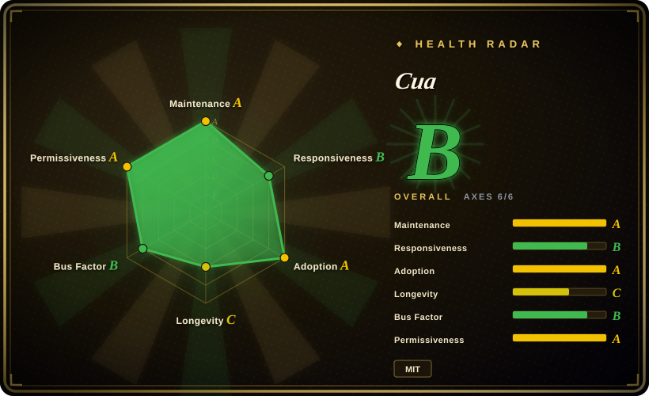
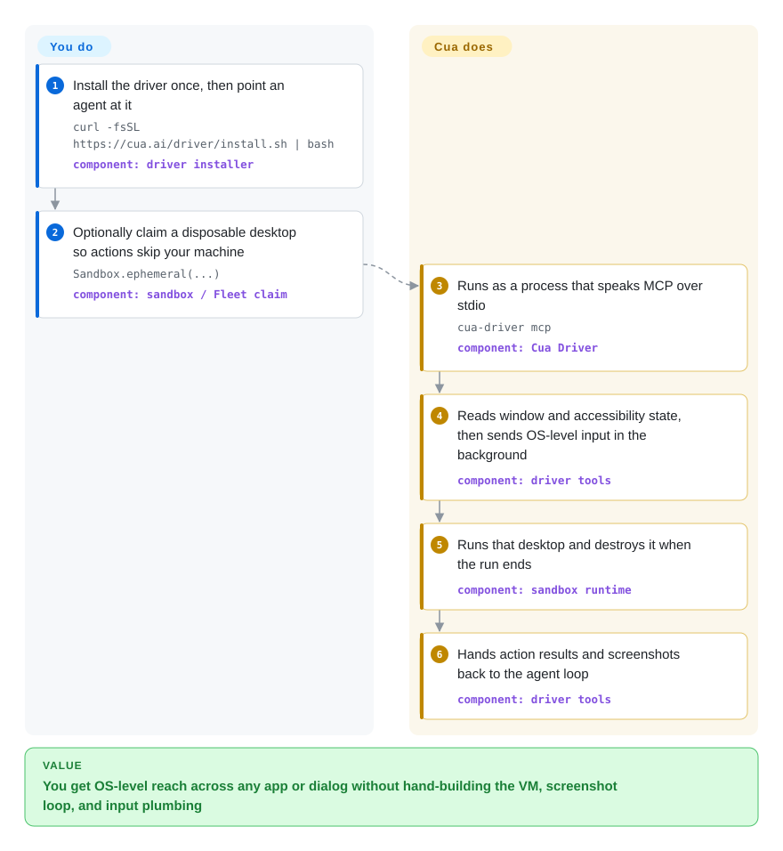

# Cua

Your agent has to operate a **whole computer** — a native desktop app, an OS dialog, a legacy installer — not just a web page, and you would rather it not do that on your real machine.

## When to use

The task leaves the page. You are automating something with no DOM and no API — a native macOS app, a Windows installer, a desktop IM client, a system settings dialog — where the only interface is a screen to look at and a mouse and keyboard to drive. Selector-based web tools are blind the moment the flow steps outside the browser, and stitching together a VM, a screenshot loop, and an input pipeline yourself is a project of its own.

You reach for **Cua** when the trigger is "a whole machine, and I want it isolated". Its anchor is **Cua Driver**: a background driver that speaks MCP over stdio, reads native window and accessibility state, and sends OS-level input without moving your pointer or taking focus. Because it works at the OS level, a browser, a native app, and a system dialog are all the same kind of target — so a flow that crosses from a web page into a desktop app does not force a tool change mid-task. When the run also has to be disposable, you wrap it in a sandbox (`Sandbox.ephemeral(...)` locally, or a cloud Fleet claim) so an agent misclick cannot touch your machine or another tenant's data. The agent layer is model-agnostic through liteLLM, so you point it at whichever computer-use-capable model you already pay for.

## Q&A

**Q: I only need to automate a web front-end. Should I use this?**
No. For a pure web target, in-page DOM automation is faster, cheaper, and far more deterministic; Cua's distinguishing axis — a whole OS plus isolation — is pure overhead there. Use [Playwright](../web-automation/playwright-family/playwright.md), [Chrome DevTools MCP](../web-automation/agent-browser-tools/chrome-devtools-mcp.md), or [Agent Browser](../web-automation/agent-browser-tools/agent-browser.md).

**Q: Is it resource-heavy?**
The cost lives in the sandbox layer you choose, not in Cua itself. Running the Driver alone is light — one local process, no VM, no model artifacts. A local VM guest is heavy, because it is a whole machine and you set its `cpu` / `memory_mb` yourself. A cloud Fleet costs almost no local resources but moves the cost to cloud billing. What keeps burning after startup is the model, not RAM.

**Q: Is it vision-only — a screenshot and a big model call every step?**
No. Reasoning about a fixed, closed set of candidate actions is the design center, and the observation it reasons over can be structured (a window / accessibility tree) rather than pixels; the screenshot parser is an *optional* extension (`cua-perception`) that is not installed by default, and the driver itself needs no model at all. Where per-step model cost is the worry, the CUA-S1 research models attack it directly: they score a fixed, closed set of candidate (element, action) options in a single forward pass instead of generating a next step token by token.

**Q: Can I use it locally without a VM?**
Yes, at the cost of isolation. A driver-only setup, attaching your already-logged-in Chromium (`cua-driver mcp --grant existing-profile`), or the unsandboxed `Localhost.connect()` all skip the VM. The tradeoff is exactly what the sandbox buys: agent actions land on your real machine.

## How it works

Cua splits the job between a **driver** (the thing that touches the computer) and an **agent** (the thing that decides what to do). You install the driver once and connect an MCP-capable agent, a CLI call, or your own application through the typed Python/TypeScript SDK; the driver then exposes tools that read a window's structured state and send mouse, keyboard, and touch input, delivering it in the background when the platform allows so your own pointer and focus stay put. The agent supplies the decisions and the model; the driver supplies the hands and eyes, and needs no model of its own. If you want the run thrown away afterwards, you claim a disposable desktop — a local container/QEMU guest or a cloud Fleet — and hand the agent that machine instead of yours; if you skip the sandbox, the same actions land on your real machine. That split is the whole point: you are not choosing a model here, you are choosing the layer that gives a model hands.

<!-- flow-steps:begin (generated from flows/cua.json by tools/flow_card.py — do not edit) -->

Text version of the flow

1. **You**: Install the driver once, then point an agent at it — `curl -fsSL https://cua.ai/driver/install.sh | bash` — component: `driver installer`
2. **You**: Optionally claim a disposable desktop so actions skip your machine — `Sandbox.ephemeral(...)` — component: `sandbox / Fleet claim`
3. **Cua**: Runs as a process that speaks MCP over stdio — `cua-driver mcp` — component: `Cua Driver`
4. **Cua**: Reads window and accessibility state, then sends OS-level input in the background — component: `driver tools`
5. **Cua**: Runs that desktop and destroys it when the run ends — component: `sandbox runtime`
6. **Cua**: Hands action results and screenshots back to the agent loop — component: `driver tools`

**Value**: You get OS-level reach across any app or dialog without hand-building the VM, screenshot loop, and input plumbing

<!-- flow-steps:end -->

## When NOT to use

- **The task stays inside a web page.** A full desktop plus a screenshot loop is massive overkill for filling a form or scraping a site — use an in-page or browser-level tool ([Playwright](../web-automation/playwright-family/playwright.md), [page-agent](../web-automation/agent-browser-tools/page-agent.md), [browser-use](../web-automation/agent-browser-tools/browser-use.md)) where DOM access is faster, cheaper, and more deterministic.
- **You need low latency or high throughput per action.** A screenshot-and-model step is slow and token-heavy next to selector automation; not a fit for tight real-time loops or large parallel fan-out on a budget.
- **You cannot run VMs or containers, and you do not accept unsandboxed host control.** The isolated path is heavy infrastructure — VMs, drivers, a computer-server — and macOS guests realistically need Apple Silicon (Virtualization.framework). The light path (driver alone, or `Localhost.connect()`) gives up isolation, which defeats the reason many teams pick Cua.
- **You want one stable SDK with frozen APIs.** This is a fast-moving monorepo of many independently versioned packages (driver, agent, sandbox, computer-server, fleet, cli, bench, train) mostly at `v0.x` — expect churn and breaking changes; pin per-package versions.
- **Pixel-perfect closed-loop reliability matters more than coverage.** Computer-use models still misclick and misread UI state. The driver now ships permission modes (`standard` / `bounded` / `unrestricted`) and an explicit existing-profile grant, but for compliance-critical or irreversible actions you still own the guardrails.
- **Data egress is sensitive.** If you enable the vision path, desktop screenshots go to your chosen model provider; review privacy and compliance before pointing it at confidential apps, and watch per-screenshot token cost.

## Comparison

| Alternative | In index | Our verdict | Tradeoff |
|---|---|---|---|
| [PyAutoGUI](pyautogui.md) | ✅ | Choose PyAutoGUI when the app and screen are fixed and you can hard-code coordinates; choose Cua when the UI is dynamic, unknown, or needs a model's judgment. | Coordinate/pixel scripting on one machine — no model, no VM, trivial to start, but it breaks silently on resolution, DPI, or theme changes and cannot generalize to an unseen screen. |
| [Playwright](../web-automation/playwright-family/playwright.md) | ✅ | Choose Playwright whenever the target is a web page — including end-to-end front-end verification; pick Cua only when the flow must leave the page. | DOM-level browser automation and a full test runner — fast, deterministic, cheap, but scoped to browsers, so native apps and OS dialogs are out of reach. |
| [Chrome DevTools MCP](../web-automation/agent-browser-tools/chrome-devtools-mcp.md) | ✅ | Choose Chrome DevTools MCP when an agent must drive and DevTools-inspect a real Chrome; choose Cua when the same agent must also operate non-browser apps. | An agent-facing DevTools surface over real Chrome — strong for web debugging and automation, but Chrome-scoped and not a whole-desktop sandbox. |
| [Agent Browser](../web-automation/agent-browser-tools/agent-browser.md) | ✅ | Choose Agent Browser for light, reproducible agent web tasks; choose Cua when determinism matters less than reaching native desktop and OS surfaces. | A headless browser-automation CLI for agents — cheap and reproducible, but blind outside the page, with no OS-level control or VM isolation. |
| Anthropic computer use / OpenAI Operator | 未收录 | Choose a hosted product when a turnkey proprietary vision agent is acceptable; choose Cua when you need self-hostable infrastructure and model choice. | Hosted vision computer-use agents — zero setup but proprietary and tied to one vendor; Cua is the open layer that can *run* such models through liteLLM. |
| E2B / Daytona (agent sandboxes) | 未收录 | Choose E2B or Daytona for isolated code execution; choose Cua when the isolated thing must be a GUI desktop, not a shell. | Code-execution sandboxes for agents — overlap on VM isolation, but they are built to run code, not to screenshot-drive a desktop. |

## Tech stack

- **Driver:** Rust (`cua-driver`), with generated UniFFI bindings and a versioned C ABI; exposes MCP over stdio (`cua-driver mcp`) and a CLI (`cua-driver call`). Reads window / accessibility state and sends OS-level input with background delivery.
- **Agent layer:** `cua-agent` — a `ComputerAgent` loop with **liteLLM** for model routing.
- **Language SDKs:** Python (`cua_driver`, `cua-sandbox`) and TypeScript (`@trycua/cua-driver`) call the same in-process native runtime.
- **Sandboxes:** local containers / QEMU, macOS and Linux guests via Lume (Swift, Apple `Virtualization.framework`), and cloud Fleets (cua.ai).
- **Benchmarks & training:** `cua-bench` (OSWorld, ScreenSpot, Windows Arena, custom tasks; trajectory export), `cua-train`, and the CUA-S1 specialist decision models (weights on Hugging Face).
- **Third-party:** Kasm (MIT). Optional components carry **AGPL-3.0**: `cua-som`, the optional `ultralytics` dependency, and the `cua-perception` extension (which bundles an AGPL OmniParser artifact).

## Dependencies

- **Runtime:** Python `>=3.12,<3.14` for the SDKs (`pip install cua`). The driver installs from bash (macOS/Linux) or PowerShell (Windows) scripts, or as a package (`@trycua/cua-driver` on npm; the `cua-sandbox[driver]` extra resolves `cua-driver` from the `wheels.cua.ai` index).
- **Model endpoint:** the agent layer needs a liteLLM-usable computer-use-capable model plus an API key. The driver alone needs no model.
- **Sandbox host:** an **Apple Silicon Mac** for local macOS guests (Lume / Virtualization.framework); containers or QEMU for Linux guests; Windows/Android guests per docs. Cloud Fleets remove the local-host requirement.
- **Cloud:** Fleet uses OAuth against `run.cua.ai`; Fleet currently supports only `us-east-1` and does not support snapshots or custom disks.

## Ops difficulty

**Low to high, depending entirely on which path you take.** A driver-only setup is one local process — no VM, no guest images — and is the lightest entry. Self-hosting a local VM sandbox is the heaviest: you operate VMs/containers, a computer-server, and drivers, and on Apple Silicon you manage Lume guest images, while tracking several independent `v0.x` version streams. The cloud path removes local operations but adds billing and data-residency questions — a Fleet pool can retain paid capacity after a claim ends, so follow the cleanup steps. Across all paths the ongoing cost that does not go away is the **model**: each non-structured step adds latency and token spend.

## Health & viability

- **Maintenance — Grade A.** Last push 2026-09-23, active in all 13 of the last 13 weeks, with nightly builds on top of tagged releases (`cua-driver v0.28.2` and `cua-sandbox v0.8.0` on 2026-09-15, `fleet v0.1.17` on 2026-09-11).
- **Responsiveness — Grade B.** Median first response 2.4 hours across 3 qualifying issues — a large improvement over the ~105 h recorded in the previous snapshot, though the sample is small.
- **Adoption — Grade A.** The driver's npm package shows 8,397,529 downloads last month, with ~1,314 release assets and ~599 Homebrew installs in 90 days — a real install base, not just stars.
- **Governance — `?` (measurement failed this round).** The contributor-window signal returned empty, so this axis is not scored. Publicly it is an **Organization**-owned repo (`trycua`) with a broad contributor base, backed by one venture-stage company behind the cua.ai hosted product — better than a lone maintainer, but its longevity is tied to that company's survival and funding. `[推断]`
- **Age & Lindy — Grade C, young.** Created 2025-01 (~601 days). Old enough to show real benchmark integration and a growing nightly cadence, but not old enough for a Lindy prior, and the many `v0.x` packages signal a pre-stable API. Expect breaking changes.
- **Risk flags — open-core plus AGPL options.** MIT core, but the hosted Cua Cloud is the commercial layer (open-core tension), and several optional components are **AGPL-3.0** (`cua-som`, `ultralytics`, the `cua-perception` extension's OmniParser artifact) — confirm whether your usage path pulls them in before treating a deployment as MIT-only. Lume's telemetry is on by default (install/command/API-event metadata; disable with `lume config telemetry disable`). The repo also carries a large open-issue count (1,045), including recent macOS window-state defects. `[推断]`

## Caveats (unverified)

- [未验证] Star count 26,076 (gh snapshot 2026-09-24) — GitHub stars are unreliable and date-sensitive; indicative only.
- [未验证] Package versions (cua-driver v0.28.2, cua-sandbox v0.8.0, computer-server v0.3.46, fleet v0.1.17, cua-agent v0.8.4, cua-bench v0.2.11, `cua` v0.1.6) read from the releases list and PyPI/npm dated 2026-09-10…2026-09-15; treat exact numbers as snapshot-time.
- [推断] "Observation prefers structured state over pixels" is inferred from the CUA-S1 model card (decisions take "an accessibility tree, or a screenshot") and from `cua-perception` being an optional extension; whether the `ComputerAgent` main loop defaults to structured or screenshot observation was not verified in source.
- [推断] CUA-S1's role in cutting per-step cost is inferred from its design (score a closed candidate set in one pass) and from the model card's scope; it is an early research family and its checkpoints are not comparable to a general-purpose model.
- [未验证] Driver browser-driving maturity — the docs carry a cross-platform browser plan, a semantic-state plan, and a bundled browser guide, but no hands-on test was run here.
- [推断] Comparison substitutes (Anthropic computer use / Operator, E2B / Daytona) are partly inferred positioning from the repo and secondary context, not all first-party confirmed.
