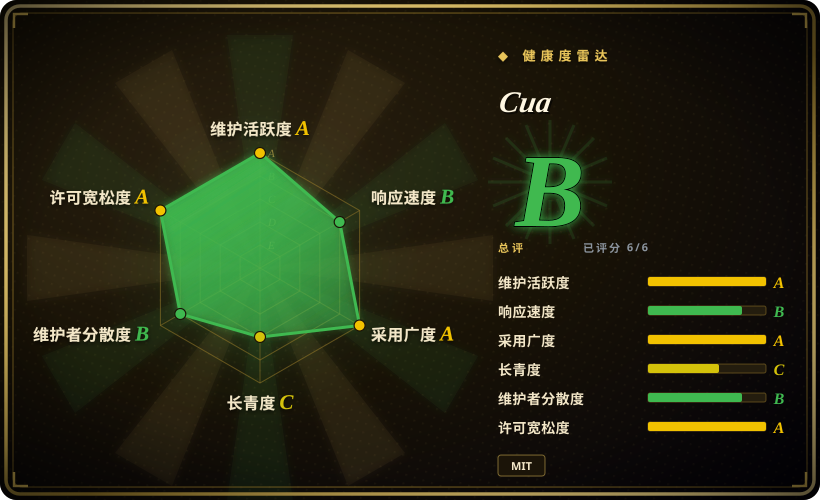
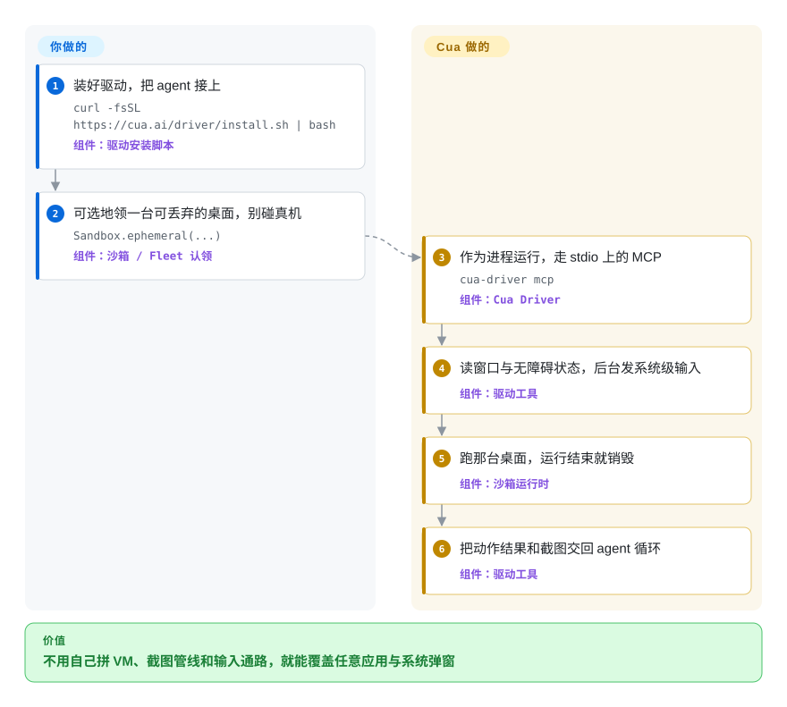

# Cua

你要的不是网页自动化，而是让 agent 操作**一整台电脑**——原生桌面应用、系统弹窗、老旧的安装程序——而且最好别让它的动作落在你的真机上。

## 何时使用

任务离开了浏览器。你要自动化的东西既没有 DOM 也没有 API——某个 macOS 原生应用、一个 Windows 安装程序、一个桌面版 IM 客户端、一个系统设置对话框——它唯一的接口就是一块能看的屏幕和一套能动的鼠标键盘。基于选择器的 web 工具一旦离开浏览器就瞎了，而自己拼一套 VM＋截图循环＋输入管线，本身就是一个项目。

当触发条件是「一整台机器，而且我要它隔离」时，选 **Cua**。它的核心是 **Cua Driver**：一个后台驱动，用 stdio 上的 MCP 对话，读原生窗口与无障碍状态，发系统级输入时不移动你的指针、也不抢焦点。因为它工作在系统层，浏览器、原生应用和系统弹窗属于同一类目标——所以一个流程从网页跨进桌面应用时，不必中途换工具。如果这次运行还需要可丢弃，就把它包进沙箱（本地用 `Sandbox.ephemeral(...)`，或领一台云 Fleet），这样 agent 误点一下也碰不到你的机器或别的租户的数据。agent 层通过 liteLLM 做到模型无关，你指向自己已经在付费的、具备 computer-use 能力的模型即可。

## 快问快答

**问：我只想自动化一个网页前端，该用它吗？**
不该。纯网页目标下，页面内的 DOM 自动化更快、更便宜、也确定得多；Cua 用来区分自己的那条轴——整机加隔离——在这里纯粹是开销。用 [Playwright](../web-automation/playwright-family/playwright.zh.md)、[Chrome DevTools MCP](../web-automation/agent-browser-tools/chrome-devtools-mcp.zh.md) 或 [Agent Browser](../web-automation/agent-browser-tools/agent-browser.zh.md)。

**问：它很吃资源吗？**
开销在你选的沙箱那一层，不在 Cua 本身。只跑 Driver 很轻——一个本地进程，没有 VM、没有模型产物。本地 VM 客户机很重，因为它就是一整台机器，`cpu` 和 `memory_mb` 由你自己设。云 Fleet 本地几乎不占资源，但把开销换成了云端计费。真正持续在烧的是模型，不是内存。

**问：它是纯视觉的吗，每步都要截图再加一次大模型调用？**
不是。设计中心是对一组固定、封闭的候选动作做判断，而判断所依据的观测可以是结构化的（窗口／无障碍树）而非像素；截图解析是一个**可选**扩展（`cua-perception`），默认不装，驱动本身则完全不需要模型。当单步模型成本成为顾虑时，CUA-S1 研究模型正是冲着它去的：一次前向就对固定、封闭的候选（元素、动作）集合打分，而不是逐 token 生成下一步。

**问：能只在本地跑、不开 VM 吗？**
可以，代价是失去隔离。只跑 Driver、附着你已登录的 Chromium（`cua-driver mcp --grant existing-profile`），或者走非沙箱的 `Localhost.connect()`，都能跳过 VM。取舍正是沙箱买来的那件事：动作会落在你的真机上。

## 怎么用起来

Cua 把工作拆成两半：**驱动**（真正碰电脑的那层）和 **agent**（做决策的那层）。你装一次驱动，把支持 MCP 的 agent、一条 CLI 调用，或你自己的应用通过带类型的 Python／TypeScript SDK 接上；驱动随后暴露一批工具，读取窗口的结构化状态并发送鼠标、键盘和触摸输入，平台允许时在后台投递，于是你的指针和焦点都留在原处。agent 负责决策和模型，驱动负责手和眼，而驱动自己不需要模型。如果你想让这次运行事后被丢掉，就领一台可丢弃的桌面——本地容器／QEMU 客户机，或云 Fleet——把 agent 指向那台机器而不是你自己的；如果你跳过沙箱，同样的动作就落在你的真机上。这个分工就是全部要点：你在这里选的不是模型，而是「给模型一双手」的那一层。

<!-- flow-steps:begin (generated from flows/cua.json by tools/flow_card.py — do not edit) -->

流程文字版

1. **你**：装好驱动，把 agent 接上 — `curl -fsSL https://cua.ai/driver/install.sh | bash` — 组件：`驱动安装脚本`
2. **你**：可选地领一台可丢弃的桌面，别碰真机 — `Sandbox.ephemeral(...)` — 组件：`沙箱 / Fleet 认领`
3. **Cua**：作为进程运行，走 stdio 上的 MCP — `cua-driver mcp` — 组件：`Cua Driver`
4. **Cua**：读窗口与无障碍状态，后台发系统级输入 — 组件：`驱动工具`
5. **Cua**：跑那台桌面，运行结束就销毁 — 组件：`沙箱运行时`
6. **Cua**：把动作结果和截图交回 agent 循环 — 组件：`驱动工具`

**价值**：不用自己拼 VM、截图管线和输入通路，就能覆盖任意应用与系统弹窗

<!-- flow-steps:end -->

## 何时不用

- **任务始终留在网页里。** 为了填个表单或抓个站，动用一整台桌面加截图循环属于杀鸡用牛刀——用页面内或浏览器级工具（[Playwright](../web-automation/playwright-family/playwright.zh.md)、[page-agent](../web-automation/agent-browser-tools/page-agent.zh.md)、[browser-use](../web-automation/agent-browser-tools/browser-use.zh.md)），有 DOM 访问会更快、更便宜、更确定。
- **你要求每步低延迟或高吞吐。** 截图加模型的一步，相比选择器自动化又慢又费 token，不适合紧凑实时循环，也不适合预算有限的大规模并行。
- **你跑不了 VM／容器，又不接受非沙箱的本机控制。** 隔离路线是重型基础设施——VM、驱动、computer-server——macOS 客户机实际上需要 Apple Silicon（Virtualization.framework）。轻量路线（只跑 Driver，或 `Localhost.connect()`）放弃了隔离，而这恰恰是很多团队选 Cua 的理由。
- **你想要一个 API 冻结的稳定单一 SDK。** 这是一个快速迭代的 monorepo，包含多个独立版本号的包（driver、agent、sandbox、computer-server、fleet、cli、bench、train），大多停在 `v0.x`——会有 churn 和破坏性变更；请按包 pin 版本。
- **闭环的像素级可靠性比覆盖面更重要。** computer-use 模型仍会误点、会误读 UI 状态。驱动现在有了权限模式（`standard`／`bounded`／`unrestricted`）和显式的现有 profile 授权，但对合规关键或不可逆操作，护栏仍然要你自己兜。
- **数据外发敏感。** 一旦启用视觉路径，桌面截图会送到你选的模型厂商；指向机密应用前先做隐私与合规评估，并留意每张截图的 token 成本。

## 横向对比

| 替代品 | 是否收录 | 我们的评价 | 取舍 |
|---|---|---|---|
| [PyAutoGUI](pyautogui.zh.md) | ✅ | 应用和屏幕固定、坐标可以写死时选 PyAutoGUI；UI 动态、未知、需要模型判断时选 Cua。 | 单机上的坐标／像素脚本自动化——不需要模型、不需要 VM、起步极简，但会因分辨率、DPI 或主题变化静默失效，也无法泛化到没见过的界面。 |
| [Playwright](../web-automation/playwright-family/playwright.zh.md) | ✅ | 只要目标是网页——包括前端端到端验证——就选 Playwright；只有当流程必须离开页面时才选 Cua。 | DOM 级浏览器自动化加完整测试运行器——快、确定、便宜，但范围限于浏览器，原生应用和系统弹窗够不着。 |
| [Chrome DevTools MCP](../web-automation/agent-browser-tools/chrome-devtools-mcp.zh.md) | ✅ | agent 需要驱动并用 DevTools 检查真实 Chrome 时选它；同一个 agent 还要操作非浏览器应用时选 Cua。 | 面向 agent 的真实 Chrome DevTools 界面——擅长浏览器调试与自动化，但限于 Chrome，不是整桌面沙箱。 |
| [Agent Browser](../web-automation/agent-browser-tools/agent-browser.zh.md) | ✅ | 轻量、可复现的 agent 网页任务选 Agent Browser；确定性没有触达原生桌面与系统面重要时选 Cua。 | 面向 agent 的无头浏览器自动化 CLI——便宜、可复现，但页面之外就是盲区，没有系统级控制，也没有 VM 隔离。 |
| Anthropic computer use／OpenAI Operator | 未收录 | 可接受开箱即用的闭源视觉 agent 时选托管产品；需要可自托管的基础设施与模型选择权时选 Cua。 | 托管的视觉 computer-use agent——零搭建，但闭源且绑定单一厂商；Cua 是能通过 liteLLM *运行*这类模型的开源层。 |
| E2B／Daytona（agent 沙箱） | 未收录 | 需要隔离的代码执行时选 E2B 或 Daytona；需要被隔离的东西是一台图形桌面而不是一个 shell 时选 Cua。 | 面向 agent 的代码执行沙箱——在 VM 隔离上重叠，但它们是用来跑代码的，不是用来截图驱动桌面的。 |

## 技术栈

- **驱动：** Rust（`cua-driver`），配生成的 UniFFI 绑定和带版本的 C ABI；以 stdio 上的 MCP（`cua-driver mcp`）和 CLI（`cua-driver call`）暴露。读取窗口／无障碍状态，并通过后台投递发送系统级输入。
- **Agent 层：** `cua-agent`——一个 `ComputerAgent` 循环，用 **liteLLM** 做模型路由。
- **语言 SDK：** Python（`cua_driver`、`cua-sandbox`）与 TypeScript（`@trycua/cua-driver`），都调用同一个进程内原生运行时。
- **沙箱：** 本地容器／QEMU；经 Lume（Swift、Apple `Virtualization.framework`）的 macOS 与 Linux 客户机；云 Fleet（cua.ai）。
- **评测与训练：** `cua-bench`（OSWorld、ScreenSpot、Windows Arena、自定义任务；轨迹导出）、`cua-train`，以及 CUA-S1 专用决策模型（权重在 Hugging Face）。
- **第三方：** Kasm（MIT）。可选组件带 **AGPL-3.0**：`cua-som`、可选的 `ultralytics` 依赖，以及 `cua-perception` 扩展（内含 AGPL 的 OmniParser 产物）。

## 依赖

- **运行时：** SDK 需 Python `>=3.12,<3.14`（`pip install cua`）。驱动通过 bash（macOS／Linux）或 PowerShell（Windows）脚本安装，也可以作为包安装（npm 的 `@trycua/cua-driver`；`cua-sandbox[driver]` 这个 extra 会从 `wheels.cua.ai` 索引解析 `cua-driver`）。
- **模型端点：** agent 层需要一个 liteLLM 可用的、具备 computer-use 能力的模型加 API key。只用驱动则不需要模型。
- **沙箱宿主：** 本地 macOS 客户机需 **Apple Silicon Mac**（Lume／Virtualization.framework）；Linux 客户机用容器或 QEMU；Windows／Android 客户机见文档。云 Fleet 可去掉本地宿主要求。
- **云：** Fleet 用 OAuth 对接 `run.cua.ai`；Fleet 目前只支持 `us-east-1`，且不支持快照与自定义磁盘。

## 运维难度

**从低到高，完全取决于你走哪条路。** 只跑驱动的方案就是一个本地进程——没有 VM、没有客户机镜像——是最轻的入口。自托管本地 VM 沙箱最重：你要运维 VM／容器、computer-server 和驱动，在 Apple Silicon 上还要管 Lume 客户机镜像，同时跟踪好几条独立的 `v0.x` 版本线。云路线免去本地运维，但多了计费与数据驻留的问题——Fleet 池在 claim 结束后可能继续保留付费容量，请按清理步骤执行。无论哪条路，唯一不会消失的持续成本是**模型**：每一个非结构化步骤都会叠加延迟和 token 开销。

## 健康度与可持续性

- **维护——A 级。** 最后一次 push 是 2026-09-23，最近 13 周全部活跃，在打 tag 的发布之上还有每日 nightly 构建（`cua-driver v0.28.2` 与 `cua-sandbox v0.8.0` 于 2026-09-15，`fleet v0.1.17` 于 2026-09-11）。
- **响应速度——B 级。** 3 个合格 issue 的中位首次响应时间为 2.4 小时——相比上一次快照记录的约 105 小时是大幅改善，不过样本量很小。
- **采用——A 级。** 驱动的 npm 包上月 8,397,529 次下载，约 1,314 个发布资产，90 天内约 599 次 Homebrew 安装——是真实的安装量，不只是 star。
- **治理——`?`（本轮测量失败）。** 贡献者时间窗信号返回空，因此该轴未计分。公开信息上，它是 **Organization** 所有的仓库（`trycua`），贡献者面较广，背后是 cua.ai 托管产品那家创业阶段公司——比单个维护者好，但其寿命系于这家公司的存续与融资。`[推断]`
- **年龄与 Lindy——C 级，年轻。** 创建于 2025-01（约 601 天）。够久到能展示真实的基准集成与不断加密的 nightly 节奏，但还不足以构成 Lindy 先验，且众多 `v0.x` 包标志着 API 仍在稳定前。预期破坏性变更。
- **风险标志——open-core 加 AGPL 可选项。** MIT 内核，但托管的 Cua Cloud 是商业层（open-core 张力），且有多个可选组件为 **AGPL-3.0**（`cua-som`、`ultralytics`、`cua-perception` 扩展里的 OmniParser 产物）——在为部署假定「仅 MIT」之前，先确认你的使用路径是否会引入它们。Lume 的遥测默认开启（安装／命令／API 事件元数据；用 `lume config telemetry disable` 关闭）。仓库的开放 issue 数也很大（1,045），其中包含近期的 macOS 窗口状态缺陷。`[推断]`

## 存疑（未验证）

- [未验证] star 数 26,076（gh 快照 2026-09-24）——GitHub star 不可靠且随时间变化，仅作参考。
- [未验证] 各包版本（cua-driver v0.28.2、cua-sandbox v0.8.0、computer-server v0.3.46、fleet v0.1.17、cua-agent v0.8.4、cua-bench v0.2.11、`cua` v0.1.6）取自 2026-09-10 至 2026-09-15 的发布列表与 PyPI／npm；确切数字按快照时点看待。
- [推断] 「观测优先结构化而非像素」是从 CUA-S1 模型卡（决策输入为「无障碍树，或截图」）以及 `cua-perception` 是可选扩展推断的；`ComputerAgent` 主循环默认走结构化还是截图观测，未在源码中核实。
- [推断] CUA-S1 对降低单步成本的作用，是从其设计（一次前向对封闭候选集打分）与模型卡的范围推断的；它是早期研究家族，其 checkpoint 不可与通用模型相提并论。
- [未验证] 驱动的浏览器自动化成熟度——文档里有跨平台浏览器计划、语义状态计划和内置浏览器指南，但本轮没有人实际跑过。
- [推断] 对比中的替代品（Anthropic computer use／Operator、E2B／Daytona）部分为基于仓库与二手背景的推断定位，并非全部经第一方确认。
