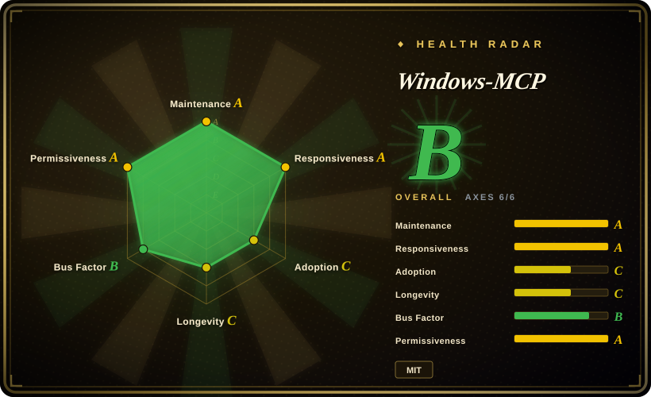
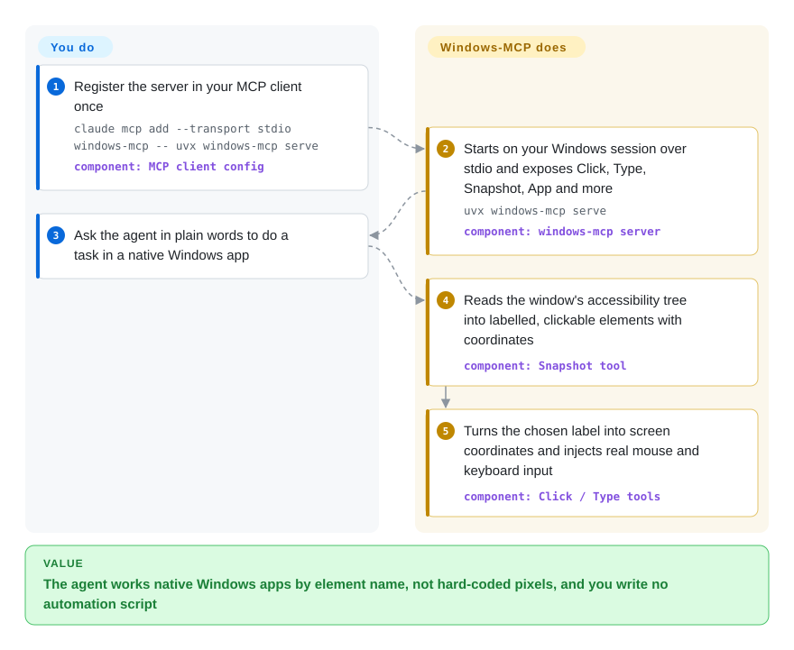

# Windows-MCP

Your coding agent can edit files and run shell commands, but the moment a task needs a native Windows program — a settings dialog, an installer, an ERP client with no API — it is blind and handless. Windows-MCP is a local MCP server that reads each window's accessibility tree into a numbered list of clickable controls and lets the agent click and type on your real Windows desktop.

## When to use

You run Claude Desktop, Claude Code, Codex CLI or Gemini CLI on a Windows machine, and the task leaves the terminal: "open the vendor's desktop client, export last month's report, and attach it to the ticket". There is no API and no web version, only a WinForms window with a grid and an *Export…* button. Your agent cannot see that window at all; a screenshot-only computer-use model can see it but has to guess pixel coordinates on every step, and those guesses drift on a 150 %-scaled 4K monitor.

That is when you reach for **Windows-MCP**. It plugs into any MCP client with one line (`uvx windows-mcp serve`), and its `Snapshot` tool returns the window's real controls — names, types and screen coordinates read through Windows UI Automation (the OS accessibility interface) — so the agent clicks "Export" by label, with or without a screenshot. Pick it over [Cua](cua.md) when you want the agent to drive *your* Windows session directly with nothing to install beyond a Python package, rather than an isolated VM; pick it over [PyAutoGUI](pyautogui.md) or pywinauto when the steps are not known in advance and a model, not a script, should decide what to click.

## How it works

Windows-MCP is a single Python process that runs on the Windows machine itself and speaks MCP (the Model Context Protocol, the plug that lets an agent call outside tools) to whichever agent you connect. You supply the agent, the model and the instruction; it supplies the eyes and hands. Its eyes are `Snapshot` and `Screenshot`: `Snapshot` walks the UI Automation tree — the same structured description of buttons, fields and menus that screen readers use — and hands back numbered interactive elements with coordinates, optionally with an annotated screenshot or, for Chrome/Edge/Firefox, only the web page's elements (`use_dom=True`). Its hands are `Click`, `Type`, `Scroll`, `Move`, `Shortcut` and `App`, which turn a label into screen coordinates and inject real mouse and keyboard events. It also hands the agent unsandboxed `PowerShell`, `FileSystem`, `Registry`, `Process` and `Clipboard` tools — think of it as giving the agent your keyboard, your mouse *and* a shell with your account's rights at once, so the safety boundary is whatever account and machine you run it on.

<!-- flow-steps:begin (generated from flows/windows-mcp.json by tools/flow_card.py — do not edit) -->

Text version of the flow

1. **You**: Register the server in your MCP client once — `claude mcp add --transport stdio windows-mcp -- uvx windows-mcp serve` — component: `MCP client config`
2. **Windows-MCP**: Starts on your Windows session over stdio and exposes Click, Type, Snapshot, App and more — `uvx windows-mcp serve` — component: `windows-mcp server`
3. **You**: Ask the agent in plain words to do a task in a native Windows app
4. **Windows-MCP**: Reads the window's accessibility tree into labelled, clickable elements with coordinates — component: `Snapshot tool`
5. **Windows-MCP**: Turns the chosen label into screen coordinates and injects real mouse and keyboard input — component: `Click / Type tools`

**Value**: The agent works native Windows apps by element name, not hard-coded pixels, and you write no automation script

<!-- flow-steps:end -->

## When NOT to use

- **On a machine you care about, with the default tool set.** The server has no sandbox: `PowerShell`, `FileSystem` (delete), `Registry` and `Process` (kill) act on your real account, and the project's own `SECURITY.md` says to deploy it in a VM. If the agent's actions must be isolated or disposable, use [Cua](cua.md) with an ephemeral sandbox instead — or at minimum run with `--exclude-tools "PowerShell,Registry"` under a least-privilege user.
- **Anything that is not Windows.** It calls Win32, COM and UI Automation directly and cannot run on macOS or Linux (WSL only works by launching the Windows-side `uvx.exe`). For a cross-OS agent, use [Cua](cua.md); the same organisation keeps separate sister servers (`CursorTouch/MacOS-MCP`, `CursorTouch/Android-MCP`), not indexed here.
- **The target is a web page.** Driving a browser through the OS accessibility tree is slower and less deterministic than DOM automation — use [Playwright](../web-automation/playwright-family/playwright.md) or [Chrome DevTools MCP](../web-automation/agent-browser-tools/chrome-devtools-mcp.md) when the whole flow stays in the browser.
- **The steps are fixed and repeatable.** Every step costs a model round-trip plus a tree walk (the README quotes 0.2–0.5 s between actions, before model latency). For a scripted nightly job against a known UI, a deterministic script with pywinauto (UI Automation selectors, not indexed here) or [PyAutoGUI](pyautogui.md) is cheaper and reproducible.
- **Electron-heavy desktops, VMs over RDP, or Windows on ARM.** Open issues (2026-10) report `Snapshot` deadlocking on VS Code and other Electron hosts (#383, mitigated by `WINDOWS_MCP_EXCLUDE_PROCESSES`), undecodable screenshots on VM/RDP desktops (#371), and empty UI trees on ARM64 (#301). If that is your environment, trial it there first; when the agent can run inside a clean VM instead, [Cua](cua.md) avoids touching your loaded desktop.
- **Old Windows, or a non-English UI.** The README lists Windows 7 and 8, but the package requires Python ≥ 3.14, which has no Windows 7 build (issue #407 is open on exactly this) [推断]. The README also asks non-English Windows users to disable `App` because Start-menu name lookup assumes English.
- **You cannot send usage telemetry off the machine.** PostHog telemetry is on by default with a project key baked into the source, and error events carry the exception text. Set `ANONYMIZED_TELEMETRY=false` before first launch, or pick a tool without telemetry.

## Comparison

| Alternative | In index | Our verdict | Tradeoff |
|---|---|---|---|
| [Cua](cua.md) | ✅ | When the agent's actions must run in a disposable VM, or the target spans macOS/Linux too, pick Cua; pick Windows-MCP when you want an agent driving your own Windows session with one `uvx` line and no VM. | Cua buys isolation and cross-OS reach at the price of VMs/drivers and many `v0.x` packages; Windows-MCP is one Python process but acts directly on your real account. |
| [PyAutoGUI](pyautogui.md) | ✅ | Choose PyAutoGUI for a fixed, scripted click path with no model in the loop; choose Windows-MCP when a model must decide the steps against UI it has not seen before. | PyAutoGUI is deterministic, cross-platform and free per step but sees only pixels; Windows-MCP reads named controls but every step costs a model call. |
| pywinauto | not indexed | For deterministic Windows test scripts written by a human, pywinauto's selector API is the better tool; Windows-MCP is the better tool when an agent, not a script, is the caller. Not added in this tab batch. | Gains a mature UI Automation/Win32 Python API (GitHub repo since 2015) with no LLM; pays with hand-written selectors and a release cadence that went quiet between 0.6.8 (2019) and 0.6.9 (2025). |
| microsoft/UFO | not indexed | If you want a complete Microsoft-backed Windows agent with its own planning loop, evaluate UFO; if you already have an agent (Claude, Codex) and only need Windows hands, Windows-MCP plugs in with less to adopt. Not added in this tab batch. | UFO brings its own multi-agent orchestration on top of UI Automation [推断]; Windows-MCP is just a tool server, so the reasoning quality is entirely your model's. |
| Anthropic computer use (hosted tool) | not a repo | Use the hosted computer-use tool when screenshots plus model-predicted coordinates are acceptable and you want vendor-maintained behaviour; use Windows-MCP when you want element labels from the accessibility tree and any model. | A hosted API, not a repository; vision-only and tied to one vendor, versus a local open server that works with any MCP client. |

## Tech stack

- **Language/runtime:** Python ≥ 3.14 (`pyproject.toml`; the README badge still says 3.13+), packaged on PyPI as `windows-mcp` and run with `uv`/`uvx`.
- **MCP layer:** `fastmcp` ≥ 3.0, with stdio (default), SSE and streamable-HTTP transports; optional bearer-token auth, OAuth 2.0 + PKCE, IP allowlist, TLS, CORS allowlist.
- **Windows access:** `pywin32`, `comtypes` and a vendored, modularised copy of yinkaisheng's `uiautomation` library (Apache-2.0, attribution kept in file headers) under `src/windows_mcp/uia/`; IAccessible2 fallback for Firefox; `dxcam` → `mss` → `pillow` screenshot backends.
- **Other deps:** `psutil`, `markdownify` + `requests` (for `Scrape`, with SSRF blocking), `thefuzz`/`python-levenshtein` (fuzzy app-name matching), `posthog` (telemetry).
- **Distribution:** PyPI, the MCP Registry (`io.github.CursorTouch/Windows-MCP`), and an `.mcpb` Claude Desktop extension (`manifest.json`).

## Dependencies

- A **Windows** host with an interactive desktop session (the tools act on the logged-in user's screen), Python 3.14 and `uv`.
- An **MCP client** and a model you already use — Claude Desktop/Code, Codex CLI, Gemini CLI, Qwen Code, Perplexity Desktop and others are documented. Windows-MCP itself calls no model.
- Optional: `windows-mcp install` registers a per-user Scheduled Task that starts the server at login; network transports need an auth key or OAuth (the server refuses a non-loopback bind without one unless you pass `--allow-insecure-remote`).
- Outbound network to `us.i.posthog.com` unless telemetry is disabled.

## Ops difficulty

**Low to set up, medium to run safely.** The happy path is one `uvx` line in a client config, and the first launch may time out while dependencies install (the README says to just restart). The real work is operational hygiene: choosing which tools to expose (`--tools` / `--exclude-tools`), running under a low-privilege account or VM, turning off telemetry, and — if you expose it over the network — managing auth keys, TLS certificates and an IP allowlist. Expect to pin a version: the Claude Desktop extension channel lagged at 0.7.2 while PyPI was at 0.8.x (issues #395/#401), and the MSIX (Store) build of Claude Desktop needs absolute paths and manual config.

## Health & viability

- **Maintenance — Grade A (2026-10).** Last push 2026-10-08, active in 13 of the last 13 weeks; ten releases from v0.6.9 (2026-03-13) to v0.8.7 (2026-09-30); unit tests run on `windows-latest` in CI on every PR.
- **Responsiveness — Grade A.** Median first response 22.4 hours across 33 qualifying issues; late-September external bug reports (#436–#441) were closed within days with fixes merged.
- **Governance — Grade B, but one lead.** 46 people committed in the last 12 months, yet the top contributor holds ~57 % of those commits and 483 all-time against 44 for the next human. The `CursorTouch` organisation has only three public repos (Windows-, MacOS-, Android-MCP); release keys and roadmap sit with Jeomon George — a real bus-factor risk.
- **Age & Lindy — Grade C, young.** Created 2025-05 (515 days), still `0.x` with a "Development Status :: 4 - Beta" classifier; no Lindy prior yet, and tool names/parameters have changed between minor versions.
- **Adoption — Grade C on registry signals.** 39,533 PyPI downloads last month (2026-10-09), 8.5k stars and 928 forks, no measured dependents; the README's "2M+ users" claim for the Claude Desktop extension could not be checked [未验证].
- **Risk flags.** Default-on telemetry; an MIT root license over a vendored Apache-2.0 library with no separate Apache license/NOTICE file shipped beside it; the Claude Desktop extension directory still ships 0.7.2, whose remote mode depends on a `windowsmcp.io` dashboard that was unreachable per issue #432 (2026-09-29) — the current README and source no longer reference that host, so install from PyPI rather than the directory.

## Caveats (unverified)

- [未验证] "2M+ users in Claude Desktop Extensions" is the README's own claim; there is no public counter to check it against, and the extension channel was reported to ship an older version (#395).
- [推断] Windows 7/8 support is effectively gone: `requires-python = ">=3.14"` and the CPython project has not shipped Windows 7 builds since 3.9; issue #407 raises the mismatch and was open on 2026-10-09. Not tested on a Windows 7 machine.
- [推断] The telemetry claim "no tool outputs are tracked" may not hold for error events: `track_error` sends `str(error)`, which can include file paths or argument fragments, and PostHog exception autocapture and GeoIP are enabled in `analytics.py`. Read from source, not observed on the wire.
- [推断] The microsoft/UFO comparison row (its own planning/multi-agent loop over UI Automation) is from its repo description and general positioning, not from reading its source for this page.
- [未验证] The README's 0.2–0.5 s per-action latency figure was not measured here; no Windows host was available for a hands-on run.
- [未验证] The Electron deadlock (#383), RDP screenshot (#371) and ARM64 (#301) issues are user reports, open as of 2026-10-09; their exact scope was not reproduced.
- [未验证] Star (8,459) and fork (928) counts from `gh api` on 2026-10-09; stars are indicative only.
