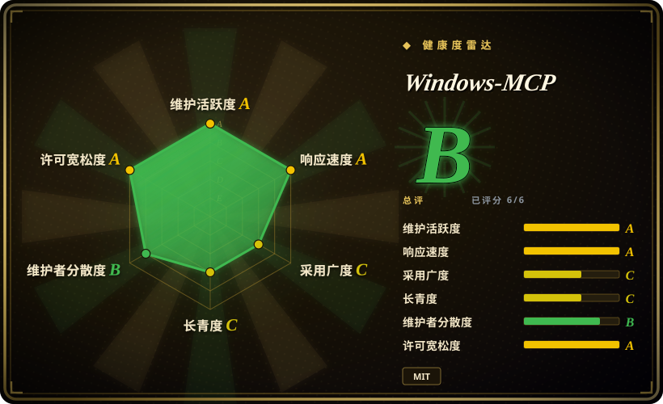
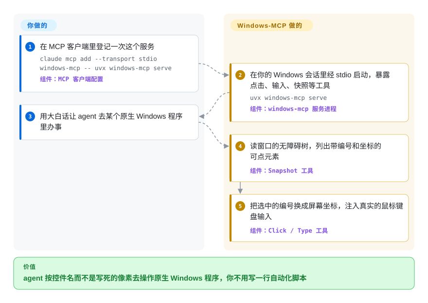

# Windows-MCP

你的编码 agent 能改文件、跑命令，可任务一旦落到原生 Windows 程序上——一个设置对话框、一个安装向导、一个没有接口的进销存客户端——它就既看不见也摸不着。Windows-MCP 是跑在本机的 MCP 服务：把每个窗口的无障碍树读成一张带编号的可点控件清单，让 agent 在你真实的 Windows 桌面上点击和输入。

## 何时使用

你在一台 Windows 电脑上用 Claude Desktop、Claude Code、Codex CLI 或 Gemini CLI，而这次的任务出了终端：“打开供应商的桌面客户端，导出上个月的报表，附到工单里”。它没有 API，也没有网页版，只有一个 WinForms 窗口、一张表格和一个“导出…”按钮。你的 agent 根本看不到这个窗口；纯截图的 computer-use 模型看得到，但每一步都要猜像素坐标，在缩放 150% 的 4K 屏上一猜就偏。

这时就该想到 **Windows-MCP**。它一行配置（`uvx windows-mcp serve`）就能接进任何 MCP 客户端，`Snapshot` 工具返回的是窗口里真实存在的控件——名字、类型、屏幕坐标，经 Windows UI Automation（系统自带的无障碍接口）读出——于是 agent 按标签点“导出”，有没有截图都行。相比 [Cua](cua.zh.md)：你想让 agent 直接操作**你自己的** Windows 会话、除了一个 Python 包什么都不用装，而不是开一台隔离虚拟机时，选它。相比 [PyAutoGUI](pyautogui.zh.md) 或 pywinauto：步骤事先不确定、该由模型而不是脚本决定点哪里时，选它。

## 怎么用起来

Windows-MCP 是一个跑在 Windows 本机上的 Python 进程，用 MCP（Model Context Protocol，让 agent 调用外部工具的插口）和你接上的 agent 对话。agent、模型和指令由你提供；它提供眼睛和手。眼睛是 `Snapshot` 和 `Screenshot`：`Snapshot` 遍历 UI Automation 树——也就是读屏软件用的那份按钮、输入框、菜单的结构化描述——交回带编号和坐标的可交互元素，可附一张标注过的截图；对 Chrome、Edge、Firefox 还能只取网页本身的元素（`use_dom=True`）。手是 `Click`、`Type`、`Scroll`、`Move`、`Shortcut` 和 `App`，它们把编号换成屏幕坐标，注入真实的鼠标键盘事件。它还给 agent 递上不设沙箱的 `PowerShell`、`FileSystem`、`Registry`、`Process` 和 `Clipboard` 工具——好比把你的键盘、鼠标**和**一个拥有你账户全部权限的命令行同时交给 agent，所以安全边界就是你运行它的那个账户和那台机器。

<!-- flow-steps:begin (generated from flows/windows-mcp.json by tools/flow_card.py — do not edit) -->

流程文字版

1. **你**：在 MCP 客户端里登记一次这个服务 — `claude mcp add --transport stdio windows-mcp -- uvx windows-mcp serve` — 组件：`MCP 客户端配置`
2. **Windows-MCP**：在你的 Windows 会话里经 stdio 启动，暴露点击、输入、快照等工具 — `uvx windows-mcp serve` — 组件：`windows-mcp 服务进程`
3. **你**：用大白话让 agent 去某个原生 Windows 程序里办事
4. **Windows-MCP**：读窗口的无障碍树，列出带编号和坐标的可点元素 — 组件：`Snapshot 工具`
5. **Windows-MCP**：把选中的编号换成屏幕坐标，注入真实的鼠标键盘输入 — 组件：`Click / Type 工具`

**价值**：agent 按控件名而不是写死的像素去操作原生 Windows 程序，你不用写一行自动化脚本

<!-- flow-steps:end -->

## 何时不用

- **在你在乎的机器上、用默认工具集。** 服务没有沙箱：`PowerShell`、`FileSystem`（删除）、`Registry`、`Process`（结束进程）都直接作用于你的真实账户，项目自己的 `SECURITY.md` 也写着要放进虚拟机部署。agent 的动作必须隔离或可丢弃时，改用 [Cua](cua.zh.md) 配临时沙箱；至少也要用 `--exclude-tools "PowerShell,Registry"` 并以低权限用户运行。
- **目标不是 Windows。** 它直接调用 Win32、COM 和 UI Automation，在 macOS、Linux 上跑不起来（WSL 只能靠启动 Windows 侧的 `uvx.exe`）。要跨系统的 agent，用 [Cua](cua.zh.md)；同一组织另有姊妹服务 `CursorTouch/MacOS-MCP`、`CursorTouch/Android-MCP`，本索引未收录。
- **目标是网页。** 通过系统无障碍树驱动浏览器，比 DOM 自动化更慢、更不确定——整条流程都在浏览器里时，用 [Playwright](../web-automation/playwright-family/playwright.zh.md) 或 [Chrome DevTools MCP](../web-automation/agent-browser-tools/chrome-devtools-mcp.zh.md)。
- **步骤固定、要反复跑。** 每一步都要一次模型往返加一次树遍历（README 给的动作间隔是 0.2–0.5 秒，还不算模型延迟）。对已知界面的定时脚本任务，用 pywinauto（UI Automation 选择器，本索引未收录）或 [PyAutoGUI](pyautogui.zh.md) 写确定性脚本，更便宜也可复现。
- **Electron 应用扎堆、远程桌面里的虚拟机、或 ARM 版 Windows。** 截至 2026-10 的未关闭 issue 报告：`Snapshot` 在 VS Code 等 Electron 程序上会死锁（#383，可用 `WINDOWS_MCP_EXCLUDE_PROCESSES` 缓解）、VM/RDP 桌面上截图无法解码（#371）、ARM64 上 UI 树为空（#301）。你的环境正好是这些，就先在那里试；agent 能改到干净虚拟机里跑时，[Cua](cua.zh.md) 不会碰你装满东西的桌面。
- **老版本 Windows，或非英文界面。** README 列了 Windows 7 和 8，但包要求 Python ≥ 3.14，而这个 Python 版本没有 Windows 7 的构建（issue #407 正是在说这个）[推断]。README 还要求非英文 Windows 用户关掉 `App`，因为它按开始菜单名字找程序时默认是英文。
- **使用数据不能出本机。** PostHog 遥测默认开启，项目密钥写死在源码里，错误事件会带上异常文本。首次启动前设 `ANONYMIZED_TELEMETRY=false`，或换一个不带遥测的工具。

## 横向对比

| 替代品 | 是否收录 | 我们的评价 | 取舍 |
|---|---|---|---|
| [Cua](cua.zh.md) | ✅ | agent 的动作必须跑在可丢弃虚拟机里，或目标还横跨 macOS、Linux 时，选 Cua；想让 agent 一行 `uvx` 就操作你自己的 Windows 会话、不开虚拟机时，选 Windows-MCP。 | Cua 用虚拟机、驱动和一堆 `v0.x` 包换来隔离与跨系统；Windows-MCP 只是一个 Python 进程，但直接作用在你的真实账户上。 |
| [PyAutoGUI](pyautogui.zh.md) | ✅ | 点击路径固定、不需要模型参与的脚本，选 PyAutoGUI；要由模型面对没见过的界面决定下一步时，选 Windows-MCP。 | PyAutoGUI 确定、跨平台、每步零成本，但只看得到像素；Windows-MCP 读得到具名控件，代价是每步一次模型调用。 |
| pywinauto | 未收录 | 由人写的确定性 Windows 测试脚本，pywinauto 的选择器 API 更合适；调用方是 agent 而不是脚本时，Windows-MCP 更合适。本批标签收录未加入。 | 换来成熟的 UI Automation/Win32 Python API（GitHub 仓库建于 2015 年）且无需大模型；代价是选择器要手写，且发版在 0.6.8（2019）与 0.6.9（2025）之间停了很久。 |
| microsoft/UFO | 未收录 | 想要一个微软背书、自带规划循环的完整 Windows agent，评估 UFO；已经有 agent（Claude、Codex）、只缺 Windows 上的手时，Windows-MCP 接入的东西更少。本批标签收录未加入。 | UFO 在 UI Automation 之上自带多 agent 编排 [推断]；Windows-MCP 只是工具服务，推理质量完全取决于你的模型。 |
| Anthropic computer use（托管工具） | 非仓库 | 接受“截图加模型预测坐标”、想要厂商维护的行为时，用托管的 computer-use 工具；想要无障碍树给的元素标签、任意模型都能用时，用 Windows-MCP。 | 它是托管 API 而不是仓库，纯视觉且绑定单一厂商；Windows-MCP 是本地开源服务，任何 MCP 客户端都能接。 |

## 技术栈

- **语言/运行时：** Python ≥ 3.14（见 `pyproject.toml`；README 徽章仍写 3.13+），以 `windows-mcp` 发布在 PyPI，用 `uv`/`uvx` 运行。
- **MCP 层：** `fastmcp` ≥ 3.0，支持 stdio（默认）、SSE 和 streamable-HTTP 三种传输；可选 Bearer 令牌鉴权、OAuth 2.0 + PKCE、IP 白名单、TLS、CORS 白名单。
- **Windows 访问：** `pywin32`、`comtypes`，以及放在 `src/windows_mcp/uia/` 下、拆成多个模块的 yinkaisheng `uiautomation` 库副本（Apache-2.0，文件头保留了署名）；Firefox 走 IAccessible2 兜底；截图后端按 `dxcam` → `mss` → `pillow` 依次回退。
- **其他依赖：** `psutil`、`markdownify` + `requests`（给 `Scrape` 用，带 SSRF 拦截）、`thefuzz`/`python-levenshtein`（程序名模糊匹配）、`posthog`（遥测）。
- **分发渠道：** PyPI、MCP Registry（`io.github.CursorTouch/Windows-MCP`），以及 `.mcpb` 格式的 Claude Desktop 扩展（`manifest.json`）。

## 依赖

- 一台有交互式桌面会话的 **Windows** 主机（工具作用在当前登录用户的屏幕上），Python 3.14 和 `uv`。
- 一个 **MCP 客户端**和你本来就在用的模型——文档覆盖 Claude Desktop/Code、Codex CLI、Gemini CLI、Qwen Code、Perplexity Desktop 等。Windows-MCP 本身不调用任何模型。
- 可选：`windows-mcp install` 会注册一个按用户的计划任务，登录即启动服务；网络传输需要鉴权密钥或 OAuth（不带鉴权绑定非回环地址时服务会拒绝启动，除非显式传 `--allow-insecure-remote`）。
- 除非关掉遥测，需要能出网访问 `us.i.posthog.com`。

## 运维难度

**装起来低，安全地用起来中等。** 顺利路径就是客户端配置里加一行 `uvx`，首次启动装依赖时可能超时（README 说重启即可）。真正的活在运维纪律上：决定暴露哪些工具（`--tools` / `--exclude-tools`）、用低权限账户或虚拟机运行、关掉遥测；若要通过网络暴露，还得管鉴权密钥、TLS 证书和 IP 白名单。最好锁定版本：PyPI 已到 0.8.x 时，Claude Desktop 扩展渠道还停在 0.7.2（issue #395/#401）；商店（MSIX）版 Claude Desktop 需要写绝对路径、手改配置。

## 健康度与可持续性

- **维护——A 级（2026-10）。** 最近推送 2026-10-08，最近 13 周每周都有提交；从 v0.6.9（2026-03-13）到 v0.8.7（2026-09-30）共十个版本；CI 在 `windows-latest` 上对每个 PR 跑单元测试。
- **响应——A 级。** 33 个合格 issue 的首次响应中位数 22.4 小时；九月下旬外部提交的 bug（#436–#441）几天内就随修复合并关闭。
- **治理——B 级，但核心只有一个人。** 近 12 个月有 46 人提交过代码，可排第一的贡献者占了约 57% 的提交，历史总数 483 次，排第二的人类贡献者只有 44 次。`CursorTouch` 组织只有三个公开仓库（Windows-、MacOS-、Android-MCP）；发版权和路线图都在 Jeomon George 手里——真实的巴士因子风险。
- **年龄与 Lindy——C 级，年轻。** 2025-05 创建（515 天），仍是 `0.x`，分类器标着 “Development Status :: 4 - Beta”；谈不上 Lindy 先验，小版本之间工具名和参数都改过。
- **采用——按包仓库信号是 C 级。** PyPI 近一个月 39533 次下载（2026-10-09），8.5k 星、928 个 fork，未测到下游依赖；README 里 Claude Desktop 扩展“200 万+ 用户”的说法无法核实 [未验证]。
- **风险信号。** 遥测默认开启；根目录 MIT 许可证之下内嵌了一个 Apache-2.0 库，却没有随附单独的 Apache 许可证或 NOTICE 文件；Claude Desktop 扩展目录里仍是 0.7.2，其远程模式依赖的 `windowsmcp.io` 面板按 issue #432（2026-09-29）已无法连通——当前 README 和源码都不再引用这个主机，所以应从 PyPI 安装，而不是走扩展目录。

## 存疑（未验证）

- [未验证] “Claude Desktop 扩展 200 万+ 用户”是 README 的自述，没有公开计数可对照，而且有人报告扩展渠道发的是旧版本（#395）。
- [推断] Windows 7/8 支持实际已不存在：`requires-python = ">=3.14"`，而 CPython 自 3.9 起就不再提供 Windows 7 构建；issue #407 提出了这一矛盾，2026-10-09 时仍未关闭。没有在 Windows 7 机器上实测。
- [推断] “不追踪工具输出”的遥测说法对错误事件未必成立：`track_error` 会发送 `str(error)`，其中可能含文件路径或参数片段，且 `analytics.py` 开启了 PostHog 异常自动捕获和 GeoIP。这是读源码得出的，没有抓包观察。
- [推断] microsoft/UFO 那一行（在 UI Automation 之上自带规划和多 agent 循环）依据的是它的仓库描述和一般定位，本页没有读它的源码。
- [未验证] README 的每步 0.2–0.5 秒延迟没有在这里实测；没有可用的 Windows 主机做上手运行。
- [未验证] Electron 死锁（#383）、RDP 截图（#371）、ARM64（#301）都是用户报告，截至 2026-10-09 仍未关闭；具体影响范围未复现。
- [未验证] 星标（8,459）和 fork（928）数取自 2026-10-09 的 `gh api`；星标仅供参考。
