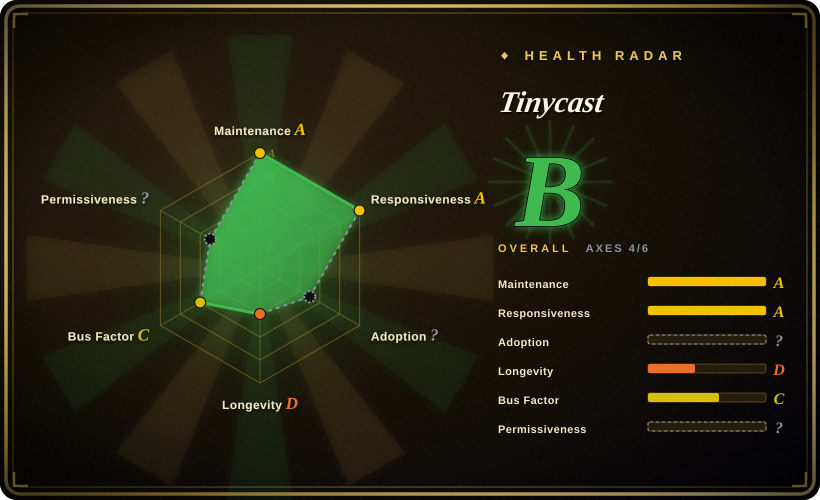
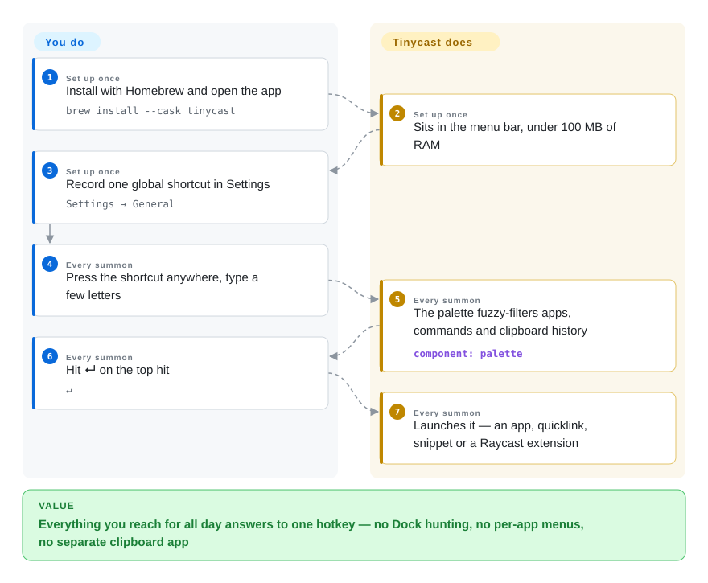

# Tinycast

Your Mac's stock launcher forgets everything the moment you close it — no clipboard history from an hour ago, no snippets, no "put this window on the left half". The tools that fix this (Raycast, Alfred) are closed-source commercial apps. Tinycast is a fully native, open-source macOS palette that gathers apps, clipboard, snippets, window moves and quicklinks behind one hotkey — and runs the Raycast extensions you already have.

## When to use

You live on a keyboard-driven Mac (on macOS 26 or newer) and Spotlight has stopped being enough: you paste the same texts fifty times a day, you keep a separate clipboard manager and a separate window-tiling app, and every one of those is another icon in the menu bar. You'd take Raycast for its breadth, but closed source, freemium gating and an AI subscription are not acceptable for your setup — or your team policy says telemetry-free, AGPL-auditable tools only.

Tinycast is that bundle as one Swift app: fuzzy app launching, clipboard history with search, Markdown snippets with keyword expansion, 34 Rectangle-style window actions, quicklinks, shell commands, Apple Shortcuts, and an optional BYO-key AI chat that ships **off** by default. The deciding pull over the closed alternatives: it is open-source (AGPL-3.0), claims zero telemetry, and — uniquely among open launchers — runs **your existing Raycast extensions**, rendered natively in SwiftUI, plus imports your Raycast setup. If you're looking for an exit ramp from Raycast that doesn't abandon your extensions, this is the one project built for exactly that.

## How it works

Tinycast is a menu-bar app that sleeps until you press your global shortcut; one floating palette window then fuzzy-searches everything it can do, and what it can do is unusually wide because the features are all built in — no plugin host to feed first. **The palette and the whole command set ship together**: you grant macOS Accessibility once (only needed when Tinycast pastes snippets into other apps), record one shortcut, and from then on the app listens locally — keystrokes for snippet expansion are matched on your machine and never stored, file search delegates to Spotlight instead of building its own index, and nothing phones home (the project's own claim; see Caveats). The Raycast-extension runtime is the interesting part: instead of running a bundled Node.js host, Tinycast reimplements the extension API natively, so an extension you installed for Raycast renders as ordinary SwiftUI views inside the same palette.

<!-- flow-steps:begin (generated from flows/tinycast.json by tools/flow_card.py — do not edit) -->

Text version of the flow

1. **You** (Set up once): Install with Homebrew and open the app — `brew install --cask tinycast`
2. **Tinycast** (Set up once): Sits in the menu bar, under 100 MB of RAM
3. **You** (Set up once): Record one global shortcut in Settings — `Settings → General`
4. **You** (Every summon): Press the shortcut anywhere, type a few letters
5. **Tinycast** (Every summon): The palette fuzzy-filters apps, commands and clipboard history — component: `palette`
6. **You** (Every summon): Hit ↵ on the top hit — `↵`
7. **Tinycast** (Every summon): Launches it — an app, quicklink, snippet or a Raycast extension

**Value**: Everything you reach for all day answers to one hotkey — no Dock hunting, no per-app menus, no separate clipboard app

<!-- flow-steps:end -->

## When NOT to use

- **Not on macOS 26.** The README gates it at macOS 26+, so on any older Mac it simply won't install; use Alfred or LaunchBar, which have long supported older macOS lines `[推断]`.
- **Don't bet a team's daily workflow on it yet.** Created 2026-06, pre-1.0 (v0.11.x), and ~90% of commits come from one tip-funded developer — for a must-not-break daily driver with commercial support, stay on Raycast.
- **Don't come for the full Raycast store.** Extension compatibility is the headline feature but is visibly under construction (menu-bar commands and TLS sockets landed in the weeks before verification); there is no compatibility matrix — if a specific extension is your reason to switch, test it first, or keep Raycast.
- **Need deep, battle-tested workflow scripting?** Alfred's workflow ecosystem and LaunchBar's two decades of stable scripting are the safer tools; Tinycast's extension story is months old.
- **Cross-platform fleet (Windows/Linux).** This is a macOS-only app; use the platform's launcher stack instead (e.g. PowerToys Run on Windows, uLauncher/Albert on Linux).
- **Redistributing a modified build.** AGPL-3.0 network-copyleft plus a contributor/feedback licensing agreement apply; if you plan to embed or rebrand it inside a product, the legal review is on you — keep it unmodified or pick a permissively-licensed base.
- **Locked-down managed Macs.** Builds are self-signed (the DMG path asks you to clear the quarantine flag yourself); if your org requires notarized, MDM-deployable binaries, verify before rolling out `[未验证]`.

## Comparison

| Alternative | In index | Our verdict | Tradeoff |
|---|---|---|---|
| Raycast | 非仓库 (closed-source freemium app) | Stay on Raycast when you need today's full extension store, polish and a company behind it; choose Tinycast when open source, zero telemetry and AGPL auditability outweigh ecosystem maturity. | Tinycast runs many Raycast extensions natively and imports your setup, but compatibility is young; Raycast is the polished default but closed, freemium and AI-subscription-driven. |
| Alfred | 非仓库 (closed-source, paid Powerpack) | Choose Alfred for mature workflow scripting and a one-time purchase on older macOS; choose Tinycast when clipboard/snippets/window actions should be free and built-in rather than paid add-ons. | Alfred sells its power via the Powerpack and its model predates command palettes; Tinycast bundles the whole bundle free but is 3 months old and macOS 26+ only. |
| LaunchBar | 非仓库 (closed-source commercial app) | Choose LaunchBar for its 20+ year track record and abbreviation muscle memory; choose Tinycast when you want the open, Raycast-compatible palette instead of a proprietary veteran. | LaunchBar is the Lindy pick but closed and license-based; Tinycast is open and free but unproven at that horizon. |
| uTools | 非仓库 (closed-source freemium app) | Choose uTools when the same launcher must run on Windows and Linux too; choose Tinycast for a fully native, open macOS-only tool. | uTools buys cross-platform at the cost of being closed and heavier; Tinycast is native Swift with zero third-party deps but a single platform. |

## Tech stack

- **Language:** Swift 6 with SwiftUI + AppKit — one native app, no Electron runtime
- **Dependencies:** zero third-party dependencies (project's own claim in the README)
- **Extension runtime:** a native reimplementation of the Raycast extension API rendering extensions as SwiftUI (menu-bar commands, forms, SVG handling actively landing as of 2026-09)
- **Quality harness:** SwiftLint + swift-format configs, a test target, per-PR memory budget and before/after video requirements for visual changes; docs ship one page per feature, each opening with an `## Invariants` section
- **Distribution:** GitHub Releases + a Homebrew tap (`brew install --cask tinycast`), separate Intel cask, and a beta cask channel

## Dependencies

- **macOS 26 or newer** — hard requirement; Apple silicon and Intel builds
- **Accessibility permission** — only for features that paste/expand text into other apps; everything else works without it
- **Nothing else to run:** no backend, no account, no local file index (file search rides on Spotlight); AI chat is optional with your own API key and off by default

## Ops difficulty

**Low.** A `brew install --cask`, one permission prompt, one shortcut — there is no service to operate and no data store beyond local settings. Maintenance is accepting a fast release cadence (stable plus a near-daily beta channel). Two frictions: DMG installs need a one-time `xattr -dr com.apple.quarantine` because builds are self-signed, and Settings backup/import replaces fleet-style management if you roll it to several Macs.

## Health & viability

- **Maintenance (2026-09).** Extremely active for its age: created 2026-06-29, latest commit 2026-09-21, stable v0.11.3 plus beta .98 within three months. `[推断 from GitHub API]`
- **Governance / bus factor.** One dominant maintainer (~503 of ~560 commits ≈ 90% `[推断]`) with a small contributor group; a contributor license + feedback agreement, mandatory issue-approval before PRs, and a deliberately closed feature set — tightly governed, but a bus-factor-of-one roadmap.
- **Backing & Lindy.** No foundation or vendor: tip-funded via Polar.sh (author's country lacks GitHub Sponsors). Three months old with 7.2k stars — hype-velocity, which this index treats as a risk flag, not proof of longevity.
- **Adoption & ecosystem.** 7.2k stars / 340 forks / 89 open issues, an active Discord, and unusually deep docs for the age; pre-1.0 semver, so expect churn.
- **Risk flags.** AGPL-3.0 (strong network copyleft); self-signed, non-notarized-at-DMG-path binaries; AI features off by default is a privacy positive; relicense risk is inherent to solo ownership.

## Caveats (unverified)

- **Under 100 MB of RAM** is the project's own headline claim; not independently measured. `[未验证]`
- **Raycast extension compatibility breadth** — no compatibility matrix exists; which extension APIs work is only visible from the commit log (menu-bar commands, TLS sockets landing 2026-09), and the set was not tested here. `[未验证]`
- **Zero telemetry / keystrokes never stored** — stated in the README's Permissions section; no independent audit. `[未验证]`
- **Notarization status** — the README says self-signed and instructs clearing quarantine for DMG installs, implying non-notarized distribution; not verified against Apple's systems. `[推断]`
- **Competitor version support** (Alfred/LaunchBar supporting older macOS) is common knowledge, not checked against their current requirements. `[推断]`
- **~90% single-maintainer commit share** is computed from the GitHub contributors API snapshot (2026-09-22) and shifts as contributors land commits. `[推断]`
- **macOS 26 install-base share** — how many Macs can actually run a macOS-26-gated tool today was not researched. `[未验证]`
