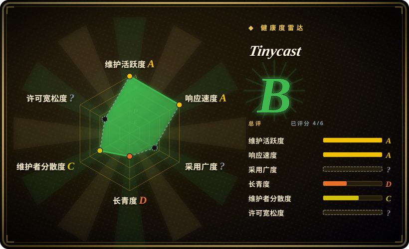
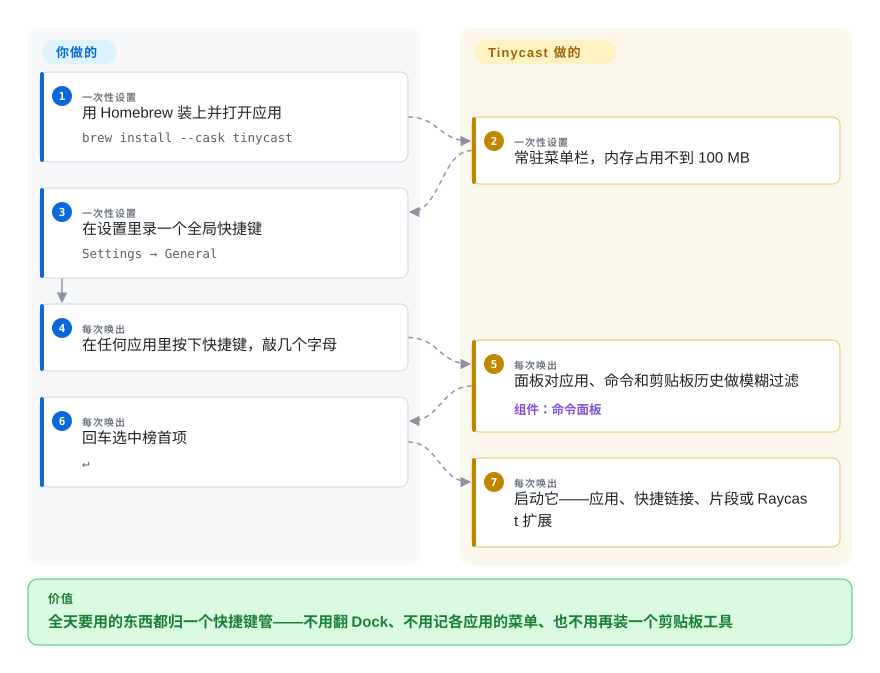

# Tinycast

系统自带的启动器什么都不记得：一小时前复制过的内容找不回来，常用回复没有模板，窗口也不会一键靠左半屏——补齐这些的工具（Raycast、Alfred）又全是闭源商业软件。Tinycast 是一个完全原生的开源 macOS 命令面板，把应用启动、剪贴板历史、文本片段、窗口管理和快捷链接全收进一个快捷键，还能直接跑你已有的 Raycast 扩展。

## 何时使用

你是重度键盘流的 Mac 用户（系统已是 macOS 26 或更新），Spotlight 早就不够用了：同一段话一天要粘几十遍，剪贴板管理器和窗口平铺工具各装了一个，菜单栏里多出一排图标。想换 Raycast 图它功能全，但闭源、免费版设卡、AI 还要订阅，你的团队政策只接受零遥测、可审计的开源工具。

Tinycast 把这一整捆装进一个 Swift 应用：应用模糊启动、可搜索的剪贴板历史、带关键词展开的 Markdown 片段、34 项 Rectangle 风格窗口操作、快捷链接、shell 命令、Apple 快捷指令，以及默认**关闭**、自带 Key 的 AI 聊天。相对闭源替代品，决定性的拉力在于：开源（AGPL-3.0）、宣称零遥测，而且——在开源启动器里独一份——**直接运行你现有的 Raycast 扩展**（原生 SwiftUI 渲染），还能导入你的 Raycast 配置。如果你想从 Raycast 找一条不抛弃扩展的退出通道，这就是专门为此造的项目。

## 怎么用起来

Tinycast 是一个常驻菜单栏的应用，平时沉睡，直到你按下全局快捷键；随后浮出一个命令面板，对你能做的一切做模糊搜索——它能做的事异常地多，因为功能全部内建，不需要先喂插件。**面板和整套命令一起出厂**：首次给 macOS 授权辅助功能（只有往别的应用里粘贴、展开片段时才需要），录一个快捷键，之后应用全在本地监听——片段展开的按键匹配只在本机进行、从不存储，文件搜索直接复用 Spotlight 而不自建索引，也不外发任何数据（以上为项目自述，见存疑账本）。最有意思的是 Raycast 扩展运行时：它不是塞一个 Node.js 宿主，而是在原生层重新实现了扩展 API，于是你为 Raycast 装的扩展在同一个面板里以普通 SwiftUI 视图渲染出来。

<!-- flow-steps:begin (generated from flows/tinycast.json by tools/flow_card.py — do not edit) -->

流程文字版

1. **你**（一次性设置）：用 Homebrew 装上并打开应用 — `brew install --cask tinycast`
2. **Tinycast**（一次性设置）：常驻菜单栏，内存占用不到 100 MB
3. **你**（一次性设置）：在设置里录一个全局快捷键 — `Settings → General`
4. **你**（每次唤出）：在任何应用里按下快捷键，敲几个字母
5. **Tinycast**（每次唤出）：面板对应用、命令和剪贴板历史做模糊过滤 — 组件：`命令面板`
6. **你**（每次唤出）：回车选中榜首项 — `↵`
7. **Tinycast**（每次唤出）：启动它——应用、快捷链接、片段或 Raycast 扩展

**价值**：全天要用的东西都归一个快捷键管——不用翻 Dock、不用记各应用的菜单、也不用再装一个剪贴板工具

<!-- flow-steps:end -->

## 何时不用

- **不在 macOS 26 上。** README 明确要求 macOS 26+，老机器装不上；用 Alfred 或 LaunchBar——它们长期支持更老的 macOS 版本「推断」。
- **别把团队日常压在它身上（至少现在）。** 2026 年 6 月创建、pre-1.0（v0.11.x）、约九成 commit 来自一位靠打赏维持的开发者——要一个不许挂、有商业支持的日用工具，留在 Raycast。
- **别为完整的 Raycast 扩展商店而来。** 扩展兼容是招牌功能，但明显还在施工中（菜单栏命令、TLS socket 都是验证前几周才落地），没有兼容矩阵——如果某个具体扩展是你迁移的理由，先实测，否则留在 Raycast。
- **需要深度的老牌工作流脚本？** Alfred 的工作流生态和 LaunchBar 二十年的稳定脚本更稳妥；Tinycast 的扩展故事只有几个月历史。
- **跨平台队伍（Windows/Linux）。** 这是 macOS 独占应用；各平台用自己的启动器栈（Windows 上如 PowerToys Run，Linux 上如 uLauncher/Albert）。
- **打算二次分发改造版。** AGPL-3.0 网络传染条款加一份贡献者许可与反馈协议同时生效；要在产品里内嵌或换皮，法务审查得自己过——保持原样分发，或改选宽松许可的基座。
- **受管控的锁定 Mac。** 构建是自签名的（DMG 路径要手动清隔离标记）；若组织要求公证过的、可 MDM 下发的二进制，先验证再铺「未验证」。

## 横向对比

| 替代品 | 是否收录 | 我们的评价 | 取舍 |
|---|---|---|---|
| Raycast | 非仓库（闭源免费增值应用） | 要今天就齐的扩展商店、打磨度和一家公司兜底，留在 Raycast；当开源、零遥测、AGPL 可审计比生态成熟度更重要时，选 Tinycast。 | Tinycast 能原生跑不少 Raycast 扩展并导入配置，但兼容性尚年轻；Raycast 是打磨过的默认选择，但闭源、免费版设卡、AI 走订阅。 |
| Alfred | 非仓库（闭源、Powerpack 付费） | 要成熟的工作流脚本和老 macOS 支持选 Alfred；当剪贴板、片段、窗口操作这些应该免费内置而不是付费插件时，选 Tinycast。 | Alfred 的能力靠 Powerpack 变现，模型早于命令面板时代；Tinycast 整捆免费，但只有三个月历史且仅支持 macOS 26+。 |
| LaunchBar | 非仓库（闭源商业应用） | 要二十多年的 track record 和缩写肌肉记忆选 LaunchBar；要开放、兼容 Raycast 生态的新面板选 Tinycast。 | LaunchBar 是 Lindy 之选但闭源、按许可收费；Tinycast 开放且免费，但在同样的时间尺度上未经证明。 |
| uTools | 非仓库（闭源免费增值应用） | 同一个启动器还要跑 Windows 和 Linux，选 uTools；要完全原生的 macOS 开源工具，选 Tinycast。 | uTools 用闭源和更重的体积换跨平台；Tinycast 是零第三方依赖的原生 Swift，但只有一个平台。 |

## 技术栈

- **语言：** Swift 6，SwiftUI + AppKit——单一原生应用，没有 Electron 运行时
- **依赖：** 零第三方依赖（README 自述）
- **扩展运行时：** 原生重实现的 Raycast 扩展 API，扩展以 SwiftUI 渲染（菜单栏命令、表单、SVG 处理在 2026-09 仍在持续落地）
- **质量约束：** SwiftLint 与 swift-format 配置、测试 target、每个 PR 卡内存预算、视觉改动须提交前后视频；文档每个功能一页，每页以 `## Invariants` 开头
- **分发：** GitHub Releases + 自建 Homebrew tap（`brew install --cask tinycast`），Intel 单独 cask，另有 beta cask 通道

## 依赖

- **macOS 26 或更新**——硬性要求；Apple silicon 与 Intel 各有构建
- **辅助功能权限**——只有往其他应用粘贴、展开文本时才需要；其余功能不依赖它
- **没有别的要跑：** 无后端、无账号、无自建文件索引（文件搜索复用 Spotlight）；AI 聊天可选、自带 Key、默认关闭

## 运维难度

**低。** 一条 `brew install --cask`、一次授权、一个快捷键——没有服务要运维，也没有本地设置之外的存储。维护成本主要是接受很快的发布节奏（稳定版加近乎每日的 beta 通道）。两处摩擦：DMG 安装因自签名需要一次性 `xattr -dr com.apple.quarantine`；多台 Mac 铺开时只有设置备份/导入，没有舰队式管理。

## 健康度与可持续性

- **维护（2026-09）。** 就其年龄而言极度活跃：2026-06-29 创建，最新 commit 2026-09-21，三个月内发出稳定版 v0.11.3 加 beta .98。「依据 GitHub API 推断」
- **治理与巴士系数。** 一位绝对主力维护者（约 503/560 commit，占九成「推断」）带一个小贡献者组；有贡献者许可加反馈协议、PR 前必须先过 issue 审批、功能集刻意封闭——治理很紧，但路线图系于一人。
- **背书与 Lindy。** 无基金会、无厂商：靠 Polar.sh 打赏（作者所在国没有 GitHub Sponsors）。三个月拿下 7.2k star——按本索引的准则是热度信号而非长寿证明。
- **采用与生态。** 7.2k star、340 fork、89 个开放 issue，活跃的 Discord，文档深度在这个年龄的项目里罕见；pre-1.0 semver，预期会有变动。
- **风险旗标。** AGPL-3.0（强网络传染）；自签名、DMG 路径未公证；AI 功能默认关闭是隐私加分项；单人所有权天然带改许可风险。

## 存疑（未验证）

- **内存不到 100 MB** 是项目自己的标题宣称；未独立测量。「未验证」
- **Raycast 扩展兼容覆盖面**——没有兼容矩阵；哪些扩展 API 可用只能从 commit 记录看出（菜单栏命令、TLS socket 于 2026-09 落地），此处未实测。「未验证」
- **零遥测、按键从不存储**——README 权限章节的自述；无独立审计。「未验证」
- **公证状态**——README 称自签名并让 DMG 用户手动清隔离标记，推断分发未走公证；未对照 Apple 系统核实。「推断」
- **竞品版本支持**（Alfred/LaunchBar 支持更老 macOS）是常识性说法，未对照其当前要求核实。「推断」
- **约九成 commit 出自单维护者**——由 2026-09-22 的 GitHub contributors API 快照计算，随贡献者提交会漂移。「推断」
- **macOS 26 装机存量**——今天有多少 Mac 真的能跑 macOS-26-gated 的工具，未调研。「未验证」
