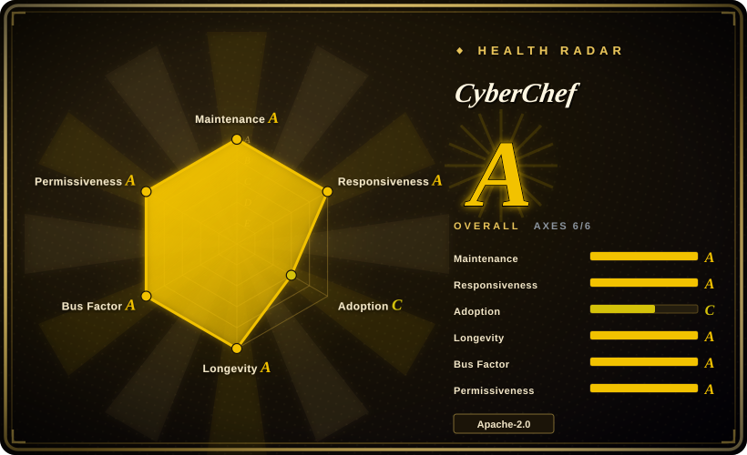
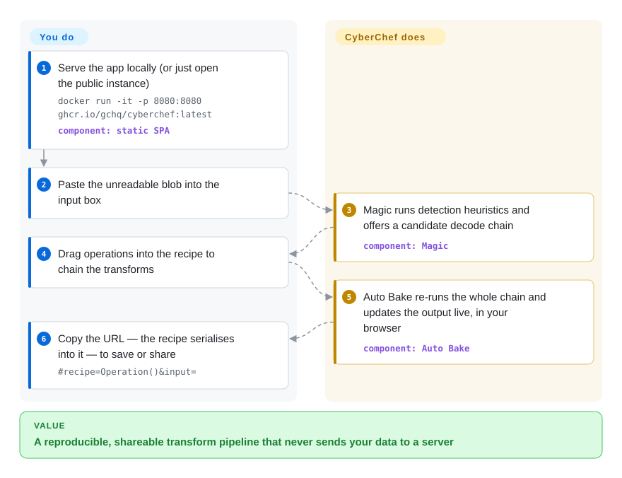

# CyberChef

You've got a blob of data you can't read — Base64 wrapped in URL-encoding, a hexdump that hides a gzip stream — and writing a throwaway decoder per layer is slow, while pasting live incident data into some online tool leaks it. CyberChef gives you a canvas where you drag decode/encode/hash/cipher operations into a chain and the answer re-computes live, entirely inside your browser.

## When to use

You're a security analyst, CTF player, or backend engineer staring at a blob of data you don't recognize — maybe a doubly-URL-encoded then Base64'd token, a gzipped payload inside a hex dump, or a timestamp in some format you can't place. Writing a throwaway script for each transform is slow, and pasting sensitive data into a random online decoder is a non-starter. You open CyberChef (the public instance, or a copy you self-host), drag operations into a recipe — `From Base64` → `URL Decode` → `Gunzip` — and watch the output update live at each step. The "Magic" operation can even guess the chain for you when you have no idea what you're looking at. Because everything runs in your browser and nothing is sent to a server, you can safely throw real incident data, keys, or PCAP-extracted strings at it.

You also reach for it when you want that same logic *repeatable*. A recipe serialises into the URL, so you can bookmark or share a deep link that reproduces an exact transform pipeline, drop file inputs up to ~2 GB, set breakpoints to inspect intermediate stages, and — when you've nailed the recipe interactively — call the very same operations programmatically from Node via the `cyberchef` npm package to bake it into a script or pipeline.

## How it works

The UI has four zones: an input box, an output box, a searchable list of operations, and the recipe area in the middle. You paste (or drag, up to ~2 GB) the data into the input, drag operations into the recipe, and **Auto Bake** re-runs the whole chain on every change — the output updates live at each step, so you iterate by looking, not by re-running scripts. Nothing is uploaded: the app is entirely client-side, and you can even click to download a full copy of it and drop it into an air-gapped VM. If you don't know what encoding you're looking at, the **Magic** operation runs detection heuristics over the data and offers a candidate decode chain in the output pane. The recipe itself serialises into the URL (`#recipe=Operation()&input=`), so a solved pipeline is a bookmarkable, shareable artifact; the same operation set is also reachable from Node (`npm install cyberchef`, see the "Node API" wiki) when you want to run a recipe programmatically.

<!-- flow-steps:begin (generated from flows/cyberchef.json by tools/flow_card.py — do not edit) -->

Text version of the flow

1. **You**: Serve the app locally (or just open the public instance) — `docker run -it -p 8080:8080 ghcr.io/gchq/cyberchef:latest` — component: `static SPA`
2. **You**: Paste the unreadable blob into the input box
3. **CyberChef**: Magic runs detection heuristics and offers a candidate decode chain — component: `Magic`
4. **You**: Drag operations into the recipe to chain the transforms
5. **CyberChef**: Auto Bake re-runs the whole chain and updates the output live, in your browser — component: `Auto Bake`
6. **You**: Copy the URL — the recipe serialises into it — to save or share — `#recipe=Operation()&input=`

**Value**: A reproducible, shareable transform pipeline that never sends your data to a server

<!-- flow-steps:end -->

## When NOT to use

- **Bulk / high-throughput batch processing.** It's a browser app; for streaming gigabytes through a transform in a server pipeline, a purpose-built CLI or library (`xxd`, `openssl`, `zstd`, a Python script) is faster and scriptable without the SPA overhead. The Node API helps but is still a general-purpose toolbox, not an optimised data-plane.
- **Production cryptography you must trust end-to-end.** CyberChef is for analysis, prototyping and learning — not a vetted crypto library for shipping. Use audited primitives (libsodium, the platform's crypto stdlib) in production code.
- **Strict-egress / air-gapped policy without self-hosting.** The public gchq.github.io instance is convenient but still a third-party site; if policy forbids that, you must self-host the static build (which is fully offline-capable once served).
- **You need a native desktop tool palette.** If you want a local, install-and-go GUI of inspectors/converters rather than a recipe-chaining canvas, a desktop devtools app fits better — see DevToys below.
- **Very large binary forensics / memory analysis.** The ~2 GB input ceiling and in-browser memory model make it unsuitable for full disk images or memory dumps; reach for dedicated forensics suites.
- **Custom operation lock-in.** Adding your own operation means writing it into CyberChef's module/operation framework and rebuilding the bundle; it's not a generic plugin you drop in at runtime.

## Comparison

| Alternative | In index | Our verdict | Tradeoff |
|---|---|---|---|
| [DevToys](devtoys.md) | ✅ | Choose DevToys when you need a native cross-platform desktop devtools palette for formatters, converters, and generators. | Native cross-platform desktop devtools palette (formatters, converters, generators); a fixed tool list rather than CyberChef's chainable recipe pipeline + "Magic" auto-detection. |
| [Cockpit](../ops-infra/cockpit.md) | ✅ | Choose Cockpit when you need a web UI for *server administration*, not data transformation. | Web UI for *server administration*, not data transformation — different problem entirely; listed only to disambiguate "web tool" overlap. |
| CyberChef-server | 未收录 | Choose CyberChef-server when you need the official Node wrapper exposing CyberChef recipes over HTTP. | Official Node wrapper exposing CyberChef recipes over HTTP for batch/automation; complements rather than replaces the app. |
| Custom scripts (`openssl`/`xxd`/Python) | 未收录 | Choose custom scripts when you need maximum control, scriptability, and no UI. | Maximum control, scriptable, no UI; but you rewrite per-task and lose the live visual recipe + Magic detection. |
| dCode / online decoders | 未收录 | Choose dCode or online decoders when browser convenience for one-off transforms outweighs offline privacy. | Browser convenience for single transforms; data leaves your machine and no offline/self-host story — the privacy gap CyberChef closes. |

## Tech stack

- **Language:** JavaScript (browser + Node). Webpack 5 bundles a single-page app; Babel (`@babel/preset-env`) transpiles; Grunt orchestrates the build.
- **Crypto/encoding deps:** `crypto-js`, `@noble/hashes`, `node-forge`, `jsrsasign`, `bcryptjs`, `argon2-browser` for the hashing/encryption operations.
- **Data/analysis deps:** `lodash`, `bignumber.js`, `protobufjs`, `cbor`, `bson`, `json5`; `d3`, `jimp`, `tesseract.js` (OCR), `highlight.js` for visualisation.
- **Compression:** `lz-string`, `lz4js`, `browserify-zlib`.
- **Dual distribution:** static web bundle (the SPA) **and** an npm library with ESM + CommonJS entry points (Node wrapper) — same operation set, two delivery modes.

## Dependencies

- **To use the public app:** just a modern browser (README states Chrome 50+ / Firefox 38+). No backend — all processing is client-side.
- **To self-host:** serve the prebuilt static files behind any web server, or run the official Docker image `ghcr.io/gchq/cyberchef:latest`. No database, no server-side runtime required at request time.
- **To build from source / develop:** Node.js `v24` (README "Node.js support": built to fully support v24, tested against v26; package declares `engines: ">=24 <27"`), then `npm install` and `npm run build` (production build into `build/prod`) or `npm start` (dev server with live reload at `http://localhost:8080`).
- **Node library:** `npm install cyberchef` to consume the operation set from Node (see the "Node API" wiki page).

## Ops difficulty

**Low.** As a static single-page app there is nothing stateful to operate: the easiest self-host is dropping the built `assets`/`index.html` on any static host or CDN, or running the published Docker image (`ghcr.io/gchq/cyberchef:latest` on port 8080). There is no database, queue, or background worker, and no inbound data handling to secure server-side because processing is in the client. The only real cost is rebuilding/upgrading the bundle on a new release and the Node `v24` build pin (`engines: ">=24 <27"`), which can bite CI pinned to other Node majors. Running the Node library inside your own service inherits that service's ops profile rather than adding its own.

## Health & viability

- **Responsiveness**: Grade A — median first-response time 32.6 hours across 29 qualifying issues/PRs.
- **Maintenance (2026-09):** **very active** — semver-tagged releases keep coming (latest v11.5.0, 2026-09-18), last pushed 2026-09-26. A mature major-version line, not coasting.
- **Governance & bus factor:** `Organization`-owned by **GCHQ** (the UK signals-intelligence agency) — institutional backing rather than a solo maintainer, with a broad contributor community (23 active committers in the trailing 12 months, top-1 share 0.36). Unusual but durable sponsor; low bus-factor risk.
- **Age & Lindy (~10yr, created 2016-11):** **old and still active** — a strong Lindy verdict. A decade of continuous releases plus government backing makes it a safe long-term bet for an analysis tool.
- **Adoption/ecosystem:** de-facto standard "cyber swiss army knife" in security/CTF/forensics circles (~36k stars), dual-distributed (hosted SPA + `cyberchef` npm library) with an official container image; broad real-world use. [推断] the "de-facto standard" framing is community reputation, not a measured claim.
- **Risk flags:** none structural (Apache-2.0 under Crown Copyright, no relicense/open-core history). Practical gates are scope, not viability: not vetted production crypto, and the Node v24 build pin can bite CI.

## Caveats (unverified)

- [未验证] "300+ operations" is the project's commonly-cited framing; the exact operation count shifts release-to-release — verify against the current build before relying on a specific operation existing.
- [未验证] Star count ~36.0k as of 2026-09 — GitHub stars are date-sensitive, treat as indicative only.
- [未验证] README states browser support as Chrome 50+ / Firefox 38+ and a ~2 GB file-input ceiling; actual behaviour at the limit depends on the host browser's memory and version.
- [推断] Self-hosted instances are "fully offline-capable once served" based on the client-side-only design (the README documents downloading a full copy of the app); still verify your specific build has no CDN/runtime fetches before treating it as air-gapped-safe.
