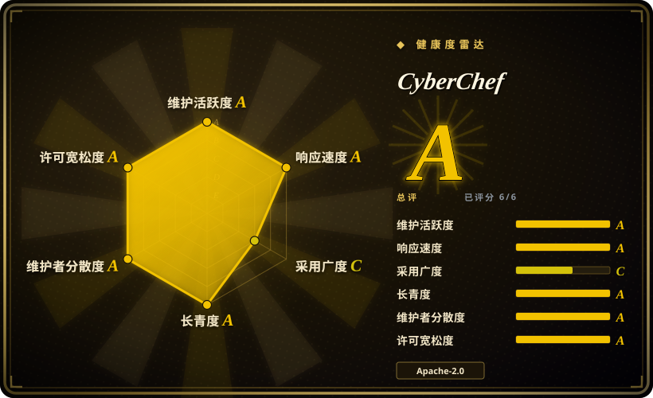
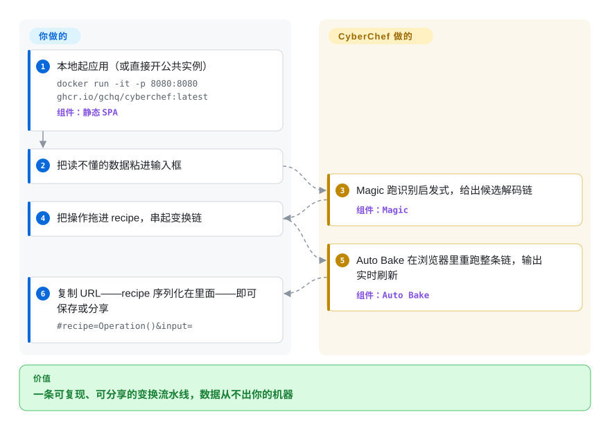

# CyberChef

你手上有一坨读不懂的数据——URL 编码里裹着 Base64，hex dump 里藏着 gzip 流——每剥一层都写个一次性解码器太慢，把真实事件数据粘进某个在线工具又会泄密。CyberChef 给你一块画布：把编解码、哈希、加解密操作拖成一条链，结果在浏览器里实时重算，数据一步都不出你的机器。

## 何时使用

你是安全分析师、CTF 选手或后端工程师，面前是一坨认不出的数据——也许是先双重 URL 编码再 Base64 的 token、藏在 hex dump 里的 gzip 负载，或某种你叫不出名字的时间戳格式。为每个变换写一次性脚本太慢，而把敏感数据粘进某个随机在线解码器又绝不可行。你打开 CyberChef（公网实例，或你自托管的副本），把操作拖进 recipe——`From Base64` → `URL Decode` → `Gunzip`——逐步看着每一阶段的输出实时刷新。当你完全摸不着头脑时，「Magic」操作甚至能替你猜出这条变换链。因为一切都在浏览器里跑、什么都不发往服务器，你可以放心地把真实事件数据、密钥或从 PCAP 抽出来的字符串丢进去。

当你想让这套逻辑*可复现*时，你也会用它。recipe 会序列化进 URL，于是你能收藏或分享一条深链，精确重现整条变换流水线；可拖入最大约 2 GB 的文件输入、设断点检查中间阶段；而当你交互式地把 recipe 调好之后，可以通过 `cyberchef` npm 包在 Node 里以编程方式调用同一批操作，把它固化进脚本或流水线。

## 怎么用起来

界面分四块：输入框、输出框、可搜索的操作清单，以及中间的 recipe 区。你把数据粘进（或拖进，上限约 2 GB）输入框，把操作拖进 recipe，**Auto Bake** 就会在每次改动后重跑整条链——输出逐段实时刷新，你靠看就能迭代，不用反复重跑脚本。没有任何东西被上传：整个应用纯客户端运行，你甚至可以点一下下载它的完整副本，丢进气隙虚拟机。如果你根本不知道数据套了哪层编码，**Magic** 操作会跑一套识别启发式，在输出区给出候选解码链。recipe 本身会序列化进 URL（`#recipe=Operation()&input=`），调好一条流水线就等于得到一个可收藏、可分享的成品；同一套操作也能从 Node 里调用（`npm install cyberchef`，见 "Node API" wiki），用来以编程方式跑 recipe。

<!-- flow-steps:begin (generated from flows/cyberchef.json by tools/flow_card.py — do not edit) -->

流程文字版

1. **你**：本地起应用（或直接开公共实例） — `docker run -it -p 8080:8080 ghcr.io/gchq/cyberchef:latest` — 组件：`静态 SPA`
2. **你**：把读不懂的数据粘进输入框
3. **CyberChef**：Magic 跑识别启发式，给出候选解码链 — 组件：`Magic`
4. **你**：把操作拖进 recipe，串起变换链
5. **CyberChef**：Auto Bake 在浏览器里重跑整条链，输出实时刷新 — 组件：`Auto Bake`
6. **你**：复制 URL——recipe 序列化在里面——即可保存或分享 — `#recipe=Operation()&input=`

**价值**：一条可复现、可分享的变换流水线，数据从不出你的机器

<!-- flow-steps:end -->

## 何时不用

- **大批量 / 高吞吐批处理。** 它是浏览器应用；要在服务端流水线里把上 GB 数据流过某个变换，专用 CLI 或库（`xxd`、`openssl`、`zstd`、一段 Python）更快，且无需 SPA 开销即可脚本化。Node API 有帮助，但仍是通用工具箱，不是优化过的数据面。
- **需要端到端可信的生产加密。** CyberChef 用于分析、原型和学习——不是用来上线的、经审计的加密库。生产代码请用经审计的原语（libsodium、平台 crypto 标准库）。
- **严格出网 / 气隙策略且不自托管。** 公网 gchq.github.io 实例很方便，但仍是第三方站点；若策略禁止，你必须自托管静态构建（只要被托管出来，它是完全可离线的）。
- **你想要原生桌面工具面板。** 如果你要的是本地、装好即用的检查器/转换器 GUI，而非串 recipe 的画布，桌面 devtools 应用更合适——见下方 DevToys。
- **超大二进制取证 / 内存分析。** 约 2 GB 的输入上限和浏览器内存模型，使它不适合整盘镜像或内存转储；请用专门的取证套件。
- **自定义操作锁定。** 加自己的操作意味着写进 CyberChef 的 module/operation 框架并重新打包；它不是一个能在运行时随手丢进去的通用插件。

## 横向对比

| 替代品 | 是否收录 | 我们的评价 | 取舍 |
|---|---|---|---|
| [DevToys](devtoys.zh.md) | ✅ | 需要原生跨平台桌面 devtools 工具面板，覆盖格式化、转换和生成器时，选 DevToys。 | 原生跨平台桌面 devtools 工具面板（格式化、转换、生成器）；是固定工具清单，而非 CyberChef 那种可串联的 recipe 流水线 +「Magic」自动识别。 |
| [Cockpit](../ops-infra/cockpit.zh.md) | ✅ | 需要面向*服务器管理*的 Web UI，而不是数据变换工具时，选 Cockpit。 | 面向*服务器管理*的 Web UI，不做数据变换——完全是另一个问题；列出仅为消解「Web 工具」这一名词上的重叠。 |
| CyberChef-server | 未收录 | 需要官方 Node 封装，把 CyberChef recipe 经 HTTP 暴露出来时，选 CyberChef-server。 | 官方 Node 封装，把 CyberChef recipe 经 HTTP 暴露出来做批处理/自动化；是补充而非替代本应用。 |
| 自写脚本（`openssl`/`xxd`/Python） | 未收录 | 需要最强控制力、可脚本化且无 UI 时，选自写脚本。 | 控制力最强、可脚本化、无 UI；但每个任务都要重写，且失去实时可视 recipe 和 Magic 识别。 |
| dCode / 在线解码器 | 未收录 | 浏览器单次变换便利性比离线隐私更重要时，选 dCode 或在线解码器。 | 浏览器里单次变换很方便；但数据会离开你的机器，也没有离线/自托管方案——正是 CyberChef 补上的隐私缺口。 |

## 技术栈

- **语言：** JavaScript（浏览器 + Node）。Webpack 5 打包成单页应用；Babel（`@babel/preset-env`）转译；Grunt 编排构建。
- **加密/编码依赖：** `crypto-js`、`@noble/hashes`、`node-forge`、`jsrsasign`、`bcryptjs`、`argon2-browser` 支撑哈希/加密类操作。
- **数据/分析依赖：** `lodash`、`bignumber.js`、`protobufjs`、`cbor`、`bson`、`json5`;`d3`、`jimp`、`tesseract.js`(OCR)、`highlight.js` 做可视化。
- **压缩：** `lz-string`、`lz4js`、`browserify-zlib`。
- **双重分发：** 静态 Web 包（即 SPA）**与**一个带 ESM + CommonJS 入口的 npm 库（Node wrapper）——同一套操作集，两种交付方式。

## 依赖

- **用公网应用：** 一个现代浏览器即可（README 标注 Chrome 50+ / Firefox 38+）。无后端——全部处理在客户端。
- **自托管：** 用任意 Web 服务器托管预构建静态文件，或运行官方 Docker 镜像 `ghcr.io/gchq/cyberchef:latest`。请求时无需数据库、无需服务端运行时。
- **从源码构建 / 开发：** Node.js `v24`（README「Node.js support」：完整支持 v24、并对 v26 做过测试；package 声明 `engines: ">=24 <27"`），然后 `npm install` 加 `npm run build`（产物在 `build/prod`），或 `npm start`（带热重载的开发服务器，监听 `http://localhost:8080`）。
- **Node 库：** `npm install cyberchef`，在 Node 里消费这套操作（见 "Node API" wiki）。

## 运维难度

**低。** 作为静态单页应用，没有任何有状态的东西要运维：最简单的自托管就是把构建出的 `assets`/`index.html` 丢到任意静态主机或 CDN，或跑发布好的 Docker 镜像（`ghcr.io/gchq/cyberchef:latest`，端口 8080）。没有数据库、队列或后台 worker，也没有服务端入站数据需要加固——因为处理在客户端。唯一的实际成本是每次发版重建/升级打包，以及 Node `v24` 的构建 pin（`engines: ">=24 <27"`），这可能会咬到固定在其它 Node 大版本的 CI。把 Node 库嵌进你自己的服务时，它继承的是你那个服务的运维画像，而不会额外增加自己的运维负担。

## 健康度与可持续性

- **响应速度**：Grade A——中位首次响应时间 32.6 小时，基于 29 个 qualifying issues/PRs。
- **维护（2026-09）：** **非常活跃**——semver 打 tag 的发版持续不断（最新 v11.5.0，2026-09-18），最近 push 在 2026-09-26。成熟的 major 版本线，不是 coasting。
- **治理与 bus factor：** `Organization` 名下，归 **GCHQ**（英国信号情报机构）所有——是机构背书而非单人维护，贡献者社区面广（近 12 个月 23 位活跃提交者，top-1 提交份额 0.36）。赞助方不寻常但耐久；bus-factor 风险低。
- **年龄与 Lindy（约 10 年，2016-11 创建）：** **老且仍活跃**——强 Lindy 判定。十年持续发版加上政府背书，作为分析工具是稳妥的长期押注。
- **采用/生态：** 在安全/CTF/取证圈是事实上的「网络瑞士军刀」标准（约 36k star），双重分发（托管 SPA + `cyberchef` npm 库）并有官方容器镜像；真实使用面广。[推断]「事实标准」是社区口碑表述，非实测数据。
- **风险标记：** 无结构性风险（Apache-2.0、Crown Copyright，无 relicense/open-core 历史）。实际门槛在适用范围而非可持续性：它不是经审计的生产加密，且 Node v24 构建 pin 可能咬到 CI。

## 存疑（未验证）

- [未验证]「300+ 操作」是项目常被引用的表述；确切操作数随版本变动——依赖某个具体操作存在前，请对照当前构建核实。
- [未验证] star 约 36.0k（截至 2026-09）——GitHub star 对时间敏感，仅供参考。
- [未验证] README 标注浏览器支持为 Chrome 50+ / Firefox 38+，文件输入上限约 2 GB；逼近上限时的实际行为取决于宿主浏览器的内存与版本。
- [推断]「只要托管出来就完全可离线」基于其纯客户端设计（README 明确可下载完整副本）；在把自托管实例当作气隙安全前，仍请核实你那个具体构建没有 CDN/运行时拉取。
