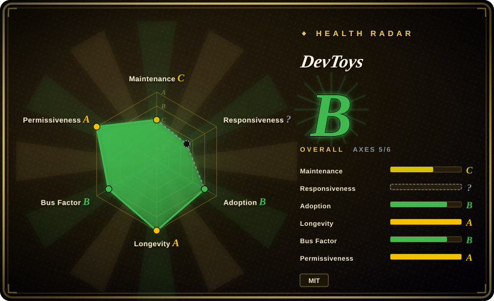
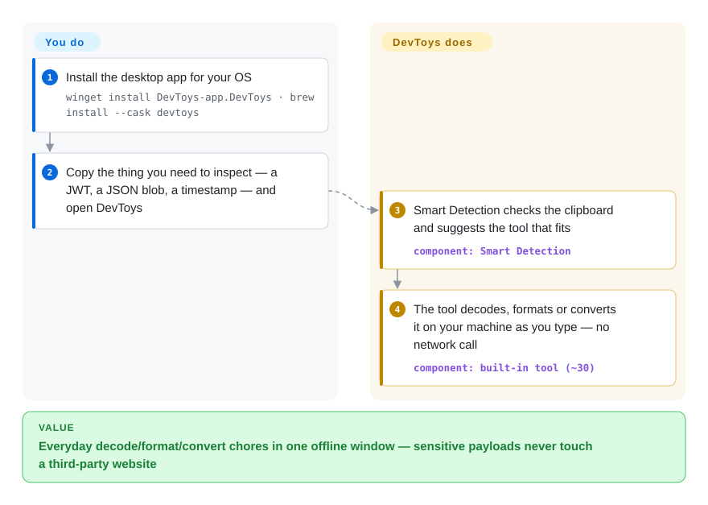

# DevToys

To decode a JWT or pretty-print a JSON blob you paste it into some ad-funded "online formatter" — and a production token has just left your machine. DevToys puts ~30 such small utilities (decoders, formatters, converters, generators, testers) in one offline desktop app for Windows, macOS and Linux, and picks the right one from whatever is on your clipboard.

## When to use

You're a developer who, twenty times a day, needs to Base64-decode a token, pretty-print a blob of JSON, diff two strings, generate a UUID, convert JSON↔YAML, or hash a file — and you're tired of pasting potentially-sensitive payloads into random "json formatter online" sites whose ad-funded business model you don't trust. DevToys installs as a normal desktop app (Windows, macOS, or Linux), opens instantly, and runs every transformation locally with no network call, so a JWT or a config secret never leaves your machine. You get one searchable window with ~30 tools instead of thirty browser tabs, and a "Smart Detection" feature that picks the tool for whatever is on your clipboard.

It also fits when you want the same conveniences in automation: DevToys ships a separate CLI app (`DevToys.CLI`) that exposes the tools for scripting, and both the GUI and CLI are extensible — you can install community tools or write your own as a NuGet-packaged .NET extension. So the personal scratchpad and the pipeline step can share the same tool implementations. Pick it over [CyberChef](cyberchef.md) when you want a native app with clipboard detection rather than a browser tab, and over IT-Tools when you want it on your own machine rather than on a server.

## How it works

Each tool in DevToys is a small .NET plugin with its own little screen: an input box, a few options, an output box. **The tools, their UI and the clipboard detection ship with the app** — when you paste or copy something, DevToys asks every tool "does this look like your kind of input?" (a JWT, a Unix timestamp, a JSON document…) and offers the best match, then the tool recomputes the output on your machine as you type. **You do the pasting, pick or confirm the tool, and copy the result out.** The desktop shell is a native window per OS (WPF on Windows, a native macOS app, GTK on Linux) hosting a web-style UI rendered locally — nothing is served from the internet. The same tools are reachable from the separate CLI, and extensions you install from the "Manage extensions" page are unpacked from NuGet packages into the app's own folder. Think of a kitchen drawer of small gadgets with a helper who hands you the right one when you hold up an ingredient.

<!-- flow-steps:begin (generated from flows/devtoys.json by tools/flow_card.py — do not edit) -->

Text version of the flow

1. **You**: Install the desktop app for your OS — `winget install DevToys-app.DevToys · brew install --cask devtoys`
2. **You**: Copy the thing you need to inspect — a JWT, a JSON blob, a timestamp — and open DevToys
3. **DevToys**: Smart Detection checks the clipboard and suggests the tool that fits — component: `Smart Detection`
4. **DevToys**: The tool decodes, formats or converts it on your machine as you type — no network call — component: `built-in tool (~30)`

**Value**: Everyday decode/format/convert chores in one offline window — sensitive payloads never touch a third-party website

<!-- flow-steps:end -->

## When NOT to use

- **You live in the terminal and want a single binary, not a desktop app.** DevToys is GUI-first; the CLI is a separate companion download. For a pure terminal pipeline, plain [`jq`](jq.md) / `xxd` / `openssl` are lighter, and for a browser-only chain, [CyberChef](cyberchef.md).
- **You need to chain transforms into a reproducible recipe.** DevToys tools are mostly one-shot, single-tool screens; CyberChef's whole model is composing many operations into a saved, shareable pipeline. DevToys (as of v2.0.9) offers no equivalent recipe graph. [推断]
- **You want one shared tool page for a whole team, served over HTTP.** DevToys is installed per machine; for a self-hosted web page with a similar grab-bag of utilities that everyone opens in a browser, use IT-Tools (not indexed, GPL-3.0, Docker image).
- **You depend on a stable, regularly-patched release.** Every 2.x build is published as a GitHub **prerelease** — the last non-prerelease is the Windows-only 1.0.13.0 (2023-07) — and 2.x releases are far apart (v2.0.8.0 in 2024-11, then v2.0.9.0 in 2026-01). If your org bars prerelease software or expects regular security patches for desktop tools, that is a real gate; CyberChef (a GCHQ-maintained static web page) or CLI primitives are safer defaults.
- **You need a tool DevToys doesn't have and can't justify an extension.** The built-in set is fixed (~30); anything beyond means finding or authoring an extension, and the extension manager does not check for extension updates (per its publishing docs) — you track those yourself.
- **Browser-embeddable / scriptable-in-JS use.** DevToys is a .NET desktop app; you can't drop it into a web page the way [CyberChef](cyberchef.md) (pure client-side JS) embeds.

## Comparison

| Alternative | In index | Our verdict | Tradeoff |
|---|---|---|---|
| [CyberChef](cyberchef.md) | ✅ | When you need chained "recipes" or deeper crypto/forensics operations, or must run in any browser with nothing installed, pick CyberChef; for quick single-tool jobs from the clipboard in a native app, pick DevToys. | CyberChef composes operations into shareable pipelines and runs anywhere a browser does; DevToys adds clipboard Smart Detection, OS integration and a CLI, but its tools are one-shot screens. |
| IT-Tools | not indexed | For a self-hosted page the whole team opens in a browser, pick IT-Tools; for an offline tool on each developer's own machine, pick DevToys. | IT-Tools is zero-install for users and actively maintained, but someone runs the server and it is GPL-3.0; DevToys needs a per-machine install and its 2.x line is still prerelease. |
| DevUtils (macOS) | not a repo | If your whole team is on macOS and a polished paid native app is acceptable, DevUtils fits; for free, MIT, cross-platform with extensions, pick DevToys. | DevUtils is closed-source and Mac-only; DevToys trades some polish for cross-platform reach and an extension SDK. |
| [`jq`](jq.md) / `xxd` / `openssl` (CLI) | partly indexed | When the transform belongs in a script or CI step, pick the Unix CLI primitives (only `jq` has a page here); when you just need to eyeball a value once, DevToys is faster. | CLI tools compose and version-control well but have no GUI and need you to remember flags; DevToys is point-and-paste but awkward to automate beyond its CLI companion. |

## Tech stack

- **Language:** C# on .NET 8 (`net8.0` targets; C# ≈ 73% of the repo), with SCSS/HTML/TypeScript UI assets; PowerShell/Shell build scripts (GitHub language stats, 2026-10).
- **UI:** a Blazor Hybrid UI (Razor components rendered in a local WebView) hosted by a native shell per OS — WPF + `WebView.Wpf` on Windows, a `net8.0-macos` app on macOS, GTK 4 + WebKitGTK via GirCore on Linux (per the platform `.csproj` files under `src/app/dev/platforms/desktop/`).
- **Form factors:** `DevToys.Windows` / `DevToys.MacOS` / `DevToys.Linux` GUI apps and a separate `DevToys.CLI`, sharing `DevToys.Api` (the extension SDK) and the same tool implementations.
- **Extensibility:** tools are plugins discovered via reflection; extensions are NuGet packages installed from the in-app "Manage extensions" page; an SDK and docs at devtoys.app/doc.

## Dependencies

- **Runtime:** none for the user — DevToys ships self-contained per OS. No database, no server, no internet connection required to run the built-in tools. Its privacy policy states usage data (errors, performance) stays local, visible under Settings → Logs, and is not sent to the developer.
- **Install:** `winget install DevToys-app.DevToys` (Windows), `brew install --cask devtoys` (macOS), a `.deb` for Debian/Ubuntu, plus the Microsoft Store and direct downloads (devtoys.app/download, 2026-10). The CLI is a separate download.
- **Linux runtime libraries:** the Linux build uses GTK 4 and WebKitGTK, so those system libraries must be present on the machine.
- **Build-from-source:** .NET 8 SDK plus the TypeScript/SCSS asset pipeline.
- **Extensions:** optional NuGet packages, installed at the user's discretion.

## Ops difficulty

**Low.** For the end user it is a single desktop install with zero services to run, no config, and no network exposure — "install and use," and uninstall is clean. The ongoing burden is release hygiene: 2.x builds are prereleases that arrive months apart, so you decide when to update; Linux users depend on the distro's GTK/WebKitGTK; and any third-party extension is arbitrary .NET code from NuGet that the app will not auto-update, so you vet and track it. There is no deployment, scaling, or backup story because there is no server.

## Health & viability

- **Maintenance (2026-10): bursty, not steady.** Commits come in clusters months apart — 2024-11, 2025-02, 2026-01/02, then a three-commit burst on 2026-09-29 (Linux WebView and macOS/Linux Text Comparer fixes). The radar's maintenance grade stays C, while longevity rose from C to A only because that late-September burst reset "last commit" to days ago; read it as "alive, slow", not "active". No release since v2.0.9.0 (2026-01-08, prerelease).
- **Responsiveness:** cannot be scored — the scorer found no usable issue-response window (`no_window_signal`); 338 open issues (2026-10) suggest a backlog.
- **Governance & bus factor.** Organization-owned (`DevToys-app`), but the project is effectively one creator's: the `veler` account (Etienne Baudoux) authored ~861 commits against 38 for the next contributor. The governance grade rose from C to B because four people committed in the last 12 months (top contributor ~55%) — a slightly wider bench, not a team. No company or foundation behind it.
- **Age & Lindy (~5 years, created 2021-09).** Mid-aged and still receiving fixes, but the 2.x line has been "prerelease" for over two years; the concept is proven, the current line is not finished — a modest Lindy prior.
- **Adoption.** ~32k stars, ~1.8k forks, ~600k release-asset downloads and steady Homebrew installs (health raw, 2026-10); a well-known name among developer utilities.
- **Risk flags.** MIT, no relicense or open-core history. Risks are the prerelease status, long gaps between releases, a single core maintainer, and unaudited third-party extensions.

## Caveats (unverified)

- [未验证] Star, fork, download and open-issue counts are GitHub/scorer snapshots from 2026-10-08 and drift.
- [推断] Built-in tool count "~30" comes from the README's "30 default tools" for 2.0; the catalog may shift between releases — verify a specific tool exists in your installed build.
- [推断] CyberChef-style recipe chaining is absent in DevToys based on its single-tool UI model and docs; not exhaustively confirmed against every extension.
- [推断] "Effectively one creator's project" is inferred from all-time commit counts (`veler` ~861 vs 38) and the recent changelog/release commits being authored by that account; review authority was not examined.
- [未验证] The privacy-policy statement that usage data stays local is taken from `PRIVACY-POLICY.md` (dated 2021-09); the 2.x network behavior was not traced in source or with a packet capture.
