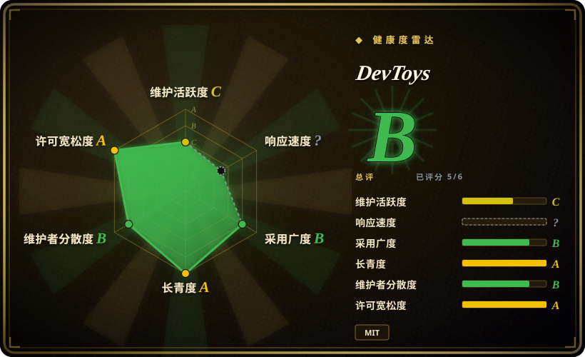
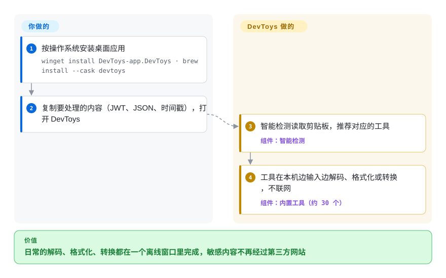

# DevToys

想解码一个 JWT、把一坨 JSON 排好版，你随手粘进某个靠广告赚钱的“在线格式化”网站——一个生产环境的 token 就这么离开了你的电脑。DevToys 把约 30 个这类小工具（解码、格式化、转换、生成、测试）装进一个离线桌面应用，Windows、macOS、Linux 都能用，还会根据剪贴板里的内容自动挑出合适的工具。

## 何时使用

你是个开发者，每天要二十次地给 token 做 Base64 解码、给一坨 JSON 美化排版、对比两段字符串、生成 UUID、做 JSON↔YAML 转换、或给文件算哈希——而你已经厌倦了把可能敏感的载荷粘进随便某个“在线 json 格式化”网站，因为你并不信任它们靠广告变现的商业模式。DevToys 作为普通桌面应用安装（Windows、macOS 或 Linux），秒开，所有变换都在本地完成、不发任何网络请求，于是一个 JWT 或配置里的密钥永远不会离开你的机器。你得到的是一个可搜索的窗口、约 30 个工具，而不是三十个浏览器标签页；还有一个“智能检测”功能，会根据剪贴板里的内容挑出对应的工具。

当你想在自动化里复用这些便利时它也合适：DevToys 附带一个独立的 CLI 应用（`DevToys.CLI`），把这些工具暴露给脚本使用，而且 GUI 和 CLI 都可扩展——你可以安装社区工具，或把自己的工具写成以 NuGet 打包的 .NET 扩展。于是个人草稿本和流水线步骤可以共用同一套工具实现。想要带剪贴板检测的原生应用而不是一个浏览器标签页时，选它而不是 [CyberChef](cyberchef.zh.md)；想把工具放在自己电脑上而不是某台服务器上时，选它而不是 IT-Tools。

## 怎么用起来

DevToys 里的每个工具都是一个小小的 .NET 插件，各有一块小界面：一个输入框、几个选项、一个输出框。**工具本身、它们的界面和剪贴板检测都随应用一起提供**——你粘贴或复制了什么，DevToys 就挨个问每个工具“这像不像你要处理的输入？”（一个 JWT、一个 Unix 时间戳、一份 JSON……），给出最匹配的那个，然后该工具在你本机上边输入边重新计算输出。**你要做的是粘贴内容、选定或确认工具、再把结果复制走。** 桌面外壳在每个系统上都是原生窗口（Windows 上是 WPF，macOS 上是原生应用，Linux 上是 GTK），里面承载的是一个在本地渲染的网页式界面——没有任何东西从互联网加载。同一批工具也能通过独立的 CLI 调用；你在“Manage extensions”页面安装的扩展，会从 NuGet 包解压到应用自己的目录里。可以把它想成一抽屉小厨具，外加一个帮手：你举起什么食材，它就递给你对应的那件。

<!-- flow-steps:begin (generated from flows/devtoys.json by tools/flow_card.py — do not edit) -->

流程文字版

1. **你**：按操作系统安装桌面应用 — `winget install DevToys-app.DevToys · brew install --cask devtoys`
2. **你**：复制要处理的内容（JWT、JSON、时间戳），打开 DevToys
3. **DevToys**：智能检测读取剪贴板，推荐对应的工具 — 组件：`智能检测`
4. **DevToys**：工具在本机边输入边解码、格式化或转换，不联网 — 组件：`内置工具（约 30 个）`

**价值**：日常的解码、格式化、转换都在一个离线窗口里完成，敏感内容不再经过第三方网站

<!-- flow-steps:end -->

## 何时不用

- **你常驻终端，想要单个二进制而非桌面应用。** DevToys 以 GUI 为先；CLI 是另外下载的配套工具。纯终端管线用 [`jq`](jq.zh.md) / `xxd` / `openssl` 更轻量，纯浏览器的串联处理用 [CyberChef](cyberchef.zh.md)。
- **你需要把多步变换串成可复现的 recipe。** DevToys 的工具基本是一次性的单工具界面；CyberChef 的整个模型就是把许多操作组合成一条可保存、可分享的管线。DevToys（截至 v2.0.9）不提供等价的 recipe 编排图。[推断]
- **你想给整个团队一个通过 HTTP 访问的共享工具页。** DevToys 是逐台机器安装的；想要一个自托管、大家用浏览器打开、工具种类相近的网页，用 IT-Tools（未收录，GPL-3.0，有 Docker 镜像）。
- **你依赖稳定、定期打补丁的正式版。** 所有 2.x 构建在 GitHub 上都标为**预发布**——最后一个非预发布版本是仅 Windows 的 1.0.13.0（2023-07）——而且 2.x 的版本间隔很长（v2.0.8.0 在 2024-11，下一版 v2.0.9.0 已是 2026-01）。如果你的组织禁止预发布软件，或要求桌面工具定期获得安全补丁，这是实打实的门槛；CyberChef（GCHQ 维护的静态网页）或命令行原语是更稳妥的默认选择。
- **你需要一个 DevToys 没有、又无法用扩展补上的工具。** 内置工具集是固定的（约 30 个）；超出范围就得找现成扩展或自己写，而且按其发布文档，扩展管理器不会检查扩展更新——得你自己跟踪。
- **要嵌进浏览器 / 用 JS 脚本化调用。** DevToys 是 .NET 桌面应用，无法像 [CyberChef](cyberchef.zh.md)（纯客户端 JS）那样嵌入网页。

## 横向对比

| 替代品 | 是否收录 | 我们的评价 | 取舍 |
|---|---|---|---|
| [CyberChef](cyberchef.zh.md) | ✅ | 需要串联的 recipe、更深的密码学 / 取证操作，或必须在任意浏览器里免安装运行时，选 CyberChef；要在原生应用里从剪贴板快速做单个小任务，选 DevToys。 | CyberChef 能把操作组合成可分享的管线，有浏览器就能跑；DevToys 多了剪贴板智能检测、系统集成和 CLI，但工具都是一次性的单屏。 |
| IT-Tools | 未收录 | 想要一个全团队用浏览器打开的自托管页面，选 IT-Tools；想在每位开发者自己的机器上离线使用，选 DevToys。 | IT-Tools 对使用者零安装、维护活跃，但得有人运行服务器，且是 GPL-3.0；DevToys 要逐台安装，2.x 线仍是预发布。 |
| DevUtils（macOS） | 非仓库 | 团队全员用 macOS、又接受付费的精致原生应用，DevUtils 合适；要免费、MIT、跨平台、可扩展，选 DevToys。 | DevUtils 闭源且只支持 Mac；DevToys 用一点打磨度换来跨平台和扩展 SDK。 |
| [`jq`](jq.zh.md) / `xxd` / `openssl`（CLI） | 部分已收录 | 变换要写进脚本或 CI 步骤时，选 Unix 命令行原语（这里只有 `jq` 有页面）；只想瞄一眼某个值时，DevToys 更快。 | 命令行工具好组合、好纳入版本管理，但没有 GUI，还得记参数；DevToys 粘贴即用，但除了配套 CLI 之外很难自动化。 |

## 技术栈

- **语言：** 基于 .NET 8 的 C#（目标框架 `net8.0`；C# 约占仓库 73%），界面资源用 SCSS / HTML / TypeScript；构建脚本用 PowerShell / Shell（GitHub 语言统计，2026-10）。
- **界面：** Blazor Hybrid 界面（Razor 组件在本地 WebView 里渲染），由各系统的原生外壳承载——Windows 上是 WPF + `WebView.Wpf`，macOS 上是 `net8.0-macos` 应用，Linux 上通过 GirCore 使用 GTK 4 + WebKitGTK（见 `src/app/dev/platforms/desktop/` 下各平台的 `.csproj`）。
- **形态：** `DevToys.Windows` / `DevToys.MacOS` / `DevToys.Linux` 三个 GUI 应用和一个独立的 `DevToys.CLI`，共用 `DevToys.Api`（扩展 SDK）和同一套工具实现。
- **可扩展性：** 工具是通过反射发现的插件；扩展是 NuGet 包，从应用内的“Manage extensions”页面安装；SDK 和文档在 devtoys.app/doc。

## 依赖

- **运行时：** 对用户而言无——DevToys 按各操作系统提供自包含的安装包。运行内置工具不需要数据库、不需要服务端、不需要联网。其隐私政策写明，使用数据（错误、性能）只保存在本地，可在“设置 → 日志”里查看，不会发送给开发者。
- **安装：** Windows 用 `winget install DevToys-app.DevToys`，macOS 用 `brew install --cask devtoys`，Debian / Ubuntu 有 `.deb` 包，另有 Microsoft Store 和直接下载（devtoys.app/download，2026-10）。CLI 需要单独下载。
- **Linux 运行库：** Linux 版使用 GTK 4 和 WebKitGTK，机器上必须装有这些系统库。
- **从源码构建：** .NET 8 SDK，外加 TypeScript / SCSS 资源管线。
- **扩展：** 可选的 NuGet 包，由用户自行安装。

## 运维难度

**低。** 对终端用户而言就是一个桌面安装包，没有任何服务要跑、无配置、不暴露网络——装上即用，卸载也干净。持续的负担在版本管理上：2.x 构建都是预发布，而且隔好几个月才出一版，什么时候升级由你决定；Linux 用户依赖发行版自带的 GTK / WebKitGTK；任何第三方扩展都是来自 NuGet 的任意 .NET 代码，应用不会自动更新它们，需要你自己审查、跟踪。没有部署、扩容或备份这套事，因为根本没有服务端。

## 健康度与可持续性

- **维护（2026-10）：时断时续，而非稳定推进。** 提交成簇出现、相隔数月——2024-11、2025-02、2026-01/02，然后是 2026-09-29 的一次三连提交（修 Linux WebView 和 macOS / Linux 上的文本对比工具）。雷达的维护轴仍是 C；寿命轴从 C 升到 A，只是因为九月底那次集中提交把“最近一次提交”重置到了几天前——应理解为“还活着、但很慢”，而不是“活跃”。自 v2.0.9.0（2026-01-08，预发布）以来没有新版本。
- **响应速度：** 无法评分——评分器找不到可用的 issue 响应窗口（`no_window_signal`）；338 个未关闭 issue（2026-10）说明有积压。
- **治理与巴士系数。** 挂在组织（`DevToys-app`）名下，但实际上是一位创建者的项目：`veler` 账号（Etienne Baudoux）累计约 861 次提交，第二名只有 38 次。治理轴从 C 升到 B，是因为近 12 个月有四个人提交过代码（头号贡献者约占 55%）——替补席稍宽了一点，但还谈不上团队。背后没有公司或基金会。
- **年龄与 Lindy（约 5 年，2021-09 创建）。** 年龄中等、仍在收到修复，但 2.x 线挂着“预发布”已超过两年；概念已被验证，当前版本线还没收尾——Lindy 先验一般。
- **采用度。** 约 3.2 万星、约 1.8k fork，release 安装包累计下载约 60 万次，Homebrew 安装量稳定（健康度原始数据，2026-10）；在开发者小工具里是知名项目。
- **风险信号。** MIT，没有改许可或开源核心（open-core）的历史。风险在于预发布状态、版本间隔长、只有一位核心维护者，以及未经审查的第三方扩展。

## 存疑（未验证）

- [未验证] 星数、fork 数、下载量和未关闭 issue 数是 2026-10-08 的 GitHub / 评分器快照，会漂移。
- [推断] 内置工具数“约 30”来自 README 对 2.0 的“30 个默认工具”表述；具体目录可能随版本变化——依赖某个工具前请在你安装的构建里核实。
- [推断] DevToys 缺少 CyberChef 式的 recipe 串联，这一判断基于其单工具界面模型和文档；没有逐个扩展穷尽核实。
- [推断] “实际上是一位创建者的项目”是根据累计提交数（`veler` 约 861 次对 38 次）以及近期更新日志、发版提交都出自该账号推断的；没有考察代码评审权限的分布。
- [未验证] “使用数据只保存在本地”取自 `PRIVACY-POLICY.md`（日期为 2021-09）；没有在源码里追踪或抓包验证 2.x 的联网行为。
