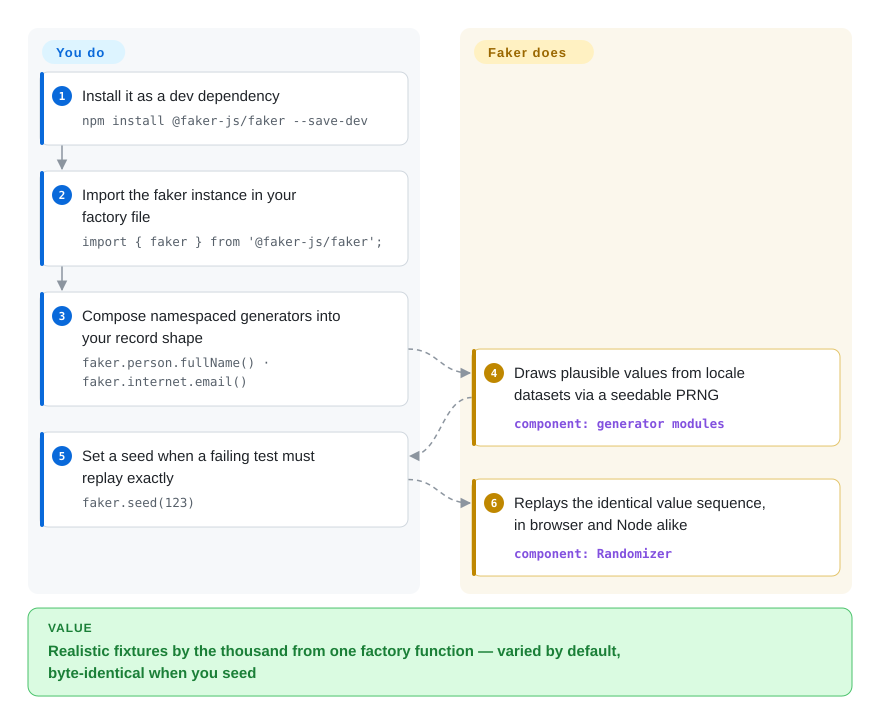

# Faker (faker-js)

You're on your tenth hand-written `"John Doe", "123 Main St"` fixture and the tests still flake whenever the one hard-coded value changes. Faker is an npm library of namespaced generators (`faker.person.fullName()`, `faker.internet.email()`) that emit thousands of plausible, varied records from one import — and one `faker.seed()` call replays the exact same batch when a failure must reproduce.

## When to use

You're a full-stack developer wiring up a new feature and your tests and local environment are starving for data. The unit tests need a believable `User` — a name, email, avatar URL, a street address that *looks* like a street address — and hand-writing `"John Doe", "123 Main St"` for the tenth time is both tedious and makes every fixture suspiciously identical. Your staging database is empty, so the UI looks broken until someone manually types in rows. You reach for Faker: `faker.person.fullName()`, `faker.internet.email()`, `faker.location.streetAddress()`, `faker.commerce.productName()` — one import, dozens of namespaced generators, and your factory functions now emit varied, realistic-looking records every run. Call `faker.seed(123)` and the same "random" data comes back deterministically, so a failing test reproduces instead of flapping.

You also reach for it to fill a seed script that pumps a few thousand fake orders, customers, and products into a dev database so the dashboard finally has something to render, or to drive Storybook/demo screens with plausible content instead of "Lorem ipsum" everywhere. It runs the same in Node and the browser, ships first-class TypeScript types, and carries 70+ locales so a German or Japanese build gets region-appropriate names and addresses rather than always-American defaults.

## How it works

Faker is a pure in-process library: the npm package ships namespaced generator modules (`person`, `internet`, `location`, `date`, `commerce`, …) plus locale data files — lists of given names, surnames, street names, phone formats for each of 70+ locales. Each call draws from those datasets through a seedable PRNG (a Mersenne-Twister-based randomizer, i.e. a reproducible pseudo-random number source), so with the same seed the whole sequence of values replays identically. What you write is a factory function that composes generator calls into *your* object shape — Faker deliberately produces fields, not your schema — and `faker.helpers.multiple(factory, {count: 5})` batches it. What stays yours: cross-field consistency (the docs' own example feeds a generated sex into `firstName` to avoid "Bob" with a female name), uniqueness (`faker.helpers.uniqueArray()` when a column needs it), and reference dates (`faker.date.*` depends on "today" unless you pass `refDate`). It also exports a `simpleFaker` with just the locale-free generators when you don't want to load the ~500 KB of locale data.

<!-- flow-steps:begin (generated from flows/faker-js.json by tools/flow_card.py — do not edit) -->

Text version of the flow

1. **You**: Install it as a dev dependency — `npm install @faker-js/faker --save-dev`
2. **You**: Import the faker instance in your factory file — `import { faker } from '@faker-js/faker';`
3. **You**: Compose namespaced generators into your record shape — `faker.person.fullName() · faker.internet.email()`
4. **Faker (faker-js)**: Draws plausible values from locale datasets via a seedable PRNG — component: `generator modules`
5. **You**: Set a seed when a failing test must replay exactly — `faker.seed(123)`
6. **Faker (faker-js)**: Replays the identical value sequence, in browser and Node alike — component: `Randomizer`

**Value**: Realistic fixtures by the thousand from one factory function — varied by default, byte-identical when you seed

<!-- flow-steps:end -->

## When NOT to use

- **Fake data is not production-representative data.** Faker's output is plausible-looking but statistically uniform-ish noise — it does **not** reflect your real distributions (value skews, null rates, correlations, edge-case clustering). Don't use it to benchmark query performance, validate analytics, or "prove" a model on data that won't match production. [推断]
- **You need schema-aware / relational data modeling.** Faker generates *fields*, not a coherent data graph — it won't keep foreign keys consistent, enforce constraints, or honor your schema. For relational fixtures you still write a factory layer on top (the docs push exactly this pattern), or use a schema-driven generator.
- **Locale coverage is uneven — by the project's own admission.** The docs state that not every locale provides data for every module and incomplete locales fall back to English. If you depend on a specific locale × module pair, verify it ships data or build a custom instance with your own fallback chain.
- **Frontend bundle size matters.** The docs are explicit: Faker is > 5 MiB minified because of all its locale strings, and they advise against deploying the full package in a web app. Keep it in `devDependencies`; for shipped code that genuinely needs a generator, import only what's needed or use `simpleFaker`.
- **You need a different language runtime.** This is the JS/TS library; for Python use Python's `Faker`, for Ruby the `faker` gem, etc. — don't shim Node into a non-JS test suite just for fake data.
- **You need guaranteed-unique values at scale.** "In general, Faker methods do not return unique values" (docs) — even `faker.animal.type()` has only 44 possible outputs, and the birthday paradox guarantees dupes. `faker.helpers.uniqueArray()` de-dups in one call but throws when the dataset is exhausted; large unique datasets still need your own strategy (e.g. sequential suffixes).

## Comparison

| Alternative | In index | Our verdict | Tradeoff |
|---|---|---|---|
| Python `Faker` | 未收录 | Choose Python Faker when your tests or seeders are Python rather than JavaScript. | The same idea for Python (the JS Faker lineage descends from it); use it when your tests/seeders are Python, not JS. |
| Chance.js | 未收录 | Choose Chance.js when you need a smaller, older random-generator utility with a narrower catalog. | Smaller, older random-generator utility; lighter and dependency-free but a much narrower data catalog and no rich locale system. |
| @ngneat/falso | 未收录 | Choose @ngneat/falso when you need a modern tree-shakeable TypeScript fake-data library. | Modern tree-shakeable TS fake-data library positioned as a lighter, individually-importable alternative; smaller locale/namespace surface than Faker. |
| Mockaroo | 非仓库 | Choose Mockaroo when you need hosted, schema-first mock-data *export* rather than an in-process test library. | Hosted SaaS (CSV/JSON/SQL export) — good for one-off bulk datasets, but it's a service, not a repo you embed in tests, and your data model lives in their UI. |

## Tech stack

- **Language:** TypeScript (compiled to ESM + CJS), shipping first-class type definitions.
- **Runtime targets:** browser and Node.js from the same package; framework-agnostic.
- **Structure:** namespaced modules (`person`, `location`, `internet`, `finance`, `commerce`, `date`, `lorem`, `image`, …) over a seedable Mersenne-Twister randomizer, plus locale data bundles (70+ locales) imported per-locale.
- **Distribution:** published to npm; per-locale entry points (`@faker-js/faker/locale/*`) so you can import only the locale you need.

## Dependencies

- **Runtime:** a JS runtime — Node.js ≥ 20 for v10 (per the docs; CJS specifically wants ≥ 20.19) or a modern browser. No external services or datastore; fully offline.
- **Install:** `npm install @faker-js/faker --save-dev` (a dev dependency; pnpm/yarn/deno equivalents documented).
- **Build (from source):** Node.js + the repo's pnpm toolchain; exact versions are pinned in the repo at build time.
- **No infrastructure:** no database, server, or network access required to generate data.

## Ops difficulty

**Low.** It's a library, not a service — there's nothing to deploy or operate. Integration cost is `npm install` plus calling generators in your factories/seeders. The few real concerns are hygiene rather than ops: keep it in `devDependencies` so its > 5 MiB of locale data never reaches production bundles, pin the major version because Faker has reorganized its API across majors (the v5→v6 community-fork transition and later majors renamed/moved methods), and call `faker.seed()` where you need deterministic fixtures — remembering the docs' caveat that seeds are only reproducible *within* a version and that date-dependent methods need a fixed `refDate`. Upgrades across major versions can require codemods/renames, so read the migration notes before bumping.

## Health & viability

- **Maintenance (2026-09).** Commits land daily on the `next` branch (v11 in development); the stable line is v10.6.0 (released 2026-08-14) — **active**, not coasting, and not archived.
- **Responsiveness:** the radar's measured issue/PR first-response grade — see the card; a very responsive multi-maintainer project.
- **Governance / bus factor.** A community **organization** project, not a single-maintainer package — and notably so *by origin*: faker-js was formed in January 2022 after the original `faker.js` was deliberately sabotaged and removed from npm by its sole author. The community fork exists specifically to remove that single-owner rug-pull risk, so the governance structure is a **positive** here; ~4.5 years of sustained multi-contributor maintenance since. [推断] the 2022-01 incident framing is widely documented but was not re-read from a primary source this sync.
- **Age & Lindy verdict.** ~4.7 years old **as this org/fork** (repo created 2022-01) and still actively shipping ⇒ a **moderate-and-improving** Lindy signal: younger than the idea behind it (the concept and data descend from the 2011-era Perl/Ruby Faker, per its own docs), but the *governed* incarnation is the one you depend on.
- **Adoption & ecosystem.** Very widely used across the JS/TS testing ecosystem (~15.5k stars; npm `dist-tags` show `latest: 10.6.0` in sync with the GitHub release), good docs, 70+ locales, first-class TS types — strong, healthy adoption.
- **Risk flags.** Permissive license (the LICENSE file bundles upstream copyright notices, which is why GitHub's auto-detector reports `NOASSERTION`/"Other" rather than "MIT" — hence the `?` license axis on the radar). The main practical risk is API churn across majors (v11 is already in the oven), not stewardship.

## Caveats (unverified)

- [未验证] ~15.5k GitHub stars and v10.6.0 stable (2026-08-14) as of 2026-09 — star counts and exact version numbers are date-sensitive; re-verify against the current repo.
- [未验证] GitHub reports the license as `NOASSERTION`/"Other"; the repository's LICENSE file is MIT (it additionally reproduces the original faker.js and upstream Ruby/Perl copyright notices, which defeats GitHub's single-license auto-detection) — recorded here as the reason for the discrepancy and the `?` license grade.
- [未验证] "70+ locales" is the project's own framing; per-locale module completeness varies with documented English fallback — verify the specific locale × module you depend on.
- [推断] The 2022-01 faker.js sabotage/rug-pull origin story is repeated widely and matches the repo's creation date, but its primary source was not fetched this sync.
- [推断] "Not production-representative" and "not schema-aware" are inferences about how realistic-but-random data behaves, not measured claims.
- [推断] Major-version API churn (renamed/moved methods, the v5→v6 fork transition) is inferred from the project's known reorganizations; check the migration guide for the exact versions you're moving between.
