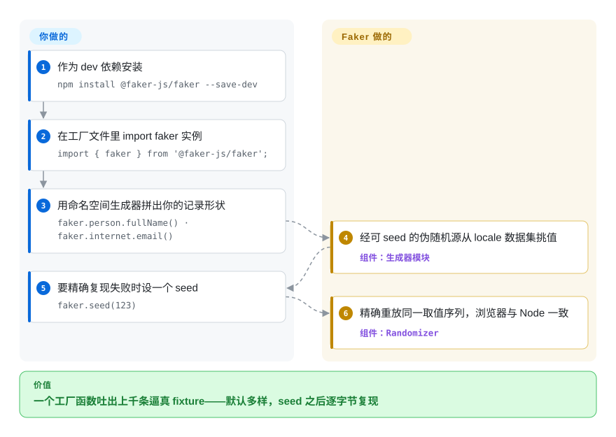

# Faker (faker-js)

你第十次手写 `"John Doe", "123 Main St"` 这种 fixture，而只要那个写死的值一变，测试就跟着抖。Faker 是一个 npm 生成器库（`faker.person.fullName()`、`faker.internet.email()`），一行 import 就能吐出成千上万条像样且互不相同的记录；再调一次 `faker.seed()`，同一批数据就精确复现。

## 何时使用

你是个全栈开发者，正在给新功能接线，而你的测试和本地环境却没数据可用。单元测试需要一个像样的 `User`——一个姓名、一个邮箱、一个头像 URL、一个*看起来像*街道地址的街道地址——而第十次手写 `"John Doe"、"123 Main St"` 既枯燥，又让所有 fixture 长得可疑地一模一样。你的 staging 数据库是空的，于是 UI 看上去像坏了，得有人手动敲行进去。你掏出 Faker：`faker.person.fullName()`、`faker.internet.email()`、`faker.location.streetAddress()`、`faker.commerce.productName()`——一行 import，几十个按命名空间分好的生成器，你的工厂函数从此每次运行都吐出多样、逼真的记录。调一下 `faker.seed(123)`，同一批“随机”数据就确定性地复现，于是失败的测试能重现，而不是飘忽不定。

你也会用它来填一个 seed 脚本，往 dev 库里灌几千条假订单、假客户、假商品，让看板终于有东西可渲染；或者用它给 Storybook/演示页喂上像样的内容，而不是满屏 "Lorem ipsum"。它在 Node 和浏览器里行为一致，自带一流的 TypeScript 类型，并携带 70+ 个 locale，所以德语或日语构建拿到的是符合地区习惯的姓名和地址，而非永远的美式默认值。

## 怎么用起来

Faker 是纯进程内库：npm 包里是一批命名空间生成器模块（`person`、`internet`、`location`、`date`、`commerce`……）加上 locale 数据文件——70+ 个 locale 各自的名、姓、街道名、电话格式清单。每次调用都经由一个可 seed 的 PRNG（基于梅森旋转算法的 randomizer，即可复现的伪随机数源）从这些数据集里取值，所以同一个 seed 之下，整条取值序列会精确重放。你写的，是把生成器调用组合成*你的*对象形状的工厂函数——Faker 刻意只产字段、不认你的 schema——再用 `faker.helpers.multiple(factory, {count: 5})` 批量吐。留在你这边的：跨字段一致性（官方文档自己的例子就是把生成的性别先喂给 `firstName`，避免“女性别配 Bob”）、唯一性（需要时上 `faker.helpers.uniqueArray()`）、以及参照日期（`faker.date.*` 默认依赖“今天”，除非传 `refDate`）。若不想加载约 500 KB 的 locale 数据，它还提供只含无 locale 生成器的 `simpleFaker`。

<!-- flow-steps:begin (generated from flows/faker-js.json by tools/flow_card.py — do not edit) -->

流程文字版

1. **你**：作为 dev 依赖安装 — `npm install @faker-js/faker --save-dev`
2. **你**：在工厂文件里 import faker 实例 — `import { faker } from '@faker-js/faker';`
3. **你**：用命名空间生成器拼出你的记录形状 — `faker.person.fullName() · faker.internet.email()`
4. **Faker (faker-js)**：经可 seed 的伪随机源从 locale 数据集挑值 — 组件：`生成器模块`
5. **你**：要精确复现失败时设一个 seed — `faker.seed(123)`
6. **Faker (faker-js)**：精确重放同一取值序列，浏览器与 Node 一致 — 组件：`Randomizer`

**价值**：一个工厂函数吐出上千条逼真 fixture——默认多样，seed 之后逐字节复现

<!-- flow-steps:end -->

## 何时不用

- **假数据不等于能代表生产的真数据。** Faker 的输出看着合理，但本质是接近均匀的噪声——它**不**反映你真实的分布（取值偏态、空值比例、字段相关性、边界值聚集）。别拿它来跑查询性能基准、验证分析口径，或在与生产不符的数据上“证明”某个模型。[推断]
- **你需要 schema 感知 / 关系型数据建模。** Faker 生成的是*字段*，不是一张自洽的数据图——它不会保持外键一致、不会强制约束、也不认识你的 schema。要做关系型 fixture，你仍得在它之上自己写工厂层（官方文档推的正是这个模式），或改用 schema 驱动的生成器。
- **locale 覆盖参差不齐——这是项目自己承认的。** 文档明说并非每个 locale 都覆盖所有模块，缺数据的部分会回退到英文。若你依赖某个具体的 locale × 模块组合，先核实它真的有数据，或自建带自己回退链的实例。
- **前端打包体积敏感。** 文档说得很直白：因为携带大量 locale 字符串，Faker 压缩后超过 5 MiB，并建议别把完整包部署进 Web 应用。把它留在 `devDependencies`；真要在线上代码用生成器，只 import 所需部分或用 `simpleFaker`。
- **你的运行时不是 JS。** 这是 JS/TS 库；Python 用 Python 的 `Faker`，Ruby 用 `faker` gem，等等——别只为了造假数据就把 Node 硬塞进非 JS 的测试套件。
- **你需要大规模保证唯一取值。** “总体上 Faker 的方法不返回唯一值”（文档原话）——连 `faker.animal.type()` 都只有 44 种输出，生日悖论保证必然撞车。`faker.helpers.uniqueArray()` 能一次性去重，但数据集耗尽就抛错；大批量唯一数据仍要自己的策略（例如拼递增后缀）。

## 横向对比

| 替代品 | 是否收录 | 我们的评价 | 取舍 |
|---|---|---|---|
| Python `Faker` | 未收录 | 测试或 seeder 是 Python 而不是 JavaScript 时，选 Python Faker。 | Python 版的同一思路（JS Faker 的血缘就源自它）；当你的测试/seeder 是 Python 而非 JS 时用它。 |
| Chance.js | 未收录 | 需要更小、更老、目录更窄的随机生成工具时，选 Chance.js。 | 更小、更老的随机生成工具；更轻、零依赖，但数据目录窄得多，也没有丰富的 locale 体系。 |
| @ngneat/falso | 未收录 | 需要现代、可 tree-shake 的 TypeScript 假数据生成库时，选 @ngneat/falso。 | 现代、可 tree-shake 的 TS 假数据库，主打更轻、可逐个 import 的替代品；locale/命名空间面比 Faker 小。 |
| Mockaroo | 非仓库 | 需要托管、schema 优先的 mock 数据*导出*，而不是进程内测试库时，选 Mockaroo。 | 托管 SaaS（导出 CSV/JSON/SQL）——适合一次性批量造数据，但它是个服务而非你嵌进测试的仓库，且你的数据模型寄存在它的界面里。 |

## 技术栈

- **语言：** TypeScript（编译为 ESM + CJS），自带一流类型定义。
- **运行目标：** 同一个包同时面向浏览器和 Node.js；与框架无关。
- **结构：** 在一个可 seed 的梅森旋转 PRNG 之上，按命名空间组织模块（`person`、`location`、`internet`、`finance`、`commerce`、`date`、`lorem`、`image`……），外加按 locale 引入的 locale 数据包（70+ 个 locale）。
- **分发：** 发布到 npm；提供按 locale 的入口（`@faker-js/faker/locale/*`），让你只 import 需要的那个 locale。

## 依赖

- **运行时：** 一个 JS 运行时——v10 要求 Node.js ≥ 20（文档标注；走 CJS 建议 ≥ 20.19）或现代浏览器。无需外部服务或数据存储，完全离线。
- **安装：** `npm install @faker-js/faker --save-dev`（作为 dev 依赖；pnpm/yarn/deno 均有对应命令）。
- **从源码构建：** 需要 Node.js 加上仓库的 pnpm 工具链；确切版本在构建时由仓库锁定。
- **无基础设施：** 生成数据不需要数据库、服务器或网络访问。

## 运维难度

**低。** 它是个库，不是服务——没什么要部署或运维的。接入成本就是 `npm install` 加上在你的工厂/seeder 里调生成器。少数真正要注意的是卫生问题而非运维：把它留在 `devDependencies` 里，别让超过 5 MiB 的 locale 数据进生产 bundle；锁定大版本，因为 Faker 跨大版本重组过 API（v5→v6 社区接管那次以及后来的大版本都重命名/搬动过方法）；在需要确定性 fixture 的地方调 `faker.seed()`——并记住文档的提醒：seed 只在*同一版本内*可复现，依赖日期的方法还要固定 `refDate`。跨大版本升级可能需要 codemod/改名，升级前先读迁移说明。

## 健康度与可持续性

- **维护（2026-09）。** `next` 分支几乎每天有提交（v11 开发中）；稳定线是 v10.6.0（2026-08-14 发布）——处于**活跃**而非吃老本，且未归档。
- **响应速度：** 雷达测得的 issue/PR 首响档位见卡片；多维护者、响应很快。
- **治理 / bus factor。** 这是一个社区**组织**项目，而非单一维护者的包——而且这一点*从出身上*就很关键：faker-js 是在 2022 年 1 月、原 `faker.js` 被其唯一作者蓄意破坏并从 npm 下架之后，由社区组建的。这个分叉的存在恰恰是为了消除单一拥有者的 rug-pull 风险，治理结构在这里是**正面信号**；此后已有约 4.5 年持续的多贡献者维护。[推断] 2022-01 事件的表述广为人知，但本次重核未再读一手来源。
- **年龄与 Lindy 判断。** 作为这个组织/分叉约 4.7 年（仓库创建于 2022-01）且仍在活跃发布⇒**中等且在改善**的 Lindy 信号：它比其承载的想法年轻（思路与数据源自 2011 年代的 Perl/Ruby Faker，其文档自述），但你真正依赖的是这个*有治理*的化身。
- **采用度与生态。** 在 JS/TS 测试生态里被广泛使用（约 15.5k star；npm `dist-tags` 显示 `latest: 10.6.0`，与 GitHub release 同步），文档良好，70+ locale，一流 TS 类型——采用度强劲、健康。
- **风险标记。** 宽松许可（LICENSE 文件捆绑了上游版权声明，GitHub 自动识别因此报 `NOASSERTION`/"Other" 而非 "MIT"——雷达上许可轴为 `?` 即为此故）。主要的现实风险是跨大版本的 API 变动（v11 已在路上），而非治理问题。

## 存疑（未验证）

- [未验证] 截至 2026-09 约 15.5k GitHub star，稳定版 v10.6.0（2026-08-14）——star 数和确切版本号对时间敏感，请对照当前仓库重核。
- [未验证] GitHub 报告许可为 `NOASSERTION`/"Other"；而仓库的 LICENSE 文件是 MIT（它额外复述了原 faker.js 及上游 Ruby/Perl 的版权声明，破坏了 GitHub 的单一许可自动识别）——在此记录差异成因与许可轴 `?` 档的来由。
- [未验证] “70+ locale”是项目自己的表述；各 locale 的模块完整度不一（英文回退有文档明说）——请核实你实际依赖的那个 locale × 模块。
- [推断] 2022-01 原版 faker.js 被蓄意破坏/下架的出身故事被广泛记载、也与本仓库创建日期吻合，但本次重核未抓取一手来源。
- [推断] “不能代表生产”和“非 schema 感知”是对逼真但随机的数据如何表现做出的推断，而非实测结论。
- [推断] 跨大版本的 API 变动（重命名/搬动方法、v5→v6 分叉接管）是从项目已知的重组推断而来；具体迁移的版本区间请查迁移指南。
