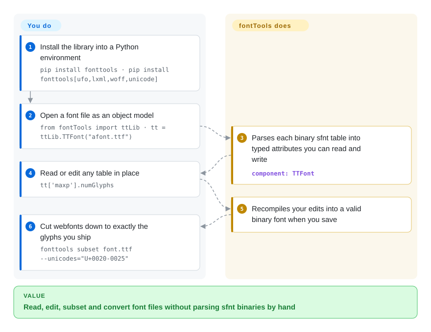

# fontTools

A font file is a binary bag of dozens of numbered tables, and a one-off script that edits or subsets one can silently corrupt the rest. fontTools parses TrueType/OpenType/WOFF into a Python object model — one class per table — so you can read, edit, subset and re-serialize fonts programmatically, plus bundled CLIs (`ttx`, subset, instancer) that do the same from the shell.

## When to use

You're building a font pipeline: maybe you're a type designer's engineer turning a UFO/glyph source into shippable `.otf`/`.ttf`/`.woff2`, or a frontend platform team that needs to **subset** webfonts down to the glyphs a page actually uses so the download is a few KB instead of hundreds. You don't want to parse the binary `sfnt`/`glyf`/`GPOS` tables by hand, and you don't trust a one-off script to round-trip a font without corrupting its tables. You `pip install fonttools`, then either call the library — `TTFont("in.ttf")` gives you a navigable object model of every table you can read, edit, and save — or run the bundled CLIs: `ttx` to dump a font to editable XML and recompile it, `pyftsubset` to cut a font down to a glyph set, `ttx`/`fontTools.ttLib` to merge, instance a variable font, or fix metadata. It's the library that other font tools (and most webfont build steps) are built on.

You reach for it whenever the task is *programmatic font surgery*: subsetting for the web, converting formats, inspecting/patching tables, instancing variable fonts to static cuts, or feeding a larger build system. The dependency claim is now checked: matplotlib declares `fonttools>=4.28.2` in its own PyPI metadata (2026-09), and PyPI's graph lists ~34k dependent repositories with ~185M monthly downloads (health scorer, 2026-09-28) — the webfont-build and designer-toolchain usage around it is inferred from that footprint, not enumerated here.

## How it works

fontTools treats a font file as what it really is: a binary container — the `sfnt` table-bag layout TrueType/OpenType use — holding dozens of numbered tables, and it gives each table its own Python class. `tt = ttLib.TTFont("afont.ttf")` parses that container into the object model, so `tt['maxp'].numGlyphs` or `tt['OS/2'].achVendID` become plain readable/writable attributes, and saving re-serializes a valid binary font when you're done editing. For one-shot bulk work you can skip Python entirely: `ttx` round-trips a font to editable XML and back, `fonttools subset` cuts a font down to a Unicode or glyph range (what webfont subsetting is), and `fonttools varLib.instancer` bakes a static instance out of a variable font. What stays yours: knowing which tables and subset flags your format actually depends on (a wrong flag can drop layout features and break kerning), and wiring the calls into your build — fontTools is an in-process library plus CLIs, not a service.

<!-- flow-steps:begin (generated from flows/fonttools.json by tools/flow_card.py — do not edit) -->

Text version of the flow

1. **You**: Install the library into a Python environment — `pip install fonttools · pip install fonttools[ufo,lxml,woff,unicode]`
2. **You**: Open a font file as an object model — `from fontTools import ttLib · tt = ttLib.TTFont("afont.ttf")`
3. **fontTools**: Parses each binary sfnt table into typed attributes you can read and write — component: `TTFont`
4. **You**: Read or edit any table in place — `tt['maxp'].numGlyphs`
5. **fontTools**: Recompiles your edits into a valid binary font when you save
6. **You**: Cut webfonts down to exactly the glyphs you ship — `fonttools subset font.ttf --unicodes="U+0020-0025"`

**Value**: Read, edit, subset and convert font files without parsing sfnt binaries by hand

<!-- flow-steps:end -->

## When NOT to use

- **You want to *design* glyphs or draw outlines.** fontTools manipulates font *files and tables*; it is not a font editor. For drawing/editing use Glyphs, FontForge, or RoboFont — fontTools is the engine behind/around them, not the canvas.
- **You need rich text shaping / rendering.** Turning text + a font into positioned glyphs (complex scripts, ligatures, bidi) is HarfBuzz's job; fontTools reads the GSUB/GPOS tables but doesn't shape or rasterize.
- **You only need to subset once via a GUI/CLI and never script it.** That's fine, but then a wrapper tool may be simpler than the library API.
- **Hard real-time or memory-tight embedded contexts.** It's a pure-Python object model that loads tables into memory; for constrained runtime font handling a C library (FreeType, HarfBuzz) is the right layer.
- **You expect every niche table to be fully supported / round-trip-perfect.** Coverage is broad but the format is vast; exotic or vendor tables may be passed through opaquely rather than modeled — verify the specific table you depend on. [未验证]

## Comparison

| Alternative | In index | Our verdict | Tradeoff |
|---|---|---|---|
| FontForge | 未收录 | Choose FontForge when you need a full GUI/scriptable font editor for design and production. | Full GUI/scriptable font editor (design + production); much broader feature surface but heavier, C-based, and a different (editor) workflow than a clean Python library. |
| HarfBuzz | 未收录 | Choose HarfBuzz when you need a text shaping engine rather than a font-file editing library. | Text shaping engine (text → positioned glyphs); complementary, not a substitute — fontTools edits the font, HarfBuzz uses it to shape. |
| FreeType | 未收录 | Choose FreeType when you need a C rasterizer/loader for rendering glyphs at runtime. | C rasterizer/loader for rendering glyphs at runtime; about drawing pixels, not editing font files. |
| Glyphs / RoboFont | 未收录 | Choose Glyphs or RoboFont when you need commercial macOS type-design apps. | Commercial macOS type-design apps; for drawing typefaces, often *use* fontTools under the hood for export. |
| `woff2`/`sfnt2woff` CLIs | 未收录 | Choose woff2/sfnt2woff CLIs when you only need single-purpose format conversion. | Single-purpose format converters; fontTools covers the same conversions plus full table manipulation and subsetting. |

## Tech stack

- **Language:** Python (pure-Python core; optional C-accelerated and native deps for specific features).
- **Model:** `TTFont` object model over `sfnt`-based formats — per-table classes for `cmap`, `glyf`, `GPOS`/`GSUB`, `name`, `head`, etc.; XML round-trip via `ttx`.
- **CLIs:** `ttx` (font ↔ XML), `pyftsubset` (subsetting), `pyftmerge` (merge), `fonttools` entry point exposing subcommands (instancer for variable fonts, etc.).
- **Formats:** TrueType/OpenType (`.ttf`/`.otf`), WOFF/WOFF2, AFM, T1/CFF, and more.

## Dependencies

- **Runtime:** Python ≥ 3.11 (README: "FontTools requires Python 3.11 or later"; PyPI `requires-python: >=3.11`, 2026-09). The base library is pure-Python with **no required external dependencies** beyond the standard library. Optional extras pull native/other deps — WOFF2 goes through the `woff` extra (Brotli bindings), `lxml` speeds up XML, `ufo`/`unicode`/etc. gate other modules; the PyPI metadata (2026-09) lists extras `ufo, lxml, woff, unicode, graphite, interpolatable, plot, symfont, type1, pathops, repacker, all`, installed via e.g. `pip install fonttools[ufo,lxml,woff,unicode]`.
- **Services/infra:** none — it's an in-process library/CLI; no datastore or daemon.
- **Build:** standard Python packaging; optional native extras need their respective build prerequisites.

## Ops difficulty

**Low.** `pip install fonttools` (add extras like `[woff]` for WOFF2) and you're done — no services, no datastore, no daemon. It runs in-process or as a CLI step in a build. The only real friction is choosing the right optional extras for the formats you touch (WOFF2 needs brotli) and the inherent complexity of the font format itself when you do deep table surgery — that's domain difficulty, not ops.

## Health & viability

- **Responsiveness**: Grade A — median first-response time 26.0 hours across 9 qualifying issues/PRs (health scorer, 2026-09-28).
- **Maintenance (2026-09).** Very active: v4.66.0 released 2026-09-23, last push to `main` 2026-09-24 (GitHub API), commits in all of the last 13 weeks — a steady frequent-minor cadence, clearly maintained, not coasting. Not archived.
- **Governance / bus factor.** Lives under the `fonttools` **GitHub organization** with a long contributor history led by Behdad Esfahbod and Cosimo Lupo (anthrotype) among hundreds of contributors — multi-maintainer, not a single point of failure, though the radar's B reflects real commit concentration (top contributor ≈42% of 12-month commits). [推断]
- **Age & Lindy.** Created 2013 on GitHub but the codebase's lineage (Just van Rossum's TTX/fontTools) predates that by years; ~13+ years here and **still actively shipping** ⇒ a **strong Lindy** signal — it is the established standard, not a newcomer. [推断]
- **Adoption.** Foundational and measured: matplotlib's PyPI metadata requires `fonttools>=4.28.2` (2026-09); the PyPI registry snapshot shows ~185M downloads/month and ~34k dependent repos (health scorer, 2026-09-28); ~5.3k GitHub stars. The webfont-service / designer-toolchain layer around it is inferred from that footprint. [推断]
- **Risk flags.** None notable — permissive MIT, no relicense history found, diversified maintainership. The main caveat is format breadth (not every exotic table is deeply modeled), not project health. [推断]

## Caveats (unverified)

- [未验证] Coverage/round-trip fidelity of exotic/vendor tables is inferred from the format's breadth, not measured against a specific table.
- [推断] "Backbone of the webfont-toolchain stack" beyond the verified matplotlib dependency and registry dependents (designer toolchains, webfont services) is ecosystem knowledge, not enumerated from sources in this pass.
- [推断] Which precise features each optional extra (brotli for WOFF2, lxml, unicodedata2, …) gates was read from README/packaging structure, not exercised one by one.
