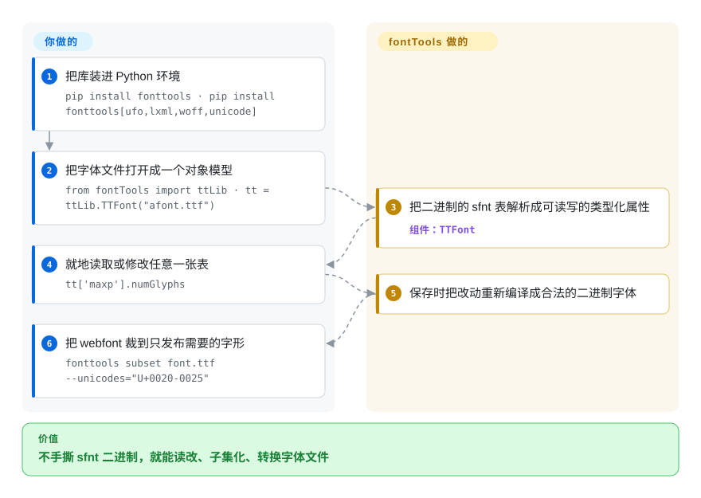

# fontTools

字体文件是几十个编号二进制表拼起来的包，临时脚本改一张表或做一次子集，很容易悄悄弄坏其余部分。fontTools 把 TrueType/OpenType/WOFF 解析成 Python 对象模型——每张表一个类——让你以编程方式读取、修改、子集化并重新序列化字体，另附带干同样活的命令行工具（`ttx`、subset、instancer）。

## 何时使用

你在搭一条字体流水线：也许你是给某位字体设计师做工程的人，要把 UFO/字形源转成可发布的 `.otf`/`.ttf`/`.woff2`；也许你是前端平台团队，需要把 webfont **子集化**到页面真正用到的那些字形，让下载从几百 KB 降到几 KB。你不想手撕二进制的 `sfnt`/`glyf`/`GPOS` 表，也不信任一个临时脚本能在不破坏表结构的前提下完整 round-trip 一个字体。你 `pip install fonttools`，然后要么调库——`TTFont("in.ttf")` 给你一个可遍历的对象模型，每张表都能读、改、存——要么用自带 CLI：`ttx` 把字体 dump 成可编辑 XML 再编译回来，`pyftsubset` 把字体裁到指定字形集，用 `fontTools.ttLib` 合并、把可变字体 instance 成静态切片、或修元数据。其他字体工具（以及大多数 webfont 构建步骤）都建在它之上。

只要任务是*程序化的字体外科手术*，你就会选它：为 Web 做子集、格式转换、检视/修补表、把可变字体 instance 成静态、或喂给更大的构建系统。依赖这条现在查实了：matplotlib 在自家 PyPI 元数据里声明 `fonttools>=4.28.2`（2026-09），PyPI 依赖图列出约 3.4 万个依赖仓库、月下载约 1.85 亿（健康度评分器，2026-09-28）——围绕它的 webfont 构建设计师工具链用法，是从这个足迹推断的，此处不逐一列举。

## 怎么用起来

fontTools 把字体文件看成它本来的样子：一个二进制容器——即 TrueType/OpenType 使用的 `sfnt`「表袋」布局——装着几十张编号表，并给每张表一个对应的 Python 类。`tt = ttLib.TTFont("afont.ttf")` 把容器解析成对象模型，于是 `tt['maxp'].numGlyphs`、`tt['OS/2'].achVendID` 都成了可读可写的普通属性，改完保存，它再序列化回合法的二进制字体。一次性的批量活儿可以完全不碰 Python：`ttx` 把字体往返转成可编辑的 XML，`fonttools subset` 把字体裁到指定的 Unicode 或字形范围（webfont 子集化就是这么回事），`fonttools varLib.instancer` 把可变字体烤成静态切片。仍然归你的：搞清楚你的格式真正依赖哪些表和子集参数（参数选错可能删掉排版特性、弄坏 kerning），以及把这些调用接进构建——fontTools 是进程内的库加 CLI，不是服务。

<!-- flow-steps:begin (generated from flows/fonttools.json by tools/flow_card.py — do not edit) -->

流程文字版

1. **你**：把库装进 Python 环境 — `pip install fonttools · pip install fonttools[ufo,lxml,woff,unicode]`
2. **你**：把字体文件打开成一个对象模型 — `from fontTools import ttLib · tt = ttLib.TTFont("afont.ttf")`
3. **fontTools**：把二进制的 sfnt 表解析成可读写的类型化属性 — 组件：`TTFont`
4. **你**：就地读取或修改任意一张表 — `tt['maxp'].numGlyphs`
5. **fontTools**：保存时把改动重新编译成合法的二进制字体
6. **你**：把 webfont 裁到只发布需要的字形 — `fonttools subset font.ttf --unicodes="U+0020-0025"`

**价值**：不手撕 sfnt 二进制，就能读改、子集化、转换字体文件

<!-- flow-steps:end -->

## 何时不用

- **你想*设计*字形或画轮廓。** fontTools 操纵字体*文件与表*，它不是字体编辑器。要绘制/编辑请用 Glyphs、FontForge 或 RoboFont——fontTools 是它们背后/周边的引擎，不是画布。
- **你需要完整的文本 shaping / 渲染。** 把文本＋字体变成定位好的字形（复杂文种、连字、双向）是 HarfBuzz 的活；fontTools 读 GSUB/GPOS 表，但不做 shaping 或栅格化。
- **你只想用 GUI/CLI 做一次性子集、永不脚本化。** 那也行，但这种情况下一个封装工具可能比库 API 更省事。
- **硬实时或内存吃紧的嵌入式场景。** 它是纯 Python 对象模型，会把表加载进内存；受限运行时下的字体处理应该用 C 库（FreeType、HarfBuzz）那一层。
- **你指望每张冷门表都被完整支持、round-trip 完美。** 覆盖很广但格式浩瀚；异种或厂商私有表可能被原样透传而非建模——请核实你依赖的那张具体表。[未验证]

## 横向对比

| 替代品 | 是否收录 | 我们的评价 | 取舍 |
|---|---|---|---|
| FontForge | 未收录 | 需要完整 GUI/可脚本字体编辑器来做设计和生产时，选 FontForge。 | 完整的 GUI/可脚本字体编辑器（设计＋生产）；功能面宽得多但更重、基于 C，工作流（编辑器）与一个干净的 Python 库不同。 |
| HarfBuzz | 未收录 | 需要文本 shaping 引擎，而不是字体文件编辑库时，选 HarfBuzz。 | 文本 shaping 引擎（文本→定位字形）；互补而非替代——fontTools 改字体，HarfBuzz 用字体来 shaping。 |
| FreeType | 未收录 | 需要运行时渲染字形的 C 栅格器/加载器时，选 FreeType。 | C 写的栅格器/加载器，用于运行时渲染字形；关乎画像素，而非编辑字体文件。 |
| Glyphs / RoboFont | 未收录 | 需要商业 macOS 字体设计应用时，选 Glyphs 或 RoboFont。 | 商业 macOS 字体设计应用；用于绘制字型，导出时往往*在底层用* fontTools。 |
| `woff2`/`sfnt2woff` 等 CLI | 未收录 | 只需要单一用途的格式转换时，选 woff2/sfnt2woff 等 CLI。 | 单一用途的格式转换器；fontTools 覆盖同样的转换，外加完整的表操作与子集化。 |

## 技术栈

- **语言：** Python（纯 Python 核心；特定特性有可选的 C 加速与原生依赖）。
- **模型：** 基于 `sfnt` 格式之上的 `TTFont` 对象模型——`cmap`、`glyf`、`GPOS`/`GSUB`、`name`、`head` 等每张表各有类；经 `ttx` 做 XML round-trip。
- **CLI：** `ttx`（字体 ↔ XML）、`pyftsubset`（子集）、`pyftmerge`（合并）、`fonttools` 入口暴露各子命令（可变字体 instancer 等）。
- **格式：** TrueType/OpenType（`.ttf`/`.otf`）、WOFF/WOFF2、AFM、T1/CFF 等。

## 依赖

- **运行时：** Python ≥ 3.11（README：「FontTools requires Python 3.11 or later」；PyPI `requires-python: >=3.11`，2026-09）。基础库是纯 Python，**除标准库外没有必需的外部依赖**。可选 extras 会拉入原生或其他依赖——WOFF2 走 `woff` extra（Brotli 绑定）、`lxml` 加速 XML、`ufo`/`unicode` 等各管各的模块；PyPI 元数据（2026-09）列出的 extras 为 `ufo, lxml, woff, unicode, graphite, interpolatable, plot, symfont, type1, pathops, repacker, all`，用 `pip install fonttools[ufo,lxml,woff,unicode]` 之类命令安装。
- **服务/基础设施：** 无——它是进程内的库/CLI，没有数据存储或守护进程。
- **构建：** 标准 Python 打包；可选原生 extras 需要各自的构建前置。

## 运维难度

**低。** `pip install fonttools`（要 WOFF2 就加 `[woff]` 这类 extras）即可——没有服务、没有数据存储、没有守护进程。它在进程内运行，或作为构建里的一个 CLI 步骤。唯一真实的摩擦是为你处理的格式挑对可选 extras（WOFF2 需要 brotli），以及做深度表手术时字体格式本身固有的复杂度——那是领域难度，不是运维难度。

## 健康度与可持续性

- **响应速度**：Grade A——中位首次响应 26.0 小时，基于 9 个 qualifying issues/PRs（健康度评分器，2026-09-28）。
- **维护（2026-9）。** 非常活跃：v4.66.0 于 2026-09-23 发布，`main` 最后 push 在 2026-09-24（GitHub API），最近 13 周每周都有提交——稳定的高频小版本节奏，明显在维护、不是吃老本。未归档。
- **治理 / bus factor。** 隶属 `fonttools` **GitHub 组织**，贡献者历史悠长，由 Behdad Esfahbod 和 Cosimo Lupo（anthrotype）领衔，外加数百名贡献者——多维护者、不是单点失效；雷达给 B 反映的是真实的提交集中度（头部贡献者约占近 12 个月提交的 42%）。[推断]
- **年龄与 Lindy。** 2013 年上 GitHub，但代码血统（Just van Rossum 的 TTX/fontTools）还要更早数年；在此 13+ 年且**仍在活跃发布**⇒ **强 Lindy** 信号——它是既定标准，而非新秀。[推断]
- **采用度。** 基础性且有实测支撑：matplotlib 的 PyPI 元数据要求 `fonttools>=4.28.2`（2026-09）；PyPI 注册表快照显示月下载约 1.85 亿、依赖仓库约 3.4 万（健康度评分器，2026-09-28）；GitHub star 约 5.3k。围绕它的 webfont 服务/设计师工具链一层是从这个足迹推断的。[推断]
- **风险标记。** 无明显项；宽松 MIT、未发现 relicense 历史、维护者多元。主要保留意见是格式广度（并非每张异种表都被深度建模），而非项目健康。[推断]

## 存疑（未验证）

- [未验证] 异种/厂商私有表的逐表覆盖与 round-trip 保真度是从格式广度做出的推断，而非对某张具体表的实测结论。
- [推断]「webfont 工具链的脊梁」里，除已查实的 matplotlib 依赖声明与注册表依赖数之外（设计师工具链、webfont 服务），其余是生态常识，本轮未从来源逐一列举。
- [推断] 各可选 extra（WOFF2 的 Brotli、lxml、unicodedata2 等）具体 gate 哪些特性，取自 README/打包结构的阅读，未逐一实测。
