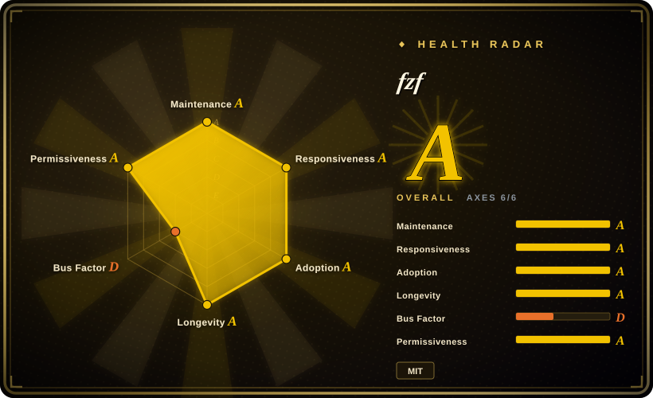
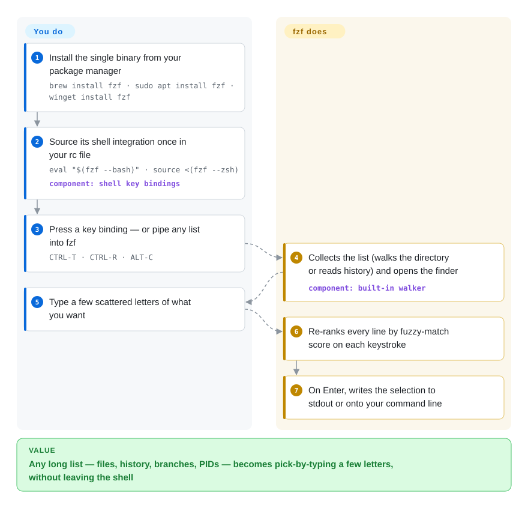

# fzf

You know the file is somewhere under `src/`, or you ran that long `kubectl` command last Tuesday, and you are scrolling through `history | grep kubectl` or retyping a path one segment at a time. fzf turns any list you pipe into it into an interactive picker: type a few scattered letters, the list shrinks as you type, and Enter hands your choice back to the shell.

## When to use

You live in a terminal — backend developer, SRE, anyone whose day is bash or zsh — and many times an hour you have to pick *one thing out of a long list*: a file among 40,000 in a monorepo, the git branch someone named `feat/JIRA-4412-retry-backoff-v2`, the `docker run` line you typed three days ago, the PID of the process eating your CPU. Today that means `history | grep docker`, 180 matches, scroll, copy with the mouse, paste. You install fzf and enable its shell integration, and now `CTRL-R` opens your history as a live-filtered list (`dkrrun` finds `docker run --rm -it ...`), `CTRL-T` pastes file paths onto the command line, `ALT-C` jumps into a subdirectory, and `vim **<TAB>` fuzzy-completes the argument.

Pick fzf over its look-alikes because of its contract: it is a plain Unix filter — lines in on stdin, selection out on stdout — so the same binary serves your shell keys, a one-line script (`git branch | fzf | xargs git checkout`), and Vim, and you can grow it into a small terminal app with `--preview` and `--bind`. skim and Television offer a similar picker; fzf wins on twelve years of continuous maintenance, packages in every major OS repository, and shell integration for bash, zsh, fish and Nushell built in rather than assembled from plugins.

## How it works

fzf is a filter, nothing more: it reads a list of lines (from stdin, or — when nothing is piped — by walking the current directory itself, skipping `.git` and `node_modules`), shows them full-screen or in a few lines under your prompt, and re-ranks the whole list on every keystroke. "Fuzzy" means the letters you type must appear in that order but not next to each other: `srcmain` matches `src/app/main.go`, and a small query syntax adds exact (`'wild`), prefix (`^music`), suffix (`.mp3$`) and negated (`!fire`) terms. **You supply the list and decide what to do with the answer; fzf does the matching, ranking and the interactive screen**, then prints the selected line(s) to stdout and exits. The shell integration you source once (`eval "$(fzf --bash)"`) is just a set of key bindings that feed fzf a list — files for `CTRL-T`, history for `CTRL-R`, directories for `ALT-C` — and paste its output back onto your command line. Past that, `--preview 'cmd {}'` runs a command for the highlighted line and `--bind` attaches actions such as `reload` or `become` to keys and events, which is how people build interactive ripgrep launchers and git browsers out of a single shell line.

<!-- flow-steps:begin (generated from flows/fzf.json by tools/flow_card.py — do not edit) -->

Text version of the flow

1. **You**: Install the single binary from your package manager — `brew install fzf · sudo apt install fzf · winget install fzf`
2. **You**: Source its shell integration once in your rc file — `eval "$(fzf --bash)" · source <(fzf --zsh)` — component: `shell key bindings`
3. **You**: Press a key binding — or pipe any list into fzf — `CTRL-T · CTRL-R · ALT-C`
4. **fzf**: Collects the list (walks the directory or reads history) and opens the finder — component: `built-in walker`
5. **You**: Type a few scattered letters of what you want
6. **fzf**: Re-ranks every line by fuzzy-match score on each keystroke
7. **fzf**: On Enter, writes the selection to stdout or onto your command line

**Value**: Any long list — files, history, branches, PIDs — becomes pick-by-typing a few letters, without leaving the shell

<!-- flow-steps:end -->

## When NOT to use

- **You need to search file *contents* for a pattern.** fzf only filters the lines it is given; it does not open files. Use [ripgrep](ripgrep.md) for that — and if you want it interactive, put fzf in front of `rg` (the README ships an "interactive ripgrep integration" recipe).
- **Nobody is at the keyboard.** The finder needs a terminal; in CI or a cron script there is no one to press Enter. Use `grep`/`rg`, or `fzf --filter=STR`, which runs the same fuzzy matcher non-interactively and prints matches.
- **You expect the file list to respect `.gitignore`.** The built-in walker skips only `.git` and `node_modules` by default, so build output and vendored trees show up. Set `FZF_DEFAULT_COMMAND` to `fd --type f` (fd, not indexed) or `rg --files` instead of relying on the walker — the README recommends exactly that.
- **You want a picker native to Neovim's Lua plugin world.** fzf's own Vim plugin works, but a Neovim-first setup is better served by fzf-lua (not indexed, still uses the fzf binary) or Telescope (not indexed, pure Lua, no external binary) because they integrate with LSP, buffers and pickers without shelling out.
- **You are on PowerShell or cmd.** The bundled key bindings cover bash, zsh, fish and Nushell only; on Windows-native shells use PSFzf (not indexed), which wraps the fzf binary with PowerShell bindings.
- **You want a desktop launcher, not a terminal tool.** fzf has no GUI; on a Linux desktop use rofi (not indexed), on macOS a launcher app, instead of wrapping fzf in a terminal window.

## Comparison

| Alternative | In index | Our verdict | Tradeoff |
|---|---|---|---|
| skim (`sk`) | not indexed | When you specifically want a Rust-native picker or to embed one as a Rust library, pick skim; for a shell-wide picker that every distro packages and every blog post assumes, stay with fzf. | skim mirrors much of fzf's interface and adds an interactive-command mode, but has a smaller user base and fewer ready-made integrations to copy from. |
| Television (`tv`) | not indexed | Pick Television when you want pre-built "channels" (files, git, env vars, docker) configured as data sources; pick fzf when you prefer composing your own sources from any command's output. | tv gives you more out of the box per source; fzf asks you to write the pipe, but its stdin/stdout contract fits any script and has a far longer track record. |
| peco | not indexed | Choose peco only if you want the smallest possible interactive filter with nothing else; for previews, key-bound actions and shell integration, fzf is the stronger choice. | peco is simpler to reason about; it lacks fzf's preview window, event bindings and maintained shell key bindings. |
| Telescope.nvim | not indexed | Inside Neovim, pick Telescope when you want pickers wired into LSP, buffers and git with no external binary; pick fzf (via fzf-lua or fzf.vim) when you want the same finder in the shell and the editor. | Telescope is Lua-native and editor-only; fzf is one binary shared across shell, scripts and editor, at the cost of an external process. |
| [ripgrep](ripgrep.md) | ✅ | Not a substitute but the usual partner: use ripgrep to find which lines contain a pattern, and fzf to choose among results interactively. | rg searches file contents fast but returns everything; fzf narrows a list by typing but cannot read files on its own. |

## Tech stack

- **Go** single binary (`go 1.23` in `go.mod`), with two terminal renderers in `src/tui`: its own lightweight one and one built on `gdamore/tcell`.
- **Directory walker:** `charlievieth/fastwalk` for the built-in file listing.
- **Shell integration:** bash/zsh/fish/Nushell scripts emitted by the binary itself (`fzf --bash`, `--zsh`, `--fish`, `--nushell`), and a Vim plugin (`plugin/fzf.vim`) in the same repo.
- **Matching:** its own fuzzy-match and ranking algorithm with an extended search syntax; options like `--ansi`, `--nth`, `--with-nth` trade speed for parsing (README "Performance").

## Dependencies

- **Runtime:** none beyond a terminal. The release is one statically built binary; packages exist for Homebrew, apt, dnf, pacman, apk, Nix, conda-forge, Chocolatey, Scoop, Winget and more.
- **Optional companions** the README recommends: `fd` or `ripgrep` as a `.gitignore`-aware file source, `bat` for syntax-highlighted previews, tmux ≥ 3.7 or Zellij ≥ 0.44 for floating-pane mode, and a terminal supporting Kitty/iTerm2/Sixel for image previews.
- **No services:** no daemon, no config server, no network access.

## Ops difficulty

**Very low.** Install one binary and add one line to your shell rc file. The only recurring work is upgrading (`brew upgrade fzf`, or `git pull && ./install` for a git checkout) — fzf ships frequently, and distro packages often lag, so the `--bash`/`--zsh` integration flags or newer `--bind` actions may be missing on an old system package. Teams standardizing on it should pin a minimum version in their dotfiles bootstrap.

## Health & viability

- **Maintenance (2026-10-08):** very active — five releases from v0.74.0 (2026-07-06) to v0.74.4 (2026-09-12), each with features and fixes; last default-branch commit 2026-09-14.
- **Governance / bus factor:** effectively a **single-maintainer** project — Junegunn Choi authored about 86% of commits in the last year (scorer top-1 share 0.858), with a dozen occasional contributors and GitHub Sponsors funding. The radar's governance D reflects exactly this.
- **Age & Lindy:** created 2013-10, about 13 years old and still releasing — a strong Lindy case for an interactive CLI.
- **Adoption:** ~83k stars, ~142k Homebrew installs in 90 days and ~14.6M release-asset downloads (scorer snapshot 2026-10-08); packaged by every major distro and used as a building block by many Vim/Neovim plugins and dotfile setups.
- **Risk flags:** MIT, no relicense history, no open-core split. The real risk is the bus factor: for an interactive tool the downside is small (the binary keeps working, and skim/Television exist), but embedding fzf as a Go library ties you more closely to one person's roadmap.

## Caveats (unverified)

- [推断] "Ships in every major OS repository" rests on the README's package table and Repology badge; versions in LTS distributions can lag the latest release by a year or more, so newer flags may be missing there.
- [未验证] fzf can be used as a Go library (release notes mention `Run()` "when fzf is used as a library"), but no stability guarantee for that API was found in the README.
- [推断] The comparisons with skim, Television and peco come from their READMEs and fzf's docs, not from benchmarks or hands-on use; relative speed on very large inputs was not measured.
