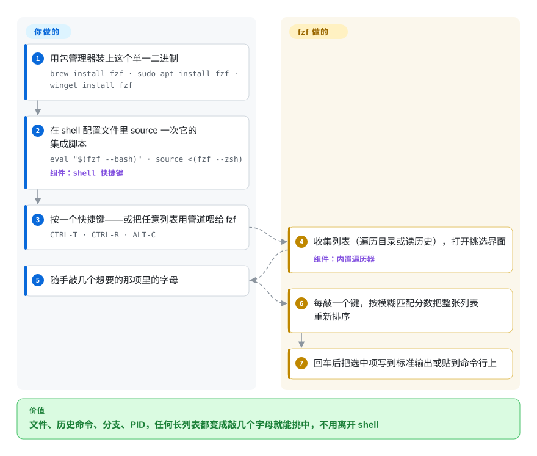

# fzf

你记得那个文件就在 `src/` 底下某处，或者上周二敲过一条很长的 `kubectl` 命令，结果只能在 `history | grep kubectl` 的几百行里翻，或者一段一段重敲路径。fzf 把任何喂给它的列表变成一个可交互的挑选框：随手敲几个字母，列表边敲边缩，回车就把选中的那一项交回给 shell。

## 何时使用

你整天待在终端里——后端开发、SRE，或者任何以 bash、zsh 为主战场的人——一小时里好几次要从一长串东西里*挑出一个*：monorepo 四万个文件里的某一个、别人起名叫 `feat/JIRA-4412-retry-backoff-v2` 的 git 分支、三天前敲过的那条 `docker run`、正在吃满 CPU 的那个进程的 PID。现在的做法是 `history | grep docker`，出来 180 行，往上翻，用鼠标复制，再粘贴。装上 fzf 并启用它的 shell 集成后，`CTRL-R` 会把历史命令变成一个实时过滤的列表（敲 `dkrrun` 就能找到 `docker run --rm -it ...`），`CTRL-T` 把选中的文件路径贴到命令行上，`ALT-C` 直接跳进某个子目录，`vim **<TAB>` 则对参数做模糊补全。

选 fzf 而不是长得差不多的同类，是因为它的约定：它就是一个普通的 Unix 过滤器——从标准输入读行，把选中项写到标准输出——所以同一个二进制既能挂在 shell 快捷键上，也能塞进一行脚本（`git branch | fzf | xargs git checkout`），还能在 Vim 里用；再加上 `--preview` 和 `--bind`，就能长成一个小型终端应用。skim 和 Television 也能提供类似的挑选框，fzf 胜在连续维护了十二年、各大系统的软件源都有打包，而且 bash、zsh、fish、Nushell 的集成是自带的，不用东拼西凑插件。

## 怎么用起来

fzf 只做一件事——过滤：它读入一串行（来自标准输入；如果没有管道输入，就自己遍历当前目录，默认跳过 `.git` 和 `node_modules`），全屏或者在提示符下方占几行显示出来，每敲一个键就把整张列表重新排一次序。所谓“模糊匹配”，是指你敲的字母只要按顺序出现即可，不必挨在一起：`srcmain` 能匹配 `src/app/main.go`；另外还有一套小语法，支持精确匹配（`'wild`）、前缀（`^music`）、后缀（`.mp3$`）和排除（`!fire`）。**列表由你提供，选中后拿来干什么也由你决定；fzf 负责匹配、排序和那块交互界面**，最后把选中的行打印到标准输出并退出。你只需要 source 一次的 shell 集成（`eval "$(fzf --bash)"`），其实就是几个快捷键：`CTRL-T` 喂文件列表，`CTRL-R` 喂历史命令，`ALT-C` 喂目录列表，再把 fzf 的输出贴回命令行。更进一步，`--preview 'cmd {}'` 会对当前高亮的那一行跑一条命令做预览，`--bind` 能把 `reload`、`become` 之类的动作挂到按键或事件上——很多人就是这样用一行 shell 拼出交互式 ripgrep 搜索器和 git 浏览器的。

<!-- flow-steps:begin (generated from flows/fzf.json by tools/flow_card.py — do not edit) -->

流程文字版

1. **你**：用包管理器装上这个单一二进制 — `brew install fzf · sudo apt install fzf · winget install fzf`
2. **你**：在 shell 配置文件里 source 一次它的集成脚本 — `eval "$(fzf --bash)" · source <(fzf --zsh)` — 组件：`shell 快捷键`
3. **你**：按一个快捷键——或把任意列表用管道喂给 fzf — `CTRL-T · CTRL-R · ALT-C`
4. **fzf**：收集列表（遍历目录或读历史），打开挑选界面 — 组件：`内置遍历器`
5. **你**：随手敲几个想要的那项里的字母
6. **fzf**：每敲一个键，按模糊匹配分数把整张列表重新排序
7. **fzf**：回车后把选中项写到标准输出或贴到命令行上

**价值**：文件、历史命令、分支、PID，任何长列表都变成敲几个字母就能挑中，不用离开 shell

<!-- flow-steps:end -->

## 何时不用

- **你要按模式搜索文件*内容*。** fzf 只过滤别人交给它的行，自己不打开文件。这种需求用 [ripgrep](ripgrep.zh.md)；想要交互式的话，就把 fzf 接在 `rg` 后面（README 里自带一份“交互式 ripgrep 集成”的配方）。
- **键盘前没有人。** 挑选界面需要终端；在 CI 或 cron 脚本里没人按回车。用 `grep`、`rg`，或者 `fzf --filter=STR`——它用同一套模糊匹配器非交互地打印匹配结果。
- **你以为文件列表会遵守 `.gitignore`。** 内置遍历器默认只跳过 `.git` 和 `node_modules`，构建产物和 vendor 目录都会冒出来。把 `FZF_DEFAULT_COMMAND` 设成 `fd --type f`（fd，未收录）或 `rg --files`，别依赖内置遍历器——README 就是这么建议的。
- **你想要一个原生融入 Neovim Lua 插件生态的挑选器。** fzf 自带的 Vim 插件能用，但以 Neovim 为主的配置更适合用 fzf-lua（未收录，底层仍调用 fzf 二进制）或 Telescope（未收录，纯 Lua、不依赖外部二进制），因为它们直接接入 LSP、缓冲区和各种 picker，不用另起进程。
- **你用的是 PowerShell 或 cmd。** 自带的快捷键只覆盖 bash、zsh、fish 和 Nushell；在 Windows 原生 shell 上用 PSFzf（未收录），它在 fzf 二进制外面包了一层 PowerShell 绑定。
- **你要的是桌面启动器，不是终端工具。** fzf 没有图形界面；Linux 桌面用 rofi（未收录），macOS 用启动器类应用，别把 fzf 塞进一个终端窗口里凑合。

## 横向对比

| 替代品 | 是否收录 | 我们的评价 | 取舍 |
|---|---|---|---|
| skim（`sk`） | 未收录 | 你明确想要 Rust 原生的挑选器，或者要把它作为 Rust 库嵌进程序时，选 skim；要一个各发行版都打包、各种教程都默认的全局 shell 挑选器，继续用 fzf。 | skim 复刻了 fzf 的大部分界面，还多了交互式命令模式，但用户群更小，可直接抄的现成集成也更少。 |
| Television（`tv`） | 未收录 | 想要现成配好的“频道”（文件、git、环境变量、docker）当数据源时，选 Television；更愿意用任意命令的输出自己拼数据源时，选 fzf。 | tv 每类数据源开箱即用的东西更多；fzf 要你自己写管道，但它的标准输入输出约定能套进任何脚本，而且历史长得多。 |
| peco | 未收录 | 只想要一个最小的交互式过滤器、别的都不要时才选 peco；需要预览、按键动作和 shell 集成时，fzf 明显更合适。 | peco 更简单好懂；但没有 fzf 的预览窗口、事件绑定和持续维护的 shell 快捷键。 |
| Telescope.nvim | 未收录 | 在 Neovim 里，想要直接接入 LSP、缓冲区和 git 且不依赖外部二进制时，选 Telescope；想让 shell 和编辑器共用同一个挑选器时，选 fzf（通过 fzf-lua 或 fzf.vim）。 | Telescope 是纯 Lua、只在编辑器里用；fzf 是 shell、脚本、编辑器共用的一个二进制，代价是多起一个外部进程。 |
| [ripgrep](ripgrep.zh.md) | ✅ | 不是替代品，而是常见搭档：用 ripgrep 找出哪些行含有某个模式，再用 fzf 在结果里交互式地挑。 | rg 搜文件内容很快，但把结果一股脑全吐出来；fzf 靠敲字缩小列表，但自己读不了文件。 |

## 技术栈

- **Go** 单一二进制（`go.mod` 声明 `go 1.23`），`src/tui` 里有两套终端渲染器：一套自研的轻量实现，一套基于 `gdamore/tcell`。
- **目录遍历：** 内置文件列表用 `charlievieth/fastwalk`。
- **shell 集成：** bash、zsh、fish、Nushell 的脚本由二进制自己输出（`fzf --bash`、`--zsh`、`--fish`、`--nushell`），同一仓库里还带一个 Vim 插件（`plugin/fzf.vim`）。
- **匹配：** 自研的模糊匹配与排序算法，外加扩展搜索语法；`--ansi`、`--nth`、`--with-nth` 这类选项会用速度换解析能力（见 README “Performance” 一节）。

## 依赖

- **运行时：** 除了一个终端，什么都不需要。发布物是一个静态构建的二进制；Homebrew、apt、dnf、pacman、apk、Nix、conda-forge、Chocolatey、Scoop、Winget 等都有包。
- **README 推荐的可选搭档：** 用 `fd` 或 `ripgrep` 提供遵守 `.gitignore` 的文件列表，用 `bat` 做语法高亮预览，tmux 3.7 及以上或 Zellij 0.44 及以上可用浮动窗格模式，支持 Kitty、iTerm2 或 Sixel 协议的终端可以预览图片。
- **没有任何服务：** 没有守护进程，没有配置服务器，不联网。

## 运维难度

**很低。** 装一个二进制，往 shell 配置文件里加一行。唯一的日常工作是升级（`brew upgrade fzf`，git 安装的话是 `git pull && ./install`）——fzf 发版很勤，而发行版的包常常滞后，所以老系统的包里可能还没有 `--bash`、`--zsh` 集成参数或较新的 `--bind` 动作。团队统一使用时，应在 dotfiles 初始化脚本里钉一个最低版本。

## 健康度与可持续性

- **维护（2026-10-08）：** 非常活跃——从 v0.74.0（2026-07-06）到 v0.74.4（2026-09-12）连发五个版本，每个都带新功能和修复；默认分支最近一次提交在 2026-09-14。
- **治理与 bus factor：** 实质上是**单人维护**——近一年约 86% 的提交出自 Junegunn Choi（评分器 top-1 占比 0.858），另有十来位零星贡献者，资金来自 GitHub Sponsors。雷达上治理一轴的 D 反映的正是这一点。
- **年龄与 Lindy：** 2013-10 创建，约 13 年，至今仍在发版——对一个交互式命令行工具来说，Lindy 判定很强。
- **采用：** 约 8.3 万 star，90 天 Homebrew 安装约 14.2 万次，release 资产下载约 1460 万次（评分器 2026-10-08 快照）；各大发行版都有打包，大量 Vim、Neovim 插件和 dotfiles 配置把它当作基础构件。
- **风险信号：** MIT 许可，没有改许可证的历史，也没有开源核心加付费功能的拆分。真正的风险是 bus factor：对交互式工具来说代价不大（二进制照样能用，skim、Television 也都在），但如果把 fzf 当 Go 库嵌进产品，你就和一个人的路线图绑得更紧。

## 存疑（未验证）

- [推断] “各大系统软件源都有打包”依据的是 README 的包管理器表格和 Repology 徽章；LTS 发行版里的版本可能落后最新版一年以上，较新的参数在那里可能不存在。
- [未验证] fzf 可以当 Go 库使用（release notes 提到 “when fzf is used as a library” 时的 `Run()`），但 README 里没有找到这套 API 的稳定性承诺。
- [推断] 与 skim、Television、peco 的对比来自它们各自的 README 和 fzf 文档，不是基准测试或上手实测；超大输入下的相对速度没有测过。
