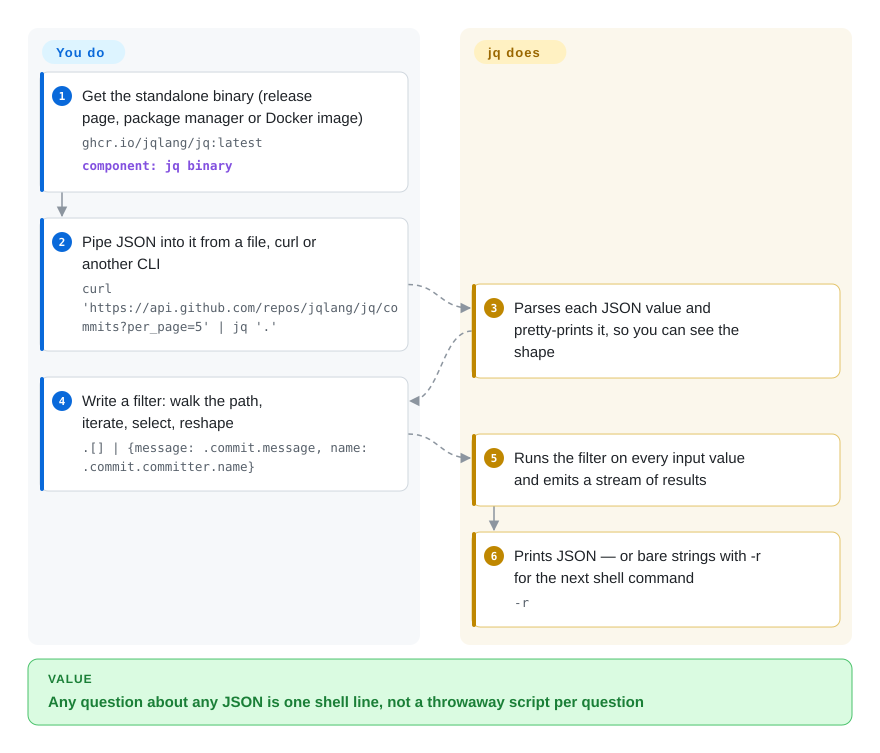

# jq

An API hands you 3,000 lines of nested JSON and you only need the `name` of every item whose `status` is `"failed"` — so you either squint at it in a pager or write yet another throwaway Python script. jq is a small language for exactly that: one line such as `.items[] | select(.status == "failed") | .name` pulls the fields out on the command line, and it slots into shell pipelines the way `grep` and `sed` do.

## When to use

You are a backend or platform engineer whose shell is full of JSON: `kubectl get pods -o json`, `aws ec2 describe-instances`, `gh api`, a webhook payload saved to disk, a log line per event. The questions are small and endless — which pods are not `Running`, what is the instance ID behind this tag, how many events have `"level":"error"` — and `grep` cannot answer them because the value you want sits three objects deep and spans lines. You pipe the output into `jq` and write the question as a filter: `jq -r '.items[] | select(.status.phase != "Running") | .metadata.name'` prints bare pod names, one per line, ready for `xargs`.

Reach for jq rather than its look-alikes because it is the one already everywhere: a single dependency-free C binary that CI images, Dockerfiles and other tools' documentation assume, with a language that gojq and jaq deliberately re-implement. The deciding tradeoff is ubiquity and a shared dialect over the extras the reimplementations add (YAML input, exact big-integer arithmetic, speed).

## How it works

A jq program is a **filter**: it takes JSON in and produces JSON out. Filters chain with `|` exactly like shell pipes — `.items` picks a field, `.[]` iterates over an array, `select(cond)` keeps only matching values, and `{name, id}` builds a new object from the fields you name — so you describe the path to the data rather than writing loops. The input can be one document or a stream of many (one JSON object per line works directly), and the filter runs once per input value, emitting a stream of results. **You write the filter; jq parses the input, runs your filter over it and prints the results** — pretty-printed JSON by default, or bare strings with `-r` so the next shell command gets plain text. Shell variables go in through `--arg name value` instead of being spliced into the quoted program, and `-s` reads everything into one array when you need to sort or count across inputs. Think of it as `sed` for JSON: a terse line you type, not a program you maintain.

<!-- flow-steps:begin (generated from flows/jq.json by tools/flow_card.py — do not edit) -->

Text version of the flow

1. **You**: Get the standalone binary (release page, package manager or Docker image) — `ghcr.io/jqlang/jq:latest` — component: `jq binary`
2. **You**: Pipe JSON into it from a file, curl or another CLI — `curl 'https://api.github.com/repos/jqlang/jq/commits?per_page=5' | jq '.'`
3. **jq**: Parses each JSON value and pretty-prints it, so you can see the shape
4. **You**: Write a filter: walk the path, iterate, select, reshape — `.[] | {message: .commit.message, name: .commit.committer.name}`
5. **jq**: Runs the filter on every input value and emits a stream of results
6. **jq**: Prints JSON — or bare strings with -r for the next shell command — `-r`

**Value**: Any question about any JSON is one shell line, not a throwaway script per question

<!-- flow-steps:end -->

## When NOT to use

- **The data is multi-gigabyte or the question is analytical.** jq parses each input document fully into memory; for a single huge file the escape hatch is `--stream`, which hands you path/leaf pairs and makes filters much harder to write. For group-by, joins across files or aggregates over large JSON/NDJSON, use [DuckDB](../../databases/database-engines/duckdb.md) (`read_json`) instead of jq, because it plans and parallelizes the query for you.
- **Your input is YAML, TOML or XML.** jq reads JSON only. Use yq (mikefarah, not indexed) for YAML-centric config work, or gojq (`--yaml-input`) / jaq if you want jq syntax over other formats.
- **You do arithmetic on integers above 2^53.** jq 1.7+ keeps a big number literal intact only if you leave it untouched; once you compute with it, it becomes a double and loses digits (the gojq README documents this difference). Use gojq, which does arbitrary-precision integer arithmetic, for 64-bit IDs and ledger amounts.
- **The transform has become business logic.** A 15-line jq program with nested `reduce` and `def` is hard for the next person to read or test. Move it into a script with your language's JSON library (Python `json`, Node, Go `encoding/json`) instead of growing the one-liner.
- **You only want to look around in an unfamiliar document.** Writing filters to explore is slow; use an interactive viewer such as fx (not indexed) to fold, search and copy paths, then come back to jq to script the answer.
- **Your systems still ship jq 1.6 or 1.7 and process untrusted JSON.** jq 1.8.2 (2026-06-20) fixed about twenty memory-safety CVEs (heap overflows, stack exhaustion, hash-collision DoS). Install the current release binary, or use the memory-safe gojq/jaq, instead of the distro package on old LTS images.

## Comparison

| Alternative | In index | Our verdict | Tradeoff |
|---|---|---|---|
| gojq | not indexed | Pick gojq when you need exact big-integer arithmetic, YAML in/out, or a Go library to embed; stay with jq when scripts depend on key order, `keys_unsorted` or jq's regex features. | Pure Go and maintained by a jq co-maintainer; but it does not preserve object key order and intentionally omits some jq flags and functions. |
| jaq | not indexed | Choose jaq when jq's startup time or throughput is the bottleneck on high-volume streams, or you want YAML/CBOR/TOML/XML input; keep jq where everyone else's scripts and docs must run unchanged. | Rust, faster on most of its published benchmarks and stricter about correctness; smaller install base and some intentional semantic differences from jq. |
| yq (mikefarah) | not indexed | Use yq for Kubernetes manifests, CI YAML and other config files you edit in place; use jq when the data is JSON from APIs and logs. | yq round-trips YAML (comments, multiple documents) with jq-like syntax; its expression language is similar to jq's but not identical. |
| [DuckDB](../../databases/database-engines/duckdb.md) | ✅ | When the JSON is large or the question is a join/group-by, load it into DuckDB and use SQL; for per-document extraction inside a shell pipeline, jq is lighter. | DuckDB brings a query planner, parallelism and SQL familiarity; it is a much bigger binary and a different mental model from a stream filter. |
| fx | not indexed | Open fx to explore an unfamiliar JSON document interactively; write the reusable extraction in jq once you know the paths. | fx is a viewer with folding and search (plus JavaScript-expression filtering); it is not the de facto scripting dialect that jq is. |

## Tech stack

- **C**, portable and statically linkable; the release assets are standalone executables for Linux, macOS and Windows (including Windows arm64 since 1.8.2), plus a `ghcr.io/jqlang/jq` Docker image.
- **Parser:** bison/flex grammar (needed only when building from git, not from release tarballs).
- **Regex:** Oniguruma, vendored under `vendor/` as a git submodule and built in with `--with-oniguruma=builtin`.
- **Numbers:** a vendored decNumber keeps number literals at full precision when they pass through unchanged; arithmetic is double-precision.
- **Build:** autotools (`autoreconf`, `./configure`, `make`); also exposes `libjq` for embedding in C programs.

## Dependencies

- **Runtime:** none — the README states "zero runtime dependencies"; drop the binary on `PATH` and `chmod +x` it.
- **Build from source:** libtool, make, automake, autoconf, plus bison/flex for git checkouts; Oniguruma comes from the bundled submodule.
- **No services:** no daemon, no network access, no config file.

## Ops difficulty

**Very low.** It is one binary. The practical work is version control across machines: jq 1.6 (2018) is still the package on some older LTS images, and 1.7/1.8 changed behaviour (number handling, error messages, new builtins) as well as fixing security bugs. Pin a version in CI and container images rather than relying on whatever `apt install jq` provides; release artifacts now ship with build-provenance attestations you can verify with `gh attestation verify`.

## Health & viability

- **Maintenance (2026-10-08):** active — commits landing weekly (latest 2026-10-07); 1.8.0 (2025-06), 1.8.1 (2025-07) and the security-heavy 1.8.2 (2026-06-20). Releases are infrequent but substantial.
- **History matters here:** after 1.6 (2018-11) there was a five-year release gap until 1.7 (2023-09), when a new maintainer group under the `jqlang` organization revived the project. Treat that as both a warning (it did stall once) and evidence the community will rescue it.
- **Governance / bus factor:** organization-owned, but recent work is concentrated — itchyny authored about half of the last 60 commits and most of the 1.8.2 security fixes, with other maintainers (wader among them) and drive-by contributors supplying the rest. The top contributor holds about 63% of last-year commits, hence the radar's governance C.
- **Age & Lindy:** created 2012, about 14 years old and active again — a strong Lindy case for a de facto standard tool.
- **Adoption:** ~35.8k stars, ~197k Homebrew installs in 90 days, ~300M release-asset downloads and 7,573,273 conda-forge downloads in the last month (scorer snapshot 2026-10-08); it is also a frequent CI-image and tooling dependency.
- **Risk flags:** the 2026 CVE batch shows the C codebase carried memory-safety bugs on untrusted input — fixed in 1.8.2, but old distro copies remain exposed. License is MIT for the code (`COPYING`); the GitHub API reports `NOASSERTION` because the same file also carries CC BY 3.0 for the docs and third-party notices, which is why the radar's license axis is unscored.

## Caveats (unverified)

- [推断] The memory-usage limitation (whole-document parsing without `--stream`) comes from the manual's guidance that `--stream` is "useful for processing very large inputs"; no memory ceiling was measured.
- [未验证] Which LTS distributions still ship jq 1.6 or 1.7 was not checked per distribution; check your own base image.
- [推断] jaq's speed advantage is taken from jaq's own benchmark section and user quotes, not from an independent benchmark.
- [推断] The description of the 2023 revival rests on the release dates (1.6 in 2018, 1.7 in 2023) and the current `jqlang` ownership and contributor list; the governance hand-over itself was not read from a primary announcement.
