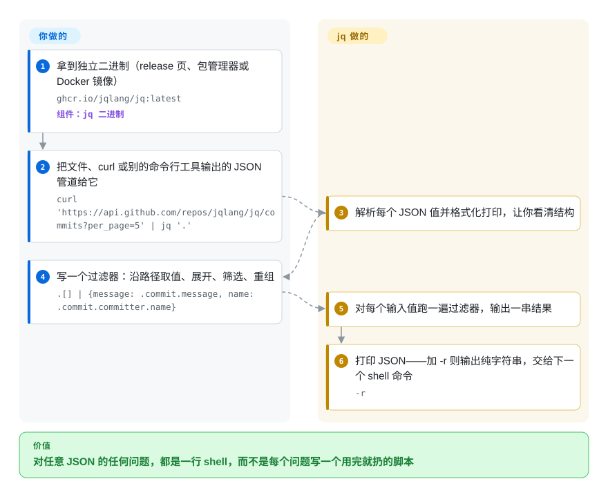

# jq

接口甩给你三千行层层嵌套的 JSON，你只想要其中 `status` 为 `"failed"` 的那些条目的 `name`——于是要么在分页器里眯着眼找，要么再写一个用完就扔的 Python 脚本。jq 就是专门干这个的小语言：在命令行里写一行 `.items[] | select(.status == "failed") | .name` 就能把字段抽出来，而且能像 `grep`、`sed` 那样直接接进 shell 管道。

## 何时使用

你是后端或平台工程师，终端里满屏都是 JSON：`kubectl get pods -o json`、`aws ec2 describe-instances`、`gh api`、存到磁盘上的 webhook 负载、每个事件一行的日志。问题都很小，但没完没了——哪些 pod 不是 `Running`、这个标签背后的实例 ID 是多少、有多少事件带着 `"level":"error"`——而 `grep` 回答不了，因为你要的值埋在三层对象里，还跨了好几行。你把输出管道给 `jq`，把问题写成一个过滤器：`jq -r '.items[] | select(.status.phase != "Running") | .metadata.name'`，打印出来的就是一行一个的 pod 名，可以直接接 `xargs`。

选 jq 而不是长得像它的那几个，是因为它已经无处不在：一个没有任何依赖的 C 二进制，CI 镜像、Dockerfile 和别的工具的文档都默认你有它，而 gojq、jaq 都在刻意复刻它的语言。决定性的取舍是：要普及度和一套大家都会的方言，就放弃那些复刻版额外提供的东西（YAML 输入、精确的大整数运算、速度）。

## 怎么用起来

一个 jq 程序就是一个**过滤器**：JSON 进，JSON 出。过滤器之间用 `|` 串起来，跟 shell 管道一模一样——`.items` 取一个字段，`.[]` 把数组逐个展开，`select(cond)` 只留下满足条件的值，`{name, id}` 用你点名的字段拼出一个新对象——所以你描述的是“数据在哪条路径上”，而不是去写循环。输入可以是一个文档，也可以是一串文档（每行一个 JSON 对象直接就能处理），过滤器对每个输入值各跑一遍，输出一串结果。**过滤器由你来写；jq 负责解析输入、在上面跑你的过滤器、把结果打印出来**——默认是格式化好的 JSON，加 `-r` 则输出不带引号的纯字符串，方便下一个 shell 命令接着用。shell 变量通过 `--arg name value` 传进去，而不是拼接到引号里的程序文本中；需要跨输入排序或计数时，`-s` 会把所有输入读成一个数组。可以把它理解成 JSON 版的 `sed`：随手敲的一行，而不是要长期维护的程序。

<!-- flow-steps:begin (generated from flows/jq.json by tools/flow_card.py — do not edit) -->

流程文字版

1. **你**：拿到独立二进制（release 页、包管理器或 Docker 镜像） — `ghcr.io/jqlang/jq:latest` — 组件：`jq 二进制`
2. **你**：把文件、curl 或别的命令行工具输出的 JSON 管道给它 — `curl 'https://api.github.com/repos/jqlang/jq/commits?per_page=5' | jq '.'`
3. **jq**：解析每个 JSON 值并格式化打印，让你看清结构
4. **你**：写一个过滤器：沿路径取值、展开、筛选、重组 — `.[] | {message: .commit.message, name: .commit.committer.name}`
5. **jq**：对每个输入值跑一遍过滤器，输出一串结果
6. **jq**：打印 JSON——加 -r 则输出纯字符串，交给下一个 shell 命令 — `-r`

**价值**：对任意 JSON 的任何问题，都是一行 shell，而不是每个问题写一个用完就扔的脚本

<!-- flow-steps:end -->

## 何时不用

- **数据有好几 GB，或者问题本身是分析型的。** jq 会把每个输入文档完整解析进内存；单个巨型文件的出路是 `--stream`，它给你的是“路径 + 叶子值”对，过滤器会难写得多。要做分组、跨文件关联或在大体量 JSON/NDJSON 上做聚合，用 [DuckDB](../../databases/database-engines/duckdb.zh.md)（`read_json`）而不是 jq，因为它会替你规划并并行执行查询。
- **输入是 YAML、TOML 或 XML。** jq 只读 JSON。以 YAML 配置为主的活用 yq（mikefarah 版，未收录）；想在别的格式上沿用 jq 语法，用 gojq（`--yaml-input`）或 jaq。
- **你要对超过 2^53 的整数做运算。** jq 1.7 及以后只在你不碰大数字面量时保留它的原样；一旦参与计算，它就变成双精度浮点数，丢掉末尾的位数（gojq 的 README 专门写了这一差异）。处理 64 位 ID 或账务金额时用 gojq，它支持任意精度的整数运算。
- **这段变换已经成了业务逻辑。** 一个十五行、嵌着 `reduce` 和 `def` 的 jq 程序，下一个人既读不懂也没法测。把它挪进一个脚本，用你所用语言的 JSON 库（Python 的 `json`、Node、Go 的 `encoding/json`），别继续往一行命令里堆。
- **你只是想在一份陌生文档里四处看看。** 靠写过滤器来探索太慢；先用 fx（未收录）这类交互式查看器折叠、搜索、复制路径，摸清结构后再回到 jq 写脚本。
- **你的系统里还是 jq 1.6 或 1.7，而且要处理不可信的 JSON。** jq 1.8.2（2026-06-20）一次修了约二十个内存安全类 CVE（堆溢出、栈耗尽、哈希碰撞 DoS）。在老的 LTS 镜像上，别用发行版自带的包，改装当前的 release 二进制，或者用内存安全的 gojq、jaq。

## 横向对比

| 替代品 | 是否收录 | 我们的评价 | 取舍 |
|---|---|---|---|
| gojq | 未收录 | 需要精确的大整数运算、YAML 输入输出，或者要嵌进 Go 程序时，选 gojq；脚本依赖键的顺序、`keys_unsorted` 或 jq 的正则特性时，继续用 jq。 | 纯 Go 实现，维护者本身也是 jq 的维护者之一；但不保留对象键的顺序，并且有意不实现 jq 的部分参数和函数。 |
| jaq | 未收录 | jq 的启动时间或吞吐成为高流量数据流的瓶颈，或者你想直接读 YAML、CBOR、TOML、XML 时，选 jaq；需要让别人的脚本和文档原样跑通的地方，保留 jq。 | Rust 实现，在它公布的大多数基准上更快，对正确性也更较真；装机量更小，并且和 jq 有一些刻意的语义差异。 |
| yq（mikefarah） | 未收录 | 改 Kubernetes 清单、CI 的 YAML 等需要原地编辑的配置文件，用 yq；数据是来自接口和日志的 JSON 时，用 jq。 | yq 能完整往返 YAML（注释、多文档），语法类似 jq；但它的表达式语言与 jq 只是相似，并不完全相同。 |
| [DuckDB](../../databases/database-engines/duckdb.zh.md) | ✅ | JSON 很大，或者问题是关联、分组时，把数据载进 DuckDB 用 SQL；在 shell 管道里逐个文档抽字段，jq 更轻。 | DuckDB 带来查询规划、并行执行和熟悉的 SQL；代价是二进制大得多，思维模型也和流式过滤器完全不同。 |
| fx | 未收录 | 想交互式地浏览一份陌生 JSON 时打开 fx；摸清路径后，再用 jq 把可复用的抽取写下来。 | fx 是带折叠和搜索的查看器（也能用 JavaScript 表达式过滤）；但它不是 jq 那种事实上的脚本方言。 |

## 技术栈

- **C**，可移植、可静态链接；release 资产是 Linux、macOS、Windows 的独立可执行文件（1.8.2 起包括 Windows arm64），另有 `ghcr.io/jqlang/jq` Docker 镜像。
- **语法解析：** bison/flex 语法（只有从 git 构建时才需要，用 release 源码包不需要）。
- **正则：** Oniguruma，以 git 子模块的形式放在 `vendor/` 下，用 `--with-oniguruma=builtin` 编进去。
- **数字：** 内置一份 decNumber，数字字面量原样经过时保持完整精度；参与运算时按双精度处理。
- **构建：** autotools（`autoreconf`、`./configure`、`make`）；同时提供 `libjq`，可嵌入 C 程序。

## 依赖

- **运行时：** 无——README 写明“zero runtime dependencies”；把二进制放进 `PATH`，`chmod +x` 即可。
- **从源码构建：** libtool、make、automake、autoconf，从 git 构建还要 bison/flex；Oniguruma 来自自带的子模块。
- **没有任何服务：** 没有守护进程，不联网，没有配置文件。

## 运维难度

**很低。** 就一个二进制。真正要做的是跨机器的版本管理：一些老 LTS 镜像里的包仍是 jq 1.6（2018 年），而 1.7、1.8 既修了安全漏洞，也改了行为（数字处理、错误信息、新内置函数）。在 CI 和容器镜像里钉住版本，别依赖 `apt install jq` 给你什么就用什么；release 产物现在附带构建来源证明，可以用 `gh attestation verify` 校验。

## 健康度与可持续性

- **维护（2026-10-08）：** 活跃——每周都有提交（最近一次 2026-10-07）；1.8.0（2025-06）、1.8.1（2025-07），以及以安全修复为主的 1.8.2（2026-06-20）。发版不频繁，但每次分量都不小。
- **这段历史要看：** 1.6（2018-11）之后，整整五年没有发版，直到 1.7（2023-09）才由 `jqlang` 组织下的新维护团队重新激活。这既是警告（它确实停摆过一次），也说明社区愿意把它救回来。
- **治理与 bus factor：** 归组织所有，但近期工作很集中——最近 60 个提交里约一半出自 itchyny，1.8.2 的安全修复也大多是他做的，其余来自其他维护者（包括 wader）和零星贡献者。头号贡献者占近一年提交的约 63%，所以雷达上治理一轴是 C。
- **年龄与 Lindy：** 2012 年创建，约 14 年，如今重新活跃——作为事实标准工具，Lindy 判定很强。
- **采用：** 约 3.58 万 star，90 天 Homebrew 安装约 19.7 万次，release 资产下载约 3 亿次，conda-forge 上月下载 7,573,273 次（评分器 2026-10-08 快照）；它还是 CI 镜像和各类工具里常见的依赖。
- **风险信号：** 2026 年这批 CVE 说明，这套 C 代码在处理不可信输入时曾有内存安全缺陷——1.8.2 已修，但老发行版里的副本仍然暴露。代码许可是 MIT（见 `COPYING`）；GitHub API 报 `NOASSERTION`，是因为同一个文件里还写了文档用的 CC BY 3.0 和第三方声明，这也是雷达上许可一轴没有打分的原因。

## 存疑（未验证）

- [推断] “不加 `--stream` 就整篇解析进内存”这一限制，依据的是手册里 `--stream` “useful for processing very large inputs”的说明；没有实测内存上限。
- [未验证] 没有逐个发行版核对哪些 LTS 版本仍然带 jq 1.6 或 1.7；请检查你自己的基础镜像。
- [推断] jaq 的速度优势取自 jaq 自己的基准章节和用户引言，不是独立基准测试。
- [推断] 关于 2023 年重新激活的描述，依据的是发版日期（2018 年 1.6、2023 年 1.7）、当前的 `jqlang` 归属和贡献者列表；没有读到治理交接的一手公告。
