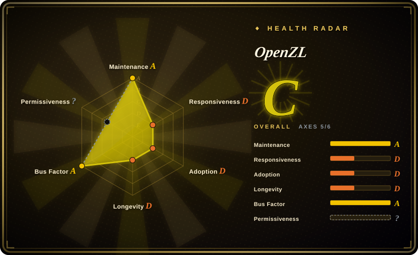
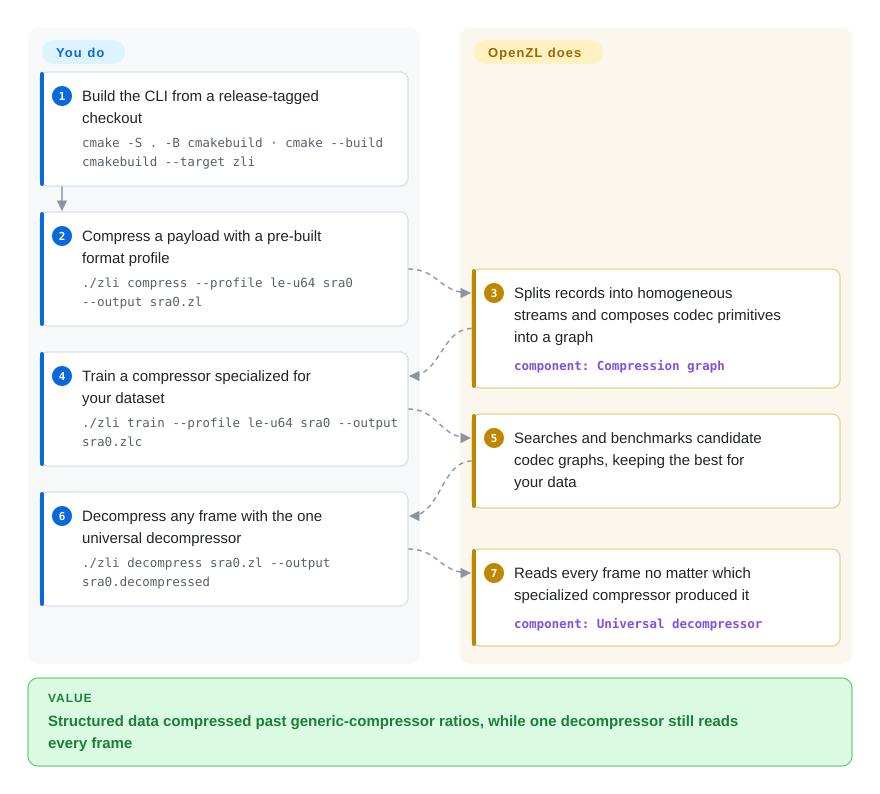

# OpenZL

zstd treats your columnar telemetry as opaque bytes, so the monotonic timestamp column and the low-cardinality enum column get compressed badly. OpenZL is Meta's format-aware framework: you describe the data's structure, it composes codec graphs over homogeneous streams, and one universal decompressor still reads everything it produces.

## When to use

You're a data-platform or storage engineer sitting on terabytes of one specific, highly structured payload — fixed-schema telemetry records, columnar feature dumps for an AI training pipeline, arrays of sorted integers, multi-field binary logs. A generic byte-stream compressor (zstd, lz4) treats the whole blob as an opaque sequence and leaves a lot of ratio on the table because it never sees that column 3 is a monotonic timestamp and column 7 is a low-cardinality enum. You've tried hand-rolling a transpose-then-delta-then-zstd pipeline and it works, but it's bespoke per dataset and a pain to maintain. OpenZL lets you instead *describe* the data — via a pre-built profile, the SDDL (Simple Data Description Language), or a custom parser — and it composes primitive codecs into a DAG that splits your records into homogeneous streams (parse → group → transform & compress), applying delta/transpose/dictionary steps where they actually pay off.

The payoff is two-fold: you can get materially better ratio-at-speed than a generic compressor on that specific format, and every frame you produce is readable by OpenZL's single universal decompressor regardless of which graph created it — so consumers don't need to know which specialized compressor was used. Meta states the core has "reached production-readiness" and is "used extensively in production at Meta", which is reassuring if you're considering it for a real ingestion pipeline rather than a one-off.

## How it works

OpenZL sits between your structured data and the byte-compressor you would otherwise reach for. You hand it a *description* of the format — a pre-built profile, an SDDL schema (the project's Simple Data Description Language, with an SDDL2 revision now announced in the docs), or a custom parser — and OpenZL lowers that description into a compression graph: a DAG of primitive codecs (delta, transpose, dictionary, entropy coders, with zstd as one of the leaves) that splits each record into homogeneous streams so like compresses with like. The `zli` CLI exposes the whole loop: `./zli compress --profile le-u64 yourdata` for an off-the-shelf profile, `./zli train` to search and benchmark candidate graphs on your actual payload and emit a `.zlc` compressor profile — and a single universal decompressor reads any frame no matter which graph produced it. What stays yours: writing and validating the data description, pinning release-tagged builds (only tagged frames carry the multi-year decompressibility promise), and the native C11/C++17 build itself — it is an embeddable library plus CLI, not a service.

<!-- flow-steps:begin (generated from flows/openzl.json by tools/flow_card.py — do not edit) -->

Text version of the flow

1. **You**: Build the CLI from a release-tagged checkout — `cmake -S . -B cmakebuild · cmake --build cmakebuild --target zli`
2. **You**: Compress a payload with a pre-built format profile — `./zli compress --profile le-u64 sra0 --output sra0.zl`
3. **OpenZL**: Splits records into homogeneous streams and composes codec primitives into a graph — component: `Compression graph`
4. **You**: Train a compressor specialized for your dataset — `./zli train --profile le-u64 sra0 --output sra0.zlc`
5. **OpenZL**: Searches and benchmarks candidate codec graphs, keeping the best for your data
6. **You**: Decompress any frame with the one universal decompressor — `./zli decompress sra0.zl --output sra0.decompressed`
7. **OpenZL**: Reads every frame no matter which specialized compressor produced it — component: `Universal decompressor`

**Value**: Structured data compressed past generic-compressor ratios, while one decompressor still reads every frame

<!-- flow-steps:end -->

## When NOT to use

- **Generic / unstructured / text blobs.** OpenZL's leverage comes from format awareness over homogeneous streams (numeric, columnar, tabular). For arbitrary text, source code, mixed web payloads, or "just compress this file", a general-purpose compressor like zstd or brotli is simpler and likely as good — the docs themselves make no generic/text performance claims. [推断]
- **You need format stability TODAY.** The project is explicit: "The API, the compressed format, and the set of codecs and graphs included in OpenZL are all subject to (and will!) change." Only release-tagged commits carry the multi-year decompressibility guarantee; `dev` branch offers "no guarantees whatsoever." Pre-1.0.
- **Small payloads / one-off files.** The describe-the-data + build-a-specialized-compressor workflow has real upfront modeling cost. For a handful of small or heterogeneous files it's overkill versus `zstd -19`.
- **You want a drop-in CLI to replace `gzip`/`zstd`.** This is a framework + library you compose against and a format you adopt, not a transparent stand-in for an existing compressor in your shell pipeline.
- **Non-C/C++ shops wanting zero native build.** It's a C11/C++17 codebase built with CMake/Make; you take on a native toolchain and the maintenance of a format that is still evolving (lock-in to OpenZL's frame format until it stabilizes).
- **Windows-first teams.** Build guidance recommends clang-cl; MSVC "may produce C2099 errors due to limited C11 support."

## Comparison

| Alternative | In index | Our verdict | Tradeoff |
|---|---|---|---|
| [CyberChef](cyberchef.md) | ✅ | Choose CyberChef when analysts need browser-based ad-hoc encode/decode/compress recipes. | Browser-based ad-hoc encode/decode/compress recipes for analysts; interactive and general, not a production library for ratio-tuned structured-data compression. |
| [DevToys](devtoys.md) | ✅ | Choose DevToys when you need a desktop developer-utility hub with built-in one-off compress/format tools. | Desktop developer-utility hub with built-in compress/format tools; convenience for one-off tasks, not a programmable format-aware compressor. |
| zstd | 未收录 | Choose zstd when you need the general-purpose compression baseline. | The general-purpose baseline (also Meta/BSD). Excellent ratio-at-speed on arbitrary bytes; OpenZL targets *beating* it on specific structured formats via format awareness, at the cost of having to describe the data. |
| Parquet + zstd/snappy | 未收录 | Choose Parquet plus zstd/snappy when you need the mainstream columnar-at-rest path. | The mainstream columnar-at-rest path: schema-aware encodings (dictionary/RLE) plus a block codec. Mature and ubiquitous; OpenZL is a lower-level framework letting you build custom codec graphs, not a file format with an ecosystem. |
| BLOSC / blosc2 | 未收录 | Choose BLOSC/blosc2 when you need blocking plus shuffle/bitshuffle meta-compression for numeric arrays. | Blocking + shuffle/bitshuffle meta-compressor aimed at numeric arrays; conceptually similar "transform then compress" idea, narrower scope and more mature than OpenZL. |
| Brotli | 未收录 | Choose Brotli when you need strong general-purpose compression for text/web content. | Strong general-purpose (esp. text/web) compressor; not format-aware for structured numeric data. |

## Tech stack

- **Language:** C++ (~55%) and C (~38%) by repo bytes (GitHub languages API, 2026-09); a C11 + C++17 codebase.
- **Core model:** codecs composed into a directed acyclic graph (DAG); a single universal decompressor that "can decompress anything produced by the compressor, independent of the compression DAG."
- **Data description:** pre-built profiles for known formats, SDDL (Simple Data Description Language — the docs now announce an SDDL2 revision), pre-parsed homogeneous streams, or custom parsers.
- **Tooling:** core library plus the `zli` CLI (`cli/`, built via `cmake --build cmakebuild --target zli`), example transforms/parsers, benchmark and test harnesses; Python bindings shipped as the `openzl` PyPI package wrapping the C++ API in the `openzl.ext` module.
- **Build:** CMake (≥ 3.20.2) or Make; requires a C11 + C++17 compiler.

## Dependencies

- **Toolchain:** a compiler supporting C11 and C++17 (GCC/Clang; clang-cl recommended on Windows). CMake ≥ 3.20.2 if using the CMake path.
- **Vendored deps:** the repo carries a `deps/` directory and submodules (`.gitmodules`); the build pulls its own dependencies rather than requiring a heavy external runtime. [推断] exact dependency set not enumerated here.
- **Runtime:** no server/daemon/database — it's an embeddable compression library + CLI, not a service.
- **Install:** build from source (`make`, or `cmake -S . -B cmakebuild · cmake --build cmakebuild --target zli`); the Python bindings are also on PyPI (`openzl`, v0.2.0, requires Python ≥ 3.8, as of 2026-09).

## Ops difficulty

**Low-to-medium as a library; medium as a format commitment.** Operationally there's nothing to run — no service, no DB; you link the library or invoke the CLI. The "low" friction is offset by two real costs: (1) a native C11/C++17 build you must own (CMake/Make, and clang-cl gymnastics on Windows), and (2) the *format-evolution* burden — because the compressed format is still changing pre-1.0, you must pin to release-tagged versions and plan for re-compression / version skew over time, even though release frames stay decompressible "for at least the next several years." The upfront data-modeling effort (writing SDDL / choosing a graph) is a per-dataset design task, not a deploy task.

## Health & viability

- **Responsiveness**: Grade D — median first-response time 968.4 hours (~40 days) across 7 qualifying issues/PRs (health scorer, 2026-09-28).
- **Maintenance (2026-09):** **active on `dev`** — commits in all 13 recent weeks, last push 2026-09-24 — but **no tagged release since v0.2.0 (2026-05-07)** (GitHub releases API). That gap matters for this project specifically: only release-tagged commits carry the decompressibility guarantee, so a ~5-month tag drought means the promise-covered surface is not growing as fast as the code. [推断]
- **Governance & bus factor:** `Organization`-owned by **Meta** (`facebook`), same house as zstd — strong vendor backing and team governance (34 active committers in 12 months), low bus-factor risk. Meta states the core "is used extensively in production at Meta," so there's an internal user keeping it alive. [未验证]
- **Age & Lindy (~12 months, created 2025-09):** **young and unproven on Lindy** — too new to bet on durability alone. The mitigant isn't age but the backer's track record (Meta/zstd lineage); still, pre-1.0 means the format itself is a moving target.
- **Risk flags:** **format-evolution lock-in** is the headline risk — only release-tagged frames carry the multi-year decompressibility guarantee; `dev` offers none. Pin to tags and plan for re-compression/version skew. Native C11/C++17 build; weak Windows/MSVC story. [推断]

## Caveats (unverified)

- [未验证] License is BSD; the LICENSE file carries three conditions including the non-endorsement clause, so SPDX `BSD-3-Clause` (Meta's standard license, same family as zstd) — frontmatter reflects this inference, not an SPDX tag declared in-repo (`gh` reports the license as "Other/NOASSERTION", and the health scorer's license axis stays `?`).
- [未验证] Latest release v0.2.0 dated 2026-05-07; first public release v0.1.0 on 2025-10-06 (alongside the engineering blog post and whitepaper arXiv:2510.03203). ~3.2k GitHub stars as of 2026-09 (API) — star counts are unreliable and date-sensitive; treat as indicative only.
- [未验证] The docs nav announces an "SDDL2" language revision and a "North Star (v.06)" spec; only the nav was read in this pass, not the prose, so SDDL2's status (announcement vs usable) is unverified.
- [推断] "Better ratio than generic compressors on structured data" is the project's framing; no first-party head-to-head benchmark numbers are quoted here — actual gains depend heavily on the dataset and the codec graph you build. The quickstart's own example (2,071,976 → 597,635 bytes with a trained profile) is the project's sample artifact, not an independent measurement.
- [推断] The `openzl` PyPI package (v0.2.0) and the `openzl.ext` binding module are verified as published; the completeness/stability of the Python surface beyond the docs' quick-start example was not exercised.
- [推断] Suitability for text/generic data is judged poor because the docs only demonstrate structured/numeric examples and make no generic-data claims — not an explicit "do not use" statement from the authors.
