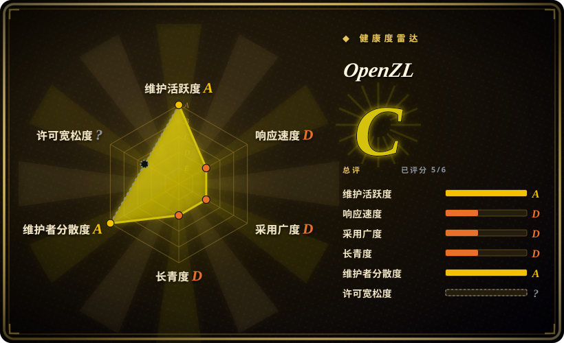
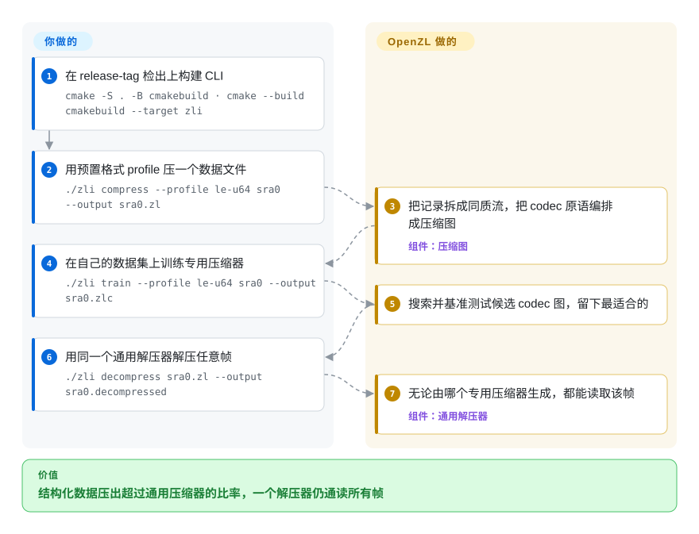

# OpenZL

zstd 把你的列式遥测数据当成不透明字节，单调递增的时间戳列和低基数枚举列就这样被压亏了。OpenZL 是 Meta 的格式感知压缩框架：你描述数据的结构，它用 codec 图对同质流做压缩，而它产出的所有帧仍由同一个通用解压器读取。

## 何时使用

你是数据平台或存储工程师，手里压着 TB 级别的某一种高度结构化负载——固定 schema 的遥测记录、AI 训练管线的列式特征转储、有序整数数组、多字段二进制日志。通用字节流压缩器（zstd、lz4）把整块数据当作不透明序列处理，因此白白浪费了大量压缩比：它永远看不到第 3 列是单调递增的时间戳、第 7 列是低基数枚举。你也试过手搓一条「转置 → delta → zstd」的管线，确实管用，但每个数据集都要单独写一套，维护起来很烦。OpenZL 让你转而去*描述*数据——通过预置 profile、SDDL（Simple Data Description Language）或自定义 parser——它会把原始 codec 组合成一张 DAG，把记录拆成同质流（parse → group → transform & compress），在真正能带来收益的地方施加 delta / 转置 / 字典等步骤。

回报有两层：一是你能在那个特定格式上拿到比通用压缩器更实在的「比率—速度」表现；二是你产出的每一帧，无论由哪张图生成，都能被 OpenZL 唯一的通用解压器读取——下游消费方不必知道用的是哪个专用压缩器。Meta 声称核心已「reached production-readiness」并且「used extensively in production at Meta」，如果你考虑把它放进真实的入库管线而非一次性试验，这点能让人更安心。

## 怎么用起来

OpenZL 站在你的结构化数据和本该直接上手的字节压缩器之间。你先交给它一份格式*描述*——预置 profile、SDDL schema（项目的 Simple Data Description Language，文档现已预告 SDDL2 修订版），或自定义 parser——OpenZL 会把这份描述降解成一张压缩图：由原始 codec（delta、转置、字典、熵编码器，zstd 也是其中一片叶子）组成的 DAG，把每条记录拆成同质流，让同类数据跟同类数据一起压。`zli` CLI 暴露整个闭环：`./zli compress --profile le-u64 yourdata` 用现成 profile 压缩，`./zli train` 在你的真实数据上搜索并基准测试候选图、产出 `.zlc` 压缩器配置——而唯一的通用解压器能读任何一张图产出的帧。仍然归你的：撰写并校验数据描述、钉住 release-tag 构建（只有打 tag 的帧带多年可解压保证），以及原生 C11/C++17 构建本身——它是供你嵌入的库加 CLI，不是服务。

<!-- flow-steps:begin (generated from flows/openzl.json by tools/flow_card.py — do not edit) -->

流程文字版

1. **你**：在 release-tag 检出上构建 CLI — `cmake -S . -B cmakebuild · cmake --build cmakebuild --target zli`
2. **你**：用预置格式 profile 压一个数据文件 — `./zli compress --profile le-u64 sra0 --output sra0.zl`
3. **OpenZL**：把记录拆成同质流，把 codec 原语编排成压缩图 — 组件：`压缩图`
4. **你**：在自己的数据集上训练专用压缩器 — `./zli train --profile le-u64 sra0 --output sra0.zlc`
5. **OpenZL**：搜索并基准测试候选 codec 图，留下最适合的
6. **你**：用同一个通用解压器解压任意帧 — `./zli decompress sra0.zl --output sra0.decompressed`
7. **OpenZL**：无论由哪个专用压缩器生成，都能读取该帧 — 组件：`通用解压器`

**价值**：结构化数据压出超过通用压缩器的比率，一个解压器仍通读所有帧

<!-- flow-steps:end -->

## 何时不用

- **通用 / 非结构化 / 文本块。** OpenZL 的杠杆来自对同质流（数值、列式、表格）的格式感知。对任意文本、源代码、混合 Web 负载或「就压一下这个文件」，zstd、brotli 这类通用压缩器更简单，效果大概率也不差——文档本身就没给出任何通用/文本场景的性能主张。[推断]
- **你现在就需要格式稳定。** 项目说得很直白：「The API, the compressed format, and the set of codecs and graphs included in OpenZL are all subject to (and will!) change.」只有 release-tag 提交才带多年解压保证；`dev` 分支「no guarantees whatsoever」。仍是 pre-1.0。
- **小负载 / 一次性文件。** 「描述数据 + 构建专用压缩器」的工作流有实打实的前期建模成本。面对少量小文件或异构文件，这远不如 `zstd -19` 划算。
- **你想要一个能直接替换 `gzip`/`zstd` 的 CLI。** 这是一个你要去组合的框架 + 库，以及一种你要去采用的格式，而不是 shell 管线里现成压缩器的透明替身。
- **不写 C/C++、不想碰原生构建的团队。** 它是 C11/C++17 代码库，用 CMake/Make 构建；你要背上原生工具链，以及对一个仍在演进的格式的维护负担（在格式稳定前会被锁定在 OpenZL 帧格式上）。
- **Windows 优先的团队。** 构建建议用 clang-cl，MSVC 则「may produce C2099 errors due to limited C11 support」。

## 横向对比

| 替代品 | 是否收录 | 我们的评价 | 取舍 |
|---|---|---|---|
| [CyberChef](cyberchef.zh.md) | ✅ | 分析师需要浏览器里做临时编解码/压缩 recipe 时，选 CyberChef。 | 浏览器里给分析师做临时编解码/压缩 recipe；交互、通用，不是面向生产、为压缩比调优结构化数据的库。 |
| [DevToys](devtoys.zh.md) | ✅ | 需要桌面开发者工具箱和一次性压缩/格式化小工具时，选 DevToys。 | 桌面开发者工具箱，内置压缩/格式化小工具；方便做一次性任务，而非可编程的格式感知压缩器。 |
| zstd | 未收录 | 需要通用压缩基线时，选 zstd。 | 通用基线（同为 Meta/BSD）。在任意字节上「比率—速度」极佳；OpenZL 的目标是在特定结构化格式上靠格式感知*超过*它，代价是你得先描述数据。 |
| Parquet + zstd/snappy | 未收录 | 需要主流列式落盘路径时，选 Parquet 加 zstd/snappy。 | 主流的列式落盘路径：schema 感知编码（字典/RLE）加块级 codec。成熟且无处不在；OpenZL 是更底层的框架，让你构建自定义 codec 图，而非一种自带生态的文件格式。 |
| BLOSC / blosc2 | 未收录 | 需要面向数值数组的分块加 shuffle/bitshuffle 元压缩时，选 BLOSC/blosc2。 | 面向数值数组的分块 + shuffle/bitshuffle 元压缩器；「先变换再压缩」思路相近，范围更窄、比 OpenZL 更成熟。 |
| Brotli | 未收录 | 需要面向文本/Web 内容的强通用压缩时，选 Brotli。 | 强通用压缩器（尤擅文本/Web）；对结构化数值数据没有格式感知。 |

## 技术栈

- **语言：** 按仓库字节数 C++（约 55%）与 C（约 38%）（GitHub languages API，2026-09）；C11 + C++17 代码库。
- **核心模型：** 把 codec 组合成有向无环图（DAG）；唯一的通用解压器「can decompress anything produced by the compressor, independent of the compression DAG」。
- **数据描述：** 已知格式的预置 profile、SDDL（Simple Data Description Language，文档现已预告 SDDL2 修订版）、直接传入的同质流，或自定义 parser。
- **工具：** 核心库加 `zli` CLI（`cli/`，用 `cmake --build cmakebuild --target zli` 构建）、示例 transform/parser、benchmark 与测试套件；Python 绑定以 PyPI 包 `openzl` 发布，`openzl.ext` 模块直接包装 C++ API。
- **构建：** CMake（≥ 3.20.2）或 Make；需要支持 C11 + C++17 的编译器。

## 依赖

- **工具链：** 支持 C11 与 C++17 的编译器（GCC/Clang；Windows 推荐 clang-cl）。走 CMake 路径需 CMake ≥ 3.20.2。
- **内置依赖：** 仓库带有 `deps/` 目录与子模块（`.gitmodules`）；构建拉取自带依赖，而非要求笨重的外部运行时。[推断] 依赖清单未在此逐项核实。
- **运行时：** 无 server/daemon/数据库——它是可嵌入的压缩库 + CLI，不是服务。
- **安装：** 从源码构建（`make`，或 `cmake -S . -B cmakebuild · cmake --build cmakebuild --target zli`）；Python 绑定也已发布到 PyPI（`openzl`，v0.2.0，要求 Python ≥ 3.8，2026-09 查证）。

## 运维难度

**作为库：低到中；作为格式承诺：中。** 运维层面没什么要跑的——没有服务、没有数据库；你链接库或调用 CLI。但这份「低」被两项真实成本抵消：(1) 你得自己背一套原生 C11/C++17 构建（CMake/Make,Windows 上还要折腾 clang-cl）;(2) *格式演进*负担——因为压缩格式在 pre-1.0 阶段仍在变，你必须 pin 到 release-tag 版本，并为长期的重压缩 / 版本错配做预案，尽管 release 产出的帧能「at least the next several years」保持可解压。前期的数据建模工作（写 SDDL / 选图）是每个数据集的设计任务，而不是部署任务。

## 健康度与可持续性

- **响应速度**：Grade D——中位首次响应 968.4 小时（约 40 天），基于 7 个 qualifying issues/PRs（健康度评分器，2026-09-28）。
- **维护（2026-09）：** **`dev` 分支活跃**——最近 13 周每周都有提交，最后 push 在 2026-09-24——但**自 v0.2.0（2026-05-07）后没有新的打 tag 发布**（GitHub releases API）。这个空窗对本项目格外要紧：只有 release-tag 提交带可解压保证，约 5 个月不打 tag 意味着「有保证的表面」增长远慢于代码本身。[推断]
- **治理与 bus factor：** `Organization` 名下，归 **Meta**（`facebook`）所有，与 zstd 同门——厂商背书强、有团队治理（近 12 个月 34 名活跃提交者），bus-factor 风险低。Meta 声称核心「is used extensively in production at Meta」，说明有内部用户在维系它。[未验证]
- **年龄与 Lindy（约 12 个月，2025-09 创建）：** **年轻、Lindy 上未经检验**——太新，不能仅凭耐久性押注。缓和因素不是年龄而是背书方的记录（Meta/zstd 血统）；但 pre-1.0 意味着格式本身仍是移动靶。
- **风险标记：** **格式演进锁定**是首要风险——只有 release-tag 的帧带多年解压保证，`dev` 分支没有任何保证。请 pin 到 tag，并为重压缩/版本错配做预案。原生 C11/C++17 构建；Windows/MSVC 支持弱。[推断]

## 存疑（未验证）

- [未验证] 许可证为 BSD；LICENSE 文件带三条条件（含非背书条款），故 SPDX 取 `BSD-3-Clause`（Meta 标准许可，与 zstd 同族）——frontmatter 反映的是这一推断，而非仓库内声明的 SPDX 标记（`gh` 报告许可为「Other/NOASSERTION」，健康度评分器的许可轴也因此停在 `?`）。
- [未验证] 最新 release v0.2.0，日期 2026-05-07；首个公开 release v0.1.0 在 2025-10-06（与工程博客和白皮书 arXiv:2510.03203 同期）。截至 2026-09 约 3.2k star（API）——star 数不可靠且对时间敏感，仅供参考。
- [未验证] 文档导航预告了「SDDL2」语言修订与「North Star (v.06)」规格；本轮只读了导航、未读正文，SDDL2 的状态（公告还是可用）未经核实。
- [推断]「在结构化数据上压缩比优于通用压缩器」是项目自身的表述；此处未引用任何一方官方的正面对比数字——实际收益高度取决于数据集与你构建的 codec 图。quickstart 自带的例子（用训练后的 profile 把 2,071,976 字节压到 597,635 字节）来自项目样本工件，不是独立实测。
- [推断] PyPI 包 `openzl`（v0.2.0）与 `openzl.ext` 绑定模块已核实发布；Python 接口超出文档 quick-start 示例部分的完整性/稳定性未经实测。
- [推断] 判断它不适合文本/通用数据，是因为文档只演示结构化/数值示例、未给出任何通用数据主张——并非作者明确的「不要使用」声明。
