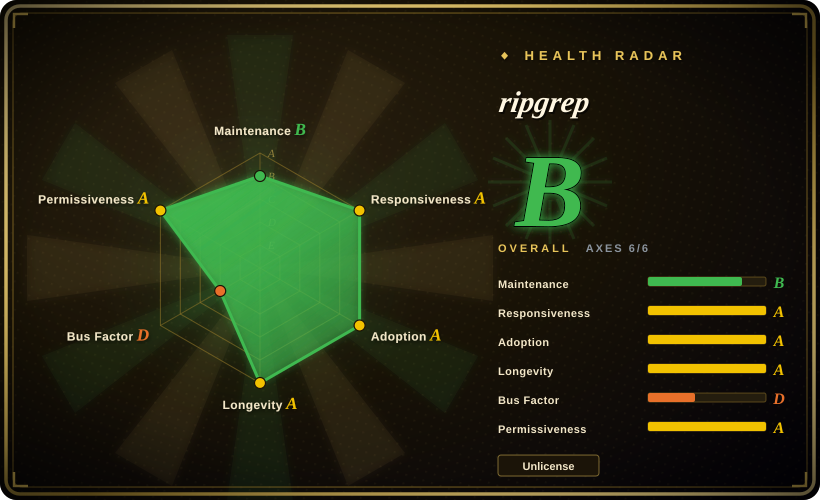
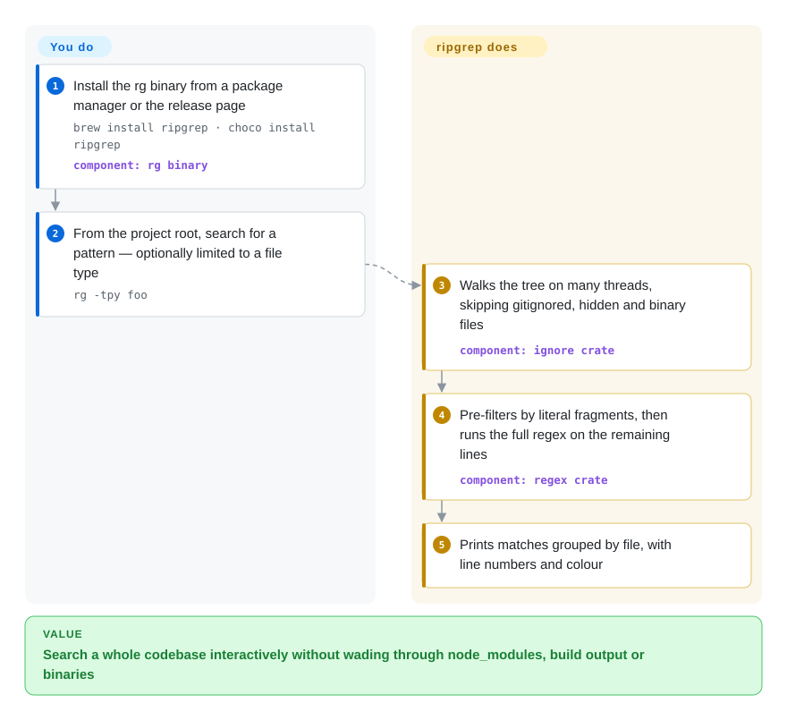

# ripgrep

You run `grep -rn retryBackoff .` in a real project and wait while it crawls through `node_modules`, `target/` and minified bundles, then scroll past hundreds of hits inside generated files and "Binary file matches" lines to find the two that matter. ripgrep (`rg`) searches the same tree but skips whatever your `.gitignore` already says is noise — plus hidden and binary files — and does it fast enough to use on every keystroke of a thought.

## When to use

You are a developer — or a coding agent — who greps a codebase dozens of times a day: where is this function called, which config sets this flag, what still imports the old module. The repository has a 600 MB `node_modules`, a build directory and some vendored code, so plain `grep -r` is slow and its output is mostly matches you never wanted, while `git grep` misses the untracked file you just created. You type `rg retryBackoff` (or `rg -tpy 'def retry'` to search only Python files) and get results grouped by file with line numbers, from the files you would actually edit.

Pick ripgrep over GNU grep for interactive code search because its defaults match how projects are laid out — recursive by default, `.gitignore`/`.ignore`/`.rgignore` respected, hidden and binary files skipped — and it stays fast with Unicode always on. Pick it over The Silver Searcher (ag) because ag has had no commit since 2020; over ack because ripgrep is a single static binary rather than a Perl script; and over `git grep` when you need to search outside a repository or include untracked files.

## How it works

You give `rg` a pattern and, optionally, a path; it does everything else. It walks the directory tree on several threads at once and, before reading a file, checks it against your ignore files and skips hidden files and anything that looks binary (a NUL byte in the content) — so most of the noise is never opened. For each remaining file it runs Rust's regex engine, which compiles your pattern into a finite automaton (a state machine that consumes the text one byte at a time without backtracking) and first scans for literal fragments of the pattern using SIMD instructions — CPU operations that compare many bytes at once — so most lines are rejected before the full regex runs. Matches print grouped by file with line numbers and colour; `--json` gives machine-readable output instead. **What you decide is the pattern and how far to widen the net**: `-t`/`-T` include or exclude file types, `-g` adds globs, and `-u`, `-uu`, `-uuu` progressively turn off ignore-file, hidden-file and binary filtering when the thing you seek lives in the noise. Switch to PCRE2 (`-P`) when you need look-around or backreferences, which the default engine deliberately omits.

<!-- flow-steps:begin (generated from flows/ripgrep.json by tools/flow_card.py — do not edit) -->

Text version of the flow

1. **You**: Install the rg binary from a package manager or the release page — `brew install ripgrep · choco install ripgrep` — component: `rg binary`
2. **You**: From the project root, search for a pattern — optionally limited to a file type — `rg -tpy foo`
3. **ripgrep**: Walks the tree on many threads, skipping gitignored, hidden and binary files — component: `ignore crate`
4. **ripgrep**: Pre-filters by literal fragments, then runs the full regex on the remaining lines — component: `regex crate`
5. **ripgrep**: Prints matches grouped by file, with line numbers and colour

**Value**: Search a whole codebase interactively without wading through node_modules, build output or binaries

<!-- flow-steps:end -->

## When NOT to use

- **The script must run on any POSIX machine untouched.** ripgrep is not preinstalled and follows no standard (its README says so). For portable shell scripts, minimal containers and other people's servers, use `grep` instead of ripgrep.
- **You need to search inside zip, tar or 7z archives, or PDFs and Office documents.** ripgrep's `-z` only decompresses single compressed files (gzip, bzip2, xz, lz4, lzma, brotli, zstd); it does not open archive members, and documents need a `--pre` preprocessor you write yourself. Use ugrep (not indexed), which searches nested archives and documents directly.
- **You do not know the identifier, only the behaviour.** ripgrep matches text; it cannot find "the code that decides when to retry a failed upload" if no literal token is shared. Use [Jevgrep](../../rag-retrieval/code-intelligence/jevgrep.md) (model-ranked results, paid per query) or an embedding-based code index for that, and keep ripgrep for when you have a token.
- **You need to match code *structure* rather than text.** "Every call to `fetch` whose second argument lacks a `timeout`" is fragile as a regex. Use ast-grep (not indexed), which matches syntax-tree patterns.
- **A team searches the same huge multi-repo corpus all day.** ripgrep re-reads the files on every run; it keeps no index (an experimental `unstable-index` feature exists in the source tree but is not in releases). For a shared, always-on search across hundreds of repositories, use an indexed engine such as Zoekt (not indexed) instead.
- **You are inside one Git repo and want only tracked content at a specific commit.** `git grep` searches tracked files, or any past revision (`git grep foo v1.2`), with no extra install; ripgrep only sees the files on disk.

## Comparison

| Alternative | In index | Our verdict | Tradeoff |
| --- | --- | --- | --- |
| GNU grep | not indexed | Use grep in portable scripts and on machines you do not control; use ripgrep at your own keyboard on codebases, where ignore-aware defaults and speed matter more than ubiquity. | grep is guaranteed and POSIX-specified but recursive search needs flags and wades through ignored and binary files; ripgrep is faster and quieter by default but must be installed. |
| git grep | not indexed | Inside a repository, reach for `git grep` when you need tracked files only or a historical revision; use ripgrep when untracked files, non-repo directories or file-type filters matter. | git grep needs no install and can search any commit; it ignores untracked files and only works inside Git. |
| ugrep | not indexed | Choose ugrep when you need to search archives, PDFs or Office files, fuzzy matches, or an interactive TUI; stay with ripgrep for plain source-tree search, where its defaults are the de facto standard. | ugrep packs far more features (archives, fuzzy search, `-Q` TUI, optional indexer) behind a grep-compatible interface; ripgrep has the narrower scope and the much larger user base. |
| The Silver Searcher (ag) | not indexed | Do not start new work on ag — no commit since 2020-12; migrate existing aliases to ripgrep, which covers the same ignore-aware use case and is still maintained. | ag was the original "fast, gitignore-aware grep"; it now carries unfixed bugs and no future releases. |
| [Jevgrep](../../rag-retrieval/code-intelligence/jevgrep.md) | ✅ | When the question is a described behaviour with no known token, try Jevgrep; when you know the token, ripgrep answers instantly, offline and free. | Jevgrep returns a model-ranked subset with excerpts but spends paid tokens and sends code to a hosted model; ripgrep returns every literal match with no ranking. |

## Tech stack

- **Rust** (edition 2024; builds with Rust 1.96+), organized as a workspace of reusable crates: `ignore` (parallel directory walker with gitignore rules), `globset`, `grep-searcher`, `grep-printer`, `grep-regex`, `grep-pcre2`.
- **Regex:** the `regex` crate (finite automata, SIMD literal search, Unicode always on); optional PCRE2 via `-P` / `--engine auto`.
- **I/O:** chooses between memory maps (better for single files) and incremental buffered reads (better for large directories) automatically.
- **Output:** human-readable or `--json` (consumed by tools such as `delta`).

## Dependencies

- **Runtime:** none. Release archives contain one executable (`rg`); Linux and Windows builds are static, and the official release builds link PCRE2 in statically, so `-P` works without a system library.
- **Platforms:** Windows, macOS and Linux on x86_64 and aarch64 (Windows aarch64 since 15.0, `aarch64-unknown-linux-musl` since 15.2); `powerpc64` artifacts were dropped in 15.0.
- **Building from source:** a stable Rust toolchain; `--features pcre2` additionally needs a C compiler (or a system PCRE2 via `pkg-config`).

## Ops difficulty

**Negligible.** Install from a package manager (`brew install ripgrep`, `choco install ripgrep`, distro packages) or drop the release binary on `PATH`. Behaviour can be tuned through a config file pointed to by `RIPGREP_CONFIG_PATH`, which is worth standardizing in a team's dotfiles; the only operational surprise to plan for is that distro packages may lag a release or be built without PCRE2.

## Health & viability

- **Maintenance (2026-10-08):** steady rather than busy — 15.0.0 (2025-10), 15.1.0 (2025-10) and 15.2.0 (2026-07-15), each mostly bug fixes and traversal performance; last default-branch commit 2026-08-04, 65 days before this check, with 4 active weeks in the last 13 (radar: B). For a finished-feeling CLI that is a mature cadence, not decline.
- **Governance / bus factor:** effectively single-maintainer — Andrew Gallant (BurntSushi) authored the vast majority of commits; top-3 contributors hold 94.6% of last-year commits across 6 active maintainers (radar: D). He also maintains the `regex` crate ripgrep is built on, which concentrates risk but also expertise.
- **Age & Lindy:** created 2016-03, about 10.5 years old and still releasing — strong Lindy signal for a CLI.
- **Adoption:** ~68.9k stars; 1,596,244 crates.io downloads in the last month, ~208k Homebrew installs in 90 days and ~59M release-asset downloads (scorer snapshot 2026-10-08). VS Code ships it as its text-search backend (`@vscode/ripgrep-universal` in VS Code's `package.json`), and coding agents commonly shell out to `rg` for code search.
- **Risk flags:** dual-licensed Unlicense OR MIT, no relicense history, no commercial tier. The main risk is the bus factor, softened by the fact that the binary is self-contained and grep remains a drop-in fallback.

## Caveats (unverified)

- [未验证] Speed claims relative to grep, ag and ugrep come from the author's benchmarks and ugrep's own benchmark repo; results depend on query, filesystem and cache state.
- [推断] "Coding agents commonly shell out to `rg`" is based on agent tools and index pages that recommend or bundle it, not on a usage survey.
- [未验证] Whether a given distro package is built with PCRE2 varies by distribution; only the official release workflow (`--features pcre2`, static PCRE2) was checked.
- [推断] The `unstable-index` feature is marked in `Cargo.toml` as "in active development and may have very serious bugs"; whether it will ship in a release, and when, is unknown.
