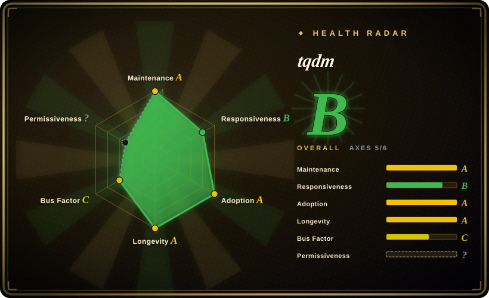
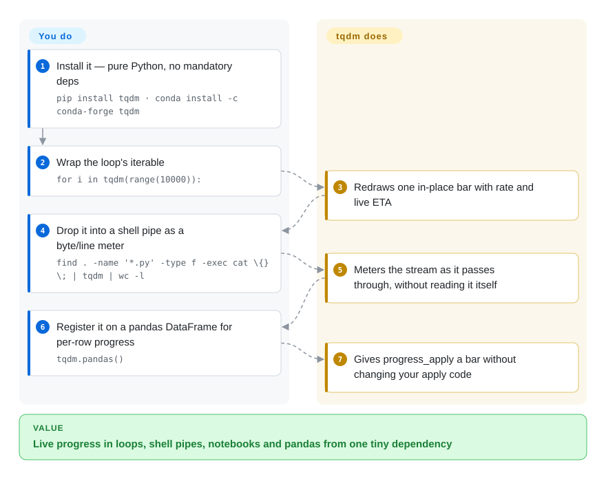

# tqdm

A long-running loop gives you nothing to look at — either silence or a terminal flooded by `print(i)`. tqdm wraps any iterable (`for x in tqdm(it):`) and keeps one line updating in place with percentage, iteration rate and ETA across terminals, Unix pipes and Jupyter, with no mandatory dependencies.

## When to use

You're a data engineer running an overnight batch — a loop over a few million records that calls an external API, cleans each row, and writes it out. The script works, but when you kick it off you have no idea whether it'll finish in ten minutes or six hours, and `print(i)` every thousand iterations floods your terminal with noise. You wrap the loop's iterable in `tqdm(...)` — one import, one function call, no refactor — and now you have a single line that updates in place: `47%|████▋ | 1.4M/3.0M [02:11<02:29, 10.8kit/s]`, with a live ETA and throughput. You can see at a glance whether it's stuck, slowing down, or on track, and the bar costs essentially nothing per iteration (the docs claim ~60ns overhead).

You also reach for it when you want the same progress feedback everywhere without rewriting code: it auto-detects Jupyter/IPython (`tqdm.notebook`), works as a Unix pipe meter — drop `tqdm` between pipes, e.g. the README's own `find . -name '*.py' -type f -exec cat \{} \; | tqdm | wc -l` — integrates with pandas (`df.progress_apply(...)` via `tqdm.pandas()`), and has thin wrappers for async, `concurrent.futures`, and logging. Because it's pure-Python with no required third-party dependencies, dropping it into any project — a Lambda, a constrained container, a notebook — is a one-line `pip install` with no dependency tree to vet.

## How it works

tqdm is a loop wrapper, not a UI framework: `tqdm(iterable)` hands back the same iterable but counts what passes through it, redrawing a single terminal line in place (carriage-return plus ANSI escapes) with the percentage, iterations/sec, and an ETA extrapolated from that rate — the README measures the cost at about 60ns per iteration, and the core needs nothing but the Python standard library. The same object reaches beyond `for` loops: `with tqdm(total=...)` plus `pbar.update(n)` for manual control, a `tqdm` command inserted between pipe segments, `tqdm.pandas()` which registers a `progress_apply` method on DataFrames, and `tqdm.notebook`/`tqdm.autonotebook` variants that render into Jupyter output instead of a terminal line. What stays yours: how it behaves when nobody is watching — bars in CI logs or redirected files need `disable=`, `file=`, or `miniters` tuning — and aggregate progress across multiprocessing or async workers, where the adapters exist but must be wired explicitly.

<!-- flow-steps:begin (generated from flows/tqdm.json by tools/flow_card.py — do not edit) -->

Text version of the flow

1. **You**: Install it — pure Python, no mandatory deps — `pip install tqdm · conda install -c conda-forge tqdm`
2. **You**: Wrap the loop's iterable — `for i in tqdm(range(10000)):`
3. **tqdm**: Redraws one in-place bar with rate and live ETA
4. **You**: Drop it into a shell pipe as a byte/line meter — `find . -name '*.py' -type f -exec cat \{} \; | tqdm | wc -l`
5. **tqdm**: Meters the stream as it passes through, without reading it itself
6. **You**: Register it on a pandas DataFrame for per-row progress — `tqdm.pandas()`
7. **tqdm**: Gives progress_apply a bar without changing your apply code

**Value**: Live progress in loops, shell pipes, notebooks and pandas from one tiny dependency

<!-- flow-steps:end -->

## When NOT to use

- **Ultra-tight, hot inner loops.** The per-iteration cost is tiny but not zero; in a loop doing nanosecond-scale work over billions of iterations, even ~60ns each adds up. Update less often (`miniters`/`mininterval`) or wrap an outer loop instead of the innermost one.
- **You need structured logging or telemetry, not a human-facing bar.** tqdm is a TTY/notebook UX widget; it is not a metrics pipeline. For machine-readable progress, durations, or dashboards, emit structured logs/metrics (and route them to something like [Telegraf](../ops-infra/telegraf.md)) — don't scrape a progress bar.
- **You want a rich, multi-panel terminal UI.** tqdm is intentionally minimal. For spinners, multiple concurrent animated bars, tables, and styled output, `rich.progress` and `alive-progress` give fancier UIs — at the cost of a heavier dependency.
- **Concurrent / async progress that must be exact.** Multiprocessing, async, and multi-bar setups work but are fiddly: position management, lock sharing across processes, and refresh ordering are common foot-guns. Single-loop progress is trivial; many-worker aggregate progress takes care.
- **Non-interactive logs (CI, files, journald).** Carriage-return redraws turn into thousands of junk lines in a log file. You can configure it (`file=`, `disable=not sys.stderr.isatty()`), but plain percentage logging is often simpler there.

## Comparison

| Alternative | In index | Our verdict | Tradeoff |
|---|---|---|---|
| rich.progress | 未收录 | Choose rich.progress when you already use `rich` or need polished multi-column progress UI. | Part of the `rich` library — far fancier (colors, columns, multiple bars, spinners, tables) and great for polished CLIs; heavier dependency and more API surface than tqdm's one-call wrap. |
| alive-progress | 未收录 | Choose alive-progress when you need animated, visually richer single-bar UX with live spinners. | Animated, visually richer single-bar UX with live spinners; smaller ecosystem and integration set than tqdm (no pandas/notebook/pipe story of the same breadth). |
| progressbar2 | 未收录 | Choose progressbar2 when you need an older, configurable widget-style progress-bar library. | Older, configurable progress-bar library; widget-based API is more verbose than `tqdm(iterable)`, smaller modern adoption. |
| plain logging / `print` | 未收录 | Choose plain logging or print when you need zero dependency and machine-parseable output. | Zero dependency and trivially machine-parseable; no ETA/rate/in-place redraw, and noisy for interactive use — the right call for files/CI, the wrong one for a human watching a TTY. |
| [Telegraf](../ops-infra/telegraf.md) | ✅ | Choose Telegraf when you need a metrics collection/routing agent instead of a human-facing progress bar. | A metrics collection/routing agent, not a progress bar — different job; use it when you need real telemetry rather than a human-facing meter. |

## Tech stack

- **Language:** Pure Python (no compiled extensions), currently supporting Python ≥ 3.8 (PyPI `requires-python`, 2026-09).
- **Output backends:** TTY/ANSI carriage-return redraw on the terminal; a separate `tqdm.notebook` (ipywidgets-based) renderer for Jupyter/IPython; a CLI entry point (`python -m tqdm`) for use as a Unix pipe meter.
- **Integrations:** pandas (`tqdm.pandas()` → `progress_apply`), `concurrent.futures` (`tqdm.contrib.concurrent`), asyncio (`tqdm.asyncio`), `logging` redirection, and `tqdm.contrib` helpers (`tenumerate`, `tzip`, `tmap`).

## Dependencies

- **Runtime:** none required — pure-Python standard-library only for the core bar; `pip install tqdm` pulls no mandatory third-party packages.
- **Optional:** the current PyPI distribution (2026-09) ships extras `notebook`, `slack`, `telegram`, `discord` — i.e. `ipywidgets` for the notebook renderer and the SDKs behind the `tqdm.contrib` notifiers; `pandas` only matters if you use the pandas integration.
- **Install paths:** PyPI (`pip`), conda-forge, and it ships in many distro repos; vendored copies are common because it's so small.

## Ops difficulty

**Very low.** There is nothing to deploy or operate — it's a library you import. The only real friction is interactive-output behavior: getting bars to render cleanly under nested loops, multiprocessing, or non-TTY environments (CI, redirected files, certain notebook configs) sometimes takes tuning (`position`, `leave`, `file`, `disable`, `dynamic_ncols`). For 95% of uses it's `from tqdm import tqdm; for x in tqdm(it):` and done.

## Health & viability

- **Responsiveness**: Grade B — median first-response time 105.6 hours (~4.4 days) across 6 qualifying issues/PRs (health scorer, 2026-09-28).
- **Maintenance (2026-09).** v4.70.1 released 2026-09-11; last `master` commit 2026-09-11, last push 2026-09-20 (GitHub API) — **active**, not abandoned. The cadence is mature and bursty (commits in 7 of the last 13 weeks; the API has long been stable), which is appropriate for a library this widely depended-on. [推断]
- **Governance / bus factor.** Owned by the `tqdm` **organization** (not a personal account) with a broad contributor base over its lifetime; historically associated with a primary maintainer (Casper da Costa-Luis) — the radar's C grade reflects real concentration (top contributor ≈72% of 12-month commits), partly offset by org ownership and 21 active committers. [推断]
- **Age & Lindy verdict.** Created 2015-06, ~11 years old and **still actively shipping** ⇒ a **strong Lindy** signal — a stable, ubiquitous primitive, not a hyped newcomer; the wrap-an-iterable API has been backward-compatible for years. [推断]
- **Adoption & ecosystem.** Machine-checked at the scale of its reputation: ~31.3k GitHub stars (API, 2026-09-28), ~401M PyPI downloads/month and ~136k dependent repos (health scorer, 2026-09-28) — one of the largest transitive-dependency footprints in Python data/ML; docs are thorough and the integration surface (pandas/notebook/CLI/async) is broad.
- **License / risk flags.** Mixed MIT + MPL-2.0: MIT (original and other contributions) plus MPL-2.0 (maintainer's contributions) — GitHub reports NOASSERTION because of the mixed file-level licensing. MPL-2.0 carries file-level copyleft obligations — normal dependency use is low-risk, but modifying/redistributing MPL-covered files has obligations. No relicense history or open-core gating found. [推断]

## Caveats (unverified)

- [未验证] "60ns overhead" is the project's own benchmark framing — treat as indicative; star/issue/download counts quoted here were API/scorer-checked on 2026-09-28 but are date-sensitive.
- [未验证] The exact set of supported Python versions changes over releases — the ≥ 3.8 floor was read from PyPI metadata on 2026-09-28; check current classifiers rather than assuming.
- [推断] License is the mixed MPL-2.0 + MIT model described in the repo's LICENCE file; this is summarized as `MPL-2.0 AND MIT` and reported as NOASSERTION by GitHub — confirm against the file if license terms are load-bearing for you.
- [推断] Which optional extra maps to which integration (notebook→ipywidgets, slack/telegram/discord notifier SDKs) is read from PyPI extras metadata (2026-09); the individual notifiers were not exercised.
- [推断] "Strong Lindy" and "active" are judgments from age × recent push/release, not a guarantee of future maintenance.
