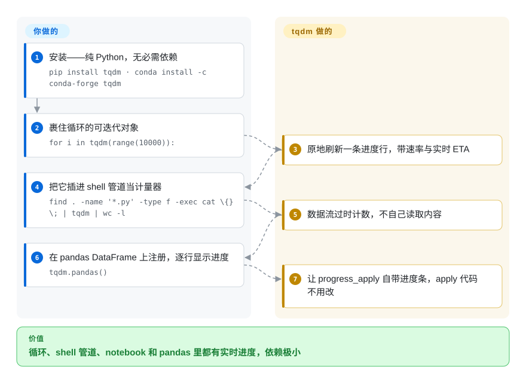

# tqdm

长循环跑起来毫无反馈——要么一片安静，要么被 `print(i)` 刷屏。tqdm 把任意可迭代对象一裹（`for x in tqdm(it):`），就得到原地刷新的一行进度：百分比、迭代速率和 ETA，覆盖终端、Unix 管道与 Jupyter，且没有强制依赖。

## 何时使用

你是数据工程师，在跑一个通宵批处理——循环遍历几百万条记录，每条都调一次外部 API、清洗一行、再写出去。脚本能跑，但你一启动就完全不知道它是十分钟跑完还是六小时，而每千条 `print(i)` 一次又会把终端刷成一堆噪声。你把循环的可迭代对象用 `tqdm(...)` 一裹——一个 import、一次函数调用、不用重构——立刻就有了一行原地更新的进度：`47%|████▋ | 1.4M/3.0M [02:11<02:29, 10.8kit/s]`，带实时 ETA 和吞吐。你一眼就能看出它是卡住了、在变慢，还是按计划推进，而每次迭代这条进度条几乎不花成本（文档称约 60ns 开销）。

当你想在各处都得到同样的进度反馈又不想改代码时，你也会选它：它会自动识别 Jupyter/IPython（`tqdm.notebook`）、能当 Unix 管道计量器——把 `tqdm` 插进管道即可，README 自带的例子是 `find . -name '*.py' -type f -exec cat \{} \; | tqdm | wc -l`——能和 pandas 集成（`tqdm.pandas()` 后用 `df.progress_apply(...)`），还为 async、`concurrent.futures` 和 logging 提供了薄封装。因为它是纯 Python、没有任何必需的第三方依赖，把它塞进任何项目——Lambda、受限容器、notebook——都是一行 `pip install`，没有依赖树要审。

## 怎么用起来

tqdm 是循环的包装器，不是 UI 框架：`tqdm(iterable)` 返回的还是同一个可迭代对象，但它数着流过的一切，用回车加 ANSI 转义在终端原地重画一行——百分比、每秒迭代数，以及由速率外推的 ETA。README 实测每次迭代开销约 60ns，核心只用 Python 标准库。同一个对象也延伸到 `for` 循环之外：`with tqdm(total=...)` 加 `pbar.update(n)` 做手动控制；把 `tqdm` 命令插进管道段之间；`tqdm.pandas()` 给 DataFrame 注册 `progress_apply` 方法；`tqdm.notebook`/`tqdm.autonotebook` 变体则渲染进 Jupyter 输出而非终端行。仍然归你的：没人在看时它怎么表现——CI 日志或重定向文件里的进度条要调 `disable=`、`file=`、`miniters`；以及跨多进程/异步 worker 的聚合进度，那里适配器虽在，却要显式接线。

<!-- flow-steps:begin (generated from flows/tqdm.json by tools/flow_card.py — do not edit) -->

流程文字版

1. **你**：安装——纯 Python，无必需依赖 — `pip install tqdm · conda install -c conda-forge tqdm`
2. **你**：裹住循环的可迭代对象 — `for i in tqdm(range(10000)):`
3. **tqdm**：原地刷新一条进度行，带速率与实时 ETA
4. **你**：把它插进 shell 管道当计量器 — `find . -name '*.py' -type f -exec cat \{} \; | tqdm | wc -l`
5. **tqdm**：数据流过时计数，不自己读取内容
6. **你**：在 pandas DataFrame 上注册，逐行显示进度 — `tqdm.pandas()`
7. **tqdm**：让 progress_apply 自带进度条，apply 代码不用改

**价值**：循环、shell 管道、notebook 和 pandas 里都有实时进度，依赖极小

<!-- flow-steps:end -->

## 何时不用

- **超紧的热点内层循环。** 单次迭代成本很小但不为零；在一个每次只做纳秒级工作、却要跑上十亿次的循环里，哪怕约 60ns 也会累积。改成不那么频繁地更新（`miniters`/`mininterval`），或者裹外层循环而非最内层。
- **你要的是结构化日志或遥测，而非给人看的进度条。** tqdm 是 TTY/notebook 的 UX 控件，不是指标管线。要机器可读的进度、耗时或看板，应当输出结构化日志/指标（再路由到类似 [Telegraf](../ops-infra/telegraf.zh.md) 的东西），别去爬一条进度条。
- **你想要丰富的多面板终端 UI。** tqdm 刻意做得极简。要 spinner、多条并发动画进度条、表格和带样式的输出，`rich.progress` 和 `alive-progress` 提供更花哨的 UI——代价是更重的依赖。
- **必须精确的并发 / 异步进度。** 多进程、异步和多条进度条的场景能用，但很折腾：position 管理、跨进程的锁共享、刷新顺序都是常见的坑。单循环进度很简单，多 worker 的聚合进度则要花心思。
- **非交互式日志（CI、文件、journald）。** 回车回刷会在日志文件里变成成千上万行垃圾。你可以配置它（`file=`、`disable=not sys.stderr.isatty()`），但在那种场景里，朴素的百分比日志往往更简单。

## 横向对比

| 替代品 | 是否收录 | 我们的评价 | 取舍 |
|---|---|---|---|
| rich.progress | 未收录 | 已经使用 `rich` 或需要精致多列进度 UI 时，选 rich.progress。 | `rich` 库的一部分——花哨得多（颜色、列、多条进度条、spinner、表格），很适合做精致 CLI；依赖更重、API 面也比 tqdm 的一行裹更大。 |
| alive-progress | 未收录 | 需要单条进度条更有动画、视觉更丰富并带实时 spinner 时，选 alive-progress。 | 单条进度条做得更有动画、视觉更丰富，带实时 spinner；生态和集成集比 tqdm 小（没有同等广度的 pandas/notebook/管道支持）。 |
| progressbar2 | 未收录 | 需要更老牌、可配置的 widget 式进度条库时，选 progressbar2。 | 更老牌、可配置的进度条库；基于 widget 的 API 比 `tqdm(iterable)` 啰嗦，现代采用度更小。 |
| 朴素 logging / `print` | 未收录 | 需要零依赖且机器可解析的输出时，选朴素 logging 或 print。 | 零依赖且天然机器可解析；没有 ETA/速率/原地回刷，交互式用又很吵——文件/CI 场景该选它，给人盯着看的 TTY 场景不该选。 |
| [Telegraf](../ops-infra/telegraf.zh.md) | ✅ | 需要指标采集/路由 agent，而不是给人看的进度条时，选 Telegraf。 | 一个指标采集/路由 agent，不是进度条——完全不同的活；当你需要真正的遥测而非给人看的计量器时才用它。 |

## 技术栈

- **语言：** 纯 Python（无编译扩展），当前支持 Python ≥ 3.8（PyPI `requires-python`，2026-09）。
- **输出后端：** 终端上基于 TTY/ANSI 回车回刷；为 Jupyter/IPython 提供单独的 `tqdm.notebook`（基于 ipywidgets）渲染器；还有一个 CLI 入口（`python -m tqdm`）可当 Unix 管道计量器用。
- **集成：** pandas（`tqdm.pandas()` → `progress_apply`）、`concurrent.futures`（`tqdm.contrib.concurrent`）、asyncio（`tqdm.asyncio`）、`logging` 重定向，以及 `tqdm.contrib` 辅助函数（`tenumerate`、`tzip`、`tmap`）。

## 依赖

- **运行时：** 无必需依赖——核心进度条只用纯 Python 标准库；`pip install tqdm` 不会拉任何强制的第三方包。
- **可选：** 当前 PyPI 发行版（2026-09）带 `notebook`、`slack`、`telegram`、`discord` 四个 extra——即 notebook 渲染器的 `ipywidgets` 与 `tqdm.contrib` 通知器背后的各 SDK；pandas 集成只在你要用时才需要 `pandas`。
- **安装路径：** PyPI（`pip`）、conda-forge，也进了不少发行版仓库；因为体积极小，被 vendored 进项目里的情况很常见。

## 运维难度

**极低。** 没有任何东西要部署或运维——它就是个 import 进来的库。唯一真正的摩擦是交互式输出行为：要让进度条在嵌套循环、多进程或非 TTY 环境（CI、重定向文件、某些 notebook 配置）下干净渲染，有时需要调参（`position`、`leave`、`file`、`disable`、`dynamic_ncols`）。95% 的用法就是 `from tqdm import tqdm; for x in tqdm(it):`，到此为止。

## 健康度与可持续性

- **响应速度**：Grade B——中位首次响应 105.6 小时（约 4.4 天），基于 6 个 qualifying issues/PRs（健康度评分器，2026-09-28）。
- **维护（2026-09）。** v4.70.1 于 2026-09-11 发布；`master` 最后提交 2026-09-11，仓库最后 push 2026-09-20（GitHub API）——处于**活跃**而非废弃。节奏成熟且一阵一阵（近 13 周中 7 周有提交；API 早已稳定），对一个被如此广泛依赖的库来说这是合适的。[推断]
- **治理 / bus factor。** 由 `tqdm` **组织**（而非个人账号）拥有，生命周期里有广泛的贡献者基础；历史上与一位主维护者（Casper da Costa-Luis）关联——雷达给 C 反映的是真实的集中度（头部贡献者约占近 12 个月提交的 72%），但组织所有权与 21 名活跃提交者在一定程度上抵消了它。[推断]
- **年龄与 Lindy 判断。** 2015-06 创建，约 11 年且**仍在活跃发布**⇒ **强 Lindy** 信号——一个稳定、无处不在的基础件，而非被炒作的新秀；裹可迭代对象的 API 多年保持向后兼容。[推断]
- **采用度与生态。** 机器核验与其名气相称：约 31.3k GitHub star（API，2026-09-28）、月下载约 4.01 亿、依赖仓库约 13.6 万（健康度评分器，2026-09-28）——Python 数据/ML 生态最大的传递依赖足迹之一；文档详尽，集成面（pandas/notebook/CLI/async）很宽。
- **许可 / 风险标记。** 混合 MIT + MPL-2.0：MIT（原始及其他贡献）加 MPL-2.0（维护者的贡献）——因文件级混合许可，GitHub 报为 NOASSERTION。MPL-2.0 带有文件级 copyleft 义务——作为普通依赖正常使用风险较低，但修改/再分发受 MPL 覆盖的文件则有义务。未发现 relicense 历史或 open-core 收口。[推断]

## 存疑（未验证）

- [未验证] 「60ns 开销」是项目自己的基准表述——仅供参考；本页引用的 star/issue/下载数在 2026-09-28 经 API/评分器核查过，但都对时间敏感。
- [未验证] 支持的 Python 版本集合随发布变化——≥3.8 的下限取自 2026-09-28 的 PyPI 元数据，请查当前 classifiers，别凭假设。
- [推断] 许可是仓库 LICENCE 文件中描述的 MPL-2.0 + MIT 混合模型；这里概括为 `MPL-2.0 AND MIT`，GitHub 报为 NOASSERTION——若许可条款对你是承重项，请对照该文件确认。
- [推断] 各可选 extra 与集成的对应关系（notebook→ipywidgets、slack/telegram/discord 通知器 SDK）取自 PyPI extras 元数据（2026-09），个别通知器未实测。
- [推断] 「强 Lindy」和「活跃」是从年龄 × 近期 push/发布得出的判断，并非对未来维护的保证。
