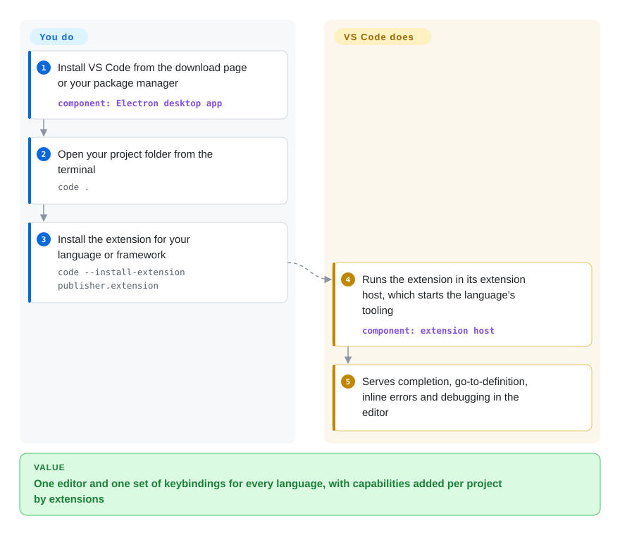

# VS Code

You write TypeScript in the morning, fix a Python script after lunch and edit Terraform and Markdown in between, and every switch means another editor with different shortcuts — or a heavyweight IDE that only really knows one language. VS Code is one free editor whose language smarts (completion, go-to-definition, debugging) come from installable extensions, so the same window and keybindings cover whatever the next file is written in.

## When to use

You are a developer on a team whose repositories mix three or four languages plus YAML, SQL and Dockerfiles, on a mix of macOS, Windows and Linux laptops. A single-language IDE fits one repo and fights the rest; a bare text editor gives you no "go to definition" when you land in an unfamiliar service at 2 a.m. You open the folder with `code .`, accept the Python extension VS Code recommends when you open the first `.py` file, and get completion, inline errors and a debugger for that language — and when the code lives on a remote box or in a container, a remote extension lets the same window edit and debug there.

Choose VS Code over [Zed](zed.md) when the extension ecosystem decides it: almost every language, framework, linter and cloud vendor ships a VS Code extension first. Choose it over IntelliJ IDEA when breadth across languages and zero licence cost matter more than the deepest refactoring for one language. The tradeoff you accept is an Electron app's memory footprint and a Microsoft-branded build with telemetry and a proprietary marketplace on top of MIT-licensed source.

## How it works

The repository is "Code - OSS": MIT-licensed source that Microsoft builds into the product called Visual Studio Code, adding its branding, telemetry, the Visual Studio Marketplace and a proprietary product licence. The app is an Electron shell (Chromium plus Node.js) around the Monaco editor component; out of the box it edits text, searches (using ripgrep), handles Git and runs a terminal. **Language intelligence is not built into the core — extensions supply it.** Extensions run in an *extension host* — a Node.js process kept apart from the editor UI, so a misbehaving extension does not freeze typing; a language extension usually launches that language's *language server* — a background program that understands the code and answers "what is this symbol, where is it defined" over a standard protocol (LSP). With the remote extensions, the window stays on your laptop while a VS Code Server and your extensions run on the SSH host, container or WSL distro where the code lives. You choose the extensions and settings; VS Code installs and updates them, wires them into the editor, and keeps itself updated.

<!-- flow-steps:begin (generated from flows/vscode.json by tools/flow_card.py — do not edit) -->

Text version of the flow

1. **You**: Install VS Code from the download page or your package manager — component: `Electron desktop app`
2. **You**: Open your project folder from the terminal — `code .`
3. **You**: Install the extension for your language or framework — `code --install-extension publisher.extension`
4. **VS Code**: Runs the extension in its extension host, which starts the language's tooling — component: `extension host`
5. **VS Code**: Serves completion, go-to-definition, inline errors and debugging in the editor

**Value**: One editor and one set of keybindings for every language, with capabilities added per project by extensions

<!-- flow-steps:end -->

## When NOT to use

- **You want an editor with no Microsoft telemetry, branding or proprietary licence.** The official binary is distributed under the Microsoft product licence with telemetry on by default. Use VSCodium (not indexed) — community builds of the same MIT source with telemetry disabled — instead of VS Code, and accept that it uses Open VSX instead of the Microsoft marketplace.
- **…but you depend on Microsoft's proprietary extensions.** The Visual Studio Marketplace terms allow its offerings only in Microsoft products, and the Remote Development extensions and the C#/C++ debuggers only work on the official build. If you need those, stay on VS Code rather than VSCodium; if you need freedom from them, plan replacements (Open VSX alternatives, open debuggers) before switching.
- **You only ever work in a terminal over SSH.** VS Code is a GUI; its remote mode still needs a desktop client (or a browser via `code tunnel`). Use Neovim (not indexed) or Helix (not indexed) for terminal-only editing on servers.
- **Startup time and RAM are your constraint.** Electron costs more memory and launch time than native editors. On low-RAM machines or when you open files hundreds of times a day, use [Zed](zed.md) (native, GPU-rendered) or Sublime Text (not a repo, paid licence) instead.
- **Your work is heavy JVM, Android or large-scale refactoring in one language.** VS Code's Java/Kotlin support comes through extensions and is shallower than a dedicated IDE. Use IntelliJ IDEA (not indexed; Community edition source on GitHub) or Android Studio for that.
- **You want to host a browser IDE for your team.** The VS Code Server licence says a server instance is meant for a single user and that "hosting it as a service is not allowed". Use code-server (not indexed, MIT) or Eclipse Theia (not indexed) to run a VS Code-like editor as a shared service on your own infrastructure.

## Comparison

| Alternative | In index | Our verdict | Tradeoff |
| --- | --- | --- | --- |
| [Zed](zed.md) | ✅ | Pick Zed when editor latency, low memory and built-in real-time collaboration are what you feel daily; pick VS Code when you need an extension for a niche language, framework or cloud service that only exists for VS Code. | Zed is native Rust and noticeably lighter; its extension ecosystem is a fraction of VS Code's, so niche tooling may simply be missing. |
| VSCodium | not indexed | Choose VSCodium when telemetry and the Microsoft product licence are disqualifying; stay on VS Code when you rely on Remote Development, Pylance-class or C#/C++ debugger extensions that only run on the official build. | Same editor, MIT-licensed binaries, Open VSX gallery; you lose access to Microsoft-only extensions and the Visual Studio Marketplace. |
| code-server | not indexed | Run code-server when you want VS Code in the browser on infrastructure you control (shared dev boxes, Chromebooks, locked-down laptops); use desktop VS Code with Remote-SSH when every developer has a capable machine. | code-server is self-hosted and MIT, with Open VSX extensions; the official build gets Microsoft's marketplace and remote extensions, but its server licence is single-user and forbids hosting it as a service. |
| Neovim | not indexed | Choose Neovim when you live in the terminal and over SSH and are willing to configure your editor; choose VS Code when a GUI with working defaults and one-click extensions matters more than modal editing. | Neovim is lightweight, keyboard-driven and runs anywhere a terminal does; it needs configuration (Lua, LSP setup) that VS Code hands you ready-made. |
| IntelliJ IDEA | not indexed | Pick IntelliJ IDEA for large Java/Kotlin codebases where deep refactoring, build-tool integration and inspections pay for themselves; pick VS Code for polyglot repos and lighter machines. | IntelliJ understands JVM code more deeply out of the box; it is heavier, JVM-centric, and its Ultimate edition is paid. |

## Tech stack

- **TypeScript** throughout the editor core and built-in extensions.
- **Electron** (Chromium + Node.js) as the desktop shell; the **Monaco** editor component (also published standalone) for text editing.
- **Extension host:** Node.js processes (local or remote) or a web worker (browser), isolating extensions from the UI.
- **Language Server Protocol** and **Debug Adapter Protocol** as the contracts most language and debugger extensions implement.
- **Bundled tools:** ripgrep for text search (`@vscode/ripgrep-universal`); GitHub Copilot Chat source now lives in this repository (`extensions/copilot`) after `microsoft/vscode-copilot-chat` was archived and merged in.

## Dependencies

- **Desktop OS:** a supported 64-bit Windows client; macOS releases that still receive Apple security updates; Linux with glibc ≥ 2.28 (e.g. Ubuntu 20.04, Debian 10, RHEL 8, Fedora 36). Windows Server is not supported.
- **Hardware:** the documented minimum is a 1.6 GHz CPU and 1 GB RAM; real usage grows with extensions and workspace size.
- **For remote work:** SSH access, Docker (Dev Containers) or WSL on the target; VS Code downloads its server component there.
- **Language support:** each language's own toolchain (Python interpreter, JDK, Go toolchain …) plus the extension that drives it.

## Ops difficulty

**Low for individuals, medium for a fleet.** A single user installs it and lets the built-in updater run. An organization has real work: VS Code now ships a new minor version roughly every week, so extension compatibility and update channels need a policy; telemetry level (`telemetry.telemetryLevel`), allowed extensions and marketplace access need to be set centrally; and proprietary extensions bring their own licence terms. Hosting a shared web IDE is ruled out by the VS Code Server licence — that is code-server or Theia territory.

## Health & viability

- **Maintenance (2026-10-08):** extremely active — commits every day, 13 of the last 13 weeks active, and since at least 2026-05 a new minor release roughly every week (1.122 on 2026-05-28 through 1.141 on 2026-10-07), even though the README still says "updated monthly".
- **Governance:** owned and staffed by Microsoft; work is spread widely (143 active committers in 12 months, top-3 contributors at 22.5% of commits — radar A). The roadmap is Microsoft's, published as iteration plans in the wiki.
- **Backing & Lindy:** created 2015-09, about 11 years old, with Microsoft's developer-tools division behind it — strong age-times-activity signal.
- **Adoption:** among the most widely used code editors; the radar's adoption axis (B) understates it because a desktop app's installs are not visible to package-registry or GitHub-release counters (its proxy package is an unrelated Theia artefact).
- **Risk flags:** source is MIT, but the binary you download is under a proprietary product licence with telemetry, and the marketplace terms restrict extensions to Microsoft products. AI features (Copilot) are increasingly built into the core; the client code is open, but the service needs a GitHub Copilot plan, so expect product direction to keep favouring Microsoft services.

## Caveats (unverified)

- [推断] "Among the most widely used code editors" relies on general developer-survey reputation; no survey was re-read in this sync, and the scorer's adoption numbers do not measure it.
- [推断] The weekly release cadence is read from GitHub release dates (2026-05 to 2026-10); whether Microsoft has formally replaced the monthly cadence was not confirmed from an announcement.
- [未验证] The exact terms of the Microsoft product licence and of individual proprietary extensions (telemetry, permitted use) were not re-read; check them before relying on them for compliance.
- [推断] Microsoft's continued push of Copilot features into the core may shift more functionality toward paid services; this is a trend reading, not a stated plan.
