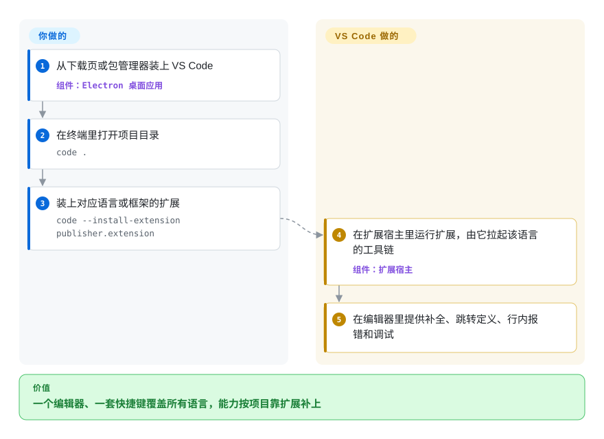

# VS Code

你上午写 TypeScript，午饭后修一个 Python 脚本，中间还要改 Terraform 和 Markdown，每换一种语言就换一个快捷键都不一样的编辑器——要么就是一个只真正懂一门语言的重量级 IDE。VS Code 是一个免费编辑器，补全、跳转到定义、调试这些语言能力都来自可安装的扩展，所以不管下一个文件是什么语言，用的都是同一个窗口、同一套快捷键。

## 何时使用

你所在团队的仓库混着三四种语言，再加上 YAML、SQL 和 Dockerfile，大家的笔记本有 macOS、Windows 也有 Linux。单语言 IDE 只适合其中一个仓库，在其余仓库里处处别扭；纯文本编辑器则在你凌晨两点被拉进一个陌生服务时，连“跳转到定义”都给不了。你用 `code .` 打开目录，打开第一个 `.py` 文件时接受 VS Code 推荐的 Python 扩展，就有了这门语言的补全、行内报错和调试器——代码放在远程机器或容器里时，装一个远程扩展，同一个窗口就能在那边编辑和调试。

当扩展生态是决定因素时，选 VS Code 而不是 [Zed](zed.zh.md)：几乎每种语言、框架、linter 和云厂商都会先出 VS Code 扩展。当跨语言的广度和零授权费用比某一门语言最深的重构能力更重要时，选它而不是 IntelliJ IDEA。你接受的代价是：Electron 应用的内存占用，以及在 MIT 源码之上加了遥测、专有扩展市场的微软品牌构建。

## 怎么用起来

这个仓库叫 “Code - OSS”：MIT 许可的源码，微软在它之上加入自家品牌、遥测、Visual Studio Marketplace 和一份专有产品许可，构建出名为 Visual Studio Code 的产品。应用本身是一个 Electron 外壳（Chromium 加 Node.js），里面装着 Monaco 编辑器组件；开箱即可编辑文本、全文搜索（底层用的是 ripgrep）、处理 Git、运行终端。**语言智能不在核心里，而是由扩展提供。** 扩展运行在“扩展宿主”里——一个与编辑器界面隔开的 Node.js 进程，所以某个扩展出了问题也不会卡住你打字；语言类扩展通常会启动该语言的“语言服务器”——一个在后台理解代码、通过标准协议（LSP）回答“这个符号是什么、定义在哪”的程序。用上远程扩展后，窗口留在你的笔记本上，而 VS Code Server 和你的扩展在代码所在的 SSH 主机、容器或 WSL 发行版上运行。装哪些扩展、怎么配置由你决定；VS Code 负责安装和更新它们、把它们接进编辑器，并保持自身更新。

<!-- flow-steps:begin (generated from flows/vscode.json by tools/flow_card.py — do not edit) -->

流程文字版

1. **你**：从下载页或包管理器装上 VS Code — 组件：`Electron 桌面应用`
2. **你**：在终端里打开项目目录 — `code .`
3. **你**：装上对应语言或框架的扩展 — `code --install-extension publisher.extension`
4. **VS Code**：在扩展宿主里运行扩展，由它拉起该语言的工具链 — 组件：`扩展宿主`
5. **VS Code**：在编辑器里提供补全、跳转定义、行内报错和调试

**价值**：一个编辑器、一套快捷键覆盖所有语言，能力按项目靠扩展补上

<!-- flow-steps:end -->

## 何时不用

- **你想要一个没有微软遥测、品牌和专有许可的编辑器。** 官方二进制按微软产品许可分发，遥测默认开启。改用 VSCodium（未收录）——同一份 MIT 源码的社区构建，关闭了遥测——而不是 VS Code，并接受它用 Open VSX 而不是微软的扩展市场。
- **……但你离不开微软的专有扩展。** Visual Studio Marketplace 的使用条款只允许其内容用于微软产品，远程开发扩展和 C#、C++ 调试器也只能在官方构建上工作。如果你需要这些，就留在 VS Code 而不是 VSCodium；如果你要摆脱它们，切换前先找好替代（Open VSX 上的同类扩展、开源调试器）。
- **你永远只在 SSH 后的终端里干活。** VS Code 是图形界面程序；它的远程模式仍需要一个桌面客户端（或者通过 `code tunnel` 用浏览器）。服务器上的纯终端编辑用 Neovim（未收录）或 Helix（未收录）。
- **启动时间和内存是你的硬约束。** Electron 比原生编辑器更吃内存、启动更慢。在小内存机器上，或者一天要开几百次文件时，改用 [Zed](zed.zh.md)（原生、GPU 渲染）或 Sublime Text（非仓库，付费授权）。
- **你的工作是重度 JVM、Android 或单一语言的大规模重构。** VS Code 的 Java、Kotlin 支持来自扩展，深度不如专门的 IDE。这类工作用 IntelliJ IDEA（未收录，Community 版源码在 GitHub 上）或 Android Studio。
- **你想给团队托管一个浏览器 IDE。** VS Code Server 的许可写明一个服务器实例只供单个用户使用，且“不允许把它作为服务托管”。要在自己的基础设施上把类 VS Code 编辑器作为共享服务运行，用 code-server（未收录，MIT）或 Eclipse Theia（未收录）。

## 横向对比

| 替代品 | 是否收录 | 我们的评价 | 取舍 |
| --- | --- | --- | --- |
| [Zed](zed.zh.md) | ✅ | 编辑器延迟、低内存和内置实时协作是你每天都能感觉到的东西时，选 Zed；需要某个只有 VS Code 才有的小众语言、框架或云服务扩展时，选 VS Code。 | Zed 是原生 Rust 实现，明显更轻；但扩展生态只有 VS Code 的零头，小众工具可能根本没有。 |
| VSCodium | 未收录 | 遥测和微软产品许可对你是硬伤时，选 VSCodium；依赖远程开发、Pylance 这类扩展或只能在官方构建上运行的 C#、C++ 调试器时，留在 VS Code。 | 同一个编辑器，MIT 许可的二进制，扩展来自 Open VSX；代价是用不了微软独占的扩展和 Visual Studio Marketplace。 |
| code-server | 未收录 | 想在自己掌控的基础设施上用浏览器跑 VS Code（共享开发机、Chromebook、受限笔记本）时，跑 code-server；每个开发者都有够用的机器时，用桌面版 VS Code 加 Remote-SSH。 | code-server 可自托管、MIT 许可，扩展来自 Open VSX；官方构建能用微软市场和远程扩展，但其服务器许可只供单用户，并禁止作为服务托管。 |
| Neovim | 未收录 | 你常驻终端和 SSH，并且愿意自己配置编辑器时，选 Neovim；带好用默认值的图形界面和一键装扩展比模态编辑更重要时，选 VS Code。 | Neovim 轻量、纯键盘驱动，有终端就能跑；但需要你自己配置（Lua、LSP），而这些 VS Code 都替你准备好了。 |
| IntelliJ IDEA | 未收录 | 大型 Java、Kotlin 代码库里，深度重构、构建工具集成和代码检查能收回成本时，选 IntelliJ IDEA；多语言仓库和配置较弱的机器，选 VS Code。 | IntelliJ 开箱即对 JVM 代码理解得更深；但它更重、以 JVM 为中心，Ultimate 版还要付费。 |

## 技术栈

- **TypeScript**，贯穿编辑器核心和内置扩展。
- **Electron**（Chromium + Node.js）作为桌面外壳；**Monaco** 编辑器组件（也单独发布）负责文本编辑。
- **扩展宿主：** Node.js 进程（本地或远程）或浏览器里的 web worker，把扩展和界面隔开。
- **语言服务器协议（LSP）**和**调试适配器协议（DAP）**，大多数语言扩展和调试器扩展都按这两份约定实现。
- **自带工具：** 文本搜索用 ripgrep（`@vscode/ripgrep-universal`）；GitHub Copilot Chat 的源码现已并入本仓库（`extensions/copilot`），原来的 `microsoft/vscode-copilot-chat` 已归档。

## 依赖

- **桌面系统：** 受支持的 64 位 Windows 客户端版本；仍在接收苹果安全更新的 macOS 版本；glibc 2.28 及以上的 Linux（如 Ubuntu 20.04、Debian 10、RHEL 8、Fedora 36）。不支持 Windows Server。
- **硬件：** 官方文档写的最低要求是 1.6 GHz 处理器和 1 GB 内存；实际占用会随扩展数量和工作区大小上涨。
- **远程开发：** 目标机器上要有 SSH、Docker（Dev Containers）或 WSL；VS Code 会把服务端组件下载到那里。
- **语言支持：** 每门语言自己的工具链（Python 解释器、JDK、Go 工具链……），外加驱动它的扩展。

## 运维难度

**个人很低，规模化部署为中等。** 个人装上后让内置更新器自己跑就行。组织则要真花功夫：VS Code 现在大约每周发一个新的次版本，扩展兼容性和更新通道需要有策略；遥测级别（`telemetry.telemetryLevel`）、允许安装的扩展和扩展市场访问要集中配置；专有扩展还各自带着许可条款。托管共享的网页版 IDE 被 VS Code Server 许可排除在外——那是 code-server 或 Theia 的地盘。

## 健康度与可持续性

- **维护（2026-10-08）：** 极其活跃——每天都有提交，近 13 周 13 周都有提交；至少从 2026-05 起，几乎每周发一个新的次版本（2026-05-28 的 1.122 到 2026-10-07 的 1.141），尽管 README 里还写着“每月更新”。
- **治理：** 由微软拥有并投入人力；工作分布很广（12 个月内 143 位活跃提交者，前三贡献者占比 22.5%——雷达 A）。路线图由微软制定，以迭代计划的形式发布在 wiki 上。
- **背书与 Lindy：** 2015-09 创建，约 11 年，背后是微软的开发者工具部门——年龄乘以活跃度的信号很强。
- **采用：** 属于使用最广的代码编辑器之一；雷达上采用一轴只有 B，是低估——桌面应用的安装量，包注册表和 GitHub release 计数器都看不到。从 2026-10-09 起，评分器不再给它读注册表包（这个仓库名下的 npm 候选都是第三方 Theia 的转包），只按它能看到的 Homebrew 和 release 下载信号打分。
- **风险信号：** 源码是 MIT，但你下载的二进制适用带遥测的专有产品许可，扩展市场的条款也把扩展限制在微软产品内使用。AI 功能（Copilot）正越来越多地进入核心；客户端代码是开源的，但服务需要 GitHub Copilot 订阅，所以预计产品方向会继续偏向微软自家服务。

## 存疑（未验证）

- [推断] “属于使用最广的代码编辑器之一”依据的是开发者调查中的普遍口碑；本次同步没有重读任何调查，评分器的采用数据也衡量不到这一点。
- [推断] 每周一版的节奏是从 GitHub release 日期（2026-05 至 2026-10）读出来的；微软是否正式取代了月度节奏，没有找到公告确认。
- [未验证] 微软产品许可和各专有扩展的具体条款（遥测、允许用途）本次没有重读；做合规判断前请自行核对。
- [推断] 微软持续把 Copilot 功能推进核心，可能让更多功能转向付费服务；这是对趋势的判断，不是官方计划。
