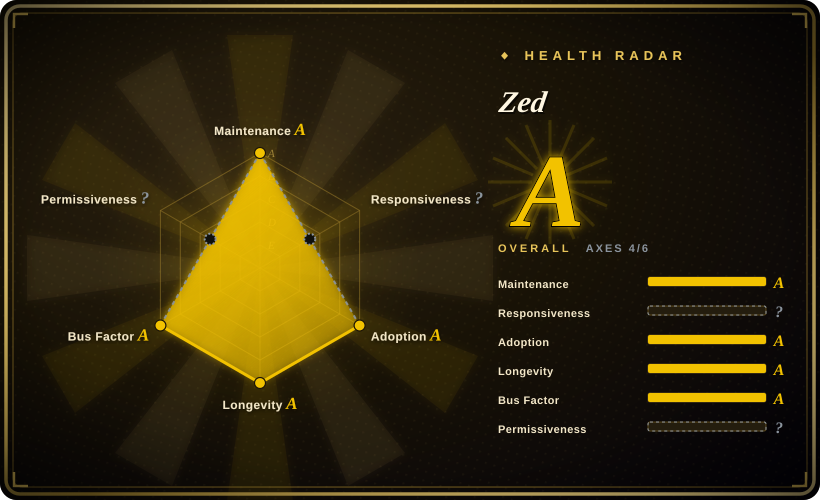
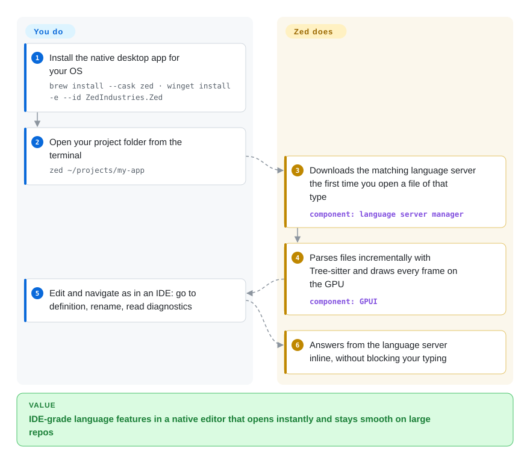

# Zed

Your editor takes seconds to open a big repo and stutters while you type next to a dozen extensions; Zed is a native editor that draws its whole UI on the GPU, so it opens instantly and stays smooth while still giving you language servers, a debugger, AI agents and live pair editing.

## When to use

You write code all day on a laptop, mostly in Rust, TypeScript, Go or Python, and your VS Code window has become the slow part of your loop: a cold start on a monorepo takes several seconds, the extension host pins a CPU core, and typing in a 10,000-line file lags by a visible frame. You don't want to give up go-to-definition, inline diagnostics or a debugger, and you don't want to move into a terminal editor and rebuild all of that from Lua plugins. Zed is the pick when **editor latency and a built-in feature set beat extension breadth**: it is a native Rust application whose UI framework renders every frame on the GPU, it fetches language servers on its own, ships a Debug Adapter Protocol debugger, an agent panel that can host external agents such as Claude Agent or Codex CLI, SSH remote development, and real-time multiplayer editing with a teammate's cursor in your buffer.

Pick it over VS Code when speed and "works out of the box" matter more than the 50,000-extension marketplace; pick it over Neovim when you want a GUI and collaboration without assembling plugins. If one niche extension or a full JetBrains-grade refactoring engine is the thing you can't live without, it is the wrong editor.

## How it works

Zed is one native program written in Rust; its UI framework, GPUI, sends every frame straight to the graphics card (Metal on macOS, Vulkan on Linux, DirectX on Windows) instead of running inside a browser engine the way Electron editors do. Code understanding is split in two: Tree-sitter — an incremental parser, meaning it re-parses only the part of the file you just changed — drives highlighting and outline, while language servers (separate per-language programs that answer "where is this defined?" over the Language Server Protocol) supply navigation, rename and diagnostics. Zed downloads the right language server the first time you open a file of that type, so for common languages your setup is just installing the app and opening a folder. What you still do is pick extensions for less common languages and themes, and opt into the networked features: multiplayer editing and Zed-hosted AI need you to sign in, and remote development installs a headless Zed server on the machine you SSH into while the UI stays local.

<!-- flow-steps:begin (generated from flows/zed.json by tools/flow_card.py — do not edit) -->

Text version of the flow

1. **You**: Install the native desktop app for your OS — `brew install --cask zed · winget install -e --id ZedIndustries.Zed`
2. **You**: Open your project folder from the terminal — `zed ~/projects/my-app`
3. **Zed**: Downloads the matching language server the first time you open a file of that type — component: `language server manager`
4. **Zed**: Parses files incrementally with Tree-sitter and draws every frame on the GPU — component: `GPUI`
5. **You**: Edit and navigate as in an IDE: go to definition, rename, read diagnostics
6. **Zed**: Answers from the language server inline, without blocking your typing

**Value**: IDE-grade language features in a native editor that opens instantly and stays smooth on large repos

<!-- flow-steps:end -->

## When NOT to use

- If you need a specific extension from the VS Code marketplace (a niche language, a cloud console, a framework-specific previewer), use [VS Code](vscode.md) instead of Zed, because Zed has its own, much smaller extension system and VS Code extensions do not run in it.
- If you only have a terminal — editing on a server over a plain SSH session, inside a container, or from a machine with no desktop — use Neovim instead of Zed, because Zed's remote development still needs the GUI running on your local machine.
- If your machine has no usable GPU path — a Linux VM without a Vulkan 1.3 driver, a Windows box on the "Microsoft Basic Display Adapter", a thin RDP session — use VS Code or Neovim instead of Zed, because Zed documents those graphics drivers as requirements and fails to open windows without them.
- If your work leans on deep language-specific IDE tooling — large-scale Java/Kotlin refactorings, framework-aware inspections, profilers — use IntelliJ IDEA instead of Zed, because Zed's built-in debugger and LSP features stop at what the language server and debug adapter provide.
- If team editing must stay inside your network, don't count on Zed's multiplayer: it requires signing in to Zed's service; share a tmux or tmate session running Neovim instead.
- If you plan to fork the editor into a closed-source product, start from VS Code's MIT-licensed Code-OSS instead of Zed, because Zed's editor source is GPL-3.0-or-later and a distributed fork must stay GPL.

## Comparison

| Alternative | In index | Our verdict | Tradeoff |
| --- | --- | --- | --- |
| [VS Code](vscode.md) | ✅ | When one marketplace extension or an existing team setup decides it, choose VS Code; choose Zed when startup time and typing latency on big repos are the daily pain. | VS Code gives you the largest extension ecosystem and settings your team already shares, at the cost of an Electron app that is slower to start and heavier on memory. |
| Neovim | 未收录 | Choose Neovim when you live in terminals or over SSH; choose Zed when you want IDE features and collaboration working without writing plugin config. | Neovim runs anywhere a terminal does and is endlessly scriptable, but the LSP, debugger and AI setup is yours to assemble and maintain. |
| IntelliJ IDEA | 未收录 | Choose IntelliJ IDEA for JVM-heavy codebases that need framework-aware refactoring; choose Zed for polyglot editing where a fast, light editor beats deep per-language inspection. | IntelliJ's community edition is open source and far deeper per language, but it is a heavy JVM application with slower startup and indexing. |
| Sublime Text | 非仓库 | Choose Sublime Text when you want a long-stable, minimal fast editor and accept a paid closed-source license; choose Zed when built-in LSP, debugger, AI and multiplayer matter. | Sublime is closed-source commercial software with a mature plugin set, and most of what Zed builds in arrives there via third-party packages. |
| Cursor | 非仓库 | Choose Cursor when you want AI-first editing on top of VS Code's extension ecosystem; choose Zed when native speed matters and you are fine bringing your own agent through the agent panel. | Cursor is a closed-source VS Code fork with its own subscription, so you keep VS Code extensions but also inherit Electron's weight and a single vendor's AI stack. |

## Tech stack

- **Rust** — the editor, its collaboration server and the GPUI framework
- **GPUI** — Zed's own GPU-rendered UI framework (Metal / Vulkan / DirectX), not a browser engine
- **Tree-sitter** — incremental parsing for highlighting, outline and structural selection
- **Language Server Protocol / Debug Adapter Protocol** — language intelligence and debugging, with adapters for C, C++, Go, JavaScript, PHP, Python, Rust and TypeScript built in
- **Agent Client Protocol (ACP)** — hosts external coding agents inside the agent panel

## Dependencies

- macOS (Intel or Apple Silicon), Windows 10 1903+ / 11 on x64 or Arm64, or 64-bit Linux
- A real GPU driver: Vulkan 1.3 on Linux, DirectX 11 on Windows
- Linux: glibc ≥ 2.31 (x86_64) or ≥ 2.35 (aarch64) for the install script, plus desktop portals
- Network access for language-server downloads, extensions, and the optional sign-in features (collaboration, hosted AI)

## Ops difficulty

**Low for individuals.** Zed is a desktop app that updates itself; most languages work after the first file is opened. The work shows up in teams: deciding whether code may flow through Zed's hosted collaboration and AI services, pinning extensions and settings, and paying for seats if you use its hosted models. Remote development adds one moving part — the headless server it places on each SSH host.

## Health & viability

- **Maintenance**: Grade A — 13/13 active weeks in the trailing quarter and a commit today; stable releases ship weekly (v1.23.2 on 2026-10-07) after v1.0.0 landed on 2026-04-29.
- **Responsiveness**: `?` (no_window_signal) — the scorer found no qualifying issue window to measure; with 3,058 open issues, don't assume fast triage on niche bugs.
- **Adoption**: Grade A — 22,676 Homebrew installs in 90 days and 13,306,406 release-asset downloads.
- **Longevity**: Grade A — repository 2,056 days old (created 2021-02-20) and still committing daily; but it has been 1.x for only about five months, so the Lindy prior is moderate, not strong.
- **Governance**: Grade A on spread — 310 people committed in the last 12 months and the top three hold only 18.6% — yet the roadmap is owned by one for-profit company, Zed Industries, which funds itself through paid plans for hosted AI and team features.
- **Risk / License**: `?` (license_unparsed) — GitHub reports `NOASSERTION`; the README states GPL-3.0-or-later with Apache-2.0 components where marked. The editor is copyleft open source; the commercial lever is the hosted services, not the code.

## Caveats (unverified)

- [推断] The hosted collaboration service is not documented for self-hosting, even though the collab server's source sits in the repo; teams needing on-prem collaboration should verify before relying on it.
- [未验证] Extension catalog size and coverage relative to VS Code were not measured; the "much smaller" judgment is qualitative.
- [推断] Because Zed Industries' revenue comes from hosted AI and team plans, future features may land first or only in those paid services.
- [未验证] Performance claims (startup time, typing latency vs. VS Code) come from the project's positioning and common experience, not a benchmark run for this page.
