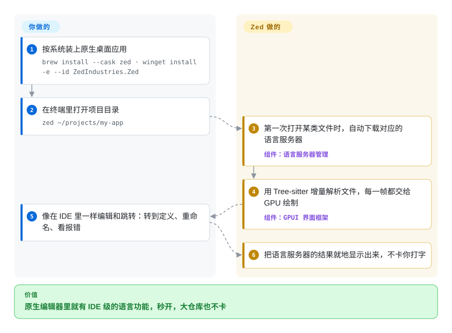

# Zed

打开一个大仓库要等好几秒，装了一堆扩展后打字都一顿一顿的；Zed 是一个把整套界面直接交给显卡画的原生编辑器，秒开、不卡，同时自带语言服务器、调试器、AI 代理和多人实时协作。

## 何时使用

你每天在笔记本上写代码，主要是 Rust、TypeScript、Go 或 Python，而 VS Code 已经成了你开发循环里最慢的一环：冷启动一个 monorepo 要好几秒，扩展宿主进程吃满一个 CPU 核，在一万行的文件里打字能看到明显的掉帧。你不想放弃转到定义、行内报错和调试器，也不想搬进终端编辑器、用 Lua 插件把这些重新拼一遍。**当编辑器延迟和开箱即用的功能比扩展数量更重要时**，选 Zed：它是用 Rust 写的原生应用，界面框架每一帧都交给 GPU 绘制；语言服务器自己下载；内置基于 Debug Adapter Protocol 的调试器；代理面板可以挂 Claude Agent、Codex CLI 这类外部代理；支持 SSH 远程开发；还能多人实时协作，队友的光标就在你的文件里。

速度和“装上就能用”比 5 万个扩展更重要时，它胜过 VS Code；想要图形界面和协作、又不想自己拼插件时，它胜过 Neovim。如果你离不开某个小众扩展，或者需要 JetBrains 级别的重构引擎，它就不是你要的编辑器。

## 怎么用起来

Zed 是一个用 Rust 写成的原生程序；它的界面框架 GPUI 把每一帧直接交给显卡绘制（macOS 上用 Metal，Linux 上用 Vulkan，Windows 上用 DirectX），而不是像 Electron 编辑器那样跑在浏览器内核里。理解代码这件事分成两半：Tree-sitter 是一种增量解析器（只重新解析你刚改动的那一小段），负责高亮和大纲；语言服务器是每种语言单独的程序，通过 Language Server Protocol 回答“这个符号定义在哪”之类的问题，负责跳转、重命名和报错。第一次打开某类文件时，Zed 会自己下载对应的语言服务器，所以常见语言下你要做的只是装上应用、打开目录。你仍需要自己做的是：给冷门语言和主题挑扩展，以及决定是否启用联网功能——多人协作和 Zed 托管的 AI 需要登录；远程开发会在你 SSH 进去的机器上装一个无界面的 Zed 服务端，界面仍留在本地。

<!-- flow-steps:begin (generated from flows/zed.json by tools/flow_card.py — do not edit) -->

流程文字版

1. **你**：按系统装上原生桌面应用 — `brew install --cask zed · winget install -e --id ZedIndustries.Zed`
2. **你**：在终端里打开项目目录 — `zed ~/projects/my-app`
3. **Zed**：第一次打开某类文件时，自动下载对应的语言服务器 — 组件：`语言服务器管理`
4. **Zed**：用 Tree-sitter 增量解析文件，每一帧都交给 GPU 绘制 — 组件：`GPUI 界面框架`
5. **你**：像在 IDE 里一样编辑和跳转：转到定义、重命名、看报错
6. **Zed**：把语言服务器的结果就地显示出来，不卡你打字

**价值**：原生编辑器里就有 IDE 级的语言功能，秒开，大仓库也不卡

<!-- flow-steps:end -->

## 何时不用

- 如果你离不开 VS Code 市场里的某个扩展（小众语言、云控制台、某框架专用预览），用 [VS Code](vscode.zh.md) 而不是 Zed，因为 Zed 有自己的、小得多的扩展体系，VS Code 扩展在里面跑不起来。
- 如果你手里只有终端——通过普通 SSH 会话在服务器上改代码、在容器里改、或者机器没有桌面——用 Neovim 而不是 Zed，因为 Zed 的远程开发仍要求图形界面跑在你本地。
- 如果机器没有可用的显卡通路——没有 Vulkan 1.3 驱动的 Linux 虚拟机、只装了“Microsoft 基本显示适配器”的 Windows、瘦客户端 RDP 会话——用 VS Code 或 Neovim 而不是 Zed，因为 Zed 文档把这些显卡驱动列为硬性要求，缺了就打不开窗口。
- 如果你的工作重度依赖语言专属的 IDE 能力——大规模 Java/Kotlin 重构、懂框架的代码检查、性能分析器——用 IntelliJ IDEA 而不是 Zed，因为 Zed 的调试器和 LSP 功能只做到语言服务器和调试适配器提供的程度。
- 如果团队协作编辑必须留在内网，别指望 Zed 的多人协作：它要求登录 Zed 的服务；改用 tmux 或 tmate 共享一个跑 Neovim 的会话。
- 如果你打算把编辑器 fork 成闭源产品，从 VS Code 的 MIT 许可的 Code-OSS 起步，而不是 Zed，因为 Zed 编辑器源码是 GPL-3.0-or-later，分发的 fork 必须保持 GPL。

## 横向对比

| 替代品 | 是否收录 | 我们的评价 | 取舍 |
| --- | --- | --- | --- |
| [VS Code](vscode.zh.md) | ✅ | 某个市场扩展或团队现成配置是决定因素时，选 VS Code；大仓库上的启动时间和打字延迟是每天的痛点时，选 Zed。 | VS Code 有最大的扩展生态和团队已共享的配置，代价是 Electron 应用启动更慢、更吃内存。 |
| Neovim | 未收录 | 常驻终端或 SSH 的人选 Neovim；想不写插件配置就拿到 IDE 功能和协作的人选 Zed。 | Neovim 只要有终端就能跑、可无限脚本化，但 LSP、调试器和 AI 都得自己组装、自己维护。 |
| IntelliJ IDEA | 未收录 | 以 JVM 为主、需要懂框架的重构时选 IntelliJ IDEA；多语言混写、轻快比单语言深度检查更重要时选 Zed。 | IntelliJ 社区版开源，单语言深度远超 Zed，但它是重量级 JVM 应用，启动和建索引都慢。 |
| Sublime Text | 非仓库 | 想要一个多年稳定、极简又快的编辑器，并接受付费闭源许可时选 Sublime Text；需要内置 LSP、调试器、AI 和多人协作时选 Zed。 | Sublime 是闭源商业软件，插件生态成熟，但 Zed 内置的大部分能力在它那里要靠第三方包补齐。 |
| Cursor | 非仓库 | 想在 VS Code 扩展生态上做 AI 优先的编辑时选 Cursor；原生速度更重要、愿意通过代理面板接入自己的代理时选 Zed。 | Cursor 是闭源的 VS Code 分支、单独订阅，保留了 VS Code 扩展，也继承了 Electron 的重量和单一厂商的 AI 栈。 |

## 技术栈

- **Rust**——编辑器本体、协作服务端和 GPUI 框架
- **GPUI**——Zed 自研的 GPU 渲染界面框架（Metal / Vulkan / DirectX），不是浏览器内核
- **Tree-sitter**——增量解析，用于高亮、大纲和结构化选择
- **Language Server Protocol / Debug Adapter Protocol**——语言智能与调试；C、C++、Go、JavaScript、PHP、Python、Rust、TypeScript 的调试适配器内置
- **Agent Client Protocol（ACP）**——在代理面板里接入外部编码代理

## 依赖

- macOS（Intel 或 Apple Silicon）、x64 或 Arm64 上的 Windows 10 1903+ / 11，或 64 位 Linux
- 真正的显卡驱动：Linux 上 Vulkan 1.3，Windows 上 DirectX 11
- Linux 安装脚本要求 glibc ≥ 2.31（x86_64）或 ≥ 2.35（aarch64），以及桌面 portal
- 需要联网下载语言服务器和扩展，以及使用可选的登录功能（协作、托管 AI）

## 运维难度

**个人使用：低。** Zed 是会自动更新的桌面应用，大多数语言打开第一个文件后就能用。麻烦出现在团队层面：要决定代码能否经过 Zed 托管的协作和 AI 服务、统一扩展和设置、以及用托管模型时为席位付费。远程开发多一个活动部件——它在每台 SSH 主机上放的无界面服务端。

## 健康度与可持续性

- **维护活跃度**：Grade A——过去一个季度 13/13 周都有提交，今天仍有提交；v1.0.0 于 2026-04-29 发布后，稳定版每周一发（2026-10-07 发布 v1.23.2）。
- **响应速度**：`?`（no_window_signal）——评分器没找到可度量的 issue 窗口；仓库有 3,058 个未关闭 issue，别指望小众 bug 很快被处理。
- **采用广度**：Grade A——Homebrew 90 天安装 22,676 次，release 资产下载 13,306,406 次。
- **长青度**：Grade A——仓库已存在 2,056 天（2021-02-20 创建），仍天天有提交；但进入 1.x 只有约五个月，Lindy 先验中等，不算强。
- **治理集中度**：按分布看是 Grade A——过去 12 个月有 310 人提交，前三名只占 18.6%；但路线图由一家营利公司 Zed Industries 掌握，靠托管 AI 和团队功能的付费套餐养活自己。
- **许可风险**：`?`（license_unparsed）——GitHub 报 `NOASSERTION`；README 写明以 GPL-3.0-or-later 为主，标注处为 Apache-2.0。编辑器本身是 copyleft 开源，商业抓手在托管服务而不是代码。

## 存疑（未验证）

- [推断] 托管协作服务没有自托管文档，尽管协作服务端源码就在仓库里；需要内网协作的团队应先核实再依赖。
- [未验证] 扩展目录的规模和覆盖面没有与 VS Code 实测对比，“小得多”是定性判断。
- [推断] Zed Industries 的收入来自托管 AI 和团队套餐，未来新功能可能先进、甚至只进付费服务。
- [未验证] 性能说法（相对 VS Code 的启动时间、打字延迟）来自项目定位和普遍体验，没有为本页跑基准。
