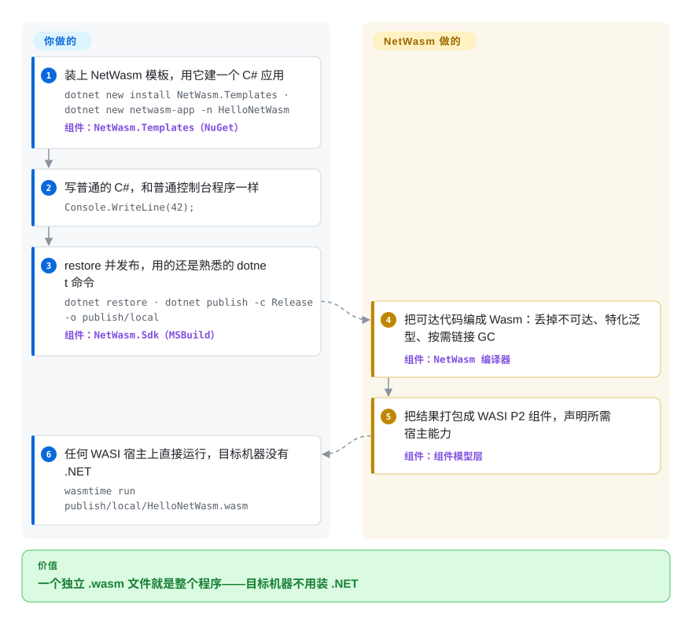

# NetWasm

把 C# 部署到 WebAssembly，通常意味着连整个 .NET 运行时一起发货：宿主先把运行时、你的 DLL 和中间的胶水全部下载完，才轮到你的程序打印第一行。NetWasm 只把程序真正能执行到的代码编译成单个独立的 `.wasm` 文件——垃圾回收器也链接在里面，一个 hello-world 约 84 KB——任何 WebAssembly 宿主直接就能运行它，目标机器完全不用装 .NET。

## 何时使用

你写 C#，但程序要跑在「先装 .NET」一票否决的地方：某个 WASI 宿主加载的插件、嵌进别人应用里的计算模块、发往边缘运行时或浏览器标签页的负载。微软官方的 .NET 进 Wasm 路线（Blazor／browser-wasm）把运行时做成了部署的一部分；NetWasm 的口号正好相反——用 .NET 构建，离开 .NET 运行——所以当「一个又小又自包含的组件」是决定性约束时你选它：`Console.WriteLine(42);` 发布出来就是一个 84,513 字节的 WASI Preview 2 组件，GC 和运行时支持都在里面，`wasmtime run` 直接就能跑。

定义这个选择的取舍是：NetWasm 是「平台契约刻意做小的 C#」（它的 README 自比 Kotlin/Wasm 的可移植 API 思路，而不是桌面兼容性），对面是微软运行时「完整桌面 API 面、随部署携带数兆负载」。同时你得按它划下的边界老实办事：没有运行时反射和 `dynamic`、没有托管线程（只有单反应器 async）、没有通用 `System.IO.File`／裸 socket／子进程，已有的 NuGet 包只在可达代码适配这个画像时才能用。如果 C# 是硬约束、而「单文件、极小、能力显式声明」是赢的条件，目前公开路线里只有它能到；如果语言可以换，TinyGo 或 Kotlin/Wasm 是同一形状下更老的赌注；如果 API 完整度优先，那官方的 .NET wasm 运行时赢。

## 怎么用起来

Roslyn 照常干活——C# 编成 CIL（.NET 编译器产出的字节码）——之后的所有事情都由 NetWasm 替换掉了。它自己的编译器读取 ECMA-335 元数据，从你的入口点出发走完所有可达方法（闭世界意味着不可达代码、没用的泛型、没引用的包根本不会被编译），把泛型特化到具体用法，再把 CIL 直接降成 WebAssembly：没有解释器、没有 JIT、不把 CLR 或 Mono 作为平台随产物发货。活下来的代码对「运行时」的需求——精确垃圾回收器（Boehm 血统的 C 模块；编译器算出精确根，收集器因此不需要保守扫描）、异常与字符串支持——被链接进模块本体，这部分是 MIT 许可。最后组件层把程序真正导入的 WIT 接口（WebAssembly 的接口定义语言）绑定好，打包成一个 WASI Preview 2 组件：文件里声明自己需要哪些宿主能力——时钟、HTTP、随机数、挂载目录——宿主就只给这些，没有任何环境访问。你要做的只是熟悉的 .NET 循环（`dotnet new`／`restore`／`build`／`run`／`publish`／`test`）：工具链以 NuGet 包的形式到来，第一次 `dotnet restore` 会拉取钉死版本的 Node、`wasm-ld` 和 Binaryen，构建机不需要预装任何工具链。

<!-- flow-steps:begin (generated from flows/netwasm.json by tools/flow_card.py — do not edit) -->

流程文字版

1. **你**：装上 NetWasm 模板，用它建一个 C# 应用 — `dotnet new install NetWasm.Templates · dotnet new netwasm-app -n HelloNetWasm` — 组件：`NetWasm.Templates（NuGet）`
2. **你**：写普通的 C#，和普通控制台程序一样 — `Console.WriteLine(42);`
3. **你**：restore 并发布，用的还是熟悉的 dotnet 命令 — `dotnet restore · dotnet publish -c Release -o publish/local` — 组件：`NetWasm.Sdk（MSBuild）`
4. **NetWasm**：把可达代码编成 Wasm：丢掉不可达、特化泛型、按需链接 GC — 组件：`NetWasm 编译器`
5. **NetWasm**：把结果打包成 WASI P2 组件，声明所需宿主能力 — 组件：`组件模型层`
6. **你**：任何 WASI 宿主上直接运行，目标机器没有 .NET — `wasmtime run publish/local/HelloNetWasm.wasm`

**价值**：一个独立 .wasm 文件就是整个程序——目标机器不用装 .NET

<!-- flow-steps:end -->

## 何时不用

- **你的程序（或它的 NuGet 依赖图）依赖反射、`dynamic` 或运行时加载程序集。** 运行时按类型名查找是*设计上*不支持的——这正是类型名元数据进不了产物的原因——所以 EF Core、Newtonsoft.Json 这类反射驱动的包会直接失败而不是降级。这套栈是你的命脉就留在桌面／服务器 .NET 或官方 wasm 运行时（dotnet/runtime）；NetWasm 给你的替代是它源码生成、无反射的移植版（JSON、DI、XML），其余的编译器用诊断拒绝。
- **你需要通用文件系统、裸 socket、子进程或托管线程。** `System.IO.File`／`Directory`、`System.Net.Sockets`、`System.Diagnostics.Process`、线程池和 `Task.Run` 并行都没有公开的托管 API，文件 API 明确推迟到 WASI 0.3 迁移之后。并发只有单反应器（async 任务、取消、定时器）。把这些当刚需而不是加分项时，用官方 .NET 运行时，或 Go／Kotlin 的 wasm 等价物。
- **你的组织超过 250 人或年营收超过 1,000 万美元，或者法务要求工具链是 OSI 式的开源。** 编译器、SDK、链接器和开发者工具用的是自定义的 NetWasm Community License 1.0（GitHub 显示 `NOASSERTION`）：只有个人、教育、符合资格的开源、评估和小组织免费；更大的组织必须按开发者数购买对应的 GitHub Sponsors 档（2026-09-29 页面标价 $149–$2,499／月），捆绑、再分发或把编译做成对外服务则要另签书面协议，而协议对手是一个化名许可人。CoreLib／运行时／模板和生成产物是 MIT。要一条干净的 MIT/Apache 工具链，选 dotnet/runtime。
- **你在押注一个「有人长期维护的平台」而不是一场实验。** 仓库约 7 周大，唯一一位化名维护者自己开、自己合了全部 PR，0 fork，且 pre-1.0 发版明确写着源码、包、目标画像和 ABI 契约会在小版本之间变。凡是要在架构评审里辩护的东西，要么钉死版本、把爆炸半径关小，要么选有 LTS 契约的官方运行时。
- **你需要 wasm64 的*组件*。** Memory64 的组件打包被上游 Component Model 工具链卡住，NetWasm 立刻报错（`NW1010`）而不是悄悄降级成 wasm32。要么用 wasm32 组件，要么只在支持 Memory64 的宿主上走显式的 raw-core JavaScript 适配层。
- **你想要一个浏览器里的 C# UI 框架。** DOM、fetch、存储都不是隐式服务；浏览器能力只能在 raw-core 模式下用显式 JavaScript 导入拿。要做 UI 应用，Blazor 或 Uno Platform 才是 C# 浏览器栈的正解。

## 横向对比

| 替代品 | 是否收录 | 我们的评价 | 取舍 |
| --- | --- | --- | --- |
| dotnet/runtime（微软 .NET WebAssembly／Blazor） | 未收录 | 完整 .NET API 面、反射驱动的包、基于 DOM 的浏览器 UI 是刚需时，选官方 wasm 运行时，接受 Mono 运行时加你的 DLL 随每次部署同行；只有当「单个小组件、目标机上什么都不装」是决定性约束、且程序合得进闭世界画像时，才选 NetWasm。 | 官方：约十年成熟度、MIT、LTS、兼容性最全——负载被运行时占掉大头。NetWasm：84,513 字节的 hello-world 组件、GC 内置——API 面窄、7 周大、工具链许可证自定义。本批 tab-intake 未收录。 |
| Emscripten | 未收录 | 语言可以挑的话，C/C++ 走 Emscripten 是「在 web 宿主上发小产物」的成熟基准；只有当 C# 本身是约束时才留着看 NetWasm——它存在的意义就是让带托管语义的 C# 绕开 Emscripten 式的 JS 胶水部署。 | Emscripten：工具链和生态经年打磨，但没有托管 C# 方案，宿主约定也偏自家风格。NetWasm：你的 C# 编成标准 WASI Preview 2 组件，但项目 pre-1.0、单人维护。本批 tab-intake 未收录。 |
| [scriptc](scriptc.zh.md) | ✅ | 两者都是把一门托管语言直编译成极小可移植产物、都拒绝证明不了静态的部分：源文件是类型干净的 TypeScript、要出原生二进制或 WASI 就选 scriptc；源文件是带泛型、异常、async 的 C# 且你不肯重写，才轮到 NetWasm。 | scriptc：Apache-2.0、Vercel 背书、产出原生可执行和 WASI Preview 1；年轻。NetWasm：野心大得多（完整的 C# 平台契约），但工具链许可证非 OSI、维护者匿名。 |
| TinyGo | 未收录 | 目标只是「托管语义的小 Wasm 产物」而语言可换时，TinyGo 是更老、采用更广的赌注（2026-09-29 核查约 17.8k star）；只有当现成代码或团队技能就是 C# 时，NetWasm 才值得冒它的险。 | TinyGo：约九年履历、生产用户众多，但语义是 Go、标准库同样有删减。NetWasm：保住 C# 语言特性（泛型、异常、单反应器 async）、组件体积同级，但属实验性质。本批 tab-intake 未收录。 |
| JetBrains/kotlin（Kotlin/Wasm） | 未收录 | NetWasm 自己的 README 就把 Kotlin/Wasm 的「更小平台契约」当样板；栈是 Kotlin/JVM 就直接用官方 wasm 目标，栈是 C# 且无可替代时才考虑 NetWasm——同一个哲学，成熟度天差地别。 | Kotlin/Wasm：语言厂商首发、随官方工具链分发。NetWasm：为 C# 独立重做同一思想，没有公司背书。本批 tab-intake 未收录。 |

## 技术栈

- **编译器、链接器、组件工具链、SDK：C#/.NET**——消费 Roslyn 产出的 CIL 与 ECMA-335 元数据；不复用任何 CLR/Mono 运行时（2026-09-29 统计仓库有 3,659 个 `.cs` 文件）
- **链接进产物的原生运行时支持：C**——Boehm 血统的收集器模块加句柄表，由编译器算出精确 GC 根后编入每个产物；MIT 许可
- **输出形态：** wasm32 的 WASI Preview 2 组件（可移植默认）、带生成 JavaScript 适配层的 raw wasm32/wasm64 核心模块、经钉版本 jco 转译的浏览器路线
- **外部工具，版本钉死、以 NuGet host-tools 包分发：** Node.js、LLVM `wasm-ld`、Binaryen（`wasm-opt`、`wasm-merge`）、`wasm-tools`；仓库内置 WASI 0.2.11 的 WIT 闭包（151 个 `.wit` 文件）
- **分发：** 与 MSBuild 集成的 NuGet 包图（`NetWasm.Sdk`、`NetWasm.Ref`、运行时包、模板、VSTest 桥）；周边仓库 `NetWasm.Libraries`（移植版 LINQ/HTTP/JSON/XML/Regex/Hashing/DI）与 `TUnit-NetWasm`

## 依赖

- 构建机：.NET SDK 10.0.303 或更新（用 C# 15 则选 .NET 11 SDK）；Linux 需 glibc 2.28+，macOS 需 13.5+，Windows ARM64 需原生 ARM64 SDK；首次 `dotnet restore` 下载钉死版本的 host-tools 包（macOS ARM64 约 79 MB 压缩包）——构建普通应用不需要 Emscripten、Node、Git 或 Python
- 部署目标：一个 WASI Preview 2 宿主——项目在 Wasmtime 47.0.3 上做了资质验证——或经钉版本组件工具链的浏览器；宿主缺声明过的能力就在实例化时失败，没有环境访问可捡
- 可选部署输入：本地时间需要的带版本时区数据 sidecar（UTC 什么都不用带）；只读文件访问需要的显式 preopen 挂载
- 维护者自建工具链：Git、Python 3、钉版本的 Emscripten SDK 6.0.7

## 运维难度

**中等**——没有任何东西要当服务运维，但版本更迭与合规是实打实的负担。部署极简单（单文件自包含组件；目标机只要有 Wasm 宿主）。维护不简单：v0.3.0 到 v0.5.0 九天发了十个版本（2026-09-20→2026-09-29），且 pre-1.0 契约明说会在小版本之间变化，所以要在 CI 里钉死包版本、每次升级重新验证；确定性构建和 84,513 字节体积金丝雀就放在仓库里，但可信度建立在维护者自己的资质体系上。商用还要按人数／营收阈值做荣誉制的许可记账。支持渠道只有给一位匿名作者的 issue。

## 健康度与可持续性

- **维护——极度活跃（2026-09-29 核查）：** v0.5.0 就在本页核验当天发布；2026-09-20 至 2026-09-29 发了十个版本；提交日志里一天数十个 PR 合并；仓库创建于 2026-08-10。
- **治理与巴士系数：** 一位化名维护者——GitHub 贡献榜 `zion-sati` 占 170 次提交中的 169 次，官网自述「由一名开发者完成」，全部 35 个 issue/PR 都是自开自合，0 fork；CLA 于 2026-09-29 才加上。没有第二个人接得住这个项目。
- **背书与年龄：** 无基金会、无公司；变现模式是对化名许可人的 GitHub Sponsors 档位加 OEM 书面协议，适用澳大利亚维多利亚州法律。年龄乘活跃度：7 周大、极度活跃——活跃是真的，但 Lindy 先验谈不上；按研究级项目对待。
- **采用：** 64 star（2026-09-29）；v0.5.0 各包已发布到 NuGet，每包下载约 1,400–1,900 次（2026-09-29 查询注册表）——产物真实存在，第三方采用几乎为零；周边生态（`NetWasm.Libraries`、`TUnit-NetWasm`）也是同一作者的移植。
- **风险标记：** 工具链挂自定义非 OSI 许可证（免费线 250 人／1,000 万美元营收；更大组织按开发者付费档；捆绑或编译即服务要另签协议）；许可人匿名、只留 Gmail；pre-1.0 的 ABI／包契约动荡；wasm64 组件被外部工具链卡死。
- [推断：依据提交节奏与自开自合 PR 模式，来源中无声明] 开发过程疑似 agent 辅助、以机器速度推进；产物原则上可检验可复现，但这种异常速度本身就是风险画像的一部分。

## 存疑（未验证）

- [未验证：需 .NET SDK 加约 79 MB 工具链下载，本环境未执行构建] 84,513 字节的 Release 组件是项目自带的金丝雀，复现步骤已公开（作者于 2026-09-27 用 .NET SDK 10.0.401、macOS arm64、Wasmtime 47.0.3 复验），此处没有独立重跑。
- [未验证] GC 与编译器正确性：资质套件（`compiler-qualification/`、体积金丝雀、跨宿主 CI）全部出自维护者之手，没有独立审计或第三方跑测。
- [未验证：未实际驱动编译] 浏览器 Playground 的「页面内编译器」：www.netwasm.com 与 playground.netwasm.com 可访问（2026-09-29 返回 HTTP 200），但没有实际在页面里编译过一次。
- [未验证] NetWasm Community License 1.0 的条款细节：完整读过 `LICENSE.md`、`LICENSE-MAP.md` 与 `docs/licensing.md`；许可证全文的法律条款（如第 15 条管辖与送达语言）未逐条解析。
- [未验证：未审计] 复制自 .NET 衍生材料的署名与出处质量：`THIRD-PARTY-NOTICES.md` 与保留的 MIT/BSD 声明存在，但文件级署名正确性未做抽查。
- [推断：依据 2026-09-29 gh api 查到的 star/fork 与 NuGet 下载数] 采用信号低可信：7 周仓库、64 star、每包约 1,600 次下载；按本索引「年轻高热仓库」启发式，热度当作发布关注而非耐久性证据。
- [推断：依据提交元数据，仓库未声明] AI agent 辅助开发（见健康度一节）；仓库内没有任何来源说明所用流程。
- GitHub 元数据（star、贡献者、发版日期）与 NuGet 下载数于 2026-09-29 经 API 取得；波动值，`sync-entry` 时应重新核对。
