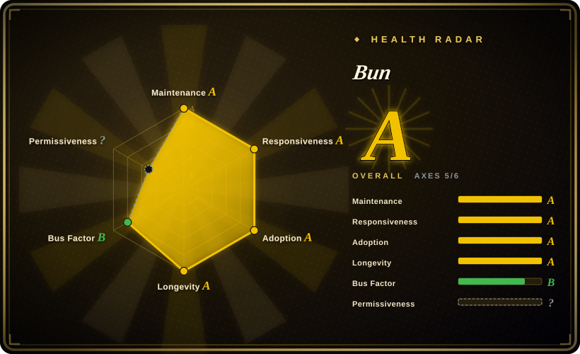
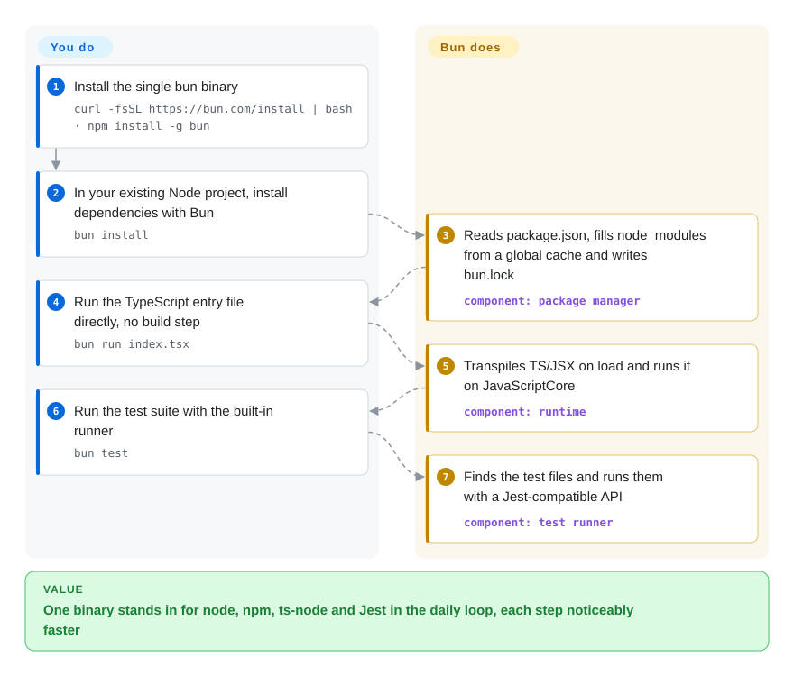

# Bun

A typical TypeScript project needs node, npm, ts-node, a bundler and Jest, each with its own config and each slow to start; Bun is one binary that runs `.ts` files directly and also installs packages, bundles and runs tests — aiming to be a drop-in replacement for Node.js.

## When to use

You maintain a TypeScript service or CLI on Node.js, and your `package.json` has grown a toolchain: `ts-node` or `tsx` to run code, `npm` or `pnpm` to install, `esbuild` to bundle, `jest` with a Babel transform to test. `npm ci` in CI takes over a minute, `jest` spends seconds before the first test runs, and every tool has its own config file that drifts. You want the same project to keep working — same `package.json`, same `node_modules`, same npm registry — just with fewer moving parts and shorter waits. Bun is the pick when **one fast, Node-compatible binary replacing several tools** is worth more than the proven stability of Node itself: `bun install`, `bun run index.ts`, `bun test` and `bun build --compile` cover the daily loop without a transpile step.

Pick it over Node.js when tool sprawl and startup time are the pain and your dependency tree runs on Bun's compatibility layer; pick it over Deno when you want to keep a stock `package.json` project as-is rather than adopt Deno's permission model and conventions. You can adopt it piecemeal — many teams start with `bun install` and `bun test` while keeping Node in production.

## How it works

Bun is a single executable: a JavaScript runtime built on JavaScriptCore (the engine inside Safari, rather than V8, the engine inside Chrome and Node), with the package manager, bundler and test runner compiled into the same binary. Since v1.4 (August 2026) the whole codebase is Rust, rewritten from Zig. When you run a `.ts` or `.tsx` file, Bun strips the types and transforms JSX as it loads each file, so there is no build step; it also implements Node's built-in modules (`node:fs`, `node:http` and so on) and `require`, which is what lets most npm packages run unchanged. `bun install` reads your existing `package.json`, fills `node_modules` from a global cache on disk and writes its own `bun.lock`. What Bun does not do is promise full Node parity: you still check that your specific dependencies and Node APIs work, which is why adoption usually starts with the package manager and test runner.

<!-- flow-steps:begin (generated from flows/bun.json by tools/flow_card.py — do not edit) -->

Text version of the flow

1. **You**: Install the single bun binary — `curl -fsSL https://bun.com/install | bash · npm install -g bun`
2. **You**: In your existing Node project, install dependencies with Bun — `bun install`
3. **Bun**: Reads package.json, fills node_modules from a global cache and writes bun.lock — component: `package manager`
4. **You**: Run the TypeScript entry file directly, no build step — `bun run index.tsx`
5. **Bun**: Transpiles TS/JSX on load and runs it on JavaScriptCore — component: `runtime`
6. **You**: Run the test suite with the built-in runner — `bun test`
7. **Bun**: Finds the test files and runs them with a Jest-compatible API — component: `test runner`

**Value**: One binary stands in for node, npm, ts-node and Jest in the daily loop, each step noticeably faster

<!-- flow-steps:end -->

## When NOT to use

- If production depends on Node APIs Bun only partly implements — its v1.4 notes report `node:inspector` at 22/110 and `node:test` at 28/81 of Node's own tests — keep Node.js as the runtime, because "not 100% compatible yet" is the project's own statement and gaps show up at runtime, not install time.
- If your dependencies include native addons built against V8's C++ API rather than Node-API (the stable addon interface), stay on Node.js, because Bun runs on JavaScriptCore and only re-implements the V8 APIs specific packages need.
- If you need to run untrusted or third-party scripts with restricted file, network and env access, use [Deno](deno.md) instead of Bun, because Deno denies those by default and Bun has no permission sandbox.
- If you cannot absorb regressions from a fresh rewrite — v1.4 moved the entire codebase from Zig to Rust in August 2026 — keep Node.js in production and use Bun only for `bun install` / `bun test`, or pin a Bun version you have tested.
- If your organization requires a runtime governed by a neutral foundation, use Node.js (OpenJS Foundation) instead of Bun, because Bun's roadmap is owned by a single company — Oven, now part of Anthropic — and one maintainer authors over half the commits.
- If you deploy to old Linux hosts (kernel below 5.1) or x64 CPUs without the instruction sets Bun's default build expects, use Node.js, because Bun documents kernel 5.6+ as recommended and "illegal instruction" crashes on older CPUs.

## Comparison

| Alternative | In index | Our verdict | Tradeoff |
| --- | --- | --- | --- |
| Node.js | 未收录 | For production services where every dependency must behave exactly as tested, choose Node.js; choose Bun when tool sprawl and startup time cost more than the residual compatibility risk. | Node.js is the reference implementation with foundation governance and every hosting platform's support, but you assemble the TypeScript runner, bundler and test framework yourself. |
| [Deno](deno.md) | ✅ | Choose Deno when you want permissions-by-default and web-standard APIs as the project's foundation; choose Bun when the goal is to speed up an existing `package.json` project with minimal change. | Deno gives a sandboxed, MIT-licensed runtime with a built-in linter and formatter, but steers you toward its own conventions (`deno.json`, JSR, `npm:` specifiers) instead of plain Node layout. |
| pnpm | 未收录 | If you only want faster, disk-efficient installs and strict dependency isolation on Node, choose pnpm; choose Bun when you also want the runtime and test runner in the same binary. | pnpm changes nothing about how your code runs, so there is no runtime-compatibility risk, but it only solves the install step. |
| Vitest | 未收录 | Choose Vitest when tests must share your Vite config and run on Node exactly like production; choose `bun test` when raw test startup speed matters most. | Vitest runs on the same engine as production and plugs into Vite, while `bun test` is faster to start but runs your tests on JavaScriptCore, not V8. |
| esbuild | 未收录 | Choose esbuild when you need a mature, standalone bundler inside a Node toolchain; choose `bun build` when you already run Bun and want bundling and single-file executables from the same tool. | esbuild has the larger plugin ecosystem and no runtime change, but it is one more tool alongside the runtime rather than part of it. |

## Tech stack

- **Rust** — the runtime, package manager, bundler and test runner since v1.4 (rewritten from Zig)
- **JavaScriptCore / WebKit** — the JavaScript engine, statically linked from Oven's WebKit fork
- **C / C++** — bindings to JavaScriptCore and statically linked libraries (BoringSSL, uSockets, mimalloc, zstd and others)
- **TypeScript / JSX** — transpiled on load; `bun check` type-checks with a port of `typescript-go`

## Dependencies

- Nothing beyond the single `bun` binary; installs via script, `npm install -g bun`, Homebrew or the `oven/bun` Docker image
- Linux x64/arm64 (kernel 5.6+ recommended, 5.1 minimum), macOS x64/Apple Silicon, Windows x64/arm64
- The npm registry (or your private registry) for packages; existing `package.json` and `node_modules` are used as-is
- Optional: a C toolchain for packages that need `node-gyp` to build native addons

## Ops difficulty

**Low.** There is no server to run — it's a binary you pin in CI and Docker images (`oven/bun`). The real ops cost is compatibility testing: run your full test suite under Bun before switching the production runtime, watch the changelog (releases are frequent, and a canary is built from every commit to `main`), and keep a Node fallback for any dependency that misbehaves. Swapping only `npm install` for `bun install` is the cheapest first step and keeps the runtime unchanged.

## Health & viability

- **Maintenance**: Grade A — commits every week of the last quarter; v1.4.0 (2026-08-20) then v1.4.1 and v1.4.2 (2026-09-05).
- **Responsiveness**: Grade A — median first response 5.8 hours across 14 qualifying issues (2026-10-09), though 9,389 issues remain open.
- **Adoption**: Grade A — on the scorer's 2026-10-09 reading the `bun` npm package had 16,383,903 downloads last month and 21,486 dependent repositories, plus 127,091,598 release-asset downloads and 18,512 Homebrew installs in 90 days; large applications such as Claude Code run on it.
- **Longevity**: Grade A — 2,003 days old (created 2021-04-14), 1.x since 2023, and now on its second implementation language; a moderate Lindy prior.
- **Governance**: Grade B — 61 active committers in 12 months but the top three hold 85.5% and the founder alone 57.7%; the roadmap belongs to Oven, which is now part of Anthropic, so continuity depends on that company's priorities rather than a foundation.
- **Risk / License**: `?` (license_unparsed) — GitHub shows `NOASSERTION` because `LICENSE.md` is a composite file: Bun itself is MIT, while the statically linked JavaScriptCore/WebKit is LGPL-2, which only adds relinking obligations if you redistribute a modified Bun.

## Caveats (unverified)

- [推断] The Zig-to-Rust rewrite in v1.4 is recent enough that its regression rate in production is not yet known from release history.
- [推断] Anthropic ownership may steer priorities toward its own products' needs; no change to the MIT license has been announced.
- [未验证] Speed claims ("significantly faster" installs, tests and startup) come from the project's own benchmarks and were not reproduced for this page.
- [未验证] The exact CPU instruction-set requirement of the default x64 build was not read from the installation docs; check them before deploying to older hardware.
