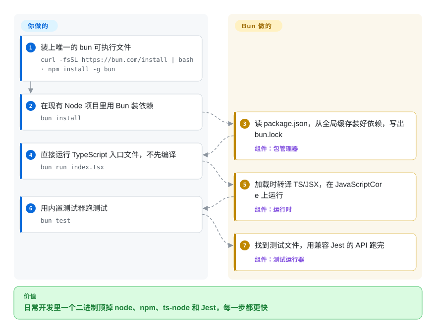

# Bun

一个普通的 TypeScript 项目要装 node、npm、ts-node、打包器和 Jest，各有各的配置，个个启动都慢；Bun 是一个二进制，直接运行 `.ts` 文件，同时负责装包、打包和跑测试，目标是直接顶替 Node.js。

## 何时使用

你维护一个跑在 Node.js 上的 TypeScript 服务或命令行工具，`package.json` 里已经长出一整套工具链：用 `ts-node` 或 `tsx` 跑代码，用 `npm` 或 `pnpm` 装包，用 `esbuild` 打包，用带 Babel 转换的 `jest` 跑测试。CI 里 `npm ci` 要一分多钟，`jest` 跑第一个用例前要先空转几秒，每个工具一份配置，还各自慢慢走样。你希望同一个项目照常工作——同样的 `package.json`、同样的 `node_modules`、同样的 npm 源——只是少几个零件、少等一会儿。**当“一个又快又兼容 Node 的二进制顶掉好几个工具”比 Node 本身久经考验的稳定性更值钱时**，选 Bun：`bun install`、`bun run index.ts`、`bun test`、`bun build --compile` 覆盖日常循环，中间不需要编译步骤。

工具链臃肿和启动慢是主要痛点、而且你的依赖树能在 Bun 的兼容层上跑通时，它胜过 Node.js；想让一个标准 `package.json` 项目原样提速、不想接受 Deno 的权限模型和约定时，它胜过 Deno。它可以分步引入——很多团队先用 `bun install` 和 `bun test`，生产环境仍跑 Node。

## 怎么用起来

Bun 是单个可执行文件：一个基于 JavaScriptCore（Safari 里的 JS 引擎，而不是 Chrome 和 Node 用的 V8）的 JavaScript 运行时，包管理器、打包器和测试运行器都编进了同一个二进制。从 v1.4（2026 年 8 月）起，整个代码库已从 Zig 重写为 Rust。你运行 `.ts` 或 `.tsx` 文件时，Bun 在加载每个文件时就把类型去掉、把 JSX 转好，所以没有编译步骤；它还实现了 Node 的内置模块（`node:fs`、`node:http` 等）和 `require`，这正是大多数 npm 包能原样运行的原因。`bun install` 读取你现有的 `package.json`，从磁盘上的全局缓存填好 `node_modules`，再写出它自己的 `bun.lock`。Bun 不承诺的是与 Node 完全一致：你的具体依赖和用到的 Node API 能不能跑，仍要你自己验证——这也是为什么引入它通常从包管理器和测试运行器开始。

<!-- flow-steps:begin (generated from flows/bun.json by tools/flow_card.py — do not edit) -->

流程文字版

1. **你**：装上唯一的 bun 可执行文件 — `curl -fsSL https://bun.com/install | bash · npm install -g bun`
2. **你**：在现有 Node 项目里用 Bun 装依赖 — `bun install`
3. **Bun**：读 package.json，从全局缓存装好依赖，写出 bun.lock — 组件：`包管理器`
4. **你**：直接运行 TypeScript 入口文件，不先编译 — `bun run index.tsx`
5. **Bun**：加载时转译 TS/JSX，在 JavaScriptCore 上运行 — 组件：`运行时`
6. **你**：用内置测试器跑测试 — `bun test`
7. **Bun**：找到测试文件，用兼容 Jest 的 API 跑完 — 组件：`测试运行器`

**价值**：日常开发里一个二进制顶掉 node、npm、ts-node 和 Jest，每一步都更快

<!-- flow-steps:end -->

## 何时不用

- 如果生产环境依赖 Bun 只实现了一部分的 Node API——它的 v1.4 发布说明里，`node:inspector` 只通过 Node 自身测试的 22/110，`node:test` 只通过 28/81——运行时继续用 Node.js，因为“还没有 100% 兼容”是项目自己的说法，缺口会在运行时才暴露，而不是安装时。
- 如果你的依赖里有基于 V8 C++ API（而不是 Node-API 这个稳定的插件接口）编译的原生插件，继续用 Node.js，因为 Bun 跑在 JavaScriptCore 上，只为个别包重新实现了它们需要的 V8 API。
- 如果你要以受限的文件、网络、环境变量权限运行不可信的第三方脚本，用 [Deno](deno.zh.md) 而不是 Bun，因为 Deno 默认全部拒绝，而 Bun 没有权限沙箱。
- 如果你承受不起一次刚完成的重写带来的回归——v1.4 在 2026 年 8 月把整个代码库从 Zig 换成了 Rust——生产环境继续用 Node.js，Bun 只拿来做 `bun install` / `bun test`，或者锁定一个你测过的 Bun 版本。
- 如果组织要求运行时由中立基金会治理，用 Node.js（OpenJS 基金会）而不是 Bun，因为 Bun 的路线图由一家公司掌握——Oven，现已并入 Anthropic——而且一位维护者贡献了一半以上的提交。
- 如果部署目标是老 Linux 主机（内核低于 5.1），或者缺少 Bun 默认构建所需指令集的 x64 CPU，用 Node.js，因为 Bun 文档建议内核 5.6+，老 CPU 上会报“illegal instruction”崩溃。

## 横向对比

| 替代品 | 是否收录 | 我们的评价 | 取舍 |
| --- | --- | --- | --- |
| Node.js | 未收录 | 生产服务要求每个依赖都和测试时表现完全一致时，选 Node.js；工具链臃肿和启动时间的代价超过残余兼容风险时，选 Bun。 | Node.js 是参考实现，有基金会治理、所有托管平台都支持，但 TypeScript 运行器、打包器和测试框架要你自己拼。 |
| [Deno](deno.zh.md) | ✅ | 想以默认权限隔离和 Web 标准 API 作为项目地基时选 Deno；目标是让现有 `package.json` 项目以最小改动提速时选 Bun。 | Deno 提供带沙箱、MIT 许可、自带 lint 和格式化的运行时，但会把你引向它自己的约定（`deno.json`、JSR、`npm:` 前缀），而不是原样的 Node 目录结构。 |
| pnpm | 未收录 | 只想在 Node 上装包更快、更省磁盘、依赖隔离更严时选 pnpm；还想把运行时和测试器装进同一个二进制时选 Bun。 | pnpm 完全不改变代码的运行方式，没有运行时兼容风险，但只解决装包这一步。 |
| Vitest | 未收录 | 测试必须共用 Vite 配置、并且要和生产一样跑在 Node 上时选 Vitest；最在意测试启动速度时选 `bun test`。 | Vitest 和生产用同一个引擎、能接入 Vite，`bun test` 启动更快，但测试跑在 JavaScriptCore 上而不是 V8。 |
| esbuild | 未收录 | 需要在 Node 工具链里放一个成熟的独立打包器时选 esbuild；已经在用 Bun、想用同一个工具打包并产出单文件可执行程序时选 `bun build`。 | esbuild 插件生态更大、也不用换运行时，但它是运行时之外的又一个工具，而不是运行时的一部分。 |

## 技术栈

- **Rust**——从 v1.4 起，运行时、包管理器、打包器和测试运行器都用 Rust 实现（由 Zig 重写而来）
- **JavaScriptCore / WebKit**——JavaScript 引擎，从 Oven 维护的 WebKit 分支静态链接
- **C / C++**——JavaScriptCore 绑定和静态链接的库（BoringSSL、uSockets、mimalloc、zstd 等）
- **TypeScript / JSX**——加载时转译；`bun check` 用 `typescript-go` 的移植版做类型检查

## 依赖

- 只需要一个 `bun` 二进制；可通过安装脚本、`npm install -g bun`、Homebrew 或 `oven/bun` Docker 镜像安装
- Linux x64/arm64（建议内核 5.6+，最低 5.1）、macOS x64/Apple Silicon、Windows x64/arm64
- npm 源（或你的私有源）提供包；现有 `package.json` 和 `node_modules` 原样使用
- 可选：需要 `node-gyp` 编译原生插件的包，要有 C 工具链

## 运维难度

**低。** 没有要运行的服务——它就是一个二进制，在 CI 和 Docker 镜像（`oven/bun`）里锁定版本即可。真正的运维成本在兼容性测试：切换生产运行时之前，用 Bun 跑一遍完整测试；关注更新日志（发版频繁，`main` 上每个提交都会出 canary 构建）；对表现异常的依赖保留 Node 后备。只把 `npm install` 换成 `bun install` 是代价最小的第一步，运行时完全不变。

## 健康度与可持续性

- **维护活跃度**：Grade A——过去一个季度每周都有提交；v1.4.0（2026-08-20）之后接连发布 v1.4.1 和 v1.4.2（2026-09-05）。
- **响应速度**：Grade A——14 个符合条件的 issue 中位首次响应时间 5.8 小时（2026-10-09），但仍有 9,389 个 issue 未关闭。
- **采用广度**：Grade A——按评分器 2026-10-09 的读数，npm 上的 `bun` 包上月下载 16,383,903 次、有 21,486 个依赖它的仓库，release 资产下载 127,091,598 次，Homebrew 90 天安装 18,512 次；Claude Code 这类大型应用就跑在它上面。
- **长青度**：Grade A——仓库已存在 2,003 天（2021-04-14 创建），2023 年进入 1.x，如今已换到第二种实现语言；Lindy 先验中等。
- **治理集中度**：Grade B——过去 12 个月有 61 位活跃提交者，但前三名占 85.5%，创始人一人占 57.7%；路线图属于已并入 Anthropic 的 Oven，延续性取决于这家公司的优先级，而不是基金会。
- **许可风险**：`?`（license_unparsed）——GitHub 显示 `NOASSERTION`，因为 `LICENSE.md` 是一份复合文件：Bun 本体是 MIT，静态链接的 JavaScriptCore/WebKit 是 LGPL-2，只有在你分发修改过的 Bun 时才多出“允许用户重新链接”的义务。

## 存疑（未验证）

- [推断] v1.4 的 Zig→Rust 重写刚发生不久，生产环境中的回归率还无法从发版历史判断。
- [推断] 被 Anthropic 收购后，优先级可能向其自家产品的需求倾斜；目前没有宣布更改 MIT 许可。
- [未验证] 速度说法（装包、测试、启动“明显更快”）来自项目自己的基准，本页没有复现。
- [未验证] 默认 x64 构建的具体 CPU 指令集要求没有从安装文档里逐条读到；部署到老硬件前请先核对。
