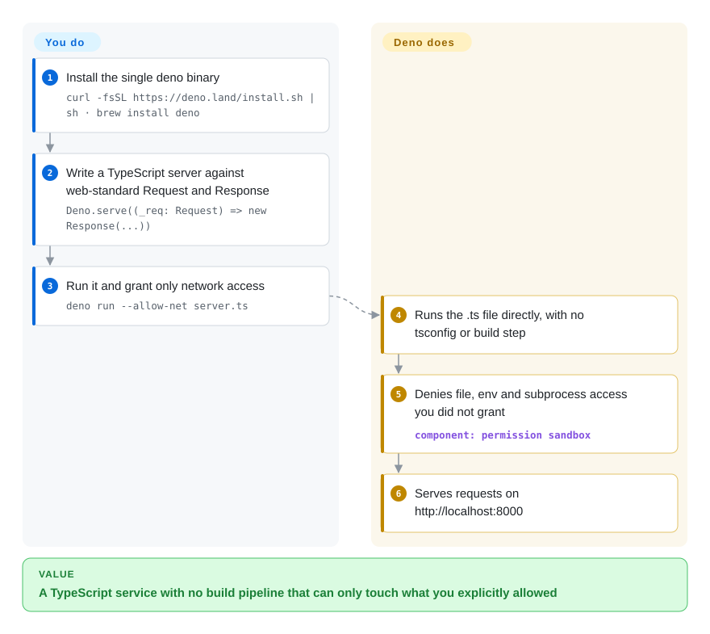

# Deno

Any npm package you install can read your SSH keys and environment variables the moment it runs, and running TypeScript still means wiring up a compiler, linter and test framework; Deno runs `.ts` directly with those tools built in, and a program can't touch files, network or env unless you grant it on the command line.

## When to use

You're starting a new TypeScript backend, internal CLI or automation script, and you are tired of the first hour of every Node project: `tsconfig.json`, `ts-node`, ESLint plus Prettier configs, a Jest setup, and a `node_modules` folder you don't trust — a single compromised dependency can `fetch` your `~/.aws/credentials` because Node gives every package the whole machine. Deno is the pick when **secure-by-default execution and a complete built-in toolchain** matter more than running an existing Node codebase unchanged: you write `.ts` files, run them with `deno run --allow-net server.ts`, and get `deno fmt`, `deno lint`, `deno test`, `deno check` and `deno compile` from the same binary. npm packages still work through `npm:` specifiers or a `package.json`, so you don't give up the ecosystem.

Pick it over Node.js when you're starting fresh and want TypeScript, tooling and a permission sandbox without assembling them; pick it over Bun when the sandbox and an MIT-licensed, eight-year-old runtime matter more than raw speed and drop-in Node compatibility.

## How it works

Deno is a single binary that embeds V8 (the JavaScript engine from Chrome) inside a Rust program, with Tokio — Rust's async I/O library — underneath for networking and files. When you run a `.ts` file, Deno strips the types itself, so there is no compile step; `deno check` does real type-checking when you ask for it. Every program starts with no access to the file system, network, environment variables or subprocesses: you grant each one with flags such as `--allow-net` or `--allow-read=./data`, and anything not granted is refused (or prompted for interactively). Think of it as an app on a phone that has to ask before using the camera, rather than a desktop program that can do anything. Dependencies come from JSR (Deno's own registry), npm via `npm:` specifiers, or URLs, cached globally; `deno compile` packs your program and the runtime into one executable for any supported OS. What stays on your side: choosing the permission flags, and checking that npm packages relying on Node-specific behavior work under Deno's compatibility layer.

<!-- flow-steps:begin (generated from flows/deno.json by tools/flow_card.py — do not edit) -->

Text version of the flow

1. **You**: Install the single deno binary — `curl -fsSL https://deno.land/install.sh | sh · brew install deno`
2. **You**: Write a TypeScript server against web-standard Request and Response — `Deno.serve((_req: Request) => new Response(...))`
3. **You**: Run it and grant only network access — `deno run --allow-net server.ts`
4. **Deno**: Runs the .ts file directly, with no tsconfig or build step
5. **Deno**: Denies file, env and subprocess access you did not grant — component: `permission sandbox`
6. **Deno**: Serves requests on http://localhost:8000

**Value**: A TypeScript service with no build pipeline that can only touch what you explicitly allowed

<!-- flow-steps:end -->

## When NOT to use

- If you are migrating a large existing Node.js application whose tooling assumes npm's exact `node_modules` layout, stay on Node.js — or try [Bun](bun.md) for a drop-in speed-up — because Deno's own docs say a few tools break on its layout and some Node APIs are only partly implemented.
- If your dependencies need native addons (Node-API), expect to give up most of the sandbox: Deno only loads them with a local `node_modules` and `--allow-ffi`, which lets native code do anything; Node.js is the more honest choice for addon-heavy apps.
- If the team knows only Node and the project is short-lived, use Node.js instead of Deno, because the permission flags, `deno.json` and JSR conventions are new things to learn with no time to pay back.
- If you want hosting you can move anywhere, don't build on Deno Deploy's platform features (its managed cron, tunnels and observability), because Deploy is a proprietary hosted service; ship a `deno compile` binary or a container to any host instead.
- If you need the edge-runtime API that Cloudflare Workers expose, use Cloudflare's workerd instead of Deno, because code written against `Deno.*` APIs does not run there unchanged.

## Comparison

| Alternative | In index | Our verdict | Tradeoff |
| --- | --- | --- | --- |
| Node.js | 未收录 | For an existing Node codebase or addon-heavy dependencies, stay on Node.js; for a new TypeScript service where you want a sandbox and built-in tooling, choose Deno. | Node.js runs every npm package exactly as published and is supported everywhere, but you assemble TypeScript, lint, format and test tooling yourself and every dependency gets full system access. |
| [Bun](bun.md) | ✅ | Choose Bun to speed up an existing `package.json` project with minimal change; choose Deno when the permission sandbox, MIT license and a longer track record weigh more than raw speed. | Bun aims at drop-in Node compatibility and faster installs and tests, but has no permission model and is owned by a single company. |
| workerd (Cloudflare Workers runtime) | 未收录 | Choose workerd when you target Cloudflare's edge and its isolate model; choose Deno for general servers, CLIs and scripts that need file system and subprocess access. | workerd is purpose-built for request-scoped edge workers with web-standard APIs, but it is not a general-purpose runtime for local tools. |

## Tech stack

- **Rust** — the runtime, CLI, permission system and built-in tools
- **V8** — JavaScript engine (via the `deno_core` crate, also reusable on its own)
- **Tokio** — async I/O runtime underneath networking, files and timers
- **TypeScript** — type-stripped on load; `deno check` type-checks on demand
- **WebAssembly** — Wasm modules can be imported alongside JS/TS

## Dependencies

- Only the `deno` binary; install via shell/PowerShell script, Homebrew, Chocolatey, WinGet or Scoop
- Packages from JSR, npm (`npm:` specifiers or `package.json`) or URLs, cached in `DENO_DIR`
- `deno compile` downloads a matching `denort` runtime per target the first time, then works offline; no C toolchain is needed
- Optional: a local `node_modules` and `--allow-ffi` for npm packages with native addons

## Ops difficulty

**Low.** It's one binary in CI and containers, and the built-in formatter, linter and test runner remove a pile of devDependencies to keep in sync. You can ship a self-contained executable with `deno compile` (cross-compiling with `--target`) or run under Deno Deploy. The ongoing work is permissions hygiene — keep the `--allow-*` flags tight in scripts and deploy configs instead of reaching for `-A` — and testing npm dependencies that rely on Node internals.

## Health & viability

- **Maintenance**: Grade A — commits every week of the last quarter; patch releases roughly every one to three weeks (v2.9.7 on 2026-09-17).
- **Responsiveness**: Grade A — median first response 19.2 hours across 20 qualifying issues/PRs.
- **Adoption**: Grade A — 7,922,831 monthly crates.io downloads of `deno_core` and 38,746,514 release-asset downloads; Supabase Edge Functions run on Deno.
- **Longevity**: Grade A — 3,068 days old (created 2018-05-15), past a 2.0 release that made npm and Node compatibility first-class, and still shipping; a solid Lindy prior.
- **Governance**: Grade A — 92 active committers in 12 months with the top three at 61.2%; the roadmap is owned by Deno Land Inc., a venture-backed company that also sells the Deno Deploy hosting service.
- **Risk / License**: Grade A — MIT, no relicense in the last 36 months. The commercial pull is toward Deno Deploy, not the runtime's license.

## Caveats (unverified)

- [未验证] Deno Land Inc.'s funding rounds and runway were not checked from primary sources.
- [推断] Because the company earns money from Deno Deploy, platform features may arrive there before (or instead of) the open-source runtime.
- [未验证] Node compatibility coverage was taken from Deno's docs summary, not measured against a specific project.
