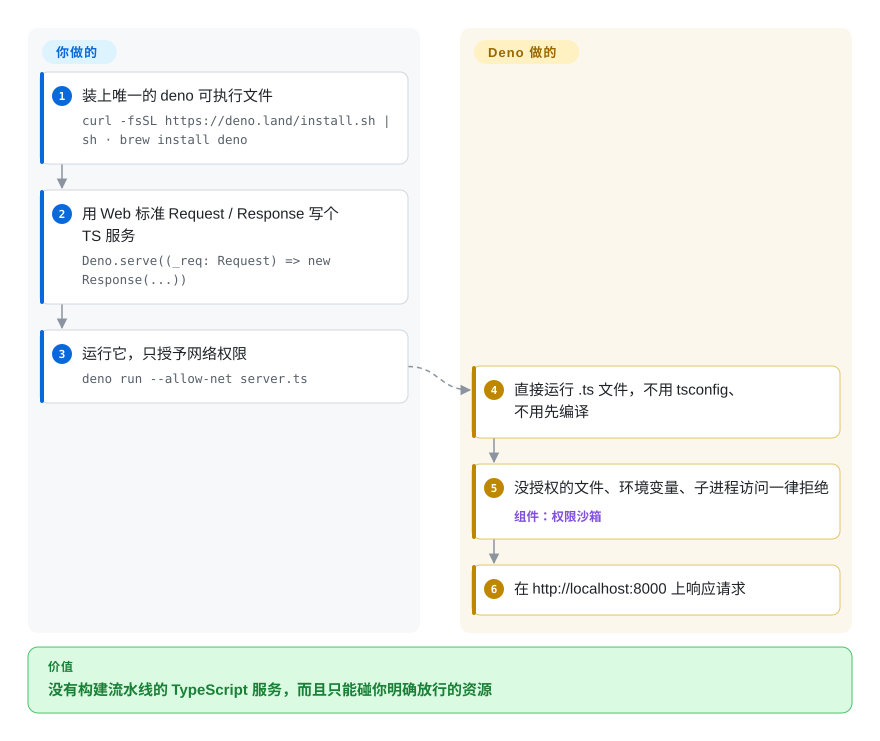

# Deno

你装的任何一个 npm 包，一运行就能读到你的 SSH 密钥和环境变量；而跑 TypeScript 还得先配编译器、lint 和测试框架。Deno 直接运行 `.ts`、这些工具全都内置，而且程序不经你在命令行授权，就碰不到文件、网络和环境变量。

## 何时使用

你要新起一个 TypeScript 后端、内部命令行工具或自动化脚本，已经受够了每个 Node 项目开头那一小时：`tsconfig.json`、`ts-node`、ESLint 加 Prettier 配置、Jest 设置，还有一个你并不信任的 `node_modules`——只要一个依赖被投毒，它就能 `fetch` 走你的 `~/.aws/credentials`，因为 Node 给每个包整台机器的权限。**当默认安全的执行方式和一整套内置工具链，比原样运行现有 Node 代码库更重要时**，选 Deno：你写 `.ts` 文件，用 `deno run --allow-net server.ts` 运行，同一个二进制里就有 `deno fmt`、`deno lint`、`deno test`、`deno check` 和 `deno compile`。npm 包仍可通过 `npm:` 前缀或 `package.json` 使用，生态不用放弃。

从零开始、想不拼装就拿到 TypeScript、工具链和权限沙箱时，它胜过 Node.js；沙箱、MIT 许可和八年历史比极致速度和对 Node 的原样兼容更重要时，它胜过 Bun。

## 怎么用起来

Deno 是单个二进制：一个 Rust 程序里嵌着 V8（Chrome 的 JavaScript 引擎），底下用 Tokio（Rust 的异步 I/O 库）处理网络和文件。运行 `.ts` 文件时，Deno 自己把类型去掉，所以没有编译步骤；需要真正的类型检查时再跑 `deno check`。每个程序启动时都没有文件系统、网络、环境变量和子进程的访问权：你用 `--allow-net`、`--allow-read=./data` 这类参数逐项授权，没授权的访问会被拒绝（交互模式下会弹出询问）。可以把它想成手机上的应用——要用相机得先问你——而不是想干什么就干什么的桌面程序。依赖来自 JSR（Deno 自己的包仓库）、通过 `npm:` 前缀引入的 npm 包，或者 URL，统一全局缓存；`deno compile` 能把程序和运行时打成一个可执行文件，面向任意受支持的系统。留给你的是：选好权限参数，以及确认依赖 Node 特有行为的 npm 包能在 Deno 的兼容层上跑通。

<!-- flow-steps:begin (generated from flows/deno.json by tools/flow_card.py — do not edit) -->

流程文字版

1. **你**：装上唯一的 deno 可执行文件 — `curl -fsSL https://deno.land/install.sh | sh · brew install deno`
2. **你**：用 Web 标准 Request / Response 写个 TS 服务 — `Deno.serve((_req: Request) => new Response(...))`
3. **你**：运行它，只授予网络权限 — `deno run --allow-net server.ts`
4. **Deno**：直接运行 .ts 文件，不用 tsconfig、不用先编译
5. **Deno**：没授权的文件、环境变量、子进程访问一律拒绝 — 组件：`权限沙箱`
6. **Deno**：在 http://localhost:8000 上响应请求

**价值**：没有构建流水线的 TypeScript 服务，而且只能碰你明确放行的资源

<!-- flow-steps:end -->

## 何时不用

- 如果你要迁移一个大型现有 Node.js 应用，而它的工具链假定 npm 那种精确的 `node_modules` 目录结构，继续用 Node.js——或者试试 [Bun](bun.zh.md) 来原样提速——因为 Deno 自己的文档承认少数工具会在它的目录结构上出问题，部分 Node API 也只实现了一部分。
- 如果你的依赖需要原生插件（Node-API），要做好放弃大部分沙箱的准备：Deno 只有在本地 `node_modules` 加 `--allow-ffi` 时才加载它们，而这等于允许原生代码为所欲为；插件密集的应用选 Node.js 更实在。
- 如果团队只会 Node、项目又是短期的，用 Node.js 而不是 Deno，因为权限参数、`deno.json` 和 JSR 约定都是新东西，没有时间回本。
- 如果你希望托管随时能搬走，别把系统建在 Deno Deploy 的平台功能上（托管 cron、隧道、可观测性），因为 Deploy 是专有托管服务；改为把 `deno compile` 出的二进制或容器部署到任意主机。
- 如果你需要 Cloudflare Workers 那套边缘运行时 API，用 Cloudflare 的 workerd 而不是 Deno，因为针对 `Deno.*` API 写的代码在那里不能原样运行。

## 横向对比

| 替代品 | 是否收录 | 我们的评价 | 取舍 |
| --- | --- | --- | --- |
| Node.js | 未收录 | 已有 Node 代码库或依赖里插件很多时，继续用 Node.js；新起的 TypeScript 服务想要沙箱和内置工具链时，选 Deno。 | Node.js 原样运行每个已发布的 npm 包、到处都支持，但 TypeScript、lint、格式化和测试工具要自己拼，每个依赖都拿到整台机器的权限。 |
| [Bun](bun.zh.md) | ✅ | 想以最小改动让现有 `package.json` 项目提速时选 Bun；权限沙箱、MIT 许可和更长的历史比极致速度更重要时选 Deno。 | Bun 追求原样兼容 Node、装包和测试更快，但没有权限模型，并且归属单一公司。 |
| workerd（Cloudflare Workers 运行时） | 未收录 | 目标是 Cloudflare 边缘和它的 isolate 模型时选 workerd；需要文件系统和子进程访问的通用服务、命令行和脚本选 Deno。 | workerd 专为按请求执行的边缘 worker 打造，提供 Web 标准 API，但不是用来跑本地工具的通用运行时。 |

## 技术栈

- **Rust**——运行时、命令行、权限系统和内置工具
- **V8**——JavaScript 引擎（通过 `deno_core` crate，它也可以单独复用）
- **Tokio**——网络、文件和定时器底下的异步 I/O 运行时
- **TypeScript**——加载时去掉类型；`deno check` 按需做类型检查
- **WebAssembly**——可以和 JS/TS 一起导入 Wasm 模块

## 依赖

- 只需要 `deno` 二进制；可通过 shell/PowerShell 脚本、Homebrew、Chocolatey、WinGet 或 Scoop 安装
- 包来自 JSR、npm（`npm:` 前缀或 `package.json`）或 URL，缓存在 `DENO_DIR`
- `deno compile` 第一次针对某个目标平台时会下载对应的 `denort` 运行时，之后可离线使用；不需要 C 工具链
- 可选：带原生插件的 npm 包需要本地 `node_modules` 和 `--allow-ffi`

## 运维难度

**低。** CI 和容器里只有一个二进制，内置的格式化、lint 和测试运行器省掉一堆要保持同步的 devDependencies。可以用 `deno compile` 交付自包含的可执行文件（用 `--target` 交叉编译），也可以跑在 Deno Deploy 上。持续要做的是权限卫生——在脚本和部署配置里把 `--allow-*` 收紧，而不是图省事用 `-A`——以及测试那些依赖 Node 内部行为的 npm 包。

## 健康度与可持续性

- **维护活跃度**：Grade A——过去一个季度每周都有提交；补丁版大约每一到三周一发（2026-09-17 发布 v2.9.7）。
- **响应速度**：Grade A——20 个 qualifying issues/PRs 的中位首次响应时间 19.2 小时。
- **采用广度**：Grade A——`deno_core` 在 crates.io 上月下载 7,922,831 次，release 资产下载 38,746,514 次；Supabase Edge Functions 就跑在 Deno 上。
- **长青度**：Grade A——仓库已存在 3,068 天（2018-05-15 创建），已经过让 npm 和 Node 兼容成为一等公民的 2.0 版本，仍在持续发版；Lindy 先验扎实。
- **治理集中度**：Grade A——过去 12 个月有 92 位活跃提交者，前三名占 61.2%；路线图由风投支持的 Deno Land Inc. 掌握，这家公司同时售卖 Deno Deploy 托管服务。
- **许可风险**：Grade A——MIT，过去 36 个月没有改许可。商业上的牵引力在 Deno Deploy，而不在运行时的许可证。

## 存疑（未验证）

- [未验证] Deno Land Inc. 的融资轮次和资金跑道没有从一手来源核实。
- [推断] 由于公司靠 Deno Deploy 赚钱，平台功能可能先进（甚至只进）Deploy，而不是开源运行时。
- [未验证] Node 兼容覆盖面取自 Deno 文档的概述，没有针对具体项目实测。
