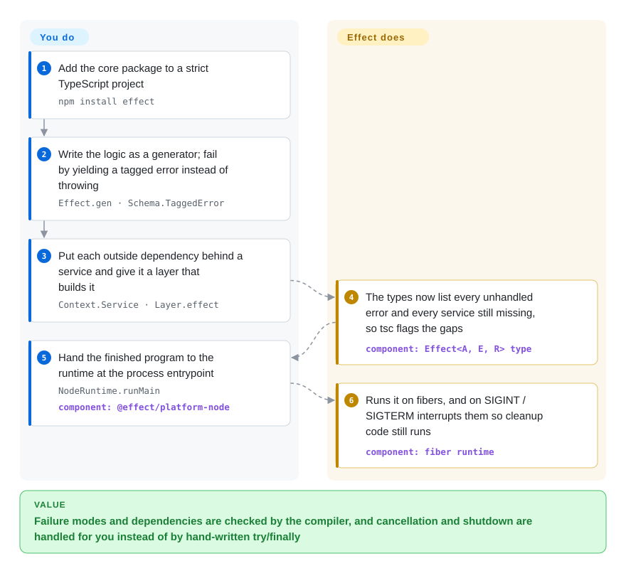

# Effect

A TypeScript signature like `Promise<User>` tells you what comes back but not how the call can fail or what it needs, so the timeout, the missing row and the database handle surface in production instead of in the editor. Effect turns each operation into a value whose type lists its result, its possible errors and the services it requires, and runs those values on its own scheduler, which can cancel, retry and trace them.

## When to use

You own a long-lived TypeScript backend — an API with a database, a queue consumer, a CLI that orchestrates several network calls — and the bugs that reach production are the ones the types never mentioned. A handler is declared `async (id: string): Promise<Order>`, and three layers down someone throws `new Error("timeout")`; nothing at the call site says so, the `catch (e)` receives `unknown`, and a request that was abandoned by the client keeps holding a connection because nobody threaded an `AbortSignal` through. You reach for Effect when you want those three facts — what can fail, what is needed, what must be cleaned up — written in the function's type and enforced by `tsc`.

The choice against substitutes is all-in-one versus piecemeal. A result-type helper gives you typed errors and nothing else; a schema library gives you validation at the boundary; a decorator-based framework gives you dependency injection resolved at run time. Effect replaces all of them with one model in which errors, dependencies, cancellation, retries, streaming and tracing compose, shipped as a single zero-dependency package. The price is that the model is viral: once a function returns an `Effect`, its callers must be Effect code too or explicitly run it — so it pays off when you can commit a whole service, not a corner of one.

## How it works

An `Effect` is a description of work, not the work itself — closer to a recipe card than a cooked meal, where a `Promise` is a meal already on the stove. Its type has three slots, `Effect<A, E, R>`: the success value, the errors it can fail with, and the services it needs (a service is a named dependency such as "the database", looked up by type rather than imported). You write the logic in a generator function with `yield*` where you would write `await`, fail by yielding a tagged error class instead of throwing, and describe how each service gets built in a `Layer` (a constructor recipe that can itself depend on other layers and that owns the cleanup). TypeScript does the bookkeeping: every `yield*` adds that step's errors and services to the surrounding type, handling an error removes it, and providing a layer removes a service — so the compiler refuses a program that still has an unprovided dependency. Nothing runs until you hand the value to a runner; then Effect's runtime executes it on fibers (lightweight threads scheduled by the library, not the operating system), and because every fiber knows its parent, interrupting one cancels its children and runs their finalizers. The same package also carries the things you would otherwise pull in separately — `Schema` for decoding untrusted data, streams, schedules, an HTTP client and server, SQL, RPC, a CLI builder, and cluster/workflow modules — and for an existing codebase you can run a single effect from ordinary Promise code with `Effect.runPromise` instead of handing over the whole process.

<!-- flow-steps:begin (generated from flows/effect.json by tools/flow_card.py — do not edit) -->

Text version of the flow

1. **You**: Add the core package to a strict TypeScript project — `npm install effect`
2. **You**: Write the logic as a generator; fail by yielding a tagged error instead of throwing — `Effect.gen · Schema.TaggedError`
3. **You**: Put each outside dependency behind a service and give it a layer that builds it — `Context.Service · Layer.effect`
4. **Effect**: The types now list every unhandled error and every service still missing, so tsc flags the gaps — component: `Effect<A, E, R> type`
5. **You**: Hand the finished program to the runtime at the process entrypoint — `NodeRuntime.runMain` — component: `@effect/platform-node`
6. **Effect**: Runs it on fibers, and on SIGINT / SIGTERM interrupts them so cleanup code still runs — component: `fiber runtime`

**Value**: Failure modes and dependencies are checked by the compiler, and cancellation and shutdown are handled for you instead of by hand-written try/finally

<!-- flow-steps:end -->

## When NOT to use

- **You only need to validate data at the edge.** Parsing a request body or an env file does not need a runtime, fibers or layers. Use Zod instead — one concept, the mainstream integrations — and keep Effect's `Schema` for when the rest of the code is already Effect.
- **You only want errors in the return type.** If the pain is "this function throws and the signature does not say so" and async/await is otherwise fine, neverthrow's `Result` type solves that without changing how the program runs. Effect's typed errors come bundled with its runtime; you cannot take one without the other.
- **The team, or half the codebase, will stay on plain async/await.** Effect is viral — callers of an Effect function become Effect code or call a runner at the boundary — and the generator style, layers and fiber semantics are a real paradigm to learn. For a conventional class-and-decorator structure with dependency injection that most Node developers already read fluently, use NestJS instead.
- **You need a stable API across the whole surface today.** 4.0.0 was published on 2026-10-01, one week before this page. The upstream migration guide marks `ai`, `cli`, `cluster`, `http`, `http-api`, `rpc`, `sql`, `workflow`, `workers` and others as `@stability unstable` (breaking changes allowed in minor releases), says every package other than `effect` is currently unstable, and allows experimental APIs to break in patch releases — the 4.0.2 patch already removed AI-telemetry options. If your product is an HTTP service that must not churn, build on the stable core only, or use NestJS for the server layer.
- **You have a working Effect v3 codebase with third-party Effect libraries.** v4 renames services (`Context.Tag` → `Context.Service`), the `catch*` family and forking combinators, removes `Runtime<R>`, flattens `Cause`, and folds `@effect/platform`, `@effect/rpc` and `@effect/cluster` into the core with no compatibility exports for the old import paths. Dependents lag: Prisma's `@prisma/config` 7.10.0 pins `effect` 3.20.0. Stay on v3 (the `v3` branch, last release 3.22.2 on 2026-09-09) until your dependencies move.
- **You need durable workflows that survive process crashes in production now.** `effect/workflow` and `effect/cluster` exist but sit in the unstable tier, and the most-upvoted open issue (#6369) asks for Temporal support. Use [Temporal](../../../workflow-orchestration/temporal.md) when durable execution is the requirement rather than a side feature.
- **Your toolchain is older than the floor.** Effect 4 requires TypeScript 5.9 or newer with the `strict` flag on, and Node.js 18 or newer (some packages need more — `@effect/sql-sqlite-node` needs Node 22.16). A non-strict or older-compiler codebase should fix that first, or stay with async/await plus a small helper such as neverthrow.

## Comparison

| Alternative | In index | Our verdict | Tradeoff |
| --- | --- | --- | --- |
| fp-ts | not indexed | For new work choose Effect: fp-ts's own README announces that the project is merging into the Effect ecosystem and calls Effect the successor to fp-ts v2, so fp-ts is the choice only for maintaining code already written against it. | fp-ts: pure data types and type classes with no runtime, a smaller thing to reason about, but no fibers, layers or built-in schema and its future lives in Effect. Effect: the full runtime and toolkit, at the cost of a larger model. Not added in this tab batch. |
| neverthrow | not indexed | When the only goal is making failure visible in return types inside ordinary async/await code, pick neverthrow; pick Effect when cancellation, dependency injection and retries must share the same model as the errors. | neverthrow: a `Result` type you can adopt one function at a time, but nothing for concurrency or resources. Effect: everything composes, but adoption is all-or-boundary. Not added in this tab batch. |
| Zod | not indexed | For validating and typing data at the edges of an otherwise conventional app, pick Zod; pick Effect's `Schema` when the decoded values feed Effect code and you also want encoding back to the wire format from the same definition. | Zod: one focused concept with the widest ecosystem of integrations. Effect: validation is one module of a framework you must otherwise buy into. Not added in this tab batch. |
| NestJS | not indexed | When the team wants a conventional server framework — classes, decorators, a module system, run-time dependency injection — pick NestJS; pick Effect when you want missing dependencies and unhandled errors to be compile errors. | NestJS: familiar structure and a large plugin ecosystem, but injection failures and thrown exceptions appear at run time. Effect: both are checked by `tsc`, paid for with a steeper learning curve and a young 4.x server API. Not added in this tab batch. |
| [Temporal](../../../workflow-orchestration/temporal.md) | ✅ | When a business process must resume exactly where it stopped after a crash or a week-long wait, run it on Temporal; use Effect for the in-process logic — retries, timeouts, typed failures — that does not need a separate durable server. | Temporal: durable execution with a server and persistence store to operate. Effect: a library inside your process, with workflow and cluster modules that are still marked unstable. |

## Tech stack

- **TypeScript**, shipped as ES modules with type declarations; the published `effect` 4.0.2 manifest declares no runtime dependencies and no peer dependencies
- **A fiber runtime** written in TypeScript — rewritten for v4 — on top of the host's event loop; no native code
- **One core package with subpath modules**: `effect/http`, `effect/http-api`, `effect/rpc`, `effect/sql`, `effect/cli`, `effect/cluster`, `effect/workflow`, `effect/ai`, `effect/schema`, `effect/observability` and more
- **Adapter packages released at the same version**: `@effect/platform-{node,bun,deno,browser}`, twelve `@effect/sql-*` drivers (PostgreSQL, MySQL, SQL Server, ClickHouse, libSQL, D1, PGlite, SQLite variants), `@effect/ai-*` providers, `@effect/opentelemetry`, `@effect/atom-{react,solid,vue}`, `@effect/vitest`
- **Monorepo tooling**: pnpm workspaces, changesets, Vitest, tstyche type tests; the npm package also ships `AGENTS.md`, `CLAUDE.md` and an `ai-docs/` tree for coding agents

## Dependencies

- **Compiler**: TypeScript 5.9 or newer with `strict` enabled (upstream recommends TypeScript 7 for its own tooling)
- **Runtime**: Node.js 18 or newer in general; Bun, Deno and browsers through the matching `@effect/platform-*` package. Individual adapters raise the floor (`@effect/sql-sqlite-node` needs Node 22.16+)
- **No services to run**: it is a library in your process. A database, an OpenTelemetry collector or an LLM provider is needed only if you use the corresponding adapter
- **Version lockstep**: every `@effect/*` package must match the `effect` version exactly — in v4 they share one version number

## Ops difficulty

**Low to operate, high to adopt.** There is nothing to deploy: no daemon, no datastore, zero runtime dependencies. The cost is in people and upgrades. The programming model takes real time to learn and cannot be introduced invisibly; upgrades need discipline because the stable core and the unstable modules move on different rules inside the same package (pin exact versions, read the changeset for every bump); and stack traces and debugging go through the library's fibers and spans rather than plain call stacks, so you will want its tracing wired to OpenTelemetry early.

## Health & viability

- **Maintenance — very active (checked 2026-10-08):** the last push was the same day; 4.0.2 was released 2026-10-07, six days after 4.0.0; 444 pull requests were merged between 2026-09-08 and 2026-10-08.
- **Governance / bus factor:** a single vendor. The LICENSE copyright holder is Effectful Technologies Inc and the README routes support requests to it; three people (tim-smart, mikearnaldi, gcanti) account for most of the commit history. No foundation, no published governance document.
- **Backing & age:** the repository dates from 2019-11-13, so the project and its core team are about seven years old and still active — a good Lindy signal for the *team*. The *API* is much younger: 2.0.0 shipped in 2024-01, 3.0.0 in 2024-04 and 4.0.0 in 2026-10, each a breaking line. The README now commits 4.x to at least three years of bug and security fixes; that promise is one week old and untested.
- **Adoption:** 159,952,985 npm downloads in the month to 2026-10-04 (about 160 million). Treat the number with care — much of it is transitive, since packages such as Prisma's `@prisma/config` depend on `effect`, and that particular dependent still pins v3 [推断] (read from that package's npm manifest; download sources were not split).
- **Risk flags:** one published advisory, CVE-2026-32887 (high, published 2026-03-20): `AsyncLocalStorage` context was lost or contaminated across fibers under concurrent RPC load, affecting `effect` ≤ 3.19.15 and fixed in 3.20.0 — a reminder that a custom scheduler interacts with libraries that assume Node's own async context. MIT with no relicensing found; commercial support is described as something the vendor is "exploring", via paid adoption partners.

## Caveats (unverified)

- [未验证] The bundle-size figures (about 6.3 KB minified and gzipped for a minimal program, about 15 KB with Schema) and the "faster, lower memory" claim for the rewritten v4 runtime come from the upstream migration guide; no bundle was built and no benchmark was run here.
- [推断] That npm downloads are dominated by transitive installs is inferred from one verified dependent (`@prisma/config` 7.10.0 lists `effect` 3.20.0); the split between direct and transitive use was not measured.
- [未验证] Effectful Technologies' funding and revenue model: only the LICENSE copyright line and the README's contact and "adoption partners" text were read; no primary source on funding was checked.
- [未验证] The README's LTS guarantee (three years of fixes for 4.x) is a statement of intent published with a release that is one week old; there is no track record to check it against, and the README does not state an end-of-support date for v3.
- [未验证] The minimum TypeScript and Node versions of the substitutes named above (neverthrow, Zod, NestJS) were not checked, so "they work on an older toolchain" is not asserted for any specific version.
- [推断] The high merge rate is partly produced with coding agents: the repository has many `agent/…` branches, an `.agents/` directory and an `effect-bot` account among recent pull-request authors. How much of the merged code is agent-written and how it is reviewed was not established.
- [未验证] Stability tiers were read from MIGRATION.md, not audited module by module in the API reference; the list of unstable modules may have changed since 4.0.0.
