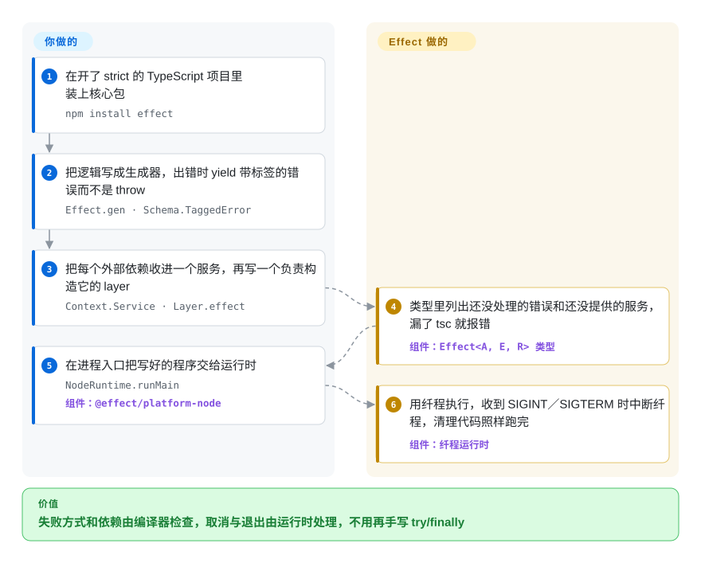

# Effect

TypeScript 里一个 `Promise<User>` 的签名只告诉你成功时拿到什么，不告诉你它会怎么失败、要用到什么，于是超时、查不到记录、数据库连接这些事都要等上线了才冒出来。Effect 把每个操作变成一个值，类型里同时写明结果、可能的错误和需要的服务，再交给它自己的调度器去执行，取消、重试、追踪都由调度器负责。

## 何时使用

你负责一个要长期维护的 TypeScript 后端：带数据库的 API、队列消费者，或者一个要串起好几次网络调用的 CLI。漏到线上的 bug，恰好都是类型里没提的那些。处理函数写的是 `async (id: string): Promise<Order>`，往下三层有人 `throw new Error("timeout")`，调用处完全看不出来，`catch (e)` 拿到的是 `unknown`；客户端早就断开了，请求还占着一条连接，因为没人把 `AbortSignal` 一层层传下去。当你希望“会怎么失败、需要什么、要清理什么”这三件事直接写进函数类型，并由 `tsc` 强制检查时，就该想到 Effect。

它和替代品的区别是“一整套”对“单点”。Result 类型的小工具只给你带类型的错误；schema 库只管边界上的数据校验；装饰器风格的框架给你依赖注入，但要到运行时才解析。Effect 用同一个模型把这些全换掉，错误、依赖、取消、重试、流和追踪可以互相组合，而且只是一个零依赖的包。代价是它会传染：一个函数一旦返回 `Effect`，调用它的代码要么也写成 Effect，要么显式地运行它。所以它适合你能把整个服务都交给它的时候，不适合只改一个角落。

## 怎么用起来

`Effect` 描述的是要做的事，不是已经在做的事：它像一张菜谱卡，而 `Promise` 是已经下锅的菜。它的类型有三个位置，`Effect<A, E, R>`：成功时的值、可能失败的错误、需要的服务（服务就是一个有名字的依赖，比如“数据库”，按类型去取，而不是直接 import）。逻辑写在生成器函数里，原来写 `await` 的地方写 `yield*`；出错时不 throw，而是 yield 一个带标签的错误类；每个服务怎么构造，写在一个 `Layer` 里（一份构造说明，可以依赖别的 layer，也负责收尾清理）。记账的活由 TypeScript 干：每个 `yield*` 把那一步的错误和服务并进外层类型，处理掉一个错误就从类型里去掉它，提供一个 layer 就去掉一个服务，所以依赖没给全的程序编译不过。在你把这个值交给运行函数之前，什么都不会执行；交出去之后，Effect 的运行时用纤程来跑它（纤程是由库自己调度的轻量线程，不是操作系统线程），每条纤程都知道自己的父纤程，中断其中一条，它的子纤程会一起取消，收尾代码也会执行。同一个包里还带着你原本要另外装的东西：解码不可信数据的 `Schema`、流、调度策略、HTTP 客户端和服务端、SQL、RPC、CLI 构建器，以及集群和工作流模块。已有代码库不必整个进程都交出去，可以在普通 Promise 代码里用 `Effect.runPromise` 只运行一个 effect。

<!-- flow-steps:begin (generated from flows/effect.json by tools/flow_card.py — do not edit) -->

流程文字版

1. **你**：在开了 strict 的 TypeScript 项目里装上核心包 — `npm install effect`
2. **你**：把逻辑写成生成器，出错时 yield 带标签的错误而不是 throw — `Effect.gen · Schema.TaggedError`
3. **你**：把每个外部依赖收进一个服务，再写一个负责构造它的 layer — `Context.Service · Layer.effect`
4. **Effect**：类型里列出还没处理的错误和还没提供的服务，漏了 tsc 就报错 — 组件：`Effect<A, E, R> 类型`
5. **你**：在进程入口把写好的程序交给运行时 — `NodeRuntime.runMain` — 组件：`@effect/platform-node`
6. **Effect**：用纤程执行，收到 SIGINT／SIGTERM 时中断纤程，清理代码照样跑完 — 组件：`纤程运行时`

**价值**：失败方式和依赖由编译器检查，取消与退出由运行时处理，不用再手写 try/finally

<!-- flow-steps:end -->

## 何时不用

- **你只需要在边界上校验数据。** 解析请求体或环境变量文件，用不着运行时、纤程和 layer。改用 Zod：只有一个概念，主流集成最全。Effect 的 `Schema` 留到其余代码已经是 Effect 的时候再用。
- **你只想让错误出现在返回类型里。** 如果痛点只是“这个函数会 throw，签名里却没写”，async/await 其他方面都够用，那么 neverthrow 的 `Result` 类型就能解决，不改变程序的运行方式。Effect 的带类型错误和它的运行时是捆在一起的，不能只拿一半。
- **团队或者一半的代码库会继续写普通 async/await。** Effect 会传染：调用 Effect 函数的代码要么变成 Effect，要么在边界上调用运行函数；生成器写法、layer 和纤程语义是一整套要学的范式。如果要的是大多数 Node 开发者一眼能看懂的类加装饰器结构，外加依赖注入，改用 NestJS。
- **你现在就需要整个 API 面都稳定。** 4.0.0 发布于 2026-10-01，距本页写成只有一周。上游迁移指南把 `ai`、`cli`、`cluster`、`http`、`http-api`、`rpc`、`sql`、`workflow`、`workers` 等模块标为 `@stability unstable`（小版本里允许破坏性变更），并说明 `effect` 之外的所有包目前都是 unstable，experimental 的 API 在补丁版本里也可以变；4.0.2 这个补丁版本就已经删掉了一批 AI 遥测选项。如果你的产品是一个不能跟着折腾的 HTTP 服务，只用稳定的核心部分，或者服务端那一层改用 NestJS。
- **你已经有一个跑着的 Effect v3 代码库，还依赖第三方 Effect 库。** v4 改了服务的定义方式（`Context.Tag` → `Context.Service`）、`catch*` 系列和 fork 系列的名字，删除了 `Runtime<R>`，把 `Cause` 拍平，并把 `@effect/platform`、`@effect/rpc`、`@effect/cluster` 并进核心包，旧的 import 路径没有兼容导出。下游跟进有延迟：Prisma 的 `@prisma/config` 7.10.0 仍然锁在 `effect` 3.20.0。在依赖跟上之前，留在 v3（`v3` 分支，最后一个版本是 2026-09-09 的 3.22.2）。
- **你现在就需要进程崩溃后还能接着跑的持久化工作流。** `effect/workflow` 和 `effect/cluster` 已经有了，但都在 unstable 这一档，目前点赞最多的未关闭 issue（#6369）要的正是对 Temporal 的支持。如果持久执行是硬需求而不是顺带的功能，改用 [Temporal](../../../workflow-orchestration/temporal.zh.md)。
- **你的工具链低于它的下限。** Effect 4 要求 TypeScript 5.9 及以上并打开 `strict`，Node.js 18 及以上（个别包更高，`@effect/sql-sqlite-node` 需要 Node 22.16）。没开 strict 或编译器版本偏旧的代码库应该先解决这个问题，或者继续用 async/await，配一个 neverthrow 这样的小工具。

## 横向对比

| 替代品 | 是否收录 | 我们的评价 | 取舍 |
| --- | --- | --- | --- |
| fp-ts | 未收录 | 新项目选 Effect：fp-ts 自己的 README 宣布项目并入 Effect 生态，并称 Effect 是 fp-ts v2 的继任者，所以只有在维护已经基于 fp-ts 写好的代码时才继续用它。 | fp-ts：只有纯数据类型和 type class，没有运行时，要理解的东西更少，但没有纤程、layer 和内置 schema，后续演进都在 Effect 里。Effect：完整的运行时和工具集，代价是模型更大。本轮标签批次未收录。 |
| neverthrow | 未收录 | 如果目标只是在普通 async/await 代码里让失败出现在返回类型中，选 neverthrow；如果取消、依赖注入和重试要和错误共用同一个模型，选 Effect。 | neverthrow：一个 `Result` 类型，可以一个函数一个函数地引入，但不管并发和资源。Effect：所有能力可以组合，但引入方式只有“全用”或“在边界上运行”两种。本轮标签批次未收录。 |
| Zod | 未收录 | 在一个其余部分都很常规的应用里，只在边界上校验数据并得到类型，选 Zod；如果解码出来的值要喂给 Effect 代码，并且想从同一份定义再编码回传输格式，选 Effect 的 `Schema`。 | Zod：只做一件事，集成生态最广。Effect：校验只是框架里的一个模块，其余部分你也得一起接受。本轮标签批次未收录。 |
| NestJS | 未收录 | 团队想要常规的服务端框架，也就是类、装饰器、模块系统和运行时依赖注入时，选 NestJS；如果想让漏掉的依赖和没处理的错误直接变成编译错误，选 Effect。 | NestJS：结构熟悉，插件生态大，但注入失败和抛出的异常要到运行时才看得到。Effect：两者都由 `tsc` 检查，代价是学习曲线更陡，4.x 的服务端 API 还很新。本轮标签批次未收录。 |
| [Temporal](../../../workflow-orchestration/temporal.zh.md) | ✅ | 一个业务流程在崩溃或者等了一周之后必须从停下的地方接着跑，就放到 Temporal 上；不需要独立持久化服务的进程内逻辑，比如重试、超时、带类型的失败，用 Effect。 | Temporal：持久执行，但要运维一个服务端和一套持久化存储。Effect：进程里的一个库，工作流和集群模块还标着 unstable。 |

## 技术栈

- **TypeScript**，以 ES 模块加类型声明的形式发布；已发布的 `effect` 4.0.2 清单里没有声明任何运行时依赖和 peer 依赖
- **纤程运行时**：用 TypeScript 写成，v4 重写过，跑在宿主的事件循环之上，没有原生代码
- **一个核心包加子路径模块**：`effect/http`、`effect/http-api`、`effect/rpc`、`effect/sql`、`effect/cli`、`effect/cluster`、`effect/workflow`、`effect/ai`、`effect/schema`、`effect/observability` 等
- **同版本号发布的适配包**：`@effect/platform-{node,bun,deno,browser}`，十二个 `@effect/sql-*` 驱动（PostgreSQL、MySQL、SQL Server、ClickHouse、libSQL、D1、PGlite 和几种 SQLite），`@effect/ai-*` 模型提供方，`@effect/opentelemetry`，`@effect/atom-{react,solid,vue}`，`@effect/vitest`
- **monorepo 工具**：pnpm workspaces、changesets、Vitest、tstyche 类型测试；npm 包里还带着给编码 agent 读的 `AGENTS.md`、`CLAUDE.md` 和 `ai-docs/` 目录

## 依赖

- **编译器**：TypeScript 5.9 及以上，并打开 `strict`（上游为了配合自家工具推荐 TypeScript 7）
- **运行环境**：通常是 Node.js 18 及以上；Bun、Deno 和浏览器通过对应的 `@effect/platform-*` 包支持。个别适配包要求更高（`@effect/sql-sqlite-node` 需要 Node 22.16 以上）
- **不需要另起服务**：它是你进程里的一个库。只有用到对应适配包时，才需要数据库、OpenTelemetry collector 或 LLM 提供方
- **版本必须对齐**：所有 `@effect/*` 包的版本要和 `effect` 完全一致，v4 里它们共用一个版本号

## 运维难度

**运行成本低，引入成本高。** 没有东西要部署：没有守护进程，没有数据存储，运行时依赖为零。成本在人和升级上。这套编程模型要花实打实的时间去学，也没法悄悄引入；升级要有纪律，因为同一个包里稳定的核心和 unstable 的模块按不同规则变动（锁死精确版本，每次升级都读 changeset）；调用栈和调试走的是库自己的纤程和 span，而不是普通调用栈，所以最好尽早把它的追踪接到 OpenTelemetry 上。

## 健康度与可持续性

- **维护：非常活跃（2026-10-08 查证）。** 最后一次 push 就在当天；4.0.2 发布于 2026-10-07，距 4.0.0 六天；2026-09-08 到 2026-10-08 之间合并了 444 个 PR。
- **治理与 bus factor：** 单一厂商。LICENSE 的版权方是 Effectful Technologies Inc，README 也把支持请求引到这家公司；三个人（tim-smart、mikearnaldi、gcanti）贡献了提交历史的大部分。没有基金会，也没有公开的治理文档。
- **背书与年龄：** 仓库创建于 2019-11-13，项目和核心团队已有约七年并且仍然活跃，对**团队**来说是不错的 Lindy 信号。**API** 则年轻得多：2.0.0 发布于 2024-01，3.0.0 发布于 2024-04，4.0.0 发布于 2026-10，每一条都是破坏性的新线。README 现在承诺 4.x 至少有三年的 bug 和安全修复；这个承诺才发出一周，还没经过检验。
- **采用度：** 截至 2026-10-04 的一个月里 npm 下载量为 159,952,985 次（约 1.6 亿）。这个数字要打折看：其中很大一部分是间接安装，比如 Prisma 的 `@prisma/config` 就依赖 `effect`，而且这个下游还锁在 v3 上 [推断]（依据是该包的 npm 清单，没有拆分下载来源）。
- **风险信号：** 有一条已发布的安全公告 CVE-2026-32887（高危，2026-03-20 发布）：并发 RPC 负载下，`AsyncLocalStorage` 上下文在纤程之间丢失或串号，影响 `effect` 3.19.15 及以下，3.20.0 修复。这提醒你，自带调度器的库和那些假定使用 Node 原生异步上下文的库放在一起会出问题。许可证是 MIT，没有发现改许可证的历史；商业支持在 README 里的说法是厂商“正在探索”，目前通过付费的 adoption partners 提供。

## 存疑（未验证）

- [未验证] 包体积数字（最小程序压缩后约 6.3 KB，带 Schema 约 15 KB）以及 v4 重写后的运行时“更快、内存更省”的说法，都来自上游迁移指南；这里没有实际打包，也没有跑基准测试。
- [推断] “npm 下载量主要来自间接安装”是从一个已核实的下游推出来的（`@prisma/config` 7.10.0 的依赖里有 `effect` 3.20.0）；直接使用和间接使用各占多少没有测量。
- [未验证] Effectful Technologies 的融资和收入模式：只读了 LICENSE 的版权行，以及 README 里的联系方式和 adoption partners 文字，没有查关于融资的一手来源。
- [未验证] README 的 LTS 承诺（4.x 三年修复）是随一个刚发布一周的版本给出的意向声明，没有过往记录可以对照；README 也没有写 v3 的支持截止日期。
- [未验证] 上面点到的替代品（neverthrow、Zod、NestJS）各自要求的最低 TypeScript 和 Node 版本没有查，所以本页没有断言它们在哪个具体的旧版本上能用。
- [推断] 很高的合并速度有一部分来自编码 agent：仓库里有大量 `agent/…` 分支和一个 `.agents/` 目录，近期 PR 作者里有 `effect-bot` 账号。合并的代码里有多少由 agent 写成、怎么审查，没有查清。
- [未验证] 稳定性分档读自 MIGRATION.md，没有到 API 文档里逐个模块核对；unstable 模块的清单在 4.0.0 之后可能已经变化。
