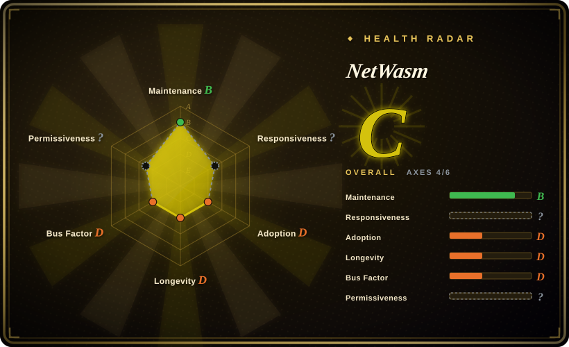
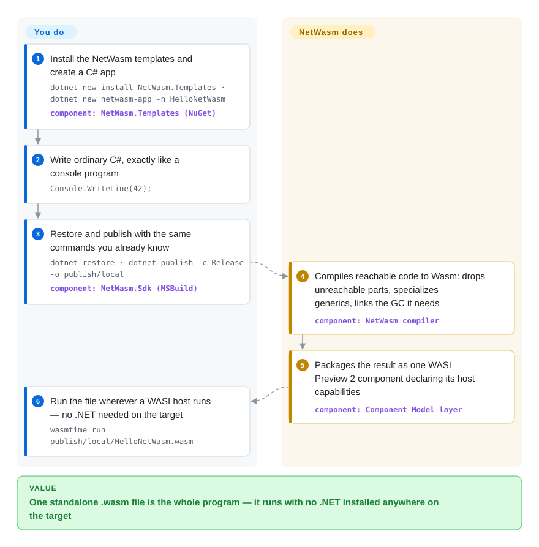

# NetWasm

Shipping C# to WebAssembly normally means shipping the .NET runtime along: the host downloads a runtime, your DLLs, and the glue between them before your program prints anything. NetWasm compiles only the code your program can actually reach into one standalone `.wasm` file — garbage collection linked in, roughly 84 KiB for a hello-world — which runs on any WebAssembly host with no .NET installed anywhere on the target.

## When to use

You write C# and you need the program to run in places where "install .NET first" is disqualifying: a plugin a WASI host loads, a compute module embedded in someone else's application, a workload shipped to an edge runtime or a browser tab. The official .NET-in-Wasm route (Blazor / browser-wasm) makes the runtime part of the deployment; NetWasm's pitch is the opposite — *build with .NET, run without it* — so you reach for it when one small, self-contained component is the deciding constraint: `Console.WriteLine(42);` publishes as an 84,513-byte WASI Preview 2 component with GC and runtime support linked in, runnable by `wasmtime run` alone.

The tradeoff that defines the choice: NetWasm is C# with a deliberately smaller platform contract (its README models itself on Kotlin/Wasm's portable-API idea, not on desktop compatibility), versus the Microsoft runtime's full desktop API surface at many-megabyte payload. You also accept its boundary honestly: no runtime reflection or `dynamic`, no managed threads (single-reactor async only), no general `System.IO.File`/sockets/subprocess, existing NuGet packages only when their reachable code fits the profile. If C# is the hard constraint and "one file, tiny, capability-declared" is the win condition, this is the only public path today that gets you there; if the language is negotiable, TinyGo or Kotlin/Wasm are the older bets in the same shape, and if API completeness wins, the official .NET wasm runtime wins.

## How it works

Roslyn does what it always does — C# to CIL, the bytecode .NET compilers emit — and NetWasm replaces everything after that. Its own compiler reads ECMA-335 metadata, walks every method reachable from your entry point (closed-world means unreachable code, unused generics, and unreferenced packages are never compiled), specializes generics down to their concrete uses, and lowers CIL directly to WebAssembly: no interpreter, no JIT, no CLR or Mono shipped as a platform. Whatever survived code needs from "the runtime" — a precise garbage collector (Boehm-lineage C modules; the compiler computes the exact roots so the collector needs no conservative scan), exception and string support — is linked into the module itself, MIT-licensed. Finally the component layer binds the WIT interfaces (WebAssembly's interface-definition language) the program actually imports and packages everything as one WASI Preview 2 component: the file declares which host capabilities it needs — clocks, HTTP, randomness, mounted directories — and the host grants exactly those, nothing ambient. You do the normal .NET loop (`dotnet new` / `restore` / `build` / `run` / `publish` / `test`); the toolchain itself arrives as NuGet packages, and the first `dotnet restore` pulls pinned Node, `wasm-ld` and Binaryen so no build-machine toolchain install is required.

<!-- flow-steps:begin (generated from flows/netwasm.json by tools/flow_card.py — do not edit) -->

Text version of the flow

1. **You**: Install the NetWasm templates and create a C# app — `dotnet new install NetWasm.Templates · dotnet new netwasm-app -n HelloNetWasm` — component: `NetWasm.Templates (NuGet)`
2. **You**: Write ordinary C#, exactly like a console program — `Console.WriteLine(42);`
3. **You**: Restore and publish with the same commands you already know — `dotnet restore · dotnet publish -c Release -o publish/local` — component: `NetWasm.Sdk (MSBuild)`
4. **NetWasm**: Compiles reachable code to Wasm: drops unreachable parts, specializes generics, links the GC it needs — component: `NetWasm compiler`
5. **NetWasm**: Packages the result as one WASI Preview 2 component declaring its host capabilities — component: `Component Model layer`
6. **You**: Run the file wherever a WASI host runs — no .NET needed on the target — `wasmtime run publish/local/HelloNetWasm.wasm`

**Value**: One standalone .wasm file is the whole program — it runs with no .NET installed anywhere on the target

<!-- flow-steps:end -->

## When NOT to use

- **Your program (or its NuGet graph) leans on reflection, `dynamic`, or runtime assembly loading.** Runtime type-name lookup is unsupported *by design* — it is what keeps type-name metadata out of the artifact — so EF Core, Newtonsoft.Json, and most reflection-driven packages fail rather than degrade. If that stack is load-bearing, stay on desktop/server .NET or the official wasm runtime (dotnet/runtime); NetWasm's substitute is its source-generated, reflection-free ports (JSON, DI, XML) and the compiler rejects anything else with diagnostics.
- **You need general filesystem, raw sockets, subprocesses, or managed threads.** `System.IO.File`/`Directory`, `System.Net.Sockets`, `System.Diagnostics.Process`, thread pool and `Task.Run` parallelism are not implemented as public managed APIs, and file APIs are explicitly deferred until after the WASI 0.3 migration. Concurrency is single-reactor (async tasks, cancellation, timers) only. Use the official .NET runtime, or Go/Kotlin wasm equivalents, when these are requirements rather than nice-to-haves.
- **Your organization is above 250 employees or USD 10M annual revenue, or you want OSI-style open source for the toolchain.** The compiler, SDK, linker, and developer tooling are under the custom NetWasm Community License 1.0 (GitHub reports `NOASSERTION`): free only for individuals, education, qualifying open-source work, evaluation, and small organizations; larger organizations must hold a per-developer GitHub Sponsors tier ($149–$2,499/month as published 2026-09-29), and bundling, redistributing, or offering compilation-as-a-service needs a separate written agreement with the anonymous licensor. CoreLib/runtime/templates and generated output are MIT. If legal wants a plain MIT/Apache toolchain, use dotnet/runtime.
- **You are betting on a maintained platform, not an experiment.** The repo is ~7 weeks old, one pseudonymous maintainer wrote and self-merged every pull request, there are 0 forks, and pre-1.0 releases explicitly warn that source, package, target-profile and ABI contracts change between minor releases. For anything you must defend in an architecture review, pin versions and contain the blast radius, or choose the official runtime with its LTS contract.
- **You need a wasm64 *component*.** Component packaging for Memory64 is blocked by upstream Component Model tooling; NetWasm fails the request immediately (`NW1010`) rather than silently downgrading. Use wasm32 components, or wasm64 only through the explicit raw-core JavaScript adapter on a Memory64-capable host.
- **You want a C# UI framework in the browser.** DOM, fetch, and storage are not implicit services; browser access is explicit JavaScript imports in raw-core mode. For UI apps, Blazor or Uno Platform are the actual C# browser stacks.

## Comparison

| Alternative | In index | Our verdict | Tradeoff |
| --- | --- | --- | --- |
| dotnet/runtime (Microsoft .NET WebAssembly / Blazor) | 未收录 | When the full .NET API surface, reflection-driven packages, or a DOM-based browser UI is the requirement, pick the official wasm runtime and accept that the Mono runtime plus your DLLs ship with every deployment; pick NetWasm only when "one small component, nothing on the target" is the deciding constraint and your program fits the closed-world profile. | Official: a decade of maturity, MIT, LTS, broadest compatibility — payload dominated by the runtime. NetWasm: an 84,513-byte hello-world component with GC linked in — narrow APIs, 7-week maturity, custom tooling license. Not added in this tab-intake batch. |
| Emscripten | 未收录 | If you can choose the language, C/C++ through Emscripten is the mature ground truth of "small artifact on a web host"; keep NetWasm only when C# itself is the constraint, since it exists precisely so managed C# skips the Emscripten-style JS-glue deployment. | Emscripten: long-established toolchain and ecosystem, but no managed C# story and nonstandard host conventions. NetWasm: your C# compiles to a standard WASI Preview 2 component, but the project is pre-1.0 single-maintainer. Not added in this tab-intake batch. |
| [scriptc](scriptc.md) | ✅ | Both compile a managed language straight down to tiny portable artifacts and both reject what they cannot prove statically; choose scriptc when the source is well-typed TypeScript destined for native binaries or WASI, and NetWasm when the source is C# with generics, exceptions and async that you refuse to rewrite. | scriptc: Apache-2.0, Vercel-backed, outputs native executables and WASI Preview 1; young. NetWasm: far broader ambition (full C# platform contract) but non-OSI tooling license and an anonymous maintainer. |
| TinyGo | 未收录 | If managed code in a small Wasm artifact is the goal but the language is negotiable, TinyGo is the older, widely adopted bet (~17.8k stars, checked 2026-09-29); NetWasm earns its risk only when the existing code or team skill is C#. | TinyGo: ~9-year track record and production Go-on-Wasm users, but Go semantics and its own reduced stdlib. NetWasm: C# language features preserved (generics, exceptions, single-reactor async) at comparable component sizes, but experimental. Not added in this tab-intake batch. |
| JetBrains/kotlin (Kotlin/Wasm) | 未收录 | NetWasm's own README names Kotlin/Wasm's "smaller platform contract" as the model; when your stack is Kotlin/JVM take the first-party wasm target, and reserve NetWasm for teams where C# is non-negotiable — same philosophy, wildly different maturity. | Kotlin/Wasm: shipped by the language vendor inside the official toolchain. NetWasm: an independent re-architecture of the same idea for C#, with no corporate backing. Not added in this tab-intake batch. |

## Tech stack

- **Compiler, linker, component tooling, SDK: C#/.NET** — consumes Roslyn's CIL and ECMA-335 metadata; it reuses no CLR/Mono runtime (3,659 `.cs` files as of 2026-09-29)
- **Linked native runtime support: C** — Boehm-lineage collector modules plus handle tables, compiled into each output with compiler-computed exact GC roots; MIT-licensed
- **Outputs:** wasm32 WASI Preview 2 components (portable default), raw wasm32/wasm64 core modules with generated JavaScript adapters, browser path via pinned jco transpile
- **External tools, version-pinned and restored as NuGet host-tools packages:** Node.js, LLVM `wasm-ld`, Binaryen (`wasm-opt`, `wasm-merge`), `wasm-tools`; checked-in WASI 0.2.11 WIT closure (151 `.wit` files)
- **Distribution:** MSBuild-integrated NuGet package graph (`NetWasm.Sdk`, `NetWasm.Ref`, runtime packs, templates, VSTest bridge); side repositories `NetWasm.Libraries` (ported LINQ/HTTP/JSON/XML/Regex/Hashing/DI) and `TUnit-NetWasm`

## Dependencies

- Build host: .NET SDK 10.0.303+ (C# 15 selects the .NET 11 SDK); Linux needs glibc ≥ 2.28, macOS ≥ 13.5, Windows ARM64 needs the native ARM64 SDK; first `dotnet restore` downloads the pinned host-tools package (about 79 MB compressed on macOS ARM64) — no Emscripten, Node, Git or Python for ordinary app builds
- Deployment target: a WASI Preview 2 host — the project qualifies on Wasmtime 47.0.3 — or a browser via the pinned component tooling; a host missing a declared capability fails instantiation, there is no ambient access
- Optional deployment inputs: the versioned timezone-data sidecar for local time (UTC needs nothing); explicit preopen mounts for read-only filesystem access
- Maintainer builds of the toolchain itself: Git, Python 3, pinned Emscripten SDK 6.0.7

## Ops difficulty

**Medium** — nothing to operate as a service, but the churn and compliance are real burdens. Deployment is trivial (one self-contained component file; the target needs only a Wasm host). Maintenance is not: v0.3.0→v0.5.0 shipped in nine days (2026-09-20→2026-09-29) with pre-1.0 contracts documented as able to change between minor releases, so pin exact package versions and re-validate after every upgrade; deterministic builds and an 84,513-byte size canary exist in-repo but rest on the maintainer's own qualification. Commercial use adds honor-system license bookkeeping against employee/revenue thresholds. There is no support channel beyond issues to a solo anonymous author.

## Health & viability

- **Maintenance — hyperactive (checked 2026-09-29):** v0.5.0 released the same day this page was verified; ten releases between 2026-09-20 and 2026-09-29; dozens of PR merges per day; repo created 2026-08-10.
- **Governance / bus factor:** one pseudonymous maintainer — GitHub lists `zion-sati` (169 of 170 contributions), the homepage says "by one developer", all 35 issues/PRs are self-filed and self-merged, 0 forks; a CLA was added 2026-09-29. No second person can carry this project.
- **Backing & age:** no foundation or company; the monetization model is GitHub Sponsors tiers plus OEM agreements with a pseudonymous licensor, under Victorian (Australia) law. Age × still-active: 7 weeks and extremely active — active, but Lindy says nothing yet; treat as research-grade.
- **Adoption:** 64 stars (2026-09-29); v0.5.0 packages published on NuGet with roughly 1,400–1,900 downloads each (registry query 2026-09-29) — real artifacts, negligible third-party usage; the surrounding ecosystem (`NetWasm.Libraries`, `TUnit-NetWasm`) is the same author's ports.
- **Risk flags:** custom non-OSI license on the tooling (free-use ceilings at 250 employees / USD 10M revenue; per-developer paid tiers for larger orgs; separate contract for bundling or compilation-as-a-service); anonymous licensor reachable only by Gmail; pre-1.0 ABI/package churn; wasm64 components externally blocked.
- [推断：依据提交节奏与自开自合 PR 模式，来源中无声明] The development process looks agent-assisted at machine tempo; the outputs are inspectable and reproducible in principle, but the unusually fast solo cadence is part of the risk profile.

## Caveats (unverified)

- [未验证：需 .NET SDK 加约 79 MB 工具链下载，本环境未执行构建] The 84,513-byte release component is the project's own canary with published reproduction steps (author-verified 2026-09-27 on .NET SDK 10.0.401, macOS arm64, Wasmtime 47.0.3); it was not rebuilt independently here.
- [未验证] GC and compiler correctness: the qualification suites (`compiler-qualification/`, size canary, cross-host CI) are the maintainer's own; no independent audit or third-party test run was performed.
- [未验证：未实际驱动编译] The browser Playground "compiler in the page": www.netwasm.com and playground.netwasm.com respond (HTTP 200, 2026-09-29), but the in-browser compilation flow was not exercised.
- [未验证] NetWasm Community License 1.0 exact terms: read `LICENSE.md`, `LICENSE-MAP.md` and `docs/licensing.md` in full; the complete legal text's clauses (e.g. its Section 15 jurisdiction language) were not parsed article by article.
- [未验证：未审计] Provenance/attribution quality of copied .NET-derived material: `THIRD-PARTY-NOTICES.md` and the retained MIT/BSD notices exist; file-level attribution correctness was not spot-audited.
- [推断：依据 gh api 2026-09-29 的 stars/forks/NuGet 下载量] Adoption signal is low-trust: a 7-week repo with 64 stars and ~1.6k downloads per package; per this index's young-repo heuristic, treat the trajectory as launch attention, not durability.
- [推断：依据提交元数据，仓库未声明] AI-agent-assisted development (see Health & viability); no source in the repo states the process used.
- GitHub metadata (stars, contributors, release dates) and NuGet download counts were fetched via the APIs on 2026-09-29; they are volatile and `sync-entry` should re-check them.
