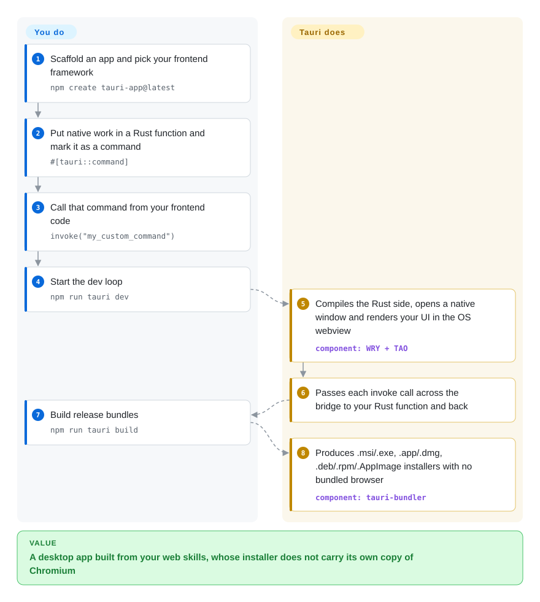

# Tauri

An Electron app ships a whole copy of Chromium, so even a small utility becomes a download of around 100 MB that idles at hundreds of megabytes of RAM; Tauri keeps your web frontend but renders it in the webview the operating system already has, with a small Rust binary doing the native work.

## When to use

You're a web developer building a desktop tool — a menu-bar utility, an internal admin client, a local-first note app — and your users complain that the Electron prototype is a heavy download, takes seconds to open, and sits in Task Manager eating memory for what is basically one window. You want to keep React, Vue or Svelte and your existing component library, and still reach the file system, system tray, notifications and an auto-updater. Tauri is the pick when **small installers and low memory matter more than pixel-identical rendering on every OS**: your UI runs in the system webview (WebView2 on Windows, WKWebView on macOS and iOS, WebKitGTK on Linux, Android System WebView), and native capabilities come from Rust functions you expose as commands, with a capability file controlling which windows may call which plugin APIs.

Pick it over Electron when bundle size, RAM and a tighter permission model beat "the same Chromium everywhere" and a Node.js backend; pick it over Flutter when your team already writes HTML/CSS/TypeScript and doesn't want to learn Dart and a new widget system. The same project can also target Android and iOS, though desktop is the more mature path.

## How it works

Tauri splits an app into two halves. The frontend is ordinary web code built by whatever tool you already use; Tauri does not bundle a browser engine but hands that code to the operating system's own webview through WRY, its cross-platform webview library, inside a native window managed by TAO, its windowing library. The backend is a Rust binary you compile: you write a function, mark it `#[tauri::command]`, and call it from JavaScript with `invoke(...)` — Tauri serializes the arguments across the bridge and returns the result as a Promise, like a web app calling its own server, except the "server" is in-process and never opens a network port. Plugins (file system, shell, updater, notifications and more) are called the same way, and each window gets only the permissions its capability file grants. `tauri build` then packages everything into the platform's native installers. What Tauri does for you is the window, the bridge, the permission checks and the bundling; what you do is write the UI, the Rust commands, and test on each OS's webview, since they are three different browser engines.

<!-- flow-steps:begin (generated from flows/tauri.json by tools/flow_card.py — do not edit) -->

Text version of the flow

1. **You**: Scaffold an app and pick your frontend framework — `npm create tauri-app@latest`
2. **You**: Put native work in a Rust function and mark it as a command — `#[tauri::command]`
3. **You**: Call that command from your frontend code — `invoke("my_custom_command")`
4. **You**: Start the dev loop — `npm run tauri dev`
5. **Tauri**: Compiles the Rust side, opens a native window and renders your UI in the OS webview — component: `WRY + TAO`
6. **Tauri**: Passes each invoke call across the bridge to your Rust function and back
7. **You**: Build release bundles — `npm run tauri build`
8. **Tauri**: Produces .msi/.exe, .app/.dmg, .deb/.rpm/.AppImage installers with no bundled browser — component: `tauri-bundler`

**Value**: A desktop app built from your web skills, whose installer does not carry its own copy of Chromium

<!-- flow-steps:end -->

## When NOT to use

- If your UI must render and behave identically on every OS, use Electron instead of Tauri v2, because Tauri renders with three different engines (Chromium-based WebView2, WebKit on macOS/iOS, WebKitGTK on Linux) and CSS or Web API gaps show up per platform; Tauri's v3 line adds an optional bundled-Chromium (CEF) runtime, but it is alpha as of 2026-10.
- If your Linux users are on distributions older than the webkit2gtk 4.1 generation (roughly pre-Ubuntu 22.04), use Electron, because Tauri v2 requires that system library and does not ship its own.
- If you need truly native widgets — SwiftUI toolbars, WinUI controls, platform accessibility behaviors — build with each platform's native toolkit instead of Tauri, because a webview UI still looks and behaves like a web page.
- If your team can't take on a Rust toolchain at all, use Electron instead of Tauri, because even a plugin-only Tauri app compiles a Rust binary, and any custom native logic is written in Rust.
- If you're building a mobile-first app with a rich native feel, use Flutter instead of Tauri, because Tauri's iOS/Android targets arrived only in v2 and the self-updater is desktop-only.
- If your app depends on Electron-specific APIs or Node.js native modules in the main process, stay on Electron, because Tauri's backend is Rust and has no Node.js runtime to load them.

## Comparison

| Alternative | In index | Our verdict | Tradeoff |
| --- | --- | --- | --- |
| Electron | 未收录 | Choose Electron when identical Chromium rendering everywhere and a JavaScript/Node backend outweigh app size; choose Tauri when installer size, memory and a permission-scoped bridge matter more. | Electron removes per-OS webview testing and keeps the whole stack in JavaScript, but every app ships and runs its own Chromium and Node. |
| Flutter | 未收录 | Choose Flutter for mobile-first apps that need pixel-controlled custom UI across platforms; choose Tauri when the team's skills and component library are on the web. | Flutter draws every pixel itself so it looks the same everywhere, but you rewrite the UI in Dart and give up the web ecosystem. |
| Wails | 未收录 | Choose Wails when your team writes Go and wants the same system-webview approach; choose Tauri when you want Rust, mobile targets and a larger plugin ecosystem. | Wails uses OS webviews just like Tauri with a Go backend, so it shares the cross-webview testing burden while targeting desktop only. |
| Neutralinojs | 未收录 | Choose Neutralinojs for a very small desktop wrapper with no compiled backend at all; choose Tauri when you need a typed native backend, an updater and mobile targets. | Neutralinojs avoids a Rust or Go toolchain by talking to a prebuilt binary, but its native API surface and ecosystem are much smaller. |

## Tech stack

- **Rust** — core framework, command bridge, CLI and bundler (workspace MSRV 1.90)
- **WRY / TAO** — Tauri's own crates for the cross-platform webview layer and native windowing
- **System webviews** — WebView2 (Windows), WKWebView (macOS/iOS), WebKitGTK 4.1 (Linux), Android System WebView
- **JavaScript / TypeScript** — the frontend, with any framework that compiles to HTML/JS/CSS, plus the `@tauri-apps/api` bindings
- **Kotlin / Swift** — mobile host glue and native plugins on Android and iOS

## Dependencies

- Rust toolchain (rustc, cargo) and the per-OS prerequisites from the docs (e.g. WebKitGTK dev packages on Linux, Xcode tools on macOS)
- A frontend toolchain — usually Node.js with npm/pnpm/yarn/bun, or Deno — to build the web UI and run the `tauri` CLI
- End users: the OS webview runtime (WebView2 on Windows, preinstalled on Windows 10/11; WebKitGTK 4.1 on Linux)
- Mobile: Android SDK/NDK and/or Xcode

## Ops difficulty

**Low to medium.** There is no server to run; the output is native installers (`.msi`/NSIS `.exe`, `.app`/`.dmg`, `.deb`/`.rpm`/`.AppImage`). The work is in the build matrix: each OS must be built on (or cross-built for) its own platform, code-signed and notarized, and tested on its own webview. The built-in updater needs a signing key and somewhere to host update manifests, and the official GitHub Action covers the CI side.

## Health & viability

- **Maintenance**: Grade A — commits every week of the last quarter; v2.12.1 on 2026-09-30, with the v3.0.0 alpha series starting 2026-09-13.
- **Responsiveness**: Grade A — median first response 4.3 hours across 25 qualifying issues/PRs.
- **Adoption**: Grade A — 35,329,089 monthly crates.io downloads; real apps ship on it, such as [Clash Verge Rev](../../ops-infra/clash-verge-rev.md).
- **Longevity**: Grade A — 2,644 days old (created 2019-07-13), through a v1→v2 major and still very active; a good Lindy prior.
- **Governance**: Grade B — 19 active committers in 12 months with the top three at 84.7%, a small core team; the project is a programme within The Commons Conservancy, funded through Open Collective and partners such as CrabNebula, so no single vendor owns it.
- **Risk / License**: Grade A — `Apache-2.0 OR MIT`, no relicense. The live risk is churn: v3 is in alpha, so an app started on v2 today should budget for another major migration, as v1→v2 required.

## Caveats (unverified)

- [推断] The size and memory advantage over Electron depends on the app; no benchmark was run for this page.
- [推断] WebKitGTK on Linux tends to lag Chromium and Safari in Web API support and performance, so Linux is usually where cross-platform bugs surface.
- [未验证] The scope and timeline of v3 (including whether the CEF runtime becomes a supported default option) were inferred from alpha release tags, not a published roadmap.
- [未验证] Mobile-target maturity relative to desktop was not tested hands-on.
- [未验证] Wails being desktop-only reflects its stable line; whether a newer Wails release adds mobile targets was not checked.
- [推断] The "around 100 MB" Electron download and its idle memory are typical figures, not measured for a specific app.
