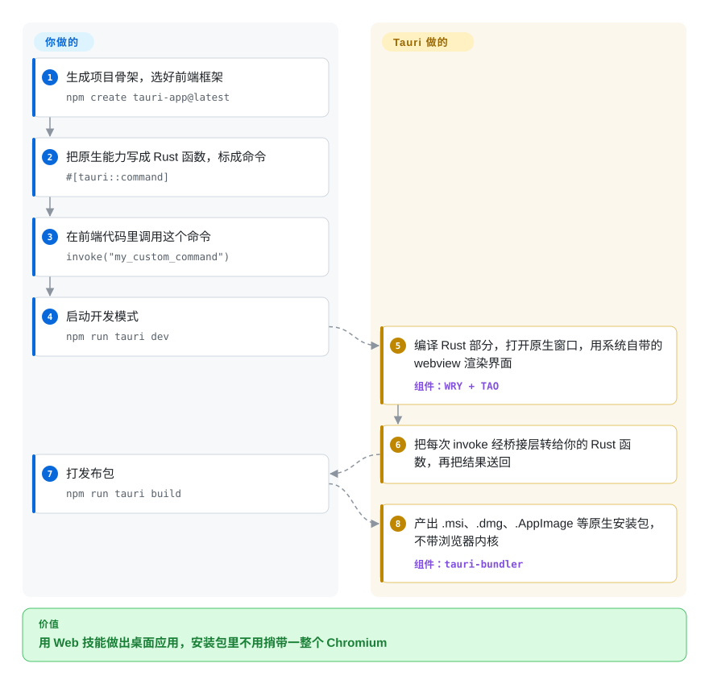

# Tauri

Electron 应用要捎带一整份 Chromium，哪怕一个小工具也是 100 MB 上下的下载、闲着就占几百 MB 内存；Tauri 保留你的 Web 前端，但用操作系统自带的 webview 来渲染，原生能力交给一个小巧的 Rust 二进制。

## 何时使用

你是 Web 开发者，要做一个桌面工具——菜单栏小工具、内部管理客户端、本地优先的笔记应用——而用户抱怨 Electron 原型下载太大、打开要好几秒、明明只有一个窗口却在任务管理器里一直吃内存。你想继续用 React、Vue 或 Svelte 和现成的组件库，同时还能访问文件系统、系统托盘、通知和自动更新。**当安装包小、内存低比每个系统上渲染得一模一样更重要时**，选 Tauri：界面跑在系统 webview 里（Windows 上是 WebView2，macOS 和 iOS 上是 WKWebView，Linux 上是 WebKitGTK，Android 上是 System WebView），原生能力来自你暴露成命令的 Rust 函数，再由 capability 文件控制哪个窗口能调用哪些插件 API。

安装包体积、内存和更严格的权限模型比“到处都是同一个 Chromium”和 Node.js 后端更重要时，它胜过 Electron；团队本来就写 HTML/CSS/TypeScript、不想学 Dart 和一套新组件体系时，它胜过 Flutter。同一个项目还能出 Android 和 iOS 包，不过桌面端更成熟。

## 怎么用起来

Tauri 把应用拆成两半。前端就是普通的 Web 代码，用你现有的工具构建；Tauri 不捎带浏览器内核，而是通过它的跨平台 webview 库 WRY 把这些代码交给操作系统自带的 webview，放进由窗口库 TAO 管理的原生窗口里。后端是你编译出来的 Rust 二进制：你写一个函数、标上 `#[tauri::command]`，在 JavaScript 里用 `invoke(...)` 调它——Tauri 把参数序列化后穿过桥接层，结果以 Promise 返回，就像网页调用自己的服务器，只不过这个“服务器”就在同一个进程里，从不打开网络端口。插件（文件系统、shell、更新器、通知等）也用同样方式调用，每个窗口只拿到它的 capability 文件授予的权限。最后 `tauri build` 把一切打成各平台原生的安装包。Tauri 替你做的是窗口、桥接、权限检查和打包；你要做的是写界面、写 Rust 命令，并在每个系统的 webview 上分别测试——它们其实是三种不同的浏览器引擎。

<!-- flow-steps:begin (generated from flows/tauri.json by tools/flow_card.py — do not edit) -->

流程文字版

1. **你**：生成项目骨架，选好前端框架 — `npm create tauri-app@latest`
2. **你**：把原生能力写成 Rust 函数，标成命令 — `#[tauri::command]`
3. **你**：在前端代码里调用这个命令 — `invoke("my_custom_command")`
4. **你**：启动开发模式 — `npm run tauri dev`
5. **Tauri**：编译 Rust 部分，打开原生窗口，用系统自带的 webview 渲染界面 — 组件：`WRY + TAO`
6. **Tauri**：把每次 invoke 经桥接层转给你的 Rust 函数，再把结果送回
7. **你**：打发布包 — `npm run tauri build`
8. **Tauri**：产出 .msi、.dmg、.AppImage 等原生安装包，不带浏览器内核 — 组件：`tauri-bundler`

**价值**：用 Web 技能做出桌面应用，安装包里不用捎带一整个 Chromium

<!-- flow-steps:end -->

## 何时不用

- 如果界面必须在每个系统上渲染和表现完全一致，用 Electron 而不是 Tauri v2，因为 Tauri 用三种不同的引擎渲染（基于 Chromium 的 WebView2、macOS/iOS 上的 WebKit、Linux 上的 WebKitGTK），CSS 或 Web API 的差异会按平台冒出来；Tauri 的 v3 线新增了可选的内置 Chromium（CEF）运行时，但截至 2026-10 仍是 alpha。
- 如果你的 Linux 用户还在 webkit2gtk 4.1 之前那一代发行版上（大致是 Ubuntu 22.04 之前），用 Electron，因为 Tauri v2 依赖这个系统库，自己并不携带。
- 如果你需要真正的原生控件——SwiftUI 工具栏、WinUI 控件、平台原生的无障碍行为——用各平台的原生工具包而不是 Tauri，因为 webview 界面看起来、用起来仍是网页。
- 如果团队完全接受不了 Rust 工具链，用 Electron 而不是 Tauri，因为哪怕只用插件的 Tauri 应用也要编译 Rust 二进制，任何自定义原生逻辑都得用 Rust 写。
- 如果你在做一个移动端优先、要求浓厚原生手感的应用，用 Flutter 而不是 Tauri，因为 Tauri 的 iOS/Android 支持到 v2 才加入，自带的更新器也只支持桌面。
- 如果你的应用在主进程里依赖 Electron 专有 API 或 Node.js 原生模块，继续用 Electron，因为 Tauri 的后端是 Rust，没有 Node.js 运行时可以加载它们。

## 横向对比

| 替代品 | 是否收录 | 我们的评价 | 取舍 |
| --- | --- | --- | --- |
| Electron | 未收录 | 各平台一致的 Chromium 渲染和 JavaScript/Node 后端比应用体积更重要时选 Electron；安装包大小、内存和按权限划定的桥接更重要时选 Tauri。 | Electron 省掉了逐个系统测试 webview 的麻烦，整套技术栈都是 JavaScript，但每个应用都要自带并运行一份 Chromium 和 Node。 |
| Flutter | 未收录 | 移动端优先、需要跨平台像素级自定义界面时选 Flutter；团队技能和组件库都在 Web 上时选 Tauri。 | Flutter 每个像素都自己画，所以处处一致，但界面要用 Dart 重写，也放弃了 Web 生态。 |
| Wails | 未收录 | 团队写 Go、想要同样的系统 webview 路线时选 Wails；想用 Rust、要移动端目标和更大的插件生态时选 Tauri。 | Wails 和 Tauri 一样用系统 webview，后端换成 Go，因此同样要承担跨 webview 测试的负担，且只面向桌面。 |
| Neutralinojs | 未收录 | 想要一个极小、完全没有编译型后端的桌面外壳时选 Neutralinojs；需要有类型的原生后端、更新器和移动端目标时选 Tauri。 | Neutralinojs 通过一个预编译二进制通信，免掉了 Rust 或 Go 工具链，但原生 API 面和生态都小得多。 |

## 技术栈

- **Rust**——核心框架、命令桥接、命令行和打包器（工作区 MSRV 1.90）
- **WRY / TAO**——Tauri 自己的 crate，分别负责跨平台 webview 层和原生窗口
- **系统 webview**——WebView2（Windows）、WKWebView（macOS/iOS）、WebKitGTK 4.1（Linux）、Android System WebView
- **JavaScript / TypeScript**——前端，任何能编译成 HTML/JS/CSS 的框架都行，外加 `@tauri-apps/api` 绑定
- **Kotlin / Swift**——Android 和 iOS 上的宿主胶水代码与原生插件

## 依赖

- Rust 工具链（rustc、cargo）以及文档列出的各系统前置条件（如 Linux 上的 WebKitGTK 开发包、macOS 上的 Xcode 工具）
- 前端工具链——通常是 Node.js 加 npm/pnpm/yarn/bun，或者 Deno——用于构建 Web 界面和运行 `tauri` 命令行
- 终端用户：系统 webview 运行时（Windows 上是 WebView2，Windows 10/11 已预装；Linux 上是 WebKitGTK 4.1）
- 移动端：Android SDK/NDK 和/或 Xcode

## 运维难度

**低到中。** 没有需要运行的服务，产物是原生安装包（`.msi`/NSIS `.exe`、`.app`/`.dmg`、`.deb`/`.rpm`/`.AppImage`）。工作量在构建矩阵上：每个系统要在自己的平台上构建（或交叉构建）、签名和公证，并在自己的 webview 上测试。内置更新器需要签名密钥和一个托管更新清单的地方，官方 GitHub Action 能覆盖 CI 这一侧。

## 健康度与可持续性

- **维护活跃度**：Grade A——过去一个季度每周都有提交；2026-09-30 发布 v2.12.1，v3.0.0 alpha 系列从 2026-09-13 开始。
- **响应速度**：Grade A——25 个 qualifying issues/PRs 的中位首次响应时间 4.3 小时。
- **采用广度**：Grade A——crates.io 上月下载 35,329,089 次；已有真实应用基于它发布，例如 [Clash Verge Rev](../../ops-infra/clash-verge-rev.zh.md)。
- **长青度**：Grade A——仓库已存在 2,644 天（2019-07-13 创建），经历了 v1→v2 大版本仍非常活跃；Lindy 先验良好。
- **治理集中度**：Grade B——过去 12 个月有 19 位活跃提交者，前三名占 84.7%，核心团队不大；项目是 The Commons Conservancy 旗下的一个 programme，靠 Open Collective 和 CrabNebula 等合作方资助，不归任何单一厂商所有。
- **许可风险**：Grade A——`Apache-2.0 OR MIT`，没有改过许可。眼下的风险是版本更替：v3 正处于 alpha，今天基于 v2 开始的应用应预留再迁移一次大版本的成本，就像 v1→v2 那样。

## 存疑（未验证）

- [推断] 相对 Electron 的体积和内存优势因应用而异，本页没有跑基准。
- [推断] Linux 上的 WebKitGTK 在 Web API 支持和性能上往往落后于 Chromium 和 Safari，所以跨平台 bug 通常先在 Linux 上冒出来。
- [未验证] v3 的范围和时间表（包括 CEF 运行时会不会成为受支持的默认选项）是从 alpha 发版标签推断的，没有公开路线图佐证。
- [未验证] 移动端目标相对桌面端的成熟度没有亲手测试。
- [未验证] “Wails 只面向桌面”反映的是它的稳定版；更新的 Wails 版本是否加入了移动端目标没有核实。
- [推断] Electron 应用“100 MB 上下”的下载体积和闲置内存是典型数字，不是针对某个具体应用实测的。
