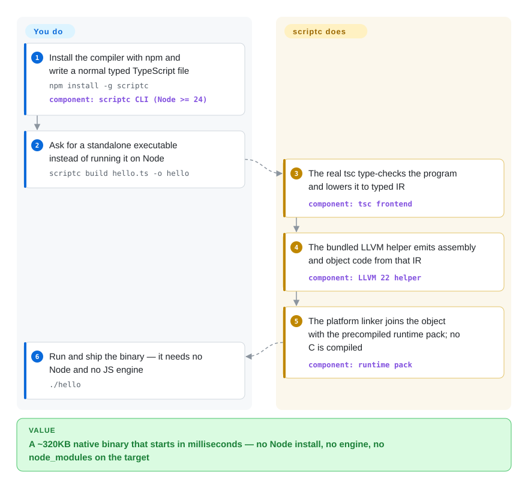

# scriptc

You wrote a small tool in TypeScript, and delivering it means installing Node on every target — or shipping a single-file bundle tens of megabytes larger than the program itself. scriptc compiles ordinary, typed TypeScript into a native executable in the ~320KB class: no Node, no V8, no JavaScript engine inside the binary.

## When to use

You maintain a small, well-typed TypeScript program — an internal CLI, a build tool, a webhook handler, an agent script — and the delivery target makes a runtime awkward: a slim container where the Node base image is the fattest layer, a machine you don't control, or users who should just receive a binary. `scriptc build hello.ts -o hello` turns that file into a native executable that starts in milliseconds and links against nothing but the system C library, and `scriptc coverage` tells you up front exactly which statements compile statically.

You reach for scriptc rather than `bun build --compile` or `deno compile` when the deciding tradeoff is binary size, startup, and compile-time strictness over ecosystem breadth: those snapshot a full JavaScript engine into every binary and run essentially any JS, while scriptc compiles what your types prove static and rejects the rest at compile time with a coded diagnostic — the same discipline you already get from tsc. It also fits when one typed codebase should ship as both a native binary and a WASI module.

## How it works

scriptc is a compiler, not a packer. The real TypeScript compiler — the same tsc that type-checks your editor — parses and type-checks the program, then lowers the AST into a typed intermediate representation (IR: a serializable form of your program where generics are already specialized into concrete types and unions become tagged values). From the IR, backends write readable C or LLVM IR, and the default path sends the LLVM IR to a bundled LLVM 22 helper that emits assembly and object code; the platform linker then joins that object with a precompiled runtime pack (a reference-counted value runtime, stackful fibers for async/await, a kqueue/epoll event loop, and native `net`/`http`/`tls` implementations), compiling no C at all. Memory is reference-counted — a value frees the moment its last reference drops — and reference cycles are collected at deterministic points rather than by a garbage collector. Nothing is ever silently faked: every construct lands in exactly one of three tiers — compiled natively, run on an embedded quickjs-ng engine if you pass `--dynamic` (for npm-package JavaScript and `any`-typed code, ~620KB), or rejected with an error code and a rewrite hint.

<!-- flow-steps:begin (generated from flows/scriptc.json by tools/flow_card.py — do not edit) -->

Text version of the flow

1. **You**: Install the compiler with npm and write a normal typed TypeScript file — `npm install -g scriptc` — component: `scriptc CLI (Node >= 24)`
2. **You**: Ask for a standalone executable instead of running it on Node — `scriptc build hello.ts -o hello`
3. **scriptc**: The real tsc type-checks the program and lowers it to typed IR — component: `tsc frontend`
4. **scriptc**: The bundled LLVM helper emits assembly and object code from that IR — component: `LLVM 22 helper`
5. **scriptc**: The platform linker joins the object with the precompiled runtime pack; no C is compiled — component: `runtime pack`
6. **You**: Run and ship the binary — it needs no Node and no JS engine — `./hello`

**Value**: A ~320KB native binary that starts in milliseconds — no Node install, no engine, no node_modules on the target

<!-- flow-steps:end -->

## When NOT to use

- **Your program is mostly untyped or npm JavaScript.** Code riding on `any`, loosely typed objects, or heavy npm imports funnels into the embedded quickjs island, which is correct but slower for CPU-bound work and pays a validation tax at every boundary crossing. Use `bun build --compile` or `deno compile` instead — they embed a full engine and run any JS unchanged.
- **You depend on native Node addons.** Node-API / `.node` addons are rejected at compile time (`createRequire` addon loads included). If the addon is irreplaceable, stay on Node.js; scriptc's substitute is its native FFI — a manifest-declared plain-C-ABI link that today refuses variadic calls and structs by value.
- **You need exact Node behavior.** scriptc's divergences are documented but real: typed-array out-of-bounds access aborts instead of returning `undefined`, some runtime traps are not catchable, `Object.keys` reports declaration order rather than insertion order, and runtime errors carry no `errno`/`syscall`/`path`. Programs leaning on Node internals should stay on Node.js.
- **You want systems-language performance.** Numbers are JS-exact f64 everywhere; integer inference and ownership analysis are roadmap items, not shipped features. For Rust/Go-class control over memory and integers, write Rust or Go instead of compiling TypeScript.
- **You need a stable compiler contract.** v0.x under an explicit "Vercel Labs Experiment" badge, one primary maintainer, and an object ABI documented as exact-runtime-version compatible (not semver-stable). For a bet your product compiles on for years, pin versions and treat scriptc as a young tool for contained blast radius — internal CLIs and small shipped tools — not a platform.

## Comparison

| Alternative | In index | Our verdict | Tradeoff |
| --- | --- | --- | --- |
| [Bun](bun.md) | ✅ | When the code is well-typed and the binary must be small and instant, compile with scriptc; when it leans on broad npm JavaScript, use `bun build --compile`, because the embedded runtime runs everything unchanged. | scriptc: ~320KB native binaries and compile-time rejection, but only its static surface plus the quickjs island. Bun: total npm compatibility, but engine-sized binaries and slower startup. |
| [Deno](deno.md) | ✅ | Pick `deno compile` when single-file distribution with V8's exact semantics and Deno's permission model is the requirement; pick scriptc when no-engine-at-all and the tsc-tier type gate are the point. | Deno snapshots the full V8 runtime (larger artifacts, engine startup cost); scriptc embeds only its own C runtime and rejects what it cannot prove. |
| Node.js SEA | 未收录 | Node's official Single Executable Applications is the conservative pick when the program must behave exactly like Node everywhere; scriptc is the size/startup pick when a static-tier subset is enough. | SEA ships the entire Node binary in each artifact; scriptc compiles a subset to native code but gates that subset at compile time. Not added in this tab-intake batch. |
| vercel/pkg | 未收录 | Treat pkg as the archived ancestor of this problem — snapshotting Node into one file; choose scriptc or Bun/Deno compile for anything current, because pkg has been archived since early 2024. | pkg froze a whole Node runtime into each binary and is now unmaintained; scriptc compiles only what the types justify and is actively developed. Not added in this tab-intake batch. |
| AssemblyScript | 未收录 | If the goal is WebAssembly and you can write in its TypeScript-like dialect against its own stdlib, AssemblyScript is the established route; if the goal is compiling your existing Node-flavored TypeScript, scriptc keeps the real tsc semantics. | AssemblyScript: mature and wasm-only, but a distinct dialect (not your TS, no npm). scriptc: your actual TypeScript with Node APIs, but young and WASI Preview 1 only. Not added in this tab-intake batch. |

## Tech stack

- **TypeScript + the real tsc API** — frontend: parsing, type-checking against `es2025`, lowering to the typed IR
- **Two backends** — `--emit=c` writes readable C; the default LLVM path sends IR to a bundled out-of-process LLVM 22 helper for assembly/object code
- **C runtime** (`packages/runtime`) — reference counting with a deterministic cycle collector, stackful fibers for async/await, kqueue/epoll event loop, native `net`/`http`/`https`/`tls` (vendored mbedTLS), zlib, libregexp
- **quickjs-ng** — the optional `--dynamic` island for npm-package JavaScript and `any`-typed code
- **Node.js ≥ 24 runs the compiler itself**; pnpm monorepo; correctness held by a differential corpus (byte-identical stdout/stderr/exit codes vs Node), test262, and an AddressSanitizer + reference-count-audit lane

## Dependencies

- Build machine: Node.js ≥ 24 (`npm install -g scriptc`); `--emit=ir|c|llvm` needs nothing beyond Node
- Native executables: a platform linker driver + SDK/sysroot (`SCRIPTC_LINKER` selects it); on macOS 15+ arm64 clang only drives the link — no C is compiled
- Cross-compilation and the `wasm32-wasi` target: Zig on `PATH` (`SCRIPTC_CC=zigcc SCRIPTC_TARGET=<triple>`)
- Sanitizer builds, explicit C builds, and LLVM fallbacks: a C compiler
- Target machine: nothing — the binary links only against the system C library

## Ops difficulty

**Low.** An npm-installed CLI with no service to run and no runtime to ship. The real burden is version churn: v0.x with rapid releases (44 npm versions in ~10 weeks) and an object ABI documented as exact-runtime-version compatible, so pin the compiler version in CI and re-run `scriptc coverage` after each upgrade; platform-specific bits (linker choice, Zig for cross-targets) are the only environment quirks.

## Health & viability

- **Maintenance — very active (checked 2026-09-28):** commits and issue closes landed the same morning this page was verified; v0.1.7 released 2026-09-27, the 44th npm version since 2026-07-13.
- **Governance / bus factor:** effectively one primary maintainer (Chris Tate, engineer at Vercel, ~98% of contributions) inside the vercel-labs org — a vendor engineer's project, not a community or foundation.
- **Backing & age:** Vercel Labs with an explicit "EXPERIMENT" badge; repo created 2026-07-22 (~2 months old). Age × still-active says: active, but far too young for any Lindy prior — 5.5k stars in two months reads as launch attention, not durability.
- **Adoption:** 23,069 npm downloads in the trailing month (~9.5k/week) as of 2026-09-28; the project self-hosts milestones — its own TypeScript client and parts of the LLVM emitter compile with scriptc itself.
- **Risk flags:** v0.x, self-labeled experimental; documented Node divergences; object ABI not semver-stable; no known CVEs checked. Apache-2.0 (LICENSE file read directly) — clean permissive license.

## Caveats (unverified)

- [未验证] The ~320KB binary size and millisecond-startup figures are the project's own documented claims; not measured on an independent machine.
- [推断] "quickjs island is slower for CPU-bound code" is the docs' own characterization; no benchmark was run here.
- [未验证] Vercel's long-term commitment: a "Labs Experiment" badge carries no productization guarantee; no roadmap beyond the docs was found.
- [未验证] Real-world production deployments: none confirmed from primary sources — the self-hosting milestones come from the project's own issues and CI.
- [推断] The star trajectory (5.5k in ~2 months) is treated as hype-signal rather than sustained adoption, per this index's young-hyped-repo heuristic.
