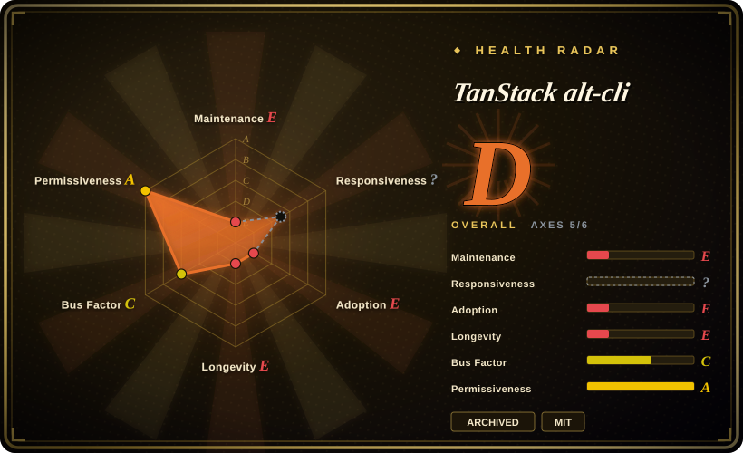
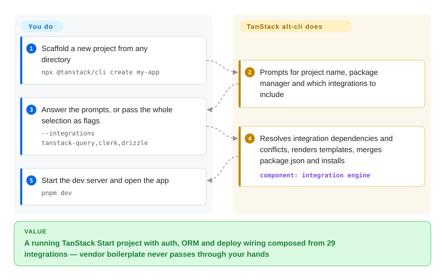

# TanStack alt-cli

You follow a January-2026 link to `TanStack/alt-cli` — "The official TanStack CLI for scaffolding, MCP, agent skills" — copy its `npx @tanstack/cli create my-app`, and silently get different software: this repo is a one-week experiment, archived since, and the `@tanstack/cli` npm name it published 0.0.1–0.0.8 under has shipped the mainline TanStack CLI since 2026-01-29. This page exists so you recognize the trap in one read and know what the repo is still good for.

## When to use

You don't reach for alt-cli to build anything — you arrive at it, usually from npm archaeology (`@tanstack/cli` versions 0.0.1–0.0.8, published 2026-01-21 to 2026-01-25, don't match anything in the current CLI's changelog), an old demo, or a link like the repo's own README that still says `npx @tanstack/cli create my-app`. Follow that command today and you install v0.71.0 from the mainline `TanStack/cli` repo — a different codebase. The page-worthy reasons to open this repo are two: as a **pattern source** — it is a compact, readable implementation of integration-composition scaffolding (29 integrations, each a folder with an `info.json` declaring `dependsOn`/`conflicts`, plus EJS asset templates compiled by a ~1k-line engine) and of agent-facing scaffolding over MCP (`listTanStackIntegrations`, `createTanStackApplication`); and as **history** — the guitar-store AI demo built in its final commit reappears verbatim in today's TanStack CLI add-ons, so it explains where that came from. For anything you intend to run, use [TanStack CLI](tanstack-cli.md) — the maintained successor that owns the npm name.

## How it works

The repo is a pnpm monorepo whose `@tanstack/cli` package exposes a `tanstack` binary. What you do is pick integrations — interactively, via @clack prompts for project name and package manager, or as a comma-separated `--integrations` flag; what it does for you is composition: the engine resolves each integration's declared dependencies and conflicts, fetches integration definitions from the repo's own `integrations/` folder on GitHub, renders every integration's EJS asset templates (routes, providers, config files), merges the integration's `package.json` deps into yours, installs, and writes a `.tanstack.json` manifest of what was chosen. Think of it as a package manager whose install unit is not a library but a wired integration — Clerk comes with its provider, routes and env skeleton, not just `@clerk/react`. A second surface is `tanstack mcp`: a local MCP server (stdio or HTTP/SSE) an agent like Claude Desktop connects to, so the agent can list integrations and scaffold projects itself instead of scraping docs. Both surfaces only ever targeted TanStack Start projects; there is no other framework mode.

<!-- flow-steps:begin (generated from flows/tanstack-alt-cli.json by tools/flow_card.py — do not edit) -->

Text version of the flow

1. **You**: Scaffold a new project from any directory — `npx @tanstack/cli create my-app`
2. **TanStack alt-cli**: Prompts for project name, package manager and which integrations to include
3. **You**: Answer the prompts, or pass the whole selection as flags — `--integrations tanstack-query,clerk,drizzle`
4. **TanStack alt-cli**: Resolves integration dependencies and conflicts, renders templates, merges package.json and installs — component: `integration engine`
5. **You**: Start the dev server and open the app — `pnpm dev`

**Value**: A running TanStack Start project with auth, ORM and deploy wiring composed from 29 integrations — vendor boilerplate never passes through your hands

<!-- flow-steps:end -->

## When NOT to use

- **For any new scaffolding, use [TanStack CLI](tanstack-cli.md) instead, because** this repo is archived (GitHub API, 2026-09-28), saw its last commit 2026-01-25, has issues disabled with 4 external PRs that will never merge — and its own documented commands (`npx @tanstack/cli …`) now install the mainline CLI, not this code.
- **If your stack is not TanStack Start, use the stack's own scaffolder — `create-next-app` for Next.js, `create-vite` for a plain Vite SPA, `create-t3-app` for the T3 stack — because** alt-cli's engine only composes TanStack Start projects; there is no bring-your-own-framework mode even in its own docs.
- **If you want a frozen starter copied verbatim, use degit on a template repo, because** alt-cli resolves and merges at generate time — that machinery is pointless for "clone that repo, no history"; degit is zero-magic and stack-agnostic.
- **If an MCP-driven agent scaffold is what you're after, note neither tool ships it today: use the mainline CLI's `--json` introspection commands instead, because** the successor removed its own `tanstack mcp` command in 2026 ("removed and will not be restored", per the [TanStack CLI](tanstack-cli.md) page) — the MCP server in this repo points at a reclaimed package name and is a config trap, not a working path.
- **If you need the integration catalog to track upstream, read the mainline CLI's add-on list instead, because** these 29 integrations are frozen at January-2026 dependency versions (each integration's `package.json` pins its own deps); Clerk or Drizzle wiring from then has already drifted.
- **If you'd otherwise pin this in CI, don't — treat it as reading material only, because** v0.0.8 carries January-2026 versions of express 4, commander 13 and zod 3 that will never receive a security update from an archived repo.

## Comparison

| Alternative | In index | Our verdict | Tradeoff |
| --- | --- | --- | --- |
| create-next-app (`vercel/next.js`) | ✅ [Next.js](../../web-ui/frameworks/app-frameworks/nextjs.md) | The stack decision "Next.js" makes create-next-app the only candidate and alt-cli a non-candidate (archived, TanStack-only); read alt-cli only if you want its integration-manifest pattern to copy for your own generator. | create-next-app scaffolds the dominant React framework and stays current; alt-cli shows a composable-integration design frozen in January 2026 — one is a tool you run, the other a pattern you read. |
| create-vite (`vitejs/vite`) | not indexed | For any non-TanStack SPA, scaffold with create-vite and add libraries by hand; alt-cli never served that audience and today serves nobody operationally. | create-vite gives a minimal, framework-agnostic starting point maintained at Vite's pace; alt-cli's 29 curated integrations came at the cost of a single-stack, single-week bet. Not added in this tab-intake batch. |
| create-t3-app (`t3-oss/create-t3-app`) | not indexed | If your question is "one command to a fully wired stack", create-t3-app is the living answer for its named stack; alt-cli was that answer for TanStack Start for one week in January 2026, and the indexed TanStack CLI page is it today. | Both compose auth/db/tooling into one scaffold; T3's opinions are fixed and maintained, alt-cli's were selectable and then abandoned — pick the one whose maintainer still exists. Not added in this tab-intake batch. |
| degit (`Rich-Harris/degit`) | not indexed | For "copy that template repo without git history", degit is the right tool; alt-cli's dependency-resolving engine is the wrong machinery for a verbatim copy and is archived anyway. | degit ships exactly one frozen state with zero magic; alt-cli resolved a dependency graph at generate time — opposite ends of the scaffolding spectrum, and only one is maintained. Not added in this tab-intake batch. |
| Yeoman (`yeoman/yo`) | not indexed | If what alt-cli's pattern suggests to you is "generators as composable, metadata-declared units", Yeoman is the long-maintained general framework for exactly that; adopt it rather than reviving this repo's engine. | Yeoman trades alt-cli's curated, batteries-included catalog for an ecosystem of community generators and 10+ years of maintenance; you write generator code instead of dropping asset folders. Not added in this tab-intake batch. |

TanStack alt-cli is the abandoned sibling of [TanStack CLI](tanstack-cli.md) (same directory, same `@tanstack/cli` npm name — versions 0.0.1–0.0.8 came from this repo, 0.48.2 onward from the mainline): its integration content demonstrably survived — the `example-guitar-*.jpg` demo assets in `integrations/ai/` reappear verbatim in the mainline's `packages/create/src/frameworks/react/add-ons/ai/` [推断] — so treat it as the mainline's add-on layer's ancestor, and scaffold with the mainline.

## Tech stack

- **TypeScript** pnpm monorepo: Nx for the task graph, changesets for releases, vitest for tests, tsdown for builds; knip and sherif for repo hygiene.
- **CLI package** `@tanstack/cli` 0.0.8 (bin: `tanstack`): commander 13 for commands, @clack/prompts for the interactive UI, chalk, zod for option validation, EJS for templates, `ignore`/`parse-gitignore` for asset filtering.
- **MCP server**: `@modelcontextprotocol/sdk` on an express 4 server (`tanstack mcp`, stdio or HTTP/SSE), exposing `listTanStackIntegrations` and `createTanStackApplication` per `docs/mcp/tools.md`.
- **Integration engine** (`packages/cli/src/engine/`): template compilation, config-file handling, and `compile-with-addons.ts` composing multiple integrations; integrations live as data — `integrations/<id>/{info.json,files.json,package.json,assets/}` — catalogued in `integrations/manifest.json` (29 entries across tanstack/auth/database/orm/deploy/tooling/api/monitoring/i18n/cms categories).
- Sibling packages `create-start` and `create-tanstack-app` are thin shims over the same engine.

## Dependencies

- **Node.js 18+** per `docs/installation.md` (the repo's own `.nvmrc` pins 24.8.0), plus any of npm/pnpm/yarn/bun/deno for installs (`--package-manager`).
- **Network egress**: the npm registry, plus GitHub — the CLI fetches integration definitions and asset files from the `integrations/` folder of this repo at generate time (per the repo's AGENTS.md and the commit adding `files.json` "to enable GitHub asset fetching"), so scaffolding breaks if that path disappears — a real risk for an archived repo.
- **`tanstack mcp`** runs a local MCP server an agent client (Claude Desktop, Claude Code, OpenCode) connects to; no other daemon, no database, no hosted service.
- Each integration merges its own runtime deps into the generated project (e.g. `@clerk/react`, `drizzle-orm`), pinned to January-2026 versions.

## Ops difficulty

**Low — and deliberately zero-impact.** A one-shot `npx` CLI with nothing to deploy or keep running. The operational reality is that there is no operation: the repo is archived, issues are disabled, and the 4 open PRs (external fixes, including one correcting the changeset config's repo reference) will never merge. If you run v0.0.8 at all, you accept January-2026 dependency versions with no security updates ever; if you follow its README instead, you silently run the mainline CLI. Either way, the right operational posture is: read the engine, run the successor.

## Health & viability

- **Maintenance: dead by design (2026-09-28).** Archived per the GitHub API; the entire development window is 2026-01-18 to 2026-01-25 (11 commits), last npm publish from this repo 0.0.8 on 2026-01-25, tags stop at v0.0.8. This is a completed-and-shelved experiment, not a coasting project.
- **Governance / bus factor.** TanStack org-owned, but the sprint is two people: tannerlinsley (10 commits; TanStack's founder) and KevinVandy (1), plus an autofix bot. Issues are disabled; community PRs from three outside contributors sit unmerged and unmergeable.
- **Backing & lineage.** The work was not lost: the mainline `TanStack/cli` took over the `@tanstack/cli` package name on 2026-01-29 (version series jumps 0.0.8 → 0.48.2) and its add-on tree carries this repo's demo assets verbatim [推断]. Backing is therefore inherited from the mainline CLI's health, not this repo's.
- **Age / Lindy.** Fails outright: one week of life, then abandoned; age × still-active reads "young and dead", the weakest possible prior. Its remaining value is documentary.
- **Adoption.** 31 stars, 5 forks (GitHub API, 2026-09-28); no surviving npm footprint of its own — the package name it published under resolves to the successor, which erases rather than preserves its download signal.
- **Risk flags.** The README and `docs/mcp/connecting.md` still instruct `npx @tanstack/cli` and `@tanstack/cli mcp` — commands that now execute a different codebase; following this repo's docs verbatim is the trap this page exists to flag. No CVEs, no CLA, MIT throughout (LICENSE read; API agrees).

## Caveats (unverified)

- [推断] The archive date is placed around 2026-08-07: the repo's `updated_at` bumped then while `pushed_at` stayed 2026-01-25; GitHub's API exposes no explicit archive timestamp.
- [推断] That the alt-cli integration content "survived into" the mainline CLI rests on identical asset filenames (`example-guitar-*.jpg`, `example-ukelele-tanstack.jpg`) in both trees (compared 2026-09-28); whether by direct merge or reimplementation is not established from the trees alone.
- [推断] Reading "alt" as "alternative CLI experiment" is inference from the repo name and one-week lifespan; no doc states the naming rationale or the experiment's shutdown decision.
- [未验证] "Powers the Builder feature on tanstack.com" is the repo's own AGENTS.md claim; the Builder site itself was not audited.
- [未验证] The full MCP tool list: `docs/mcp/tools.md` was read in part (`listTanStackIntegrations`, `createTanStackApplication` confirmed); further tools may exist below the read range.
- [未验证] Comparison verdicts for create-vite, create-t3-app, degit and Yeoman rest on those projects' public positioning and general knowledge, not on reading their repositories in this batch.
