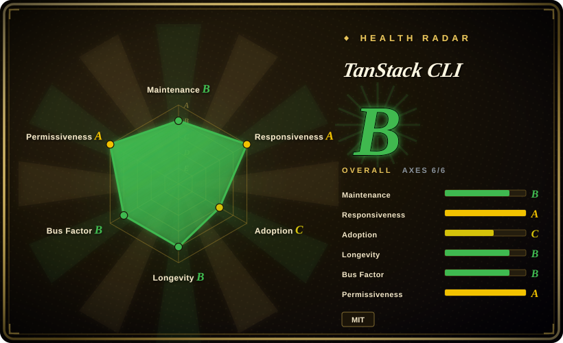
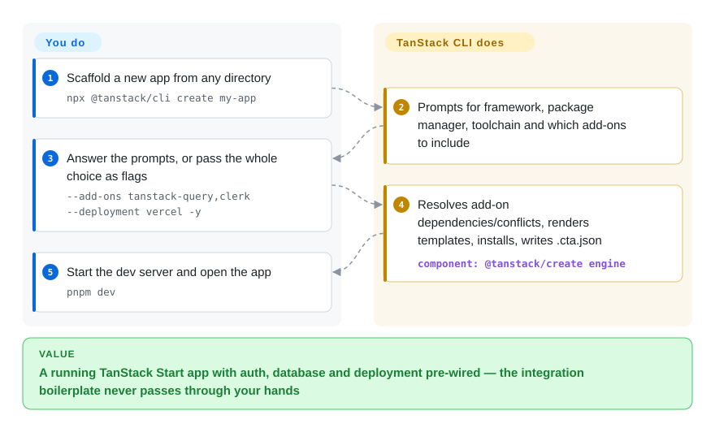

# TanStack CLI

Starting a TanStack Start or Router app by hand means assembling auth, a database layer and a deploy target from five different docs, each with its own provider boilerplate — and a coding agent asked to "add Clerk" guesses at files the framework actually owns. TanStack CLI scaffolds the whole app in one command and layers those integrations as composable add-ons, plus JSON introspection commands an agent can call instead of scraping the docs site.

## When to use

You are starting a full-stack React (or Solid) app on TanStack Start — or a Router-only SPA — and you want the auth provider, ORM, deployment target and monitoring wired before you write your first component. One command, `npx @tanstack/cli create my-app`, produces a running project with Clerk/better-auth, Drizzle/Prisma, a Vercel/Cloudflare/Netlify/Railway/Render/Nitro deploy config, Sentry/PostHog and more already merged into `package.json`, injected as providers in the root route, and documented in `.env.example`. The same CLI then answers agent questions deterministically: `tanstack create --list-add-ons --json` enumerates add-ons with dependencies and conflicts, and `tanstack search-docs "loaders" --library router --json` returns matching docs pages — so a coding agent discovers what exists instead of hallucinating integration steps.

Pick it over **create-next-app** or **create-vite** when you have already chosen the TanStack stack: those scaffolders cannot layer add-ons into a TanStack Start project (Vite's scaffolder stops at a blank SPA, Next's at a Next app). Pick it over template repos copied with **degit** when the combinations matter — 27 React add-ons that declare `dependsOn`/`conflicts` between them compose correctly, a frozen template rots. And pick the `tanstack add clerk drizzle` path when the project already has a `.cta.json` from a previous `create` — that is the maintained way to evolve a scaffolded app.

## How it works

The `tanstack` binary (package `@tanstack/cli`) is a thin command layer over the `@tanstack/create` engine. An **add-on** is a folder of EJS templates — templates with holes like the project name or enabled options — plus an `info.json` that declares what it provides (routes, providers wrapped around the app, Vite plugins, env vars), what it depends on or conflicts with, and its options. You choose add-ons interactively (the CLI prompts) or as flags; the engine then resolves the dependency graph, renders every template, merges dependencies into `package.json`, runs your package manager to install, and writes a `.cta.json` manifest recording what was chosen — that file is what later `tanstack add` calls read to reconcile an existing project. Think of it as a build system for starter projects: you describe the destination ("Start + file-router + Clerk + Drizzle + Cloudflare"), and it composes the pieces that used to be copy-paste. The second surface is read-only introspection: `libraries`, `doc`, `search-docs`, `ecosystem` and `--list-add-ons`/`--addon-details` all accept `--json`, replacing the MCP server the CLI shipped earlier (that `tanstack mcp` command was removed and the docs say it will not be restored). A `--intent` flag additionally writes local skill mappings so coding agents discover the scaffold's conventions.

<!-- flow-steps:begin (generated from flows/tanstack-cli.json by tools/flow_card.py — do not edit) -->

Text version of the flow

1. **You**: Scaffold a new app from any directory — `npx @tanstack/cli create my-app`
2. **TanStack CLI**: Prompts for framework, package manager, toolchain and which add-ons to include
3. **You**: Answer the prompts, or pass the whole choice as flags — `--add-ons tanstack-query,clerk --deployment vercel -y`
4. **TanStack CLI**: Resolves add-on dependencies/conflicts, renders templates, installs, writes .cta.json — component: `@tanstack/create engine`
5. **You**: Start the dev server and open the app — `pnpm dev`

**Value**: A running TanStack Start app with auth, database and deployment pre-wired — the integration boilerplate never passes through your hands

<!-- flow-steps:end -->

## When NOT to use

- **If you are not on the TanStack stack, use the stack's own scaffolder instead — `create-next-app` for Next.js, `nuxi init` for Nuxt, `create-vite` for a plain Vite SPA — because** this CLI only generates TanStack Start or Router projects (React and Solid); there is no "bring your own framework" mode, and `--router-only` even disables add-ons and deployment targets.
- **If you are on Solid and need the add-on catalog you saw in a React demo, check the Solid list first (`tanstack create --list-add-ons --framework Solid`) or wire integrations by hand / use Solid's own starters, because** the Solid framework tree carries 9 add-ons versus 27 for React (counted in `packages/create/src/frameworks/` on 2026-09-28) — Clerk, Drizzle, Prisma, Storybook, shadcn and most deployment targets are React-only today.
- **If your workflow expects the MCP server, switch to the JSON CLI commands, because** `tanstack mcp` has been removed ("removed and will not be restored" per `docs/mcp-migration.md`); existing MCP client configs pointing at `@tanstack/cli mcp` are dead weight and should be deleted. The repo description still advertising "MCP Server" is stale (checked 2026-09-28).
- **If the project was not scaffolded by this CLI (no `.cta.json`), wire libraries by hand or use `shadcn add` for component drops, because** `tanstack add` reconciles add-ons against the scaffold manifest; without `.cta.json` it fails rather than guessing — a deliberate precondition, and a hard stop on brownfield apps.
- **If telemetry to Google Analytics is a problem in your environment, disable it (`TANSTACK_CLI_TELEMETRY_DISABLED=1`, `DO_NOT_TRACK=1`, `tanstack telemetry disable`) or pick a scaffolder without a beacon, because** the CLI phones `www.google-analytics.com/g/collect` on every run by default (verified in `packages/cli/src/telemetry.ts`; it auto-disables under CI); the payload excludes project names, paths and search text, but the egress itself is on unless turned off.
- **If you pin nothing and let `npx @tanstack/cli` float in CI, pin an exact version (`npx @tanstack/cli@0.71.0`) or expect breakage, because** the project is v0.x and has already removed a whole command (`mcp`) and deprecated flags (`--no-tailwind`) within 2026; unpinned automation is the first thing to break on a minor bump.

## Comparison

| Alternative | In index | Our verdict | Tradeoff |
| --- | --- | --- | --- |
| create-next-app (`vercel/next.js`) | ✅ [Next.js](../../web-ui/frameworks/nextjs.md) | When the stack decision is "Next.js", create-next-app is the only right answer and this CLI cannot help; pick TanStack CLI only when you have chosen TanStack Start/Router and want add-on composition instead of a bare app. | create-next-app scaffolds the dominant React framework with its full plugin ecosystem; TanStack CLI buys curated, composable integrations but locks the scaffold to the TanStack stack (still pre-1.0 at the framework's edges). |
| Vite / create-vite (`vitejs/vite`) | not indexed | For a framework-agnostic SPA or a non-React/Solid stack, scaffold with create-vite and add libraries yourself; pick TanStack CLI when the add-on graph (auth + db + deploy + monitoring that know about each other) is worth more than framework freedom. | create-vite gives a minimal, dependency-free starting point across many frameworks; you hand-assemble everything this CLI layers automatically. Not added in this tab-intake batch. |
| create-t3-app (`t3-oss/create-t3-app`) | not indexed | If your stack is Next.js + tRPC + Prisma + Tailwind + NextAuth (the T3 stack), create-t3-app is purpose-built for it; pick TanStack CLI when the stack is TanStack Start and you want the same one-command composition over its add-on catalog. | Both are opinionated stack scaffolders; T3's opinions are fixed (a named stack), TanStack's are selectable per add-on — and swap the framework lock-in accordingly. Not added in this tab-intake batch. |
| shadcn CLI (`shadcn-ui/ui`) | ✅ [shadcn/ui](../../web-ui/component-libraries/shadcn-ui.md) | For dropping a component into an existing project, the shadcn CLI is the model (it copies code you own); for whole-project scaffolding with auth/db/deploy wiring, TanStack CLI operates at the project level the shadcn CLI deliberately does not. | shadcn add gives you source files you edit forever; tanstack add gives you integration wiring a scaffold owns — different layers, and the shadcn add-on inside TanStack CLI composes both. |
| degit (`Rich-Harris/degit`) | not indexed | Degit is the right tool for "clone that template repo without git history"; pick TanStack CLI when combinations matter — 27 add-ons with declared dependencies and conflicts compose correctly at generate time, while a frozen template decays as its stack moves. | degit is zero-magic and stack-agnostic but ships exactly one frozen state; the CLI re-resolves current add-on versions every run but only inside its ecosystem. Not added in this tab-intake batch. |

TanStack CLI is the onboarding surface for the TanStack ecosystem: it scaffolds apps on [TanStack Router](../../web-ui/frameworks/tanstack-router.md) (and Start), and can pre-wire [TanStack Query](../../web-ui/data-fetching/tanstack-query.md), TanStack Form and TanStack DB as add-ons — those libraries are the reason to pick the stack; the CLI is just how you get there. `--intent` installs skill mappings generated by TanStack Intent, a sibling project.

## Tech stack

- **TypeScript** monorepo: pnpm workspaces + Nx; `@tanstack/cli` (commander 13, @clack/prompts for the interactive UI, chalk, zod for option validation) over `@tanstack/create` (EJS templating, execa to drive the package manager, prettier to format output).
- **Add-on engine**: per-framework template trees (`packages/create/src/frameworks/{react,solid}/`) with add-ons, toolchains (eslint/biome), deployment hosts (cloudflare, netlify, nitro, railway, render, vercel) and example projects; add-on metadata (`info.json`) declares deps, conflicts, options, routes and integration points (providers, root-providers, Vite plugins, devtools).
- **Introspection commands**: `libraries`, `doc`, `search-docs`, `ecosystem`, `--list-add-ons`, `--addon-details`, all with `--json` output.
- **Programmatic API**: `@tanstack/create/worker` for edge runtimes (e.g. generating projects inside a Cloudflare Worker); the visual builder at tanstack.com/builder shares the same engine. [未验证：builder 内部实现未读，仅由 docs/cli-reference.md 提及]

## Dependencies

- **Node.js >= 20** per `engines` in `packages/cli/package.json` (the installation doc still says 18+ — the manifest is stricter, checked 2026-09-28), plus npm/pnpm/yarn/bun/deno for installs.
- **Network egress**: the package registry you install from, plus a Google Analytics telemetry beacon (`www.google-analytics.com/g/collect`) on by default — disable with `TANSTACK_CLI_TELEMETRY_DISABLED=1`, `DO_NOT_TRACK=1` or `tanstack telemetry disable`; auto-disabled under CI.
- **Each add-on brings its own runtime deps** (e.g. `@clerk/react`, `drizzle-orm`, `@sentry/react`) merged into the generated `package.json`; some require API keys via `.env`.
- No daemon, no database, no hosted service required by the tool itself.

## Ops difficulty

**Low.** A one-shot CLI (`npx @tanstack/cli …` or a global install exposing the `tanstack` binary) — nothing to deploy or keep running. The real operational notes:

- Pin the CLI version in automation (`npx @tanstack/cli@0.71.0`); the v0.x line has removed commands and deprecated flags within a single year.
- The generated `.cta.json` is the contract for future `tanstack add` runs — keep it in version control, and expect `add` to refuse without it.
- Custom add-ons/templates are supported (`tanstack add-on init/compile`, `tanstack template init/compile`) and maintained via a dev-watch loop; that is maintainer tooling, not app runtime.
- Telemetry policy belongs in your onboarding docs if engineers run this behind restricted networks.

## Health & viability

- **Maintenance (2026-09-28).** Active: `@tanstack/cli` 0.71.0 released 2026-09-01 after 0.70.x in July–August (monthly-ish cadence), last push to `main` 2026-09-06, 57 open issues with triage activity as recent as 2026-09-26. The CLI consolidated the older scaffolders (`create-tsrouter-app`, `create-start-app`, `create-tanstack`) that still publish compatibility releases from this repo.
- **Governance / bus factor.** Owned by the TanStack GitHub organization; two core committers carry the repo — jherr (478 commits) and tannerlinsley (312, TanStack's founder) — with a long tail of one-digit contributors. A two-person core with org backing is healthier than one, but it is not a foundation.
- **Backing & longevity.** The repo is young: created 2025-02-14 (as `create-tsrouter-app`, renamed later), `@tanstack/cli` itself first published 2026-01-21. Age × still-active reads "young and very active" — weaker Lindy than the libraries it scaffolds, and it inherits their fate: if Start/Router adoption stalls, the CLI has no independent reason to exist. MIT throughout, GitHub Sponsors funding, no CLA or relicense history found.
- **Adoption & ecosystem.** 107,803 `@tanstack/cli` downloads/month (health-scorer npm window, 2026-09-28; a manual npm API check put the engine `@tanstack/create` at ~120.2k/month, 2026-09-27), with the legacy aliases still pulling a few thousand combined — it is the documented default way to start TanStack Start. Note the radar grades adoption **C**: download volume is real, but zero registry dependent-repos — nobody lists a scaffolding CLI as a dependency, so that signal is structurally weak for this tool type. Docs are thorough (CLI reference, add-on authoring, templates, MCP-migration guide).
- **Risk flags.** v0.x churn is real and user-visible: the `mcp` command was removed outright and `--no-tailwind` deprecated within 2026; the repo description still advertises the removed MCP server (stale, checked 2026-09-28). Telemetry-on-by-default is a policy smell for some shops even though the payload is documented and disable switches exist.

## Caveats (unverified)

- [未验证] Whether jherr is a TanStack employee is not established from the repo (commit identity only); the bus-factor claim rests on commit counts, which do not capture review load or npm publish rights.
- [推断] "Documented default way to start TanStack Start" is inferred from this repo's docs and npm volume; the TanStack Start framework docs (separate repo) were not read in this pass.
- [未验证] Comparison cells for create-next-app, create-vite, create-t3-app and degit rest on those projects' public positioning and general knowledge, not on reading their repositories in this batch.
- [推断] "Solid is a second-class target" is inferred from the add-on count gap (9 vs 27, `packages/create/src/frameworks/`, 2026-09-28) and doc examples centering React; no official support-level statement was found.
- [未验证] Telemetry payload scope beyond the source constants read (endpoint, GA property ID, notice text, 1.2s timeout); the claim that no project names/paths are sent is the code's own filtering as read, not a network capture.
- [未验证] The tanstack.com/builder visual builder's relationship to this engine is taken from one line in `docs/cli-reference.md`; the site itself was not audited.
