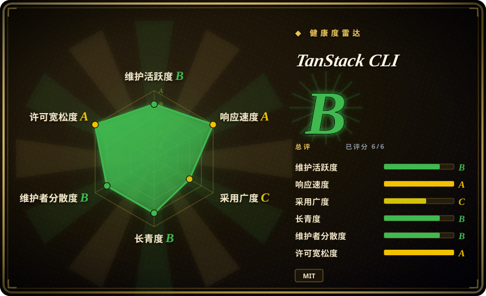
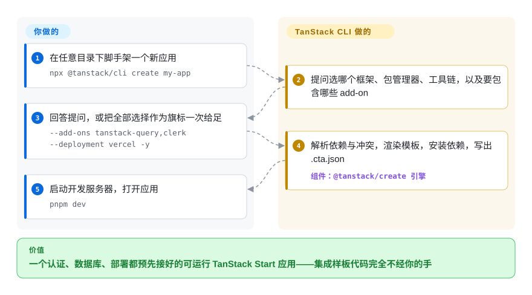

# TanStack CLI

手动起一个 TanStack Start 或 Router 项目，意味着从五份不同的文档里拼装认证、数据库层和部署配置，每样都自带一套 provider 样板；让 coding agent「加个 Clerk」，它只能瞎猜该动哪些其实归框架管的文件。TanStack CLI 一条命令生成整个应用，把这些集成做成可组合的 add-on 逐层叠加，另外提供一组 JSON 内省命令，agent 直接调用就能拿到事实，不用去爬文档站。

## 何时使用

你要起一个基于 TanStack Start 的全栈 React（或 Solid）应用——或者一个纯 Router 的 SPA——并且希望认证、ORM、部署目标和监控在你写下第一个组件之前就接好。一条 `npx @tanstack/cli create my-app` 就能产出可运行的项目：Clerk／better-auth、Drizzle／Prisma、Vercel／Cloudflare／Netlify／Railway／Render／Nitro 的部署配置、Sentry／PostHog 等已经合并进 `package.json`，以 provider 的形式注入根路由，并在 `.env.example` 里写清需要哪些 key。同一个 CLI 还能确定性地回答 agent 的问题：`tanstack create --list-add-ons --json` 列出每个 add-on 的依赖与冲突，`tanstack search-docs "loaders" --library router --json` 返回匹配的文档页——agent 先发现有什么，再去写集成，而不是凭空编造步骤。

和 **create-next-app** 或 **create-vite** 比：你已经选定 TanStack 技术栈时才选它——那两个脚手架没法往 TanStack Start 项目里叠加 add-on（Vite 的脚手架到空白 SPA 为止，Next 的到 Next 应用为止）。和用 **degit** 拷模板仓库比：组合多的时候选它——27 个 React add-on 彼此声明了 `dependsOn`／`conflicts`，怎么拼都拼得对，而一份冻结的模板会随技术栈一起烂掉。项目已有 `create` 生成的 `.cta.json` 时，`tanstack add clerk drizzle` 是维护期演化项目的正规路径。

## 怎么用起来

`tanstack` 二进制（包名 `@tanstack/cli`）是一层薄命令壳，真正的引擎是 `@tanstack/create`。一个 **add-on** 就是一文件夹的 EJS 模板——带占位符的文件模板，占位符是项目名、启用了哪些选项之类——外加一份 `info.json`，声明它提供什么（路由、包在应用外层的 provider、Vite 插件、环境变量）、依赖谁、和谁冲突、有哪些选项。你以交互方式（CLI 会提问）或旗标方式选 add-on；引擎接着解析依赖图，渲染每个模板，把依赖合并进 `package.json`，调你的包管理器安装，最后写一份 `.cta.json` 清单记录这次的选择——之后 `tanstack add` 就靠读它来对既有项目做增改。可以把它想成给起步项目用的构建系统：你描述终点（「Start ＋ file-router ＋ Clerk ＋ Drizzle ＋ Cloudflare」），它把过去靠复制粘贴的零件拼装到位。第二个面是只读内省：`libraries`、`doc`、`search-docs`、`ecosystem` 和 `--list-add-ons`／`--addon-details` 都支持 `--json`，取代了 CLI 早期内置的 MCP 服务器（`tanstack mcp` 已删除，文档明说不会恢复）。`--intent` 旗标还会写入本地技能映射，让 coding agent 发现脚手架的约定。

<!-- flow-steps:begin (generated from flows/tanstack-cli.json by tools/flow_card.py — do not edit) -->

流程文字版

1. **你**：在任意目录下脚手架一个新应用 — `npx @tanstack/cli create my-app`
2. **TanStack CLI**：提问选哪个框架、包管理器、工具链，以及要包含哪些 add-on
3. **你**：回答提问，或把全部选择作为旗标一次给足 — `--add-ons tanstack-query,clerk --deployment vercel -y`
4. **TanStack CLI**：解析依赖与冲突，渲染模板，安装依赖，写出 .cta.json — 组件：`@tanstack/create 引擎`
5. **你**：启动开发服务器，打开应用 — `pnpm dev`

**价值**：一个认证、数据库、部署都预先接好的可运行 TanStack Start 应用——集成样板代码完全不经你的手

<!-- flow-steps:end -->

## 何时不用

- **技术栈不在 TanStack 上时，用各家自己的脚手架——Next.js 用 `create-next-app`，Nuxt 用 `nuxi init`，纯 Vite SPA 用 `create-vite`——因为**本 CLI 只生成 TanStack Start 或 Router 项目（React 和 Solid），没有「自带框架」模式，`--router-only` 甚至会禁用 add-on 和部署目标。
- **用 Solid、又看中了 React 演示里的 add-on 目录时，先查 Solid 的清单（`tanstack create --list-add-ons --framework Solid`），查不到就手接或用 Solid 自己的起步项目，因为**Solid 模板树只有 9 个 add-on，React 有 27 个（2026-09-28 数自 `packages/create/src/frameworks/`）——Clerk、Drizzle、Prisma、Storybook、shadcn 和多数部署目标目前仅支持 React。
- **工作流依赖 MCP 服务器时，改用 JSON CLI 命令，因为**`tanstack mcp` 已被删除（`docs/mcp-migration.md` 写明「removed and will not be restored」）；MCP 客户端里指向 `@tanstack/cli mcp` 的配置已失效，应删除。仓库描述里至今写着「MCP Server」，是过时信息（2026-09-28 核实）。
- **项目不是本 CLI 生成的（没有 `.cta.json`）时，手工接线或用 `shadcn add` 拖组件，因为**`tanstack add` 要对照脚手架清单做增改，没有 `.cta.json` 会直接失败而不是靠猜——这是刻意设计的前置条件，对存量老项目是硬门槛。
- **环境不允许向 Google Analytics 发遥测时，先禁用（`TANSTACK_CLI_TELEMETRY_DISABLED=1`、`DO_NOT_TRACK=1`、`tanstack telemetry disable`）或改用无信标的脚手架，因为**CLI 默认每次运行都会请求 `www.google-analytics.com/g/collect`（读 `packages/cli/src/telemetry.ts` 核实；CI 环境下自动关闭）；载荷不含项目名、路径和搜索词，但出网请求本身默认存在。
- **CI 里不锁版本、放任 `npx @tanstack/cli` 浮动时，请锁精确版本（`npx @tanstack/cli@0.71.0`），因为**项目还在 v0.x，一年内删过整条命令（`mcp`）、废弃过旗标（`--no-tailwind`）；不锁版本的自动化最先在 minor 升级上断掉。

## 横向对比

| 替代品 | 是否收录 | 我们的评价 | 取舍 |
| --- | --- | --- | --- |
| create-next-app（`vercel/next.js`） | ✅ [Next.js](../../web-ui/frameworks/nextjs.zh.md) | 技术栈决定是「Next.js」时，create-next-app 是唯一正确答案，本 CLI 帮不上忙；只有选定 TanStack Start／Router、要 add-on 组合而不是裸应用时才选 TanStack CLI。 | create-next-app 脚手架的是占统治地位的 React 框架及其插件生态；TanStack CLI 换来精心打理的可组合集成，代价是脚手架被锁在仍处前 1.0 边缘的 TanStack 栈上。 |
| Vite／create-vite（`vitejs/vite`） | 未收录 | 要框架无关的 SPA 或 React／Solid 之外的栈，用 create-vite 自己加库；当 add-on 图（彼此知情的认证＋数据库＋部署＋监控）比框架自由更值钱时选 TanStack CLI。 | create-vite 给一个极简、无依赖的起点，覆盖很多框架；本 CLI 自动叠加的每一层都得你手工装配。本批次未收录。 |
| create-t3-app（`t3-oss/create-t3-app`） | 未收录 | 你的栈就是 Next.js ＋ tRPC ＋ Prisma ＋ Tailwind ＋ NextAuth（T3 栈）时，create-t3-app 是量身定做；栈是 TanStack Start、想在它的 add-on 目录上做同样的一键组合时选 TanStack CLI。 | 两者都是有主见的整栈脚手架；T3 的主见是固定的（一个具名技术栈），TanStack 的按 add-on 逐项可选——框架锁定也随之互换。本批次未收录。 |
| shadcn CLI（`shadcn-ui/ui`） | ✅ [shadcn/ui](../../web-ui/component-libraries/shadcn-ui.zh.md) | 往既有项目里掉一个组件，shadcn CLI 是范本（拷的是归你所有的代码）；整项目级、带认证／数据库／部署接线的脚手架，TanStack CLI 干的是 shadcn CLI 刻意不干的那一层。 | shadcn add 给你一份可以永远改下去的源码；tanstack add 给你一套归脚手架维护的集成接线——层次不同，TanStack CLI 里的 shadcn add-on 还能把两者组合起来。 |
| degit（`Rich-Harris/degit`） | 未收录 | 「把那个模板仓库克隆下来但不要 git 历史」用 degit 正合适；组合重要时选 TanStack CLI——27 个声明了依赖与冲突的 add-on 在生成时拼得对，冻结的模板只会随技术栈一起过期。 | degit 零魔法、不限技术栈，但交付的是某一刻的冻结状态；本 CLI 每次运行都重新解析各 add-on 的当前版本，代价是只在自己的生态里成立。本批次未收录。 |

TanStack CLI 是 TanStack 生态的入门界面：它脚手架基于 [TanStack Router](../../web-ui/frameworks/tanstack-router.zh.md)（及 Start）的应用，也能预先接好 [TanStack Query](../../web-ui/data-fetching/tanstack-query.zh.md)、TanStack Form 和 TanStack DB 这些 add-on——选这个栈的理由是那些库，CLI 只是你到达的方式。`--intent` 安装的技能映射由 TanStack Intent 生成，那是同家的兄弟项目。

## 技术栈

- **TypeScript** monorepo：pnpm workspaces 加 Nx；`@tanstack/cli`（commander 13、@clack/prompts 做交互界面、chalk、zod 校验选项）架在 `@tanstack/create` 引擎上（EJS 模板、execa 驱动包管理器、prettier 格式化产出）。
- **Add-on 引擎**：按框架分模板树（`packages/create/src/frameworks/{react,solid}/`），含 add-on、工具链（eslint／biome）、部署宿主（cloudflare、netlify、nitro、railway、render、vercel）和示例项目；add-on 元数据（`info.json`）声明依赖、冲突、选项、路由和接入点（provider、root-provider、Vite 插件、devtools）。
- **内省命令**：`libraries`、`doc`、`search-docs`、`ecosystem`、`--list-add-ons`、`--addon-details`，全部支持 `--json` 输出。
- **编程接口**：`@tanstack/create/worker` 面向边缘运行时（比如在 Cloudflare Worker 里生成项目）；tanstack.com/builder 的可视化搭建器共用同一引擎。[未验证：builder 内部实现未读，仅由 docs/cli-reference.md 提及]

## 依赖

- **Node.js >= 20**（以 `packages/cli/package.json` 的 `engines` 为准；安装文档仍写 18+——清单更严格，2026-09-28 核对），外加 npm／pnpm／yarn／bun／deno 之一负责安装。
- **网络出访**：所用的包 registry，加一个默认开启的 Google Analytics 遥测信标（`www.google-analytics.com/g/collect`）——用 `TANSTACK_CLI_TELEMETRY_DISABLED=1`、`DO_NOT_TRACK=1` 或 `tanstack telemetry disable` 关闭；CI 环境自动禁用。
- **每个 add-on 自带运行时依赖**（如 `@clerk/react`、`drizzle-orm`、`@sentry/react`），合并进生成的 `package.json`；部分依赖要求通过 `.env` 提供 API key。
- 工具本身不需要守护进程、数据库或托管服务。

## 运维难度

**低。** 一次性 CLI（`npx @tanstack/cli …` 或全局安装得到 `tanstack` 二进制）——没有要部署、要常驻的东西。真正要注意的是：

- 自动化里锁版本（`npx @tanstack/cli@0.71.0`）；v0.x 线一年内删过命令、废弃过旗标。
- 生成的 `.cta.json` 是后续 `tanstack add` 的契约——进版本控制；没有它 `add` 会拒绝执行。
- 自定义 add-on／模板有官方支持（`tanstack add-on init/compile`、`tanstack template init/compile`），经 dev-watch 循环维护；那是维护者工具，不是应用运行时。
- 若团队在受限网络下使用，把遥测政策写进入职文档。

## 健康度与可持续性

- **维护（2026-09-28）。** 活跃：`@tanstack/cli` 0.71.0 于 2026-09-01 发布，7—8 月是 0.70.x（约月更节奏），`main` 最后一次推送 2026-09-06，57 个 open issue 且 2026-09-26 仍有分类活动。本仓库合并了旧脚手架（`create-tsrouter-app`、`create-start-app`、`create-tanstack`），它们仍从这里发兼容版本。
- **治理／bus factor。** 归 TanStack GitHub 组织所有；两名核心提交者扛起整个仓库——jherr（478 commits）和 tannerlinsley（312，TanStack 创始人）——其余是一两位数贡献的长尾。有组织背书的两人核心好过单人，但不是基金会。
- **背书与寿命。** 仓库年轻：2025-02-14 创建（原名 `create-tsrouter-app`，后改名），`@tanstack/cli` 本体 2026-01-21 才首发。「年轻且非常活跃」的年龄×活跃度组合，Lindy 信号弱于它所脚手架的那些库，且它的命运绑在它们身上——Start／Router 生态若失速，CLI 没有独立存在的理由。全程 MIT，GitHub Sponsors 资助，未发现 CLA 或改许可证历史。
- **采用与生态。** `@tanstack/cli` 月下载 107,803（健康度评分器的 npm 窗口，2026-09-28；另经 npm API 手查，引擎 `@tanstack/create` 约 12.02 万／月，2026-09-27），旧别名合计还有几千——它是文档写明的 TanStack Start 起步方式。注意雷达把采用度评为 **C**：下载量是真实的，但 registry 依赖仓库数为零——没人会把脚手架 CLI 列进依赖，这个信号对此类工具天然偏弱。文档扎实（CLI 参考、add-on 编写、模板、MCP 迁移指南）。
- **风险信号。** v0.x 的变动真实且用户可见：2026 年内整条 `mcp` 命令被删、`--no-tailwind` 被废弃；仓库描述至今还在宣传已删除的 MCP 服务器（过时，2026-09-28 核实）。默认开启的遥测对部分团队是政策上的瑕疵，尽管载荷有文档、也有关闭开关。

## 存疑（未验证）

- [未验证] jherr 是否 TanStack 雇员，仓库里查不到依据（只有提交身份）；bus factor 的判断依赖 commit 计数，它反映不了 review 负担和 npm 发布权归属。
- [推断] 「文档写明的起步方式」推断自本仓库文档与 npm 量；TanStack Start 框架自己的文档（另一仓库）本轮没有读。
- [未验证] create-next-app、create-vite、create-t3-app、degit 的对比格基于这些项目的公开定位与一般认知，本批次未读其仓库。
- [推断] 「Solid 是二等目标」推断自 add-on 数量差（9 对 27，`packages/create/src/frameworks/`，2026-09-28）和文档示例以 React 为中心；未找到官方的支持级别声明。
- [未验证] 遥测载荷范围只读到源码常量（端点、GA property ID、提示文案、1.2 秒超时）；「不发项目名／路径」的结论来自对代码里过滤逻辑的阅读，没有做网络抓包。
- [未验证] tanstack.com/builder 可视化搭建器与该引擎的关系只取自 `docs/cli-reference.md` 的一句话；站点本身未审计。
