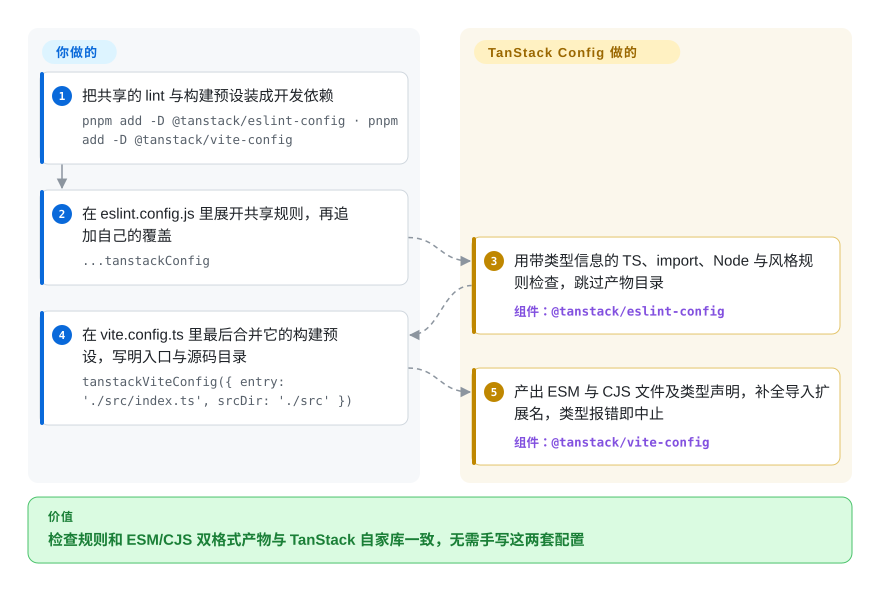

# TanStack Config

每发一个新的 TypeScript 包，都要重来一遍同样的下午：从上个仓库抄一份 ESLint 配置，和 Vite 较劲到它同时吐出 ESM 和 CommonJS、再配齐 `.d.ts` 与 `.d.cts` 类型、让 `publint` 不再报错，然后再写发版脚本。TanStack Config 就是 TanStack 自家库做这些事用的那几份开发期预设——一套 ESLint 规则、一套双格式 Vite 构建、一套 TypeDoc 转 Markdown——打包出来，别的仓库直接导入即可，不必再从头摸索。

## 何时使用

你在 pnpm monorepo 里维护一个 TypeScript 库——可能是 TanStack 的适配器或插件，也可能是你自己的无头工具库——希望它的检查、构建和文档方式与 TanStack 自家库一致，让熟悉那些仓库的贡献者一上手就认得。眼下你的 `vite.config.ts` 里已经长出一个手写插件，专门把声明文件里的 `import './foo'` 改成 `'./foo.js'`，可 CJS 使用方仍然撞上 `TS1479: The current file is a CommonJS module whose imports will produce 'require' calls`。你装上 `@tanstack/eslint-config`，在 `eslint.config.js` 里展开 `...tanstackConfig`，再把 `tanstackViteConfig({ entry, srcDir })` 最后合并进 Vite 配置——ESM/CJS 双格式产物、成对的 `.d.ts`/`.d.cts` 文件和带类型信息的检查规则，就都来自 TanStack Form 至今仍在用的那套预设（Query 与 Table 已改用 tsdown）。

如果你要的是更窄、与框架无关、专为 TypeScript **库**设计且贴合 TanStack 代码风格的规则集（不含格式化、不检查 JSON/YAML/Markdown），选它而不是 **@antfu/eslint-config**。只有当你已经在用 Vite 8 跑测试和插件、又需要 TanStack 那种确切的产物布局时，才选 `@tanstack/vite-config` 而不是 **tsdown**——项目自己的文档把它归在“Legacy Setup”之下，并说明 TanStack 的新项目会转向 tsdown。至于版本管理与发布，TanStack 自己现在用的是 **Changesets**（外加本仓库提供的两个可复用 GitHub Action），而不是 `@tanstack/publish-config`。

## 怎么用起来

它不以服务形式运行：仓库是一个 pnpm + Nx 的 monorepo，发布四个互相独立的开发依赖包，每个都是在某个知名工具上薄薄加一层“主张”。`@tanstack/eslint-config` 导出一组 ESLint “扁平配置”对象（ESLint 9 起的格式，配置就是一个可以直接展开的数组），接好带类型信息的 typescript-eslint——检查时会读取你的 `tsconfig.json` 做类型分析——再加上 import-x、eslint-plugin-n 和代码风格规则，并忽略构建产物目录。`@tanstack/vite-config` 导出一个返回 Vite 配置的函数：以库模式把入口逐文件构建到 `dist/esm/*.js` 与 `dist/cjs/*.cjs`，调用两次 `vite-plugin-dts` 分别生成 `.d.ts` 和 `.d.cts` 声明，把声明里的相对导入补上明确的扩展名，把依赖排除在打包之外，遇到任何类型错误就让构建失败退出。属于你自己的部分——框架插件、Vitest 配置、自定义的检查覆盖——仍由你保留，预设放在**最后**合并，就像在你自己的内容外面套上一个标准相框。`@tanstack/typedoc-config` 提供 `generateReferenceDocs()`，驱动 TypeDoc 配合 Markdown 插件，按 tanstack.com 需要的版式写出 API 参考页；`@tanstack/publish-config` 提供一个移植自 React Router 的 `publish()` 脚本，根据提交信息和 git 标签推算版本号。仓库里还放着几个复合 GitHub Action（`setup`、`changeset-preview`、`comment-on-release`），其他 TanStack 仓库按提交哈希固定引用它们。

<!-- flow-steps:begin (generated from flows/tanstack-config.json by tools/flow_card.py — do not edit) -->

流程文字版

1. **你**：把共享的 lint 与构建预设装成开发依赖 — `pnpm add -D @tanstack/eslint-config · pnpm add -D @tanstack/vite-config`
2. **你**：在 eslint.config.js 里展开共享规则，再追加自己的覆盖 — `...tanstackConfig`
3. **TanStack Config**：用带类型信息的 TS、import、Node 与风格规则检查，跳过产物目录 — 组件：`@tanstack/eslint-config`
4. **你**：在 vite.config.ts 里最后合并它的构建预设，写明入口与源码目录 — `tanstackViteConfig({ entry: './src/index.ts', srcDir: './src' })`
5. **TanStack Config**：产出 ESM 与 CJS 文件及类型声明，补全导入扩展名，类型报错即中止 — 组件：`@tanstack/vite-config`

**价值**：检查规则和 ESM/CJS 双格式产物与 TanStack 自家库一致，无需手写这两套配置

<!-- flow-steps:end -->

## 何时不用

- **如果你今天要为一个新库搭构建，用 tsdown 而不是 `@tanstack/vite-config`，因为** TanStack 自己的 `docs/vite.md` 把 Vite 预设归在“Legacy Setup”之下，并写明“新项目将采用 tsdown，不再继续使用自定义 Vite 方案”；旗舰仓库（Query、Table）的根 devDependencies 里已经列着 `tsdown`（2026-09-28 核对）。
- **如果你需要版本管理与发布，用 Changesets（单包、按提交信息自动发版则用 semantic-release），不要用 `@tanstack/publish-config`，因为** TanStack 各仓库自己跑的是 `changeset version` / `changeset publish`（Query、Router、Table、Form 的根脚本，2026-09-28），而这个发布包自 2026 年 3 月以来只有 CI 管道层面的补丁；把发版流水线押在作者已经离开的脚本上，方向是反的。
- **如果你不在 Vite 8 上，固定一个旧版 `@tanstack/vite-config`，或改用 tsdown/tsc 构建，因为** 0.5.0（2026-03）已放弃 Vite 6/7 支持，当前 peer 范围是 `vite ^8.0.0`，没有兼容层。
- **如果你的包管理器是 npm、Yarn 或 Bun，选一套没有这个限制的工具链（例如 tsdown 加 @antfu/eslint-config），因为** 概览文档写明“pnpm 是 TanStack Config 唯一支持的包管理器”，整套方案默认你有 pnpm 工作区和 Nx 任务缓存。
- **如果大仓库里的检查必须快，或者要覆盖不在任何 `tsconfig.json` 里的文件，用 @antfu/eslint-config 或不带类型信息的普通 typescript-eslint，因为** `@tanstack/eslint-config` 设置了 `parserOptions.project: true`——带类型信息的检查要求每个被检查文件都在某个 tsconfig 里，而且每次运行都要付出构建 TypeScript 程序的开销。
- **如果你要检查 Svelte、Vue 模板、JSON/YAML/Markdown，或想要自动格式化，用 @antfu/eslint-config（或另配 Prettier），因为** TanStack 的规则集刻意与框架无关：只针对 `**/*.{js,ts,tsx}`（外加一个 Vue 解析器挂钩），没有格式化器，而“支持 Svelte”的请求从 2024-11 起一直开着（issue #181）。
- **如果你的包从目录桶文件再导出（`import from '../utils'` 实际解析到 `utils/index.ts`），务必检查生成的声明文件，或者干脆别用这个 Vite 预设，因为** 它补扩展名的正则会把这种导入改成 `'../utils.js'` 而不是 `'../utils/index.js'`，使用方在 `skipLibCheck: false` 下编译就会失败（issue #401，自 2026-07-08 起开着，至今无人回复）。
- **如果你要通用的 HTML API 文档，直接用 TypeDoc，而不是 `@tanstack/typedoc-config`，因为** 这个预设写死了带 frontmatter 的 Markdown 输出和 TanStack 文档站版式（不显示生成器署名、不要面包屑、入口文件名为 `index`）；它是文档站适配器，不是通用文档工具。

## 横向对比

| 替代品 | 是否收录 | 我们的评价 | 取舍 |
| --- | --- | --- | --- |
| tsdown（`rolldown/tsdown`） | 未收录 | 给新的 TypeScript 库搭构建，选 tsdown——TanStack 自己的文档就把新项目指向它；只有当 Vite 8 的插件与测试栈已经在位、又需要 TanStack 那种确切的 `dist/esm` + `dist/cjs` 布局时，才选 `@tanstack/vite-config`。 | tsdown 是基于 Rolldown 的专用库打包器，自带双格式与声明文件处理，也是 TanStack 正在迁往的方向；Vite 预设能复用你现有的 Vite 配置，但背着已知的声明改写缺陷和“legacy”标签。本轮标签页批量收录未添加。 |
| Changesets（`changesets/changesets`） | 未收录 | 做 monorepo 的版本号、变更日志和 npm 发布，选 Changesets——TanStack 的发布工作流实际跑的就是它；`@tanstack/publish-config` 只适合本来就在用它那套提交信息加标签流程的仓库。 | Changesets 要求贡献者每个 PR 写一份明确的变更文件，版本升级可以被审阅；publish-config 从提交信息推断升级幅度，没有逐 PR 的产物，用户群也小得多。本轮标签页批量收录未添加。 |
| semantic-release（`semantic-release/semantic-release`） | 未收录 | 想要完全由提交信息约定驱动的自动发版，semantic-release 是仍在维护的通用工具；只有要照搬一份现成的 TanStack 式分支配置时，才选 TanStack 的发布脚本。 | semantic-release 有插件生态、采用面广，但以单包为主；publish-config 一个脚本处理多包分支映射，却只是 TanStack 内部移植的脚本，每周下载 4.3k。本轮标签页批量收录未添加。 |
| @antfu/eslint-config（`antfu/eslint-config`） | 未收录 | 应用或混合多种文件的仓库想用一行配置同时拿到检查与格式化，选 @antfu/eslint-config；要让 TypeScript 库遵守 TanStack 那套带类型信息、不管格式化的规则，选 `@tanstack/eslint-config`。 | antfu 的预设覆盖 TypeScript、JSX、Vue、JSON、YAML、TOML 和 Markdown，并取代 Prettier；TanStack 的更窄、对类型更严（带类型解析），但格式化和非 JS 文件得你自己管。本轮标签页批量收录未添加。 |
| TypeDoc（`TypeStrong/typedoc`） | 未收录 | 一般的 API 参考文档直接用 TypeDoc；只有想给仿 tanstack.com 搭建的文档站生成 TanStack 版式的 Markdown 页时，才用 `@tanstack/typedoc-config`。 | 原生 TypeDoc 有 HTML 主题和全部选项；预设替你定死了 Markdown 插件、frontmatter 和版式，也就拿走了这些选择。本轮标签页批量收录未添加。 |

这个仓库是其他 TanStack 库背后的共享工具链——[TanStack Query](../../web-ui/data-fetching/tanstack-query.zh.md)、[TanStack Table](../../web-ui/component-libraries/tanstack-table.zh.md)、[TanStack Router](../../web-ui/frameworks/app-frameworks/tanstack-router.zh.md) 和 [TanStack Form](../../web-ui/forms/tanstack-form.zh.md) 都在根目录固定引用 `@tanstack/eslint-config`（多数还引用 `@tanstack/typedoc-config`）。选用这些库并不需要它；只有当你要按它们的风格去**做包**时，它才有意义。

## 技术栈

- **TypeScript** monorepo：pnpm 工作区（`packageManager: pnpm@12.4.2`），Nx 作为带缓存的任务执行器，本仓库自己的发版用 Changesets，依赖更新 PR 由 Renovate 提交，依赖卫生用 Sherif 和 Knip。
- **`@tanstack/eslint-config`**：基于 `@eslint/js`、typescript-eslint（带类型信息）、eslint-plugin-import-x、eslint-plugin-n、`@stylistic/eslint-plugin`、`globals`、`vue-eslint-parser` 的 ESLint 扁平配置；peer 为 `eslint ^9 || ^10`。
- **`@tanstack/vite-config`**：Vite 库模式，加 `vite-plugin-dts`、`vite-plugin-externalize-deps`、`vite-tsconfig-paths`；peer 为 `vite ^8`；产物不压缩、带 sourcemap。
- **`@tanstack/typedoc-config`**：TypeDoc 加 `typedoc-plugin-markdown` 和 `typedoc-plugin-frontmatter`。
- **`@tanstack/publish-config`**：纯 ESM JavaScript，依赖 `@commitlint/parse`、`semver`、`simple-git`、`jsonfile`，并调用 `git` 与 GitHub CLI。
- **可复用 GitHub Action**（位于 `.github/`）：`setup`（通过 `voidzero-dev/setup-vp` 装 Node 与 pnpm）、`changeset-preview`、`comment-on-release`。

## 依赖

- 概览文档要求 **Node.js 20.17+**（各包清单仍声明 `>=18`）、**Git** 和 **pnpm v10+**；GitHub CLI 只有发布脚本需要。
- 检查预设需要 **ESLint 9 或 10**，构建预设需要 **Vite 8**，另外要有覆盖所有被检查文件的 `tsconfig.json`（带类型信息的规则所需）。
- 不会给你发布的包增加任何运行时依赖——四个包都是开发期工具。没有服务、数据库，除包仓库外（发布时再加 GitHub）没有其他网络出口。

## 运维难度

**低**，但有升级摩擦。没有东西要部署；成本在于让不由你控制的预设跟上你的仓库：

- 预设会在你脚下变：Vite 预设 0.5.0 放弃了 Vite 6/7，0.6.0 升级到 `vite-plugin-dts` 5 并支持 TypeScript 7；ESLint 预设在 0.4.0 升到 `@eslint/js` 10。固定版本，升级前先读 `CHANGELOG.md`。
- Vite 预设默认由它掌管 `build`——文档要求你在自己的配置里不要改 `build`——所以要定制产物形态，就只能 fork 它或者不用它。
- 所有包都是 0.x 版本，破坏性变更落在次版本号上。

## 健康度与可持续性

- **维护（2026-09-28）。** 活跃但量小：最后推送 2026-09-27，近期发布有 `typedoc-config` 0.3.4（2026-08-09）和 `vite-config` 0.6.0（2026-07-21）；提交流里很大一部分是 Renovate 的依赖升级。issue 往来稀少（一年寥寥几个），最新的缺陷报告（#401，2026-07-08）至今没有维护者回复。
- **治理 / 巴士因子。** 归 TanStack GitHub 组织所有，有一份指向核心团队的 `CODEOWNERS`（2026-08 加入）。实际上主要由一人支撑：Lachlan Collins 提交 200 次，其次是 TanStack 创始人 Tanner Linsley（95 次）和 Corbin Crutchley（15 次），其余人都是个位数。
- **背书与寿命。** 创建于 2023-12-31，约 2.75 年；最初的一体化 npm 包 `@tanstack/config`（最后版本 0.22.2，2025-11-29）已被标为弃用，拆成了 2025-03-04 首发的四个作用域包。“年龄 × 仍活跃”给出中等的 Lindy 先验，而它的前途绑定在 TanStack 自身的需要上：Vite 和发布这两半在 TanStack 内部已经在被 tsdown 与 Changesets 取代。
- **采用与生态。** npm 周下载量（2026-09-21 至 09-27）：`@tanstack/eslint-config` 28.5 万（健康度评分器的 npm 月窗口为 950335，2026-09-28），`vite-config` 1.95 万，`typedoc-config` 1.56 万，`publish-config` 4.3 千，已弃用的一体化包仍有 7 千。检查预设的使用面远超本仓库 395 个 star 所显示的；其余三个主要是 TanStack 生态内部在用。
- **风险信号。** MIT 许可，没有发现 CLA 或改许可证的历史。真正的风险是策略层面的：这是 TanStack 原样公开的内部工具，一旦方向调整（比如转向 tsdown），某个预设就会变成“legacy”，没有弃用过渡期。

## 存疑（未验证）

- [未验证] `@tanstack/eslint-config` 每周约 28.5 万下载的来由没有查清——npm 计数本身是真的（2026-09-21 至 09-27），但没有拉取依赖方明细；其中可能包含其他包的传递安装或 CI 的大量重复安装。
- [推断] “大仓库里带类型信息的检查更慢”是根据 `packages/eslint-config/src/index.ts` 里的 `parserOptions.project: true` 和 typescript-eslint 的工作方式推断的，没有跑基准测试。
- [推断] `@tanstack/publish-config` 实际上已成遗留，是根据 TanStack 自家仓库都跑 Changesets 脚本（Query/Router/Table/Form 根 `package.json`，2026-09-28）以及它自 2026-03 起只有 CI 管道修复的变更日志推断的；官方没有弃用声明。
- [未验证] 一体化包 `@tanstack/config` 上的 npm 弃用文字（“Package no longer supported. Contact Support…”）是 npm 的通用措辞；何时、由谁标为弃用没有核实。
- [未验证] “何时使用”场景里的 `TS1479` CJS 导入报错只是用来说明 Vite 预设所针对的那类双格式发布故障（`docs/vite.md` 写的是“同时发布 ESM 和 CJS……兼容所有 TypeScript 模块解析选项”），并非在此复现的报错。
- [未验证] tsdown、Changesets、semantic-release、@antfu/eslint-config 和 TypeDoc 的对比内容基于 2026-09-28 读到的仓库元数据与 README 功能列表，没有实际运行。
