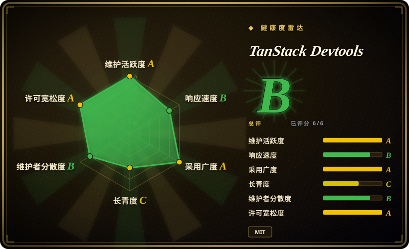
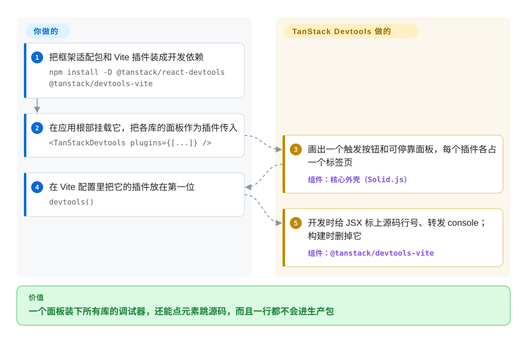

# TanStack Devtools

页面右下角挤着三个调试按钮：请求缓存一个、路由一个、表单库一个，互相抢层级，各开各的面板、各记各的开关状态。TanStack Devtools 给它们一个共用的抽屉：每个库的调试器变成同一个可停靠面板里的一个标签页；配套的 Vite 插件还能让你点页面元素直接跳到源码，并在生产构建时把这一切删干净。

## 何时使用

你在 Vite 上跑一个 React（或 Solid、Vue、Preact）应用，已经用了两个以上的 TanStack 库，比如 [TanStack Query](../../web-ui/data-fetching/tanstack-query.zh.md) 和 [TanStack Router](../../web-ui/frameworks/app-frameworks/tanstack-router.zh.md)。开发时你反复开关 `<ReactQueryDevtools />` 和 `<TanStackRouterDevtools />`：两个独立浮层，各自在角落画一个按钮，刷新一次就忘了你拖好的尺寸。现在你只在根部挂一次 `<TanStackDevtools plugins={[…]} />`，把各库的 `*DevtoolsPanel` 当插件传进去，就得到一个可调高度的工作台：标签页切换、最多三个插件并排、统一主题和快捷键，全部存进 `localStorage`。再把 `devtools()` 放在 Vite 插件第一位，你还会得到源码定位（按住 Shift+Alt+Ctrl/Meta 点元素，编辑器直接打开那一行 JSX）和浏览器与终端互通的 console；`vite build` 时这些导入被删掉，一个字节都不进产物。

第二种触发场景是库作者：你维护一个状态库或内部 SDK，想给它配一个调试面板，但不想自己写触发按钮、拖拽、停靠和持久化。你写一个带类型的 `EventClient` 把状态发出来，再写一个面板组件，外壳就把它和 TanStack 自家的面板放在一起。要面板**长在页面里**、不装浏览器扩展、还要同时容纳好几个库时，选它而不是 React DevTools、Redux DevTools、Vue DevTools 扩展这条路；应用不是 Nuxt 时，选它而不是 Nuxt DevTools，后者是同一思路更成熟的实现，但只存在于 Nuxt 里。

## 怎么用起来

核心包是一个很小的 Solid.js 应用（Solid 是一个和 React 类似、但编译成直接 DOM 操作的 UI 框架），负责画触发按钮、可停靠面板、设置页和标签栏。你的框架从不渲染这个外壳：一层很薄的适配包（`@tanstack/react-devtools`、`vue-devtools` 等）创建它、把它挂到一个 DOM 节点上，再把**你的**插件组件“传送”进外壳留出的空盒子里，所以 React 面板仍然是 React 组件。插件和被调试的代码之间靠 `EventClient` 通信：它是对浏览器 `window` 上 `CustomEvent`（自定义事件）的带类型封装，单页面内无需任何服务器就能工作；Vite 插件运行时还会起一个小的 WebSocket/SSE 服务（默认端口 4206），让事件能跨标签页、到达开发服务器进程。Vite 插件本身是一组构建期代码改写：给每个 JSX 元素打上 `data-tsd-source` 文件和行号属性（供点元素跳源码），改写 `console.*` 调用让它带上出处，并在生产构建时删除所有 `@tanstack/*-devtools` 导入。你决定挂哪些面板、要不要跑 Vite 插件；布局、持久化和传输归外壳管。可以把它想成调试工具的排插：它自己什么都不测，只给每个库的调试器留一个插座。

<!-- flow-steps:begin (generated from flows/tanstack-devtools.json by tools/flow_card.py — do not edit) -->

流程文字版

1. **你**：把框架适配包和 Vite 插件装成开发依赖 — `npm install -D @tanstack/react-devtools @tanstack/devtools-vite`
2. **你**：在应用根部挂载它，把各库的面板作为插件传入 — `<TanStackDevtools plugins={[...]} />`
3. **TanStack Devtools**：画出一个触发按钮和可停靠面板，每个插件各占一个标签页 — 组件：`核心外壳（Solid.js）`
4. **你**：在 Vite 配置里把它的插件放在第一位 — `devtools()`
5. **TanStack Devtools**：开发时给 JSX 标上源码行号、转发 console；构建时删掉它 — 组件：`@tanstack/devtools-vite`

**价值**：一个面板装下所有库的调试器，还能点元素跳源码，而且一行都不会进生产包

<!-- flow-steps:end -->

## 何时不用

- **如果你只想看 React 组件树、props、hooks 或做渲染性能分析，用 React Developer Tools（React 仓库里的浏览器扩展），因为** TanStack Devtools 自己什么都不检查，它只是承载别的库的面板；一个插件都不挂时，它就是个空抽屉。
- **如果你的打包器是 webpack、Turbopack 或 Next.js，改为把各库自带的独立 devtools 组件放在 `NODE_ENV` 判断后面，因为** 源码定位、console 转发、事件总线服务和自动剥离生产代码只由 `@tanstack/devtools-vite` 和 `@tanstack/devtools-rspack` 提供（2026-09-28 核对）；其他打包器下文档要求你自己把 devtools 排除出生产包，你能用的只剩面板外壳。
- **如果开发服务器能被你以外的人访问（共享机器上 `server.host: 0.0.0.0`、云 IDE、演示用的内网穿透），设置 `eventBusConfig.enabled: false` 或者不装 Vite 插件，因为** 开发期事件总线返回 `Access-Control-Allow-Origin: *` 且没有鉴权，插件市场的 `install-devtools` 处理器把事件里的包名拼进 `npm install -D ${packageName}` 字符串，再用 `child_process.exec()` 执行——issue #464（2026-06-19 起一直开着）把它报为命令注入，2026-09-28 读到的 `main` 分支代码仍是如此。同一浏览器里任意网页能否打到它，取决于这里没有复现的传输细节 [推断]。
- **如果你要的是 Redux 类状态库的时间旅行调试（动作日志、回放、状态差异），用 Redux DevTools，因为** 那是现成的专用工具；在这里你得自己在 `EventClient` 上把那个面板写出来。
- **如果问题是“这个组件为什么在重复渲染”，用 React Scan，因为** 它直接插桩 React 的渲染路径并把元凶标出来；TanStack Devtools 没有渲染分析器（它附带的是无障碍审计插件，不是性能插件）。
- **如果你用 Nuxt，用 Nuxt DevTools，因为** 它和框架深度集成（模块可以贡献标签页、自带服务端 RPC），而且早好几年；在 Nuxt 里再挂一个 TanStack 外壳是重复建设。
- **如果你要在它的 API 上做产品功能，先等等或锁死精确版本，因为** 文档把项目标为 **alpha**，API “可能变化”；核心包在 2026 年 6 月到 9 月间从 0.12 走到 0.15，开着的 issue 里有 Cloudflare Vite 插件不兼容（#375）、Vite 8 下 Solid 多实例（#411）、注入的 `data-tsd-source` 属性导致 SSR 水合不一致（#405）、console 转发刷爆日志（#428、#482）。

## 横向对比

| 替代品 | 是否收录 | 我们的评价 | 取舍 |
| --- | --- | --- | --- |
| React Developer Tools（`facebook/react` 的 `packages/react-devtools*`） | ✅ [React](../../web-ui/frameworks/view-frameworks/react.zh.md) | 查 React 组件树、props、hooks 和性能分析，就用 React DevTools，TanStack Devtools 替代不了它；只有要在页面里承载库面板（请求缓存、路由状态、你自己的 store）时才选 TanStack Devtools。 | React DevTools 能看到任何用户态面板都够不着的 React 内部，但它活在浏览器扩展（或独立应用）里，不懂你的库状态；TanStack 的外壳只看得到插件发出来的东西，好处是不用装扩展。 |
| Vue DevTools（`vuejs/devtools`） | 未收录 | Vue 应用里，Vue DevTools（扩展或它的 Vite 插件浮层）是组件、Pinia、路由的官方调试器；只有同时用了需要宿主的 TanStack 库面板时，才再加 TanStack Devtools。 | Vue DevTools 深而专；TanStack 的 Vue 适配包很新（`@tanstack/vue-devtools` 周下载约 6.3k，2026-09-27），它承载面板，不检查 Vue 本身。本批次（标签页收录）未添加。 |
| Nuxt DevTools（`nuxt/devtools`） | 未收录 | 在 Nuxt 里选 Nuxt DevTools，它是同样的页内、可插拔标签页设计，并与 Nuxt 模块和服务端集成；没有元框架的纯 Vite/React/Solid/Vue 应用要同样体验时，选 TanStack Devtools。 | Nuxt DevTools 拿得到框架级钩子、历史更长，但只能用于 Nuxt；TanStack 的与框架无关，但还是 alpha。本批次（标签页收录）未添加。 |
| Redux DevTools（`reduxjs/redux-devtools`） | 未收录 | 用 Redux（或任何接入其扩展协议的 store）且要时间旅行、动作回放、状态差异时，选 Redux DevTools；想给自家 store 做一个页内定制面板、并愿意自己写界面时，选 TanStack Devtools。 | Redux DevTools 通过浏览器扩展给你一整套时间旅行界面；TanStack 给你带类型的传输和宿主外壳，但没有任何针对具体 store 的视图。本批次（标签页收录）未添加。 |
| React Scan（`aidenybai/react-scan`） | 未收录 | 要找 React 的无效重渲染，直接接入 React Scan；TanStack Devtools 回答的是“我的库状态是什么”，不是“为什么渲染了”。 | React Scan 是零配置的渲染分析浮层；TanStack Devtools 是给别的面板用的宿主，自己不做性能分析。本批次（标签页收录）未添加。 |

TanStack Devtools 是 TanStack 家族自家面板的共用宿主：[TanStack Query](../../web-ui/data-fetching/tanstack-query.zh.md)、[TanStack Router](../../web-ui/frameworks/app-frameworks/tanstack-router.zh.md)、[TanStack Form](../../web-ui/forms/tanstack-form.zh.md)、TanStack Pacer 等都提供为它设计的 `*DevtoolsPanel` 组件，`@tanstack/form-core` 和 `@tanstack/pacer` 直接依赖它的 `@tanstack/devtools-event-client`（npm，2026-09-28）。用 [TanStack CLI](tanstack-cli.zh.md) 脚手架出的应用是最常见的入口。

## 技术栈

- **TypeScript** 单体仓库（pnpm workspaces + Nx，用 changesets 发版，Vitest 单测，Playwright 端到端测试）。
- **核心外壳** `@tanstack/devtools`：Solid.js ≥1.9.7（即使在 React 应用里也是 peer 依赖），goober 做 CSS-in-JS，`@neodrag` 做拖拽，外加 `@solid-primitives/*`；共享 UI 在 `@tanstack/devtools-ui`。
- **适配包**：React、Preact、Solid、Vue、Svelte、Angular 各一个；各自用 portal、Teleport、`mount()`、`createComponent()` 把原生组件转成外壳的 `render(el, props)` 接口。
- **事件系统**：`@tanstack/devtools-event-client`（带类型的 CustomEvent 封装，`NODE_ENV` 不是 development 时自动变成空实现，除非从 `/production` 子路径导入）和 `@tanstack/devtools-event-bus`（浏览器端 `ClientEventBus` 用 `BroadcastChannel` 做跨标签同步；Node 端 `ServerEventBus` 走 WebSocket + SSE）。
- **构建插件**：`@tanstack/devtools-vite` 和 `@tanstack/devtools-rspack`，共用 `@tanstack/devtools-bundler-core`（oxc-parser + MagicString 注入源码位置、改写 console、删除 devtools 导入、用 `launch-editor` 打开编辑器、为插件市场调用包管理器命令）。
- **附加包**：`@tanstack/devtools-a11y`（无障碍审计插件）、`@tanstack/devtools-webmcp`（为浏览器 agent 注册仅开发期可用的 WebMCP 工具）、`@tanstack/devtools-utils`（插件工厂辅助函数）。

## 依赖

- **运行时（浏览器里，仅开发期）**：框架适配包 + 核心外壳；不管你用什么框架，它都会把 **Solid.js** 带进开发包（issue #411 就是 Vite 8 下由此出现的“多实例”警告）。
- **构建**：完整功能需要 Vite（或 Rspack）；Vue 的快速上手把 Vite 插件标为可选，Svelte、Angular 的快速上手不装它，React、Preact、Solid 默认装。
- **开发服务器上的副作用**：为事件总线多起一个本地 HTTP 服务（默认端口 4206，被占用则自动加一）；点元素跳源码时由 `launch-editor` 拉起编辑器；插件市场会执行 `npm`、`pnpm`、`yarn`、`bun` 安装命令并改写你的源码来注册插件。
- **不依赖托管服务**：库本身不向机器外发送任何数据（2026-09-28 读过的包里没找到遥测）。

## 运维难度

接入**低**，让它安静下来**中等**。它是开发依赖：装两个包、挂一个组件、加一个 Vite 插件，没有要部署的东西。持续成本在集成摩擦：它动你的构建（每个 JSX 文件都做 AST 改写、改写 console）、你的开发服务器（多一个端口、一个会执行 shell 的插件市场处理器）和你的依赖图（多一个 UI 框架）。和 SSR、Cloudflare/Nitro 部署或 Playwright 测试冲突时（issue #405、#375、#390、#318），要准备逐项关掉 `injectSource`、`consolePiping`、`enhancedLogs`、`eventBusConfig.enabled`；alpha API 每月都在变，版本要锁住。真要带进生产，文档要求设 `removeDevtoolsOnBuild: false`、改成普通依赖并用 `/production` 子路径的 event client，而且文档本身不推荐这么做。

## 健康度与可持续性

- **维护（2026-09-28）**：非常活跃。`@tanstack/devtools` 0.15.0 于 2026-09-23 发布（7 月 0.13，8 月 0.14.x），同一周 `main` 上还有提交（热角、可配置的源码检查 URL、新的 WebMCP 包）。56 个开着的 issue，有几条 bug 报告几周都没有维护者回复。
- **治理与巴士系数**：归 TanStack GitHub 组织所有，但实际由一个人扛：AlemTuzlak 202 次提交，下一位真人（harry-whorlow）36 次，其余都是个位数。知名组织里的单人核心——比个人仓库强，但比 TanStack 那几个老库弱。
- **背书与长期性**：很年轻。仓库创建于 2025-07-25，npm 首发于 2025-07-29，约 14 个月，仍标 alpha。Lindy 先验帮不上什么；它的存续绑在 TanStack 生态上，而生态已经为它出了各库面板，依赖是双向的。
- **采用与生态**：量很大，但部分是被动的。`@tanstack/devtools`、`@tanstack/react-devtools` 周下载约 2.0M，`@tanstack/devtools-vite` 约 15.7M，`@tanstack/devtools-event-client` 约 20.7M（npm，截至 2026-09-27 的一周；健康度评分按 event-client 近一月 55,695,488 次下载计，所以采用轴是 A）。event-client 的量至少部分来自 TanStack Form 和 Pacer 对它的直接依赖；下载这么高而星标只有 500，说明多数用户是经由 TanStack 进来的，而不是专门挑中这个仓库。仓库里有一份需要提 PR 才能加入的插件市场登记表。
- **风险信号**：MIT，没找到 CLA 或改许可证的历史。没有 `SECURITY.md`（#464 的报告者公开指出了这一点）；那份命令注入报告搁了两个月，维护者才在 2026-08-24 回复会处理，而 2026-09-28 时 `exec()` 拼字符串的写法仍未改。alpha 阶段的 API 变动是另一个风险。

## 存疑（未验证）

- [推断] issue #464 能否被任意网页利用：代码读下来是 CORS `*`、无鉴权、再加拼字符串的 `exec()`，但没有实际复现；别处可能有 POST 路径或载荷校验缩小了攻击面。
- [未验证] `@tanstack/devtools-vite` 为什么有约 15.7M 周下载——多半是某个传递依赖（TanStack 的框架插件或脚手架模板），但没有找出具体是谁。
- [推断] “多数用户经由 TanStack 进来”是根据星标与下载量之比、以及 form-core/pacer 的依赖推出来的，没有调查数据。
- [未验证] 对比表里 React DevTools、Vue DevTools、Nuxt DevTools、Redux DevTools、React Scan 的评价基于这些项目的公开定位；本批次没有读它们的仓库（只看了元数据：都是 MIT，截至 2026-09-28 都在最近六周内有推送）。
- [未验证] Svelte 和 Angular 适配包的成熟度：npm 上 `@tanstack/svelte-devtools` 是 0.1.x，`@tanstack/angular-devtools` 是 0.0.12（2026-09-28）；与 React 版相比完成度如何没有测试。
- [未验证] “没有遥测”只覆盖 2026-09-28 粗读过的 core、event-bus、bundler-core 源码，不是完整审计，也没有抓包。
