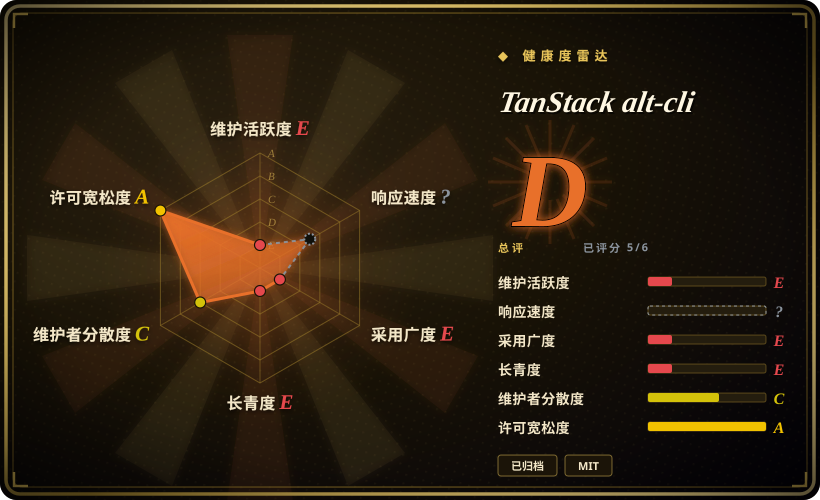
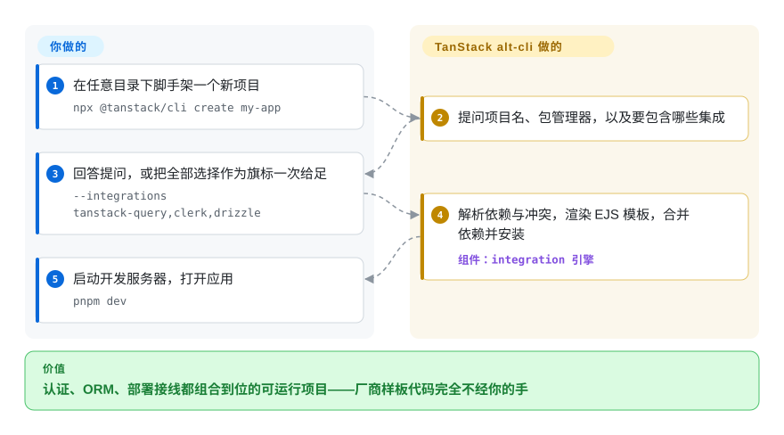

# TanStack alt-cli

你顺着一条 2026 年 1 月的链接点进 `TanStack/alt-cli`——「The official TanStack CLI for scaffolding, MCP, agent skills」——照着它的 README 敲 `npx @tanstack/cli create my-app`，装上来的却是另一套代码：这个仓库是一场只活了一周的实验，早已归档，它发过 0.0.1–0.0.8 的那个 `@tanstack/cli` 包名从 2026-01-29 起就一直归主线 TanStack CLI 所有。本页存在的意义，是让你一眼认出这个坑，并说清这个仓库还剩什么价值。

## 何时使用

你不会主动选 alt-cli 来搭任何东西——你是「走到」它面前的：多半来自 npm 考古（`@tanstack/cli` 的 0.0.1–0.0.8，发布于 2026-01-21 到 2026-01-25，在现任 CLI 的更新日志里对不上号）、一场旧演示，或一个像它自家 README 那样仍然写着 `npx @tanstack/cli create my-app` 的链接。今天照这条命令敲下去，装的是主线 `TanStack/cli` 仓库的 v0.71.0——另一个代码库。值得打开这个仓库的理由只有两个：一是当**模式参考**——它是一份紧凑可读的「集成组合式脚手架」实现（29 个集成，每个集成一个目录，`info.json` 声明 `dependsOn`／`conflicts`，EJS 资产模板交给一个千行级引擎编译），外加一套面向 agent 的 MCP 脚手架接口（`listTanStackIntegrations`、`createTanStackApplication`）；二是当**历史**——它最后一次提交里的吉他店 AI 演示，原封不动地出现在今天 TanStack CLI 的 add-on 里，它解释了那东西的来历。凡是想拿来跑的，一律改用 [TanStack CLI](tanstack-cli.zh.md)——持有 npm 包名的在维护后继者。

## 怎么用起来

这个仓库是 pnpm monorepo，`@tanstack/cli` 包暴露一个 `tanstack` 二进制。你做的事是选集成——交互式地答 @clack 提问（项目名、包管理器），或用逗号分隔的 `--integrations` 旗标一次给足；它替你做的是组合：引擎解析每个集成声明的依赖与冲突，从 GitHub 上这个仓库自己的 `integrations/` 目录拉取集成定义，渲染每个集成的 EJS 资产模板（路由、provider、配置文件），把该集成的 `package.json` 依赖合并进你的项目，安装，最后写一份 `.tanstack.json` 清单记录这次的选择。可以把它想成一个「安装单元不是库而是接好线的集成」的包管理器——Clerk 装下来是 provider、路由和环境变量骨架，而不只是 `@clerk/react`。第二个面是 `tanstack mcp`：一个本地 MCP 服务器（stdio 或 HTTP／SSE），Claude Desktop 这类 agent 客户端连上之后，agent 自己就能列集成、建项目，不用去爬文档。两个面都只服务 TanStack Start 项目，没有任何其他框架模式。

<!-- flow-steps:begin (generated from flows/tanstack-alt-cli.json by tools/flow_card.py — do not edit) -->

流程文字版

1. **你**：在任意目录下脚手架一个新项目 — `npx @tanstack/cli create my-app`
2. **TanStack alt-cli**：提问项目名、包管理器，以及要包含哪些集成
3. **你**：回答提问，或把全部选择作为旗标一次给足 — `--integrations tanstack-query,clerk,drizzle`
4. **TanStack alt-cli**：解析依赖与冲突，渲染 EJS 模板，合并依赖并安装 — 组件：`integration 引擎`
5. **你**：启动开发服务器，打开应用 — `pnpm dev`

**价值**：认证、ORM、部署接线都组合到位的可运行项目——厂商样板代码完全不经你的手

<!-- flow-steps:end -->

## 何时不用

- **任何新的脚手架需求，改用 [TanStack CLI](tanstack-cli.zh.md)，因为**本仓库已归档（GitHub API，2026-09-28 核实），最后一次提交停在 2026-01-25，issue 区已关闭、4 个外部 PR 永远合不进去——而它自己文档里的命令（`npx @tanstack/cli …`）如今装的是主线 CLI，不是这套代码。
- **技术栈不在 TanStack Start 上时，用各家自己的脚手架——Next.js 用 `create-next-app`，纯 Vite SPA 用 `create-vite`，T3 栈用 `create-t3-app`——因为**alt-cli 的引擎只会组合 TanStack Start 项目，连它自己的文档里都没有「自带框架」模式。
- **想要的是原样复制一份冻结的起步项目时，用 degit 拷模板仓库，因为**alt-cli 在生成期做的是解析与合并——对「把那个仓库克隆下来但不要历史」来说这套机器纯属多余；degit 零魔法且不限技术栈。
- **看中的是 MCP 驱动的 agent 脚手架时，注意如今两边都没有这个东西：改用主线 CLI 的 `--json` 内省命令，因为**后继者在 2026 年删掉了自己的 `tanstack mcp` 命令（文档写明「removed and will not be restored」，见 [TanStack CLI](tanstack-cli.zh.md) 页）——本仓库里的 MCP 服务器指向一个已被收回的包名，是一个配置陷阱，不是可用路径。
- **需要集成目录跟得上上游时，去看主线 CLI 的 add-on 清单，因为**这 29 个集成冻结在 2026 年 1 月的依赖版本（每个集成的 `package.json` 各自锁版本）；那时候的 Clerk、Drizzle 接线到今天早已漂移。
- **想在 CI 里钉住它时，别钉——把它当阅读材料，因为**v0.0.8 带着的是 2026 年 1 月的 express 4、commander 13、zod 3，一个归档仓库永远不会给它们发安全更新。

## 横向对比

| 替代品 | 是否收录 | 我们的评价 | 取舍 |
| --- | --- | --- | --- |
| create-next-app（`vercel/next.js`） | ✅ [Next.js](../../../web-ui/frameworks/app-frameworks/nextjs.zh.md) | 技术栈决定是「Next.js」时，create-next-app 是唯一候选，alt-cli 根本不在候选列（已归档、只服务 TanStack）；读 alt-cli 只为把它的集成清单模式抄去写你自己的生成器。 | create-next-app 脚手架主流 React 框架且持续维护；alt-cli 展示的是一套冻结在 2026 年 1 月的可组合集成设计——一个是拿来跑的工具，一个是拿来读的模式。 |
| create-vite（`vitejs/vite`） | 未收录 | 任何非 TanStack 的 SPA，用 create-vite 起步、自己加库；alt-cli 从来不服务这个人群，如今在运营意义上也不服务任何人。 | create-vite 给一个极简、框架无关的起点，随 Vite 的节奏持续更新；alt-cli 的 29 个精选集成，换来的是单栈、单周的豪赌。本批次未收录。 |
| create-t3-app（`t3-oss/create-t3-app`） | 未收录 | 你要的是「一条命令得到接线完整的整栈」，create-t3-app 是它的具名技术栈上活着的答案；alt-cli 是 TanStack Start 上这个答案在 2026 年 1 月的一周版本，今天的答案叫已收录的 TanStack CLI。 | 两者都把认证／数据库／工具链组合进一份脚手架；T3 的主见固定且在维护，alt-cli 的主见可选但随即被弃——选维护者还活着的那边。本批次未收录。 |
| degit（`Rich-Harris/degit`） | 未收录 | 「把那个模板仓库复制下来但不要 git 历史」用 degit 正合适；alt-cli 那个做依赖解析的引擎对逐字复制来说是错误的机器，何况已归档。 | degit 交付某一刻的冻结状态、零魔法；alt-cli 在生成期解析依赖图——脚手架光谱的两端，且只有一端还在维护。本批次未收录。 |
| Yeoman（`yeoman/yo`） | 未收录 | 如果 alt-cli 的模式让你想到「生成器就是带元数据声明的可组合单元」，Yeoman 正是这件事长期维护的通用框架；用它，别复活这个仓库的引擎。 | Yeoman 用社区生成器生态和十多年的维护，换掉 alt-cli 精选打包的集成目录；你要写生成器代码，而不是丢资产目录。本批次未收录。 |

TanStack alt-cli 是 [TanStack CLI](tanstack-cli.zh.md)（同目录、同一个 `@tanstack/cli` 包名——0.0.1–0.0.8 出自本仓库，0.48.2 起归主线）被废弃的兄弟项目：它的集成内容有据可查地活了下来——`integrations/ai/` 里的 `example-guitar-*.jpg` 演示资产，原样出现在主线 `packages/create/src/frameworks/react/add-ons/ai/` 里 [推断]——所以把它当主线 add-on 层的祖先来读，脚手架一律用主线。

## 技术栈

- **TypeScript** pnpm monorepo：Nx 管任务图，changesets 管发版，vitest 跑测试，tsdown 构建；knip 和 sherif 管仓库卫生。
- **CLI 包** `@tanstack/cli` 0.0.8（bin：`tanstack`）：commander 13 管命令，@clack/prompts 做交互界面，chalk、zod 校验选项，EJS 做模板，`ignore`／`parse-gitignore` 过滤资产。
- **MCP 服务器**：`@modelcontextprotocol/sdk` 架在 express 4 上（`tanstack mcp`，stdio 或 HTTP／SSE），按 `docs/mcp/tools.md` 暴露 `listTanStackIntegrations` 与 `createTanStackApplication`。
- **集成引擎**（`packages/cli/src/engine/`）：模板编译、配置文件处理，以及负责组合多个集成的 `compile-with-addons.ts`；集成以数据形式存在——`integrations/<id>/{info.json,files.json,package.json,assets/}`——由 `integrations/manifest.json` 编目（29 项，覆盖 tanstack／auth／database／orm／deploy／tooling／api／monitoring／i18n／cms 类目）。
- 兄弟包 `create-start` 与 `create-tanstack-app` 是架在同一引擎上的薄壳。

## 依赖

- **Node.js 18+**（`docs/installation.md`；仓库自己的 `.nvmrc` 锁 24.8.0），外加 npm／pnpm／yarn／bun／deno 任一用于安装（`--package-manager`）。
- **网络出向**：npm registry，外加 GitHub——生成期 CLI 会从这个仓库的 `integrations/` 目录拉取集成定义与资产文件（见仓库 AGENTS.md，以及那条为「enable GitHub asset fetching」补 `files.json` 的提交），所以这条路径一旦消失，脚手架直接断——对一个归档仓库这是真实风险。
- **`tanstack mcp`** 在本地起一个 MCP 服务器，供 agent 客户端（Claude Desktop、Claude Code、OpenCode）连接；没有其他常驻进程，没有数据库，没有托管服务。
- 每个集成会把各自运行时依赖（如 `@clerk/react`、`drizzle-orm`）合并进生成的项目，全部锁在 2026 年 1 月的版本。

## 运维难度

**低——而且刻意让它零影响。**一次性的 `npx` CLI，没有要部署或常驻的东西。运营层面的现实是「无可运营」：仓库已归档，issue 已关闭，4 个打开的 PR（外部修复，包括一条改正 changeset 配置里仓库指向的）永远合不进去。真要跑 v0.0.8，等于接受 2026 年 1 月的依赖版本和永不到来的安全更新；照它的 README 跑，则悄悄跑到了主线上。无论哪种，正确的姿势都是：引擎拿来看，运行用后继者。

## 健康度与可持续性

- **维护：设计意义上的死亡（2026-09-28）。**GitHub API 显示已归档；整个开发窗口是 2026-01-18 到 2026-01-25（11 次提交），本仓库最后一次 npm 发布是 2026-01-25 的 0.0.8，tag 止于 v0.0.8。这是一场做完就收起的实验，不是失速的存量项目。
- **治理／巴士系数。**挂在 TanStack 组织名下，但冲刺只有两个人：tannerlinsley（10 次提交，TanStack 创始人）与 KevinVandy（1 次），外加一个 autofix 机器人。issue 区关闭；三位外部贡献者的社区 PR 挂着，合不进去也没法合。
- **背书与血统。**工作没有白费：主线 `TanStack/cli` 在 2026-01-29 接管了 `@tanstack/cli` 包名（版本序列从 0.0.8 跳到 0.48.2），其 add-on 树里逐字保留着本仓库的演示资产 [推断]。因此它的背书继承自主线 CLI 的健康度，而非本仓库自身。
- **年龄／Lindy。**彻底不成立：活了一周就被放弃，年龄×仍在维护读作「既年轻又已死」，是最弱的可能先验。剩余价值是文献性的。
- **采用度。**31 星、5 fork（GitHub API，2026-09-28）；npm 侧没有属于自己的存活足迹——它发过包的那个名字解析到后继者，下载信号被抹掉而不是被保留。
- **风险标记。**README 和 `docs/mcp/connecting.md` 至今教人跑 `npx @tanstack/cli` 和 `@tanstack/cli mcp`——这些命令现在执行的是另一个代码库；逐字照这个仓库的文档做，正是本页要标出的那个坑。无 CVE、无 CLA，MIT 一致（LICENSE 已读，与 API 一致）。

## 存疑（未验证）

- [推断] 归档时间定在 2026-08-07 前后：仓库 `updated_at` 在那天被更新而 `pushed_at` 停在 2026-01-25；GitHub API 不暴露明确的归档时间戳。
- [推断] alt-cli 的集成内容「存活进了」主线 CLI，依据是两棵树里逐字相同的资产文件名（`example-guitar-*.jpg`、`example-ukelele-tanstack.jpg`，2026-09-28 比对）；是直接合并还是重实现，仅凭树无法断定。
- [推断] 把「alt」读作「替代版 CLI 实验」是从仓库名和一周寿命推出的推断；没有任何文档说明命名缘由或实验叫停的决定。
- [未验证] 「Powers the Builder feature on tanstack.com」出自仓库自己的 AGENTS.md；Builder 站点本身未核查。
- [未验证] MCP 工具的完整清单：`docs/mcp/tools.md` 只读了前半（确认了 `listTanStackIntegrations`、`createTanStackApplication`）；已读范围之外可能还有别的工具。
- [未验证] create-vite、create-t3-app、degit、Yeoman 四行对比结论基于其公开定位与一般认知，本批次未读它们各自的仓库。
