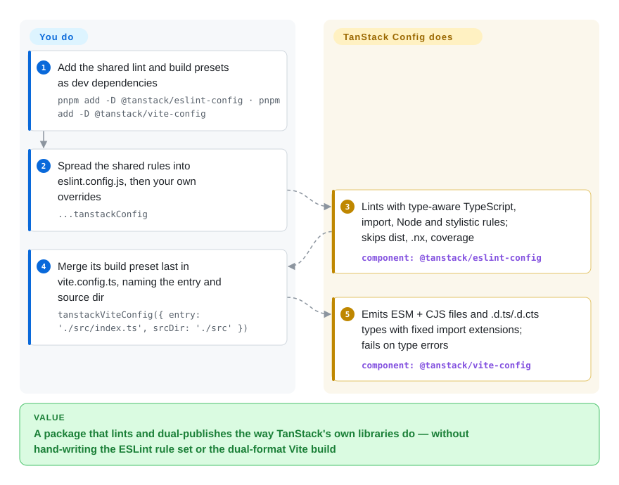

# TanStack Config

Every new TypeScript package you publish starts with the same afternoon: copy an ESLint config from the last repo, fight Vite until it emits both ESM and CommonJS with `.d.ts` *and* `.d.cts` types that tools like `publint` stop complaining about, then script the release. TanStack Config is the set of dev-only presets TanStack's own libraries use for that — one ESLint rule set, one dual-format Vite build, one TypeDoc-to-Markdown setup — packaged so another repo can import them instead of re-deriving them.

## When to use

You maintain a TypeScript library in a pnpm monorepo — maybe a TanStack adapter or plugin, maybe your own headless utility — and you want it to lint, build and document itself the way TanStack's own libraries do, so contributors who know those repos feel at home. Today your `vite.config.ts` has grown a hand-rolled plugin that rewrites `import './foo'` to `'./foo.js'` inside declaration files, and CJS consumers still hit `TS1479: The current file is a CommonJS module whose imports will produce 'require' calls`. You add `@tanstack/eslint-config` and spread `...tanstackConfig` into `eslint.config.js`, merge `tanstackViteConfig({ entry, srcDir })` last into your Vite config, and the dual ESM/CJS output, the paired `.d.ts`/`.d.cts` files and the type-aware lint rules come from the preset TanStack Form still builds with (Query and Table have since moved to tsdown).

Pick it over **@antfu/eslint-config** when you want a narrower, framework-agnostic TypeScript *library* rule set (no formatter, no JSON/YAML/Markdown linting) that matches TanStack's code style. Pick `@tanstack/vite-config` over **tsdown** only when you are already on Vite 8 for tests and plugins and need TanStack's exact output layout — the project's own docs call it the "Legacy Setup" and say TanStack is moving new projects to tsdown. For versioning and publishing, TanStack itself now uses **Changesets** (plus two reusable GitHub Actions from this repo), not `@tanstack/publish-config`.

## How it works

Nothing runs as a service: the repo is a pnpm/Nx monorepo that publishes four independent dev-dependency packages, each a thin opinion layer over a well-known tool. `@tanstack/eslint-config` exports an array of ESLint "flat config" objects (the ESLint 9+ format where a config is just a list you spread) that wires typescript-eslint with type information — it reads your `tsconfig.json` to check types while linting — plus import-x, eslint-plugin-n and stylistic rules, and ignores build output. `@tanstack/vite-config` exports a function returning a Vite config: it builds your entry in library mode into `dist/esm/*.js` and `dist/cjs/*.cjs` file-by-file, runs `vite-plugin-dts` twice to emit `.d.ts` and `.d.cts` declarations, patches relative imports in those declarations to carry explicit extensions, externalizes your dependencies, and exits the build on any type error. You keep the parts that are yours — your framework plugins, your Vitest config, your custom lint overrides — and merge the preset *last*, like laying a standard frame over your own contents. `@tanstack/typedoc-config` exposes `generateReferenceDocs()`, which drives TypeDoc with a Markdown plugin to write API reference pages in the layout tanstack.com expects; `@tanstack/publish-config` exposes a `publish()` script, ported from React Router's, that derives versions from commit messages and git tags. The repo also hosts composite GitHub Actions (`setup`, `changeset-preview`, `comment-on-release`) that the other TanStack repos pin by commit.

<!-- flow-steps:begin (generated from flows/tanstack-config.json by tools/flow_card.py — do not edit) -->

Text version of the flow

1. **You**: Add the shared lint and build presets as dev dependencies — `pnpm add -D @tanstack/eslint-config · pnpm add -D @tanstack/vite-config`
2. **You**: Spread the shared rules into eslint.config.js, then your own overrides — `...tanstackConfig`
3. **TanStack Config**: Lints with type-aware TypeScript, import, Node and stylistic rules; skips dist, .nx, coverage — component: `@tanstack/eslint-config`
4. **You**: Merge its build preset last in vite.config.ts, naming the entry and source dir — `tanstackViteConfig({ entry: './src/index.ts', srcDir: './src' })`
5. **TanStack Config**: Emits ESM + CJS files and .d.ts/.d.cts types with fixed import extensions; fails on type errors — component: `@tanstack/vite-config`

**Value**: A package that lints and dual-publishes the way TanStack's own libraries do — without hand-writing the ESLint rule set or the dual-format Vite build

<!-- flow-steps:end -->

## When NOT to use

- **If you are starting a new library build today, use tsdown instead of `@tanstack/vite-config`, because** TanStack's own `docs/vite.md` files the Vite preset under "Legacy Setup" and says "We will be adopting tsdown for future projects rather than continuing to use our custom Vite setup"; the flagship repos (Query, Table) already list `tsdown` in their root devDependencies (checked 2026-09-28).
- **If you need release versioning and publishing, use Changesets (or semantic-release for single-package, commit-message-driven releases) instead of `@tanstack/publish-config`, because** the TanStack repos themselves run `changeset version` / `changeset publish` (Query, Router, Table, Form root scripts, 2026-09-28) and the publish package has had only CI-plumbing patches since March 2026; betting a release pipeline on a script its authors moved away from is the wrong direction.
- **If you are not on Vite 8, pin an older `@tanstack/vite-config` or build with tsdown/tsc, because** 0.5.0 (2026-03) dropped Vite 6/7 support and the current peer range is `vite ^8.0.0`; there is no compatibility shim.
- **If you use npm, Yarn or Bun as your package manager, pick a toolchain without that constraint (tsdown + @antfu/eslint-config, for example), because** the overview doc states "pnpm is the only supported package manager for TanStack Config" and the whole setup assumes a pnpm workspace with Nx task caching.
- **If your lint runs must be fast on a large repo or cover files outside any `tsconfig.json`, use @antfu/eslint-config or plain typescript-eslint without type information, because** `@tanstack/eslint-config` sets `parserOptions.project: true` — type-aware linting that needs every linted file in a tsconfig and pays the TypeScript program cost on each run.
- **If you lint Svelte, Vue templates, JSON/YAML/Markdown or want auto-formatting, use @antfu/eslint-config (or Prettier alongside), because** the TanStack rule set is deliberately framework-agnostic: it targets `**/*.{js,ts,tsx}` (plus a Vue parser hook), has no formatter, and a Svelte-support request has been open since 2024-11 (issue #181).
- **If your package re-exports from directory barrels (`import from '../utils'` resolving to `utils/index.ts`), verify the emitted declarations or avoid the Vite preset, because** its extension-rewrite regex turns that into `'../utils.js'` instead of `'../utils/index.js'`, which breaks consumers compiling with `skipLibCheck: false` (issue #401, open and unanswered since 2026-07-08).
- **If you want generic HTML API docs, use TypeDoc directly instead of `@tanstack/typedoc-config`, because** the preset hard-codes Markdown output with frontmatter and TanStack's docs-site layout (no generator footer, no breadcrumbs, `index` entry file); it is a docs-site adapter, not a general documentation tool.

## Comparison

| Alternative | In index | Our verdict | Tradeoff |
| --- | --- | --- | --- |
| tsdown (`rolldown/tsdown`) | not indexed | For a new TypeScript library build, pick tsdown — TanStack's own docs route new projects there; pick `@tanstack/vite-config` only when a Vite 8 plugin/test stack already exists and you need TanStack's exact `dist/esm` + `dist/cjs` layout. | tsdown is a dedicated library bundler on Rolldown with its own dual-format and declaration handling, and it is where TanStack is heading; the Vite preset reuses your existing Vite config but carries known declaration-rewrite bugs and a "legacy" label. Not added in this tab-intake batch. |
| Changesets (`changesets/changesets`) | not indexed | For monorepo versioning, changelogs and npm publishing, pick Changesets — it is what TanStack's release workflows actually run; `@tanstack/publish-config` only makes sense for a repo already on its commit-message/tag flow. | Changesets asks contributors to write an explicit change file per PR and gives reviewable version bumps; publish-config infers bumps from commit messages with no per-PR artifact and a much smaller user base. Not added in this tab-intake batch. |
| semantic-release (`semantic-release/semantic-release`) | not indexed | If you want fully automatic releases driven by commit-message conventions, semantic-release is the maintained general tool; pick TanStack's publish script only to mirror an existing TanStack-style branch config. | semantic-release has a plugin ecosystem and wide adoption but is single-package-first; publish-config handles a multi-package branch map in one script yet is a TanStack-internal port with 4.3k weekly downloads. Not added in this tab-intake batch. |
| @antfu/eslint-config (`antfu/eslint-config`) | not indexed | For an app or a mixed-language repo that wants linting and formatting from one line of config, pick @antfu/eslint-config; pick `@tanstack/eslint-config` for a TypeScript library that should follow TanStack's type-aware, formatter-free rules. | antfu's preset covers TypeScript, JSX, Vue, JSON, YAML, TOML and Markdown and replaces Prettier; TanStack's is narrower and stricter on types (type-aware parsing) but leaves formatting and non-JS files to you. Not added in this tab-intake batch. |
| TypeDoc (`TypeStrong/typedoc`) | not indexed | For API reference docs in general, use TypeDoc directly; use `@tanstack/typedoc-config` only when you want TanStack-shaped Markdown pages for a docs site built like tanstack.com. | Raw TypeDoc gives HTML themes and every option; the preset fixes the Markdown plugin, frontmatter and layout for you and removes those choices. Not added in this tab-intake batch. |

This repo is the shared toolchain behind the other TanStack libraries — [TanStack Query](../../../web-ui/data-fetching/tanstack-query.md), [TanStack Table](../../../web-ui/component-libraries/tanstack-table.md), [TanStack Router](../../../web-ui/frameworks/app-frameworks/tanstack-router.md) and [TanStack Form](../../../web-ui/forms/tanstack-form.md) all pin `@tanstack/eslint-config` (and most `@tanstack/typedoc-config`) at their roots. Choosing one of those libraries does not require it; it matters only if you build *packages* in their style.

## Tech stack

- **TypeScript** monorepo: pnpm workspaces (`packageManager: pnpm@12.4.2`), Nx as a cached task runner, Changesets for this repo's own releases, Renovate for dependency PRs, Sherif and Knip for dependency hygiene.
- **`@tanstack/eslint-config`**: ESLint flat config over `@eslint/js`, typescript-eslint (type-aware), eslint-plugin-import-x, eslint-plugin-n, `@stylistic/eslint-plugin`, `globals`, `vue-eslint-parser`; peer `eslint ^9 || ^10`.
- **`@tanstack/vite-config`**: Vite library mode plus `vite-plugin-dts`, `vite-plugin-externalize-deps`, `vite-tsconfig-paths`; peer `vite ^8`; outputs are unminified with sourcemaps.
- **`@tanstack/typedoc-config`**: TypeDoc with `typedoc-plugin-markdown` and `typedoc-plugin-frontmatter`.
- **`@tanstack/publish-config`**: plain ESM JavaScript over `@commitlint/parse`, `semver`, `simple-git`, `jsonfile`, shelling out to `git` and the GitHub CLI.
- **Reusable GitHub Actions** in `.github/`: `setup` (Node + pnpm via `voidzero-dev/setup-vp`), `changeset-preview`, `comment-on-release`.

## Dependencies

- **Node.js 20.17+** per the overview doc (the package manifests still declare `>=18`), **Git**, and **pnpm v10+**; the GitHub CLI is needed only for the publish script.
- **ESLint 9 or 10** for the lint preset, **Vite 8** for the build preset, plus a `tsconfig.json` covering every linted file (type-aware rules).
- No runtime dependency is added to your published package — all four are dev-time tools. No service, database or network egress beyond the package registry (and GitHub when publishing).

## Ops difficulty

**Low**, with upgrade friction. There is nothing to deploy; the cost is keeping presets you do not control in step with your repo:

- Presets change under you: 0.5.0 of the Vite preset dropped Vite 6/7, 0.6.0 moved to `vite-plugin-dts` 5 and TypeScript 7 support, and the ESLint preset moved to `@eslint/js` 10 in 0.4.0. Pin versions and read `CHANGELOG.md` before bumping.
- The Vite preset expects to own `build` — the docs say to avoid modifying `build` in your own config — so custom output shapes mean forking it or leaving it.
- Everything is 0.x semver; minor bumps are where breaking changes land.

## Health & viability

- **Maintenance (2026-09-28).** Active but low-volume: last push 2026-09-27, recent releases `typedoc-config` 0.3.4 (2026-08-09) and `vite-config` 0.6.0 (2026-07-21); much of the commit stream is Renovate dependency bumps. Issue traffic is thin (a handful per year) and the newest bug (#401, 2026-07-08) has no maintainer reply yet.
- **Governance / bus factor.** Owned by the TanStack GitHub organization, with a `CODEOWNERS` file pointing at a core team (added 2026-08). In practice one person carries it: Lachlan Collins has 200 commits, followed by Tanner Linsley (TanStack's founder, 95) and Corbin Crutchley (15); everyone else is in single digits.
- **Backing & longevity.** Created 2023-12-31, so about 2.75 years old; the original all-in-one `@tanstack/config` npm package (last release 0.22.2, 2025-11-29) is now deprecated, having been split into the four scoped packages first published 2025-03-04. Age × still-active gives a moderate Lindy prior, and its future is tied to TanStack's needs: the Vite and publish halves are already being replaced by tsdown and Changesets inside TanStack itself.
- **Adoption & ecosystem.** Weekly npm downloads (2026-09-21 → 09-27): `@tanstack/eslint-config` 285k (950,335/month in the health scorer's npm window, 2026-09-28), `vite-config` 19.5k, `typedoc-config` 15.6k, `publish-config` 4.3k, and the deprecated umbrella still 7k. The lint preset is used well beyond this repo's 395 stars; the other three are largely TanStack-ecosystem consumers.
- **Risk flags.** MIT with no CLA or relicense history found. The real risk is strategic: this is TanStack's internal tooling published as-is, so a direction change (as with tsdown) turns a preset into "legacy" without a deprecation cycle.

## Caveats (unverified)

- [未验证] Why `@tanstack/eslint-config` pulls ~285k weekly downloads is not established — the npm point count is real (2026-09-21 → 09-27), but no dependents breakdown was pulled; it may include transitive installs by other packages or heavy CI reinstalls.
- [推断] "Type-aware linting is slower on large repos" is inferred from `parserOptions.project: true` in `packages/eslint-config/src/index.ts` and how typescript-eslint works; no benchmark was run.
- [推断] That `@tanstack/publish-config` is effectively legacy is inferred from TanStack's own repos running Changesets scripts (Query/Router/Table/Form root `package.json`, 2026-09-28) and its changelog showing only CI-plumbing fixes since 2026-03; no official deprecation notice exists.
- [未验证] The npm deprecation text on the `@tanstack/config` umbrella ("Package no longer supported. Contact Support…") is npm's generic wording; when and by whom it was deprecated was not confirmed.
- [未验证] The `TS1479` CJS-import error in the When to use scenario is an illustration of the class of dual-publishing failures the Vite preset targets (`docs/vite.md` "dual publish ESM and CJS … compatibility with all TypeScript module resolution options"), not an error reproduced here.
- [未验证] Comparison cells for tsdown, Changesets, semantic-release, @antfu/eslint-config and TypeDoc rest on those repos' metadata and README feature lists read on 2026-09-28, not on running them.
