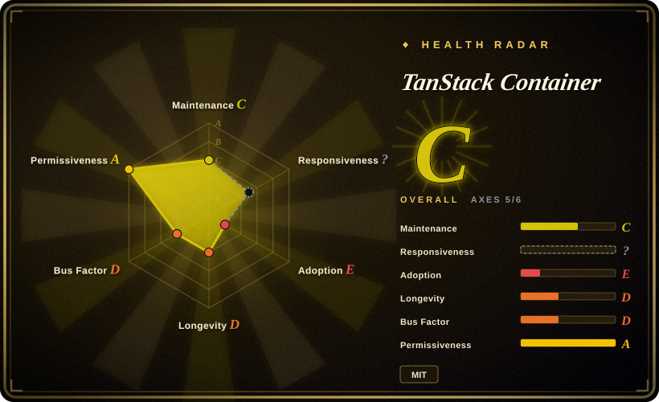
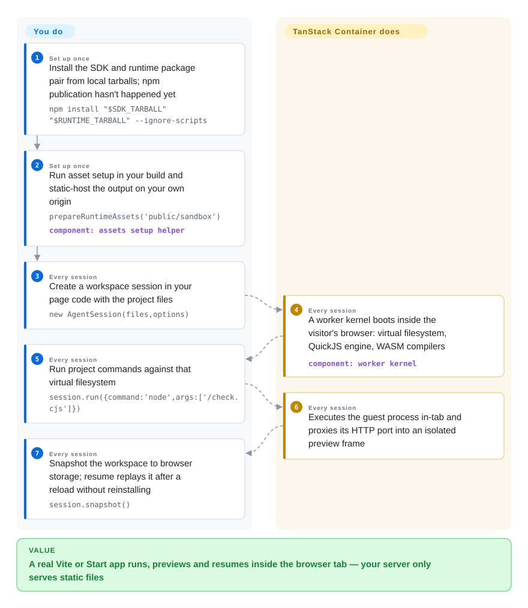

# TanStack Container

You want to hand someone a running frontend project without asking them to install anything — the page you send should run the project itself. TanStack Container is MIT-licensed source for a sandbox that gives a browser tab its own virtual filesystem, Node-style processes, npm installs, app previews and resumable workspaces; as of 2026-09-28 the alpha packages are not published to npm yet.

## When to use

You are building docs, a course, or an AI-agent showcase that wants the reader to *run* a real project instead of reading a snippet — and your funnel still starts with "install Node, npm install, npm run dev", where readers churn before the first painted screen. Or your demo budget is dominated by per-user cloud sandbox billing. TanStack Container attacks that from the browser side: a visitor opens your hosted page and their tab gets a virtual filesystem, Node-ish processes (the sample runs `require('node:fs')` and an `http` server on a virtual port), npm pulls from registry.npmjs.org done by the page, a live preview, and save/reload/resume. The deciding tradeoff versus the mature option: StackBlitz's WebContainer runtime is proprietary — its 4.6k-star GitHub repo contains no code — so what this bet buys is an open, MIT, self-hostable browser runtime from the TanStack org, with the same two-origin isolation model written down.

Reach for it as a tracking bet, not an adoption bet: as of 2026-09-28 neither `@tanstack/browser-sandbox-experimental` nor its runtime twin exists on npm (both 404), and the repo's own ALPHA.md says the alpha is "not ready to release" — so today "using it" means building the package pair from source per BUILDING.md or watching the candidate, while this quarter's shippable playground still means WebContainer or Sandpack. The verified surface, once published, is narrow but concrete: pinned Vite 7 and TanStack Start workflows — install, script/test runs, live-edit HMR, SSR, hydration, server functions, navigation, offline resume — with per-candidate Chromium and Firefox acceptance recorded in the docs.

## How it works

TanStack Container is a library you embed, not a service you phone. You install the SDK + runtime package pair, run one explicit setup step — `prepareRuntimeAssets('public/sandbox')`, which copies worker scripts and WASM (WebAssembly binaries of upstream compilers like esbuild and Rollup, pinned as ordinary npm dependencies) into a directory you host — and write a handful of SDK calls against an `AgentSession`. Everything else happens in the visitor's tab: a worker kernel boots; QuickJS (a small embeddable JavaScript interpreter) compiled to WASM executes the Node-style guest code against the virtual filesystem under enforced memory quotas and deadlines; npm packages are installed in-page with lifecycle scripts disabled; `WorkerHTTP` proxies a guest's port into a preview iframe served from a separate preview origin; and `session.snapshot()` / `session.restore()` persist files plus installed dependencies to browser storage and replay them into a fresh runtime. The analogy that fits is a small Node-shaped machine living inside the tab: files are emulated, "processes" are budgeted interpreter threads, and your server is only ever a static-file host. It is deliberately not an OS emulation — native addons, arbitrary binaries and unrestricted networking are outside the supported scope, and the project says so.

<!-- flow-steps:begin (generated from flows/tanstack-container.json by tools/flow_card.py — do not edit) -->

Text version of the flow

1. **You** (Set up once): Install the SDK and runtime package pair from local tarballs; npm publication hasn't happened yet — `npm install "$SDK_TARBALL" "$RUNTIME_TARBALL" --ignore-scripts`
2. **You** (Set up once): Run asset setup in your build and static-host the output on your own origin — `prepareRuntimeAssets('public/sandbox')` — component: `assets setup helper`
3. **You** (Every session): Create a workspace session in your page code with the project files — `new AgentSession(files,options)`
4. **TanStack Container** (Every session): A worker kernel boots inside the visitor's browser: virtual filesystem, QuickJS engine, WASM compilers — component: `worker kernel`
5. **You** (Every session): Run project commands against that virtual filesystem — `session.run({command:'node',args:['/check.cjs']})`
6. **TanStack Container** (Every session): Executes the guest process in-tab and proxies its HTTP port into an isolated preview frame
7. **You** (Every session): Snapshot the workspace to browser storage; resume replays it after a reload without reinstalling — `session.snapshot()`

**Value**: A real Vite or Start app runs, previews and resumes inside the browser tab — your server only serves static files

<!-- flow-steps:end -->

## When NOT to use

- **You need a browser runtime you can ship this quarter.** Nothing is published — both `-experimental` npm names 404 as of 2026-09-28 — and ALPHA.md itself says the alpha is not ready. Use StackBlitz WebContainer (closed core but battle-tested) or Sandpack for docs-playground scope instead.
- **Untrusted or AI-generated code that must be isolated.** The README states this is "not a production security boundary for arbitrary hostile projects" — permissions, quotas and deadlines are implemented but compatibility tests are not security certification. For a hostile workload pick a server-side sandbox with kernel/VM isolation: [E2B](../../../sandboxing/e2b.md), [gVisor](../../../sandboxing/gvisor.md), [Firecracker](../../../sandboxing/firecracker.md). Never put sensitive source or credentials in this sandbox.
- **You need full Node/npm surface.** Native addons, arbitrary binaries, dependency install scripts and esbuild watch/serve are unsupported; the verified app surface is pinned Vite 7 / Start fixtures, not arbitrary packages. For the long tail use a real container runtime — or WebContainer, whose npm coverage is documented as much broader.
- **A code snippet is what you want to embed, not a project.** [Sandpack](https://github.com/codesandbox/sandpack) ships interactive React component playgrounds at a fraction of the weight; a full virtual machine in the tab is overkill for one `<Counter />` example.
- **Your audience is on Safari or phones.** Actual Safari is unverified by the project itself and phones are a stretch goal; a hosted playground with vendor QA coverage is safer there.
- **You need a stable API to build against.** The package names carry `-experimental`, and every "works" claim in the docs is frozen to a specific candidate's SHA-256 artifacts that are not shipped. Track it; do not depend on it yet.

## Comparison

| Alternative | In index | Our verdict | Tradeoff |
| --- | --- | --- | --- |
| WebContainer (StackBlitz) | not a repo | When you need a browser runtime that works in production today, pick WebContainer; pick this page only when an MIT, forkable, self-hostable supply chain outweighs maturity — WebContainer's core runtime is proprietary (the GitHub repo ships no code; the runtime arrives via npm/CDN), so you are buying vendor terms, not source. | WebContainer: broadest in-tab npm coverage, commercial support, closed core with paid terms. This: full MIT source, an explicit owner/preview-origin isolation model, but unpublished alpha and compatibility verified only on pinned fixtures. |
| Sandpack (CodeSandbox) | not indexed | When your docs embed live React examples, Sandpack is the small, already-shipped choice; when the visitor must install dependencies, run a server process and resume a workspace, this page is the only one of the two that attempts it. | Sandpack: Apache-2.0 component toolkit with a 2025-04 last push — check its freshness before adopting; this page: whole-project scope, still pre-publication. Not added in this tab-intake batch. |
| BrowserFS | not indexed | If you are assembling your own in-browser runtime and only need a virtual `fs` API, BrowserFS is the building block; if you want installer + processes + preview + snapshots end to end, pick this page rather than composing them yourself. | BrowserFS is a library layer (stale since 2024), you wire everything above it; TanStack Container is a whole sandbox but pre-release and opinionated about hosting. Not added in this tab-intake batch. |
| [E2B](../../../sandboxing/e2b.md) | ✅ | If the code being run is untrusted and isolation is a product requirement, pick E2B's cloud microVM sandboxes — this page's README explicitly disclaims being a security boundary; if the workload is your own demo project and the cost model must be "it runs in the visitor's tab", pick this page. | E2B: real kernel-level isolation, but per-session server cost and cold-start latency. This page: zero server runtime, compute stays client-side, zero security certification. |
| Pyodide | not indexed | If the payload language is Python, Pyodide is the settled browser runtime — active, 14.9k stars (as of 2026-09); this page runs the JavaScript/TypeScript world only, and neither emulates the other's ecosystem. | Pyodide: mature CPython-on-WASM with a package index, no Node semantics. TanStack Container: a Node-ish guest surface (`fs`/`http`/processes) at alpha stage. Not added in this tab-intake batch. |

## Tech stack

- **TypeScript/JavaScript SDK surface** (`src/sdk`), worker kernel, in-browser VFS and npm installer; GitHub language stats: JavaScript 3.85 MB, TypeScript 2.57 MB, HTML 1.52 MB, C 320 KB, WebAssembly 61 KB (gh api, 2026-09-28)
- **Guest engine: QuickJS compiled to WASM**, pinned via `quickjs-emscripten` checkout `df4efb9…` built with Emscripten 5.0.1 (BUILDING.md toolchain table); sync and experimental fiber engine profiles, the latter requiring cross-origin isolation
- **Upstream compilers pinned as ordinary npm dependencies** and assembled by your setup step, not vendored WASM: Rollup WASM 4.63.1, esbuild WASM 0.28.2, Lightning CSS WASM 1.33.0 in the examples (COMPATIBILITY.md); examples pin Vite 7.3.6, `@tanstack/react-start` 1.168.25, React 19.1.1
- **Preview and isolation by origin**: owner origin hosts your app plus the prepared runtime; a separate preview origin follows the generated `preview-host`'s `hosting.json` routes/headers; `WorkerHTTP` bridges guest ports to it
- **Persistence**: `snapshot()`/`restore()` of files, installed dependencies and saved app data into localStorage (basic example) or IndexedDB (frameworks example)
- **Quality harness baked into the repo**: per-candidate SHA-256 manifests, strict save/resume audits with retained failing runs, `compat/` surface matrices for Node/dgram/cluster/sqlite feasibility

## Dependencies

- **Nothing server-side**: no backend, no database, no server process — you static-host two origins (owner + preview) with the documented headers
- **Visitor browser**: Chromium and Firefox are the documented acceptance targets; actual Safari is stated unverified; cross-origin isolation (COOP `same-origin` + COEP `require-corp`) is required for fiber profiles and full Start hosting
- **npm registry reachability on first install** (registry.npmjs.org); offline resume deliberately blocks external dependency requests and persists only what the snapshot contains
- **Today**: a build host with the pinned QuickJS-emscripten / Emscripten 5.0.1 / wasm3 / Go 1.27.1 toolchains under `.toolchains/` to produce the unpublished package pair (BUILDING.md)
- **Browser storage is not reliable**: workspaces live in localStorage/IndexedDB and can be evicted by the browser

## Ops difficulty

**High today, expected Medium after publication (assessed 2026-09-28).** Today nothing ships: you build the package pair from source across several pinned toolchains, and ALPHA.md's own checklist is unfinished, so every artifact you verify binds to candidate hashes only this repo's docs know. Post-publication the integration is an ordinary npm library — setup step, static hosting on two origins with specific headers, matched SDK/runtime versions. There is no daemon, database or server fleet to operate; the durable burdens are the per-candidate acceptance discipline the project imposes and workspace eviction risk.

## Health & viability

- **Maintenance — one snapshot, not a cadence (checked 2026-09-28):** published to GitHub 2026-09-23; all 5 commits landed the same day, last push 2026-09-23T23:08Z — idle 5 days; no releases, tags, pull requests or issues; 12 stars, 1 fork, 0 watchers.
- **Governance / bus factor — 1:** sole contributor tannerlinsley (5/5 commits via the contributors API); the tree has no CONTRIBUTING, CODEOWNERS, GOVERNANCE or SECURITY.md — only `.github/workflows/source-checks.yml`. The TanStack org owns the repo, but no in-repo evidence shows how the org reviews it.
- **Backing & age:** the repo lives in the TanStack organization (`owner.type: Organization`), a large and active library family — a good home; the repo itself is 5 days old, so there is no Lindy basis at all, and no hype signal either (12 stars).
- **Adoption — zero measurable:** both `-experimental` npm names 404 (verified 2026-09-28), no homepage, no known dependents.
- **Process signal:** unusually rigorous per-artifact evidence discipline for a repo this young — SHA-256-bound candidate records, byte-exact restoration audits, retained failing runs — which reads as a serious alpha rather than a weekend demo drop. [推断] That judgment comes from reading the docs; the referenced audit reports are stated to be not shipped, so the rigor is paper-verified unless you reproduce from source.
- **Risk flags:** self-declared "not a production security boundary" and "not ready to release"; `-experimental` API names; results explicitly non-transferable between package candidates. MIT license read directly from the LICENSE file (Copyright (c) 2026-present Tanner Linsley).

## Caveats (unverified)

- [未验证] All Chromium/Firefox workflow passes, byte-exact resume and the twelve-run strict audits are the project's own doc claims bound to unpublished artifacts; the audit JSON files are stated to be not shipped in the repo, and nothing was reproduced here.
- [未验证] WebContainer's core being closed-source: evidenced by stackblitz/webcontainer-core shipping no code (GitHub language stats null, 4.6k stars) and the runtime being consumed via the published `@webcontainer/api` npm package; StackBlitz's license terms were not read.
- [未验证] Whether and when the npm packages get published: README (2026-09-23) says the alpha release "is being prepared"; no tags or releases exist as of 2026-09-28.
- [未验证] Actual Safari support — the project itself lists it as unverified; Playwright WebKit evidence is explicitly declared non-substitutable.
- [推断] Bus factor of 1, from the contributors API (one user, 5/5 commits); TanStack-internal review may exist outside this repo.
- [推断] Guest execution overhead versus native Node: the engine is a WASM interpreter (QuickJS), but no benchmark was run here and the docs publish no Node-vs-guest runtime numbers.
