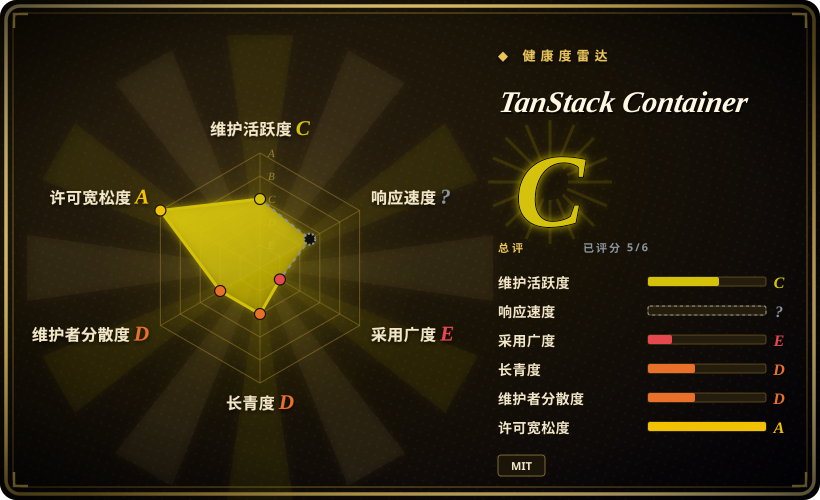
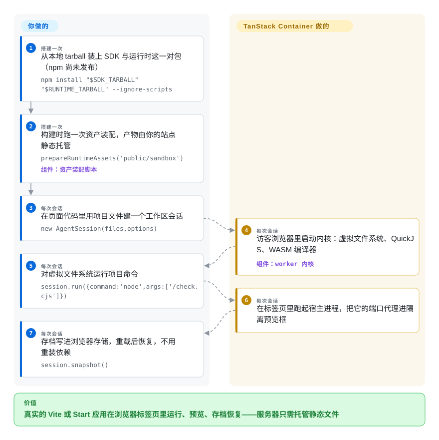

# TanStack Container

你想把「能跑起来的前端项目」直接放进网页交给别人，但访问者的机器上没有 Node、没有 npm、也没有本地工具链。TanStack Container 把整套开发环境搬进浏览器标签页：虚拟文件系统、Node 风格的进程、可安装的依赖、应用预览和可恢复的工作区——你的服务器只需要托管静态文件；截至 2026-09-28，alpha 包尚未发布到 npm。

## 何时使用

你在做文档、课程或 AI agent 的演示，想让读者「运行」一个真实项目而不是看一段代码片段——而漏斗仍然从「先装 Node，再 npm install，再 npm run dev」开始，一大半读者在首屏渲染出来之前就流失了；或者你的演示预算被「每个用户一个云端沙箱」的计费压垮。TanStack Container 从浏览器这一侧解决：访客打开你托管的页面，标签页里就有了虚拟文件系统、Node 风格的进程（示例直接跑 `require('node:fs')` 和监听虚拟端口的 `http` 服务）、由页面自己发起的 npm 安装、实时预览，以及保存/重载/恢复。和成熟方案的决定性取舍在于：StackBlitz 的 WebContainer 运行时是闭源的——那个 4.6k star 的 GitHub 仓库里没有一行实现代码——这个赌注买到的是 TanStack 组织下 MIT 开源、可完全自托管的浏览器运行时，外加一套写清楚的双源隔离模型。

把它当作「跟踪」而非「采用」的赌注：截至 2026-09-28，`@tanstack/browser-sandbox-experimental` 和它的运行时孪生包在 npm 上都不存在（双双 404），仓库自己的 ALPHA.md 也写着 alpha「尚未准备好发布」——所以今天的「用起来」意味着按 BUILDING.md 从源码构建那一对包，或者盯住候选版本；本季度要上线的游乐场仍然是 WebContainer 或 Sandpack 的活。发布后的已验证面窄但具体：钉死版本的 Vite 7 与 TanStack Start 工作流——安装、跑脚本/测试、热更新、SSR、水合、server functions、导航、离线恢复——文档里为每个候选版本逐条记录了 Chromium 和 Firefox 的验收。

## 怎么用起来

TanStack Container 是你要嵌进去的库，不是要拨打的服务。你装好 SDK 加运行时这一对包，跑一个显式的准备步骤——`prepareRuntimeAssets('public/sandbox')`，它把 worker 脚本和 WASM（esbuild、Rollup 这些上游编译器编译成的 WebAssembly 二进制，以普通 npm 依赖钉版本）拷进一个由你托管的目录——再对着 `AgentSession` 写几个 SDK 调用。其余全部发生在访客的标签页里：worker 内核启动；QuickJS（一个可内嵌的小型 JavaScript 解释器）编译成的 WASM 在强制内存配额与截止时间下，对着虚拟文件系统执行 Node 风格的宿主代码；npm 包在页面内安装且禁用生命周期脚本；`WorkerHTTP` 把宿主进程的端口代理到独立预览源上的 iframe；`session.snapshot()` 和 `session.restore()` 把文件加已装依赖持久化进浏览器存储，再在一个全新运行时里重放。合适的类比是：一台 Node 形状的小机器住在标签页里——文件是模拟的，「进程」是按预算分配的解释器线程，你的服务器自始至终只是静态文件托管。它刻意不做操作系统仿真——原生插件、任意二进制、不受限的网络都在支持范围之外，项目自己也这么说。

<!-- flow-steps:begin (generated from flows/tanstack-container.json by tools/flow_card.py — do not edit) -->

流程文字版

1. **你**（搭建一次）：从本地 tarball 装上 SDK 与运行时这一对包（npm 尚未发布） — `npm install "$SDK_TARBALL" "$RUNTIME_TARBALL" --ignore-scripts`
2. **你**（搭建一次）：构建时跑一次资产装配，产物由你的站点静态托管 — `prepareRuntimeAssets('public/sandbox')` — 组件：`资产装配脚本`
3. **你**（每次会话）：在页面代码里用项目文件建一个工作区会话 — `new AgentSession(files,options)`
4. **TanStack Container**（每次会话）：访客浏览器里启动内核：虚拟文件系统、QuickJS、WASM 编译器 — 组件：`worker 内核`
5. **你**（每次会话）：对虚拟文件系统运行项目命令 — `session.run({command:'node',args:['/check.cjs']})`
6. **TanStack Container**（每次会话）：在标签页里跑起宿主进程，把它的端口代理进隔离预览框
7. **你**（每次会话）：存档写进浏览器存储，重载后恢复，不用重装依赖 — `session.snapshot()`

**价值**：真实的 Vite 或 Start 应用在浏览器标签页里运行、预览、存档恢复——服务器只需托管静态文件

<!-- flow-steps:end -->

## 何时不用

- **本季度就要上线的浏览器运行时。** 什么都没发布——两个 `-experimental` 包名在 2026-09-28 都是 404——ALPHA.md 自己写着还没准备好发布。选 StackBlitz WebContainer（闭源但久经实战），或文档游乐场量级的 Sandpack。
- **要隔离不可信或 AI 生成的代码。** README 明说这「不是针对任意恶意项目的生产安全边界」——权限、配额、截止时间实现了，但兼容性测试不等于安全认证。恶意负载请选有内核/VM 隔离的服务端沙箱：[E2B](../../../sandboxing/e2b.zh.md)、[gVisor](../../../sandboxing/gvisor.zh.md)、[Firecracker](../../../sandboxing/firecracker.zh.md)。别把敏感源码或凭据放进这个沙箱。
- **需要完整的 Node/npm 面。** 原生插件、任意二进制、依赖安装脚本、esbuild watch/serve 都不支持；已验证的应用面是钉死版本的 Vite 7/Start fixture，不是任意包。长尾兼容性请上真正的容器运行时——或 npm 覆盖面有文档佐证的 WebContainer。
- **要嵌的是代码片段，不是项目。** [Sandpack](https://github.com/codesandbox/sandpack) 提供轻得多的 React 组件互动游乐场；一个 `<Counter />` 示例不值得塞进一台标签页里的虚拟机。
- **受众在 Safari 或手机上。** 项目自己声明真 Safari 未验证，手机只是远期目标；那种场景选有厂商 QA 覆盖的托管游乐场更稳。
- **需要一个能长期依赖的稳定 API。** 包名带 `-experimental`，文档里每个「能用」的结论都冻结在特定候选包的 SHA-256 工件上，而工件并不随仓库分发。跟踪它，先别依赖它。

## 横向对比

| 替代品 | 是否收录 | 我们的评价 | 取舍 |
| --- | --- | --- | --- |
| WebContainer (StackBlitz) | 非仓库 | 今天要一个能上生产的浏览器运行时，选 WebContainer；只有当 MIT 开源、可 fork、可自托管的供应链比成熟度更重要时才选本页——WebContainer 的内核运行时闭源（GitHub 仓库不附带代码，运行时经 npm/CDN 分发），你买的是商业条款而不是源码。 | WebContainer：标签页内最广的 npm 覆盖、商业支持、闭源内核加付费条款。本页：完整 MIT 源码、写明白的双源隔离模型，但未发布的 alpha，兼容性只在钉死 fixture 上验证过。 |
| Sandpack (CodeSandbox) | 未收录 | 文档里嵌 React 示例用 Sandpack——它小、而且早就发布了；要让访客装依赖、跑服务进程、恢复工作区，两者里只有本页会尝试。 | Sandpack：Apache-2.0 组件工具包，最后 push 在 2025-04——采用前先核实现状；本页：整个项目的量级，还在发布前。本批 tab-intake 未收录。 |
| BrowserFS | 未收录 | 只想自己攒浏览器运行时、缺一个虚拟 `fs` API 时，BrowserFS 是积木；要安装器、进程、预览、快照整套端到端，选本页而不是自己拼装。 | BrowserFS 是一层库（2024 年后停更），上面全要自己接；TanStack Container 是整套沙箱，但处于发布前且对托管方式有强意见。本批 tab-intake 未收录。 |
| [E2B](../../../sandboxing/e2b.zh.md) | ✅ | 跑的是不可信代码、隔离是产品要求时选 E2B 的云端 microVM 沙箱——本页 README 自己否认是安全边界；负载是你自己的演示项目、成本模型必须是「跑在访客标签页里」时选本页。 | E2B：真内核级隔离，但按会话付费、有冷启动延迟。本页：零服务端运行时、计算留在客户端、零安全认证。 |
| Pyodide | 未收录 | 负载语言是 Python 时，Pyodide 是已成定论的浏览器运行时——活跃、14.9k star（2026-09 核查）；本页只跑 JavaScript/TypeScript 世界，两边都不模拟对方的生态。 | Pyodide：成熟的 CPython-on-WASM、自带包索引，但没有 Node 语义。TanStack Container：Node 风格的宿主面（`fs`、`http`、进程），alpha 阶段。本批 tab-intake 未收录。 |

## 技术栈

- **TypeScript/JavaScript SDK 面**（`src/sdk`）、worker 内核、浏览器内虚拟文件系统与 npm 安装器；GitHub 语言统计：JavaScript 3.85 MB、TypeScript 2.57 MB、HTML 1.52 MB、C 320 KB、WebAssembly 61 KB（gh api，2026-09-28）
- **宿主引擎：编译成 WASM 的 QuickJS**，经 `quickjs-emscripten` 钉在 checkout `df4efb9…`，用 Emscripten 5.0.1 构建（BUILDING.md 工具链表）；分 sync 与实验性 fiber 两种引擎档，后者要求跨源隔离
- **上游编译器以普通 npm 依赖钉版本**、由你的准备步骤装配，不随包携带：示例里是 Rollup WASM 4.63.1、esbuild WASM 0.28.2、Lightning CSS WASM 1.33.0（COMPATIBILITY.md）；示例钉 Vite 7.3.6、`@tanstack/react-start` 1.168.25、React 19.1.1
- **按源分开的预览与隔离**：owner 源托管你的应用加装配好的运行时；独立预览源遵循生成的 `preview-host` 里 `hosting.json` 的路由与响应头；`WorkerHTTP` 把宿主端口桥接过去
- **持久化**：`snapshot()`/`restore()` 把文件、已安装依赖与应用保存数据写进 localStorage（基础示例）或 IndexedDB（框架示例）
- **仓库自带质量工程**：逐候选包的 SHA-256 清单、字节级恢复审计并保留失败运行记录、`compat/` 目录下 Node/dgram/cluster/sqlite 可行性面矩阵

## 依赖

- **服务端零依赖**：没有后端、没有数据库、没有服务进程——你要做的是把带规定响应头的静态资源托管在两个源上（owner 源与预览源）
- **访客浏览器**：文档里的验收目标是 Chromium 与 Firefox；真 Safari 项目自称未验证；fiber 档与完整 Start 托管要求跨源隔离（COOP `same-origin` 加 COEP `require-corp`）
- **首次安装要能访问 npm registry**（registry.npmjs.org）；离线恢复会刻意拦掉外部依赖请求，只恢复快照里有的东西
- **当下**：一台构建机，外加 `.toolchains/` 下钉死的 QuickJS-emscripten、Emscripten 5.0.1、wasm3、Go 1.27.1 工具链，才能构建那一对未发布的包（BUILDING.md）
- **浏览器存储不可靠**：工作区放在 localStorage/IndexedDB 里，可能被浏览器清除

## 运维难度

**当下是「高」，发布后预期「中」（2026-09-28 评估）。** 现在什么都没有发布：你要跨多个钉死工具链从源码构建这一对包，ALPHA.md 自己的清单也没走完，你验证的每个工件只绑得上这份仓库文档里的候选哈希。发布后，集成就是一个普通 npm 库——一个装配步骤、两个源上的静态托管加特定响应头、SDK 与运行时版本配对。没有守护进程、数据库或服务器集群要运维；长期负担是项目强制的逐候选验收纪律，以及工作区被浏览器清除的风险。

## 健康度与可持续性

- **维护——是一次快照，不是节奏（2026-09-28 核查）：** 2026-09-23 公开到 GitHub；5 个 commit 全部落在同一天，最后 push 是 2026-09-23T23:08Z——已静默 5 天；没有 release、tag、PR、issue；12 star、1 fork、0 watcher。
- **治理/巴士系数——1：** 唯一贡献者 tannerlinsley（贡献者 API：5/5 commit）；目录树里没有 CONTRIBUTING、CODEOWNERS、GOVERNANCE、SECURITY.md——只有 `.github/workflows/source-checks.yml`。仓库归属 TanStack 组织，但仓库内看不到组织如何评审它。
- **背书与年龄：** 仓库在 TanStack 组织下（`owner.type: Organization`），是个庞大活跃的软件家族——落脚处不差；但仓库本身只有 5 天大，完全谈不上 Lindy 基础，也谈不上炒作信号（12 star）。
- **采用——可度量为零：** 两个 `-experimental` npm 包名 404（2026-09-28 验证），没有 homepage，没有已知依赖方。
- **工程信号：** 对这么年轻的仓库来说，逐工件的证据纪律异常严格——SHA-256 绑定的候选记录、字节级恢复审计、保留失败运行——读起来像认真的 alpha，而不是周末 demo。[推断] 该判断来自阅读文档；引用的审计文件项目自称未随仓库分发，不从源码复现就只能停留在纸面。
- **风险信号：** 自称「不是生产安全边界」「尚未准备好发布」；API 带 `-experimental` 后缀；结论在候选包之间明确不可迁移。MIT 协议直接读了 LICENSE 文件（Copyright (c) 2026-present Tanner Linsley）。

## 存疑（未验证）

- [未验证] 所有 Chromium/Firefox 工作流通过、字节级恢复与十二连审计都是项目文档自述、且绑定未发布工件；审计 JSON 自称未进仓库，这里没有复现任何一条。
- [未验证] WebContainer 内核闭源：依据是 stackblitz/webcontainer-core 不附代码（GitHub 语言统计为 null、4.6k star）且运行时经已发布的 `@webcontainer/api` npm 包分发；没有逐条读 StackBlitz 的许可条款。
- [未验证] npm 包是否以及何时发布：README（2026-09-23）说 alpha「正在准备」；2026-09-28 没有 tag 或 release。
- [未验证] 真 Safari 支持——项目自称未验证；Playwright WebKit 的证据被明确声明不可替代。
- [推断] 巴士系数 1 来自贡献者 API（单用户、5/5 commit）；TanStack 内部评审流程可能存在，但在仓库外不可见。
- [推断] 宿主执行相对原生 Node 的开销：引擎是 WASM 解释器（QuickJS），但这里没跑基准，文档也没给 Node 对宿主的运行数据。
