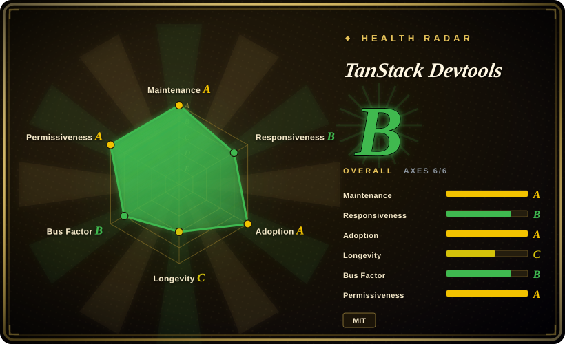
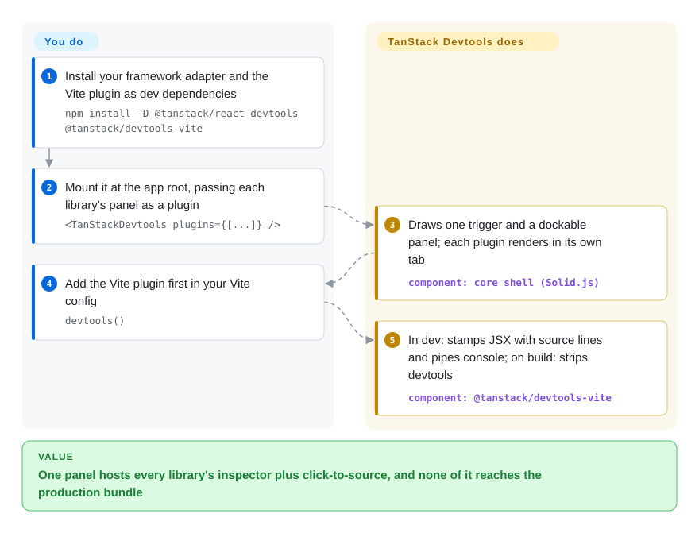

# TanStack Devtools

Your app already has three floating debug buttons — one from the query cache, one from the router, one from the form library — stacked in the bottom corner, fighting over z-index, each with its own panel and its own open/closed state. TanStack Devtools gives them one shared drawer: every library's inspector becomes a tab in a single dockable panel, and its Vite plugin adds click-an-element-to-open-its-source and strips the whole thing out of production builds.

## When to use

You run a React (or Solid, Vue, Preact) app on Vite that already uses two or more TanStack libraries — say [TanStack Query](../../../web-ui/data-fetching/tanstack-query.md) and [TanStack Router](../../../web-ui/frameworks/app-frameworks/tanstack-router.md) — and during development you keep toggling `<ReactQueryDevtools />` and `<TanStackRouterDevtools />`, two separate overlays that each render their own trigger in the corner and each forget their size on reload. You mount `<TanStackDevtools plugins={[…]} />` once, pass each library's `*DevtoolsPanel` as a plugin, and get one resizable Workbench with tabs, up to three plugins side by side, a shared theme and hotkeys, all persisted in `localStorage`. Add `devtools()` as the first Vite plugin and you also get a source inspector (hold Shift+Alt+Ctrl/Meta, click an element, your editor opens at that JSX line) and browser↔terminal console piping — and on `vite build` the imports are removed so nothing ships.

The second trigger is library authors: you maintain a state library or an internal SDK and want a devtools panel without building the trigger, drag handle, docking and persistence yourself. You write a typed `EventClient` that emits your state and a panel component, and the shell hosts it next to the TanStack panels. Pick this over the browser-extension route (React DevTools, Redux DevTools, Vue DevTools extension) when you want the panel **inside the page** with no extension install, spanning several libraries; pick it over Nuxt DevTools when your app is not Nuxt — Nuxt's in-app panel is the more mature design of the same idea but only exists inside Nuxt.

## How it works

The core package is a small Solid.js app — Solid is a UI framework, like React but compiled to direct DOM updates — that draws the trigger button, the dockable panel, settings and tab bar. Your framework never renders that shell; a thin adapter (`@tanstack/react-devtools`, `vue-devtools`, …) creates it, mounts it into a DOM node, and teleports each of **your** plugin components into the empty box the shell hands it, so a React panel stays a React component. Plugins talk to the code they inspect through an `EventClient`: a typed wrapper over browser `CustomEvent`s on `window`, which works on a single page with no server at all; when the Vite plugin is running it also starts a small WebSocket/SSE server (default port 4206) so events reach other tabs and the dev server process. The Vite plugin is a bundle of build-time transforms: it stamps every JSX element with a `data-tsd-source` file:line attribute (for click-to-source), rewrites `console.*` calls to carry their location, and on production builds deletes every `@tanstack/*-devtools` import. You decide which panels to mount and whether to run the Vite plugin; the shell owns layout, persistence and transport. Think of it as a power strip for devtools: it does not measure anything itself, it gives each library's inspector a socket.

<!-- flow-steps:begin (generated from flows/tanstack-devtools.json by tools/flow_card.py — do not edit) -->

Text version of the flow

1. **You**: Install your framework adapter and the Vite plugin as dev dependencies — `npm install -D @tanstack/react-devtools @tanstack/devtools-vite`
2. **You**: Mount it at the app root, passing each library's panel as a plugin — `<TanStackDevtools plugins={[...]} />`
3. **TanStack Devtools**: Draws one trigger and a dockable panel; each plugin renders in its own tab — component: `core shell (Solid.js)`
4. **You**: Add the Vite plugin first in your Vite config — `devtools()`
5. **TanStack Devtools**: In dev: stamps JSX with source lines and pipes console; on build: strips devtools — component: `@tanstack/devtools-vite`

**Value**: One panel hosts every library's inspector plus click-to-source, and none of it reaches the production bundle

<!-- flow-steps:end -->

## When NOT to use

- **If you only need to inspect the React component tree, props, hooks or profile renders, use React Developer Tools (the browser extension from the React repo) instead, because** TanStack Devtools inspects nothing by itself — it hosts other libraries' panels; with no plugins mounted it is an empty drawer.
- **If your bundler is webpack, Turbopack or Next.js, keep each library's standalone devtools component behind a `NODE_ENV` check instead, because** the source inspector, console piping, event-bus server and automatic production stripping are delivered by `@tanstack/devtools-vite` and `@tanstack/devtools-rspack` only (checked 2026-09-28); on other bundlers the docs tell you to exclude devtools from production yourself, and you are left with just the panel shell.
- **If your dev server is reachable by anyone but you (`server.host: 0.0.0.0` on a shared box, a cloud IDE, a demo tunnel), set `eventBusConfig.enabled: false` or drop the Vite plugin, because** the dev event bus answers with `Access-Control-Allow-Origin: *` and no authentication, and its marketplace `install-devtools` handler builds an `npm install -D ${packageName}` string from the event payload and runs it with `child_process.exec()` — reported as a command-injection bug in issue #464 (open since 2026-06-19) and still the code on `main` as read on 2026-09-28. Whether a random web page in the same browser can reach it depends on transport details not reproduced here [推断].
- **If you need time-travel debugging of a Redux-style store (action log, replay, state diff), use Redux DevTools instead, because** that is a finished, specialised tool; here you would be writing that panel yourself on top of `EventClient`.
- **If the question is "why is this component re-rendering?", use React Scan instead, because** it instruments React's render path and paints the offenders; TanStack Devtools has no render profiler (it ships an accessibility-audit plugin, not a performance one).
- **If you are on Nuxt, use Nuxt DevTools, because** it is framework-integrated (modules contribute tabs, server-side RPC is built in) and several years older; mounting TanStack's shell inside Nuxt duplicates it.
- **If you need a stable API to build a product feature on, wait or pin exact versions, because** the docs label the project **alpha** with an API "subject to change"; the core went 0.12 → 0.15 between June and September 2026, and open issues include Cloudflare Vite plugin incompatibility (#375), duplicate Solid instances under Vite 8 (#411), SSR hydration mismatches from the injected `data-tsd-source` attributes (#405), and console piping that can flood logs (#428, #482).

## Comparison

| Alternative | In index | Our verdict | Tradeoff |
| --- | --- | --- | --- |
| React Developer Tools (`facebook/react`, `packages/react-devtools*`) | ✅ [React](../../../web-ui/frameworks/view-frameworks/react.md) | For React component-tree, props, hooks and profiler work, React DevTools is the tool and TanStack Devtools does not replace it; pick TanStack Devtools only to host library panels (query cache, router state, your own store) inside the page. | React DevTools sees React internals no userland panel can reach, but lives in a browser extension (or standalone app) and knows nothing about your libraries' state; TanStack's shell sees only what plugins emit, with no extension install. |
| Vue DevTools (`vuejs/devtools`) | not indexed | On a Vue app, Vue DevTools (extension or its Vite plugin overlay) is the first-party inspector for components, Pinia and routes; add TanStack Devtools only when you also run TanStack libraries whose panels need a host. | Vue DevTools is deep and Vue-specific; TanStack's Vue adapter is new (`@tanstack/vue-devtools` ≈6.3k weekly downloads, 2026-09-27) and hosts panels rather than inspecting Vue. Not added in this tab-intake batch. |
| Nuxt DevTools (`nuxt/devtools`) | not indexed | Inside Nuxt, choose Nuxt DevTools — the same in-app, pluggable-tab design, integrated with Nuxt modules and server; choose TanStack Devtools for the equivalent experience on a plain Vite/React/Solid/Vue app with no meta-framework. | Nuxt DevTools gets framework-level hooks and a longer track record but is Nuxt-only; TanStack's is framework-agnostic but alpha. Not added in this tab-intake batch. |
| Redux DevTools (`reduxjs/redux-devtools`) | not indexed | For Redux (or any store speaking its extension protocol) with time-travel, action replay and state diffs, pick Redux DevTools; pick TanStack Devtools when you want a custom in-page panel for your own store and are willing to build the UI. | Redux DevTools delivers a complete time-travel UI through a browser extension; TanStack gives you typed transport and a host shell but no store-specific views. Not added in this tab-intake batch. |
| React Scan (`aidenybai/react-scan`) | not indexed | To find wasted React re-renders, drop in React Scan; TanStack Devtools answers "what is my library state", not "why did this render". | React Scan is a zero-config render profiler overlay; TanStack Devtools is a host for other panels with no profiling of its own. Not added in this tab-intake batch. |

TanStack Devtools is the shared host for the TanStack family's own panels: [TanStack Query](../../../web-ui/data-fetching/tanstack-query.md), [TanStack Router](../../../web-ui/frameworks/app-frameworks/tanstack-router.md), [TanStack Form](../../../web-ui/forms/tanstack-form.md), TanStack Pacer and others ship `*DevtoolsPanel` components meant to be mounted in it, and `@tanstack/form-core` and `@tanstack/pacer` depend on its `@tanstack/devtools-event-client` directly (npm, 2026-09-28). Apps scaffolded with [TanStack CLI](tanstack-cli.md) are the usual entry point.

## Tech stack

- **TypeScript** monorepo (pnpm workspaces + Nx, changesets for releases, Vitest, Playwright e2e).
- **Core shell** `@tanstack/devtools`: Solid.js ≥1.9.7 (a peer dependency even in React apps), goober for CSS-in-JS, `@neodrag` for dragging, `@solid-primitives/*`; shared UI in `@tanstack/devtools-ui`.
- **Adapters**: React, Preact, Solid, Vue, Svelte, Angular packages; each converts native components into the shell's `render(el, props)` interface via portals / Teleport / `mount()` / `createComponent()`.
- **Event system**: `@tanstack/devtools-event-client` (typed CustomEvent wrapper, no-ops outside `NODE_ENV=development` unless imported from `/production`) and `@tanstack/devtools-event-bus` (browser `ClientEventBus` with `BroadcastChannel` cross-tab sync; Node `ServerEventBus` over WebSocket + SSE).
- **Build plugins**: `@tanstack/devtools-vite` and `@tanstack/devtools-rspack` over a shared `@tanstack/devtools-bundler-core` (oxc-parser + MagicString source injection, console rewriting, devtools-import removal, `launch-editor` for go-to-source, package-manager shell-outs for the marketplace).
- **Extras**: `@tanstack/devtools-a11y` (accessibility audit plugin), `@tanstack/devtools-webmcp` (registers development-only WebMCP tools for browser agents), `@tanstack/devtools-utils` (plugin factory helpers).

## Dependencies

- **Runtime (in the browser, dev only)**: the framework adapter + core shell, which pulls **Solid.js** into your dev bundle whatever your framework is (issue #411 shows the resulting "multiple instances" warnings with Vite 8).
- **Build**: Vite (or Rspack) for the full feature set; the Vue quick start marks the Vite plugin optional and the Svelte/Angular quick starts do not install it, while React/Preact/Solid install it by default.
- **Dev-server side effects**: an extra local HTTP server for the event bus (default port 4206, auto-increments if taken); `launch-editor` spawning your editor on click-to-source; the marketplace running `npm`/`pnpm`/`yarn`/`bun` installs and editing your source to register plugins.
- **No hosted service**: nothing is sent off-machine by the library itself (no telemetry found in the packages read on 2026-09-28).

## Ops difficulty

**Low** to adopt, **medium** to keep quiet. It is a dev dependency: install two packages, mount one component, add one Vite plugin — nothing to deploy. The ongoing cost is integration friction: it touches your build (AST transforms on every JSX file, console rewriting), your dev server (an extra port, a shell-running marketplace handler) and your bundle graph (a second UI framework). Expect to turn individual features off (`injectSource`, `consolePiping`, `enhancedLogs`, `eventBusConfig.enabled`) when they collide with SSR, Cloudflare/Nitro setups or Playwright tests (issues #405, #375, #390, #318), and pin versions because the alpha API moves monthly. If you must ship it to production, the docs require `removeDevtoolsOnBuild: false`, a regular (non-dev) dependency and the `/production` event-client import — and recommend against it.

## Health & viability

- **Maintenance (2026-09-28).** Very active: `@tanstack/devtools` 0.15.0 published 2026-09-23 (0.13 in July, 0.14.x in August), commits on `main` the same week (hot corners, configurable source-inspector URL, the new WebMCP package). 56 open issues; several bug reports sit weeks without a maintainer reply.
- **Governance / bus factor.** Owned by the TanStack GitHub organization, but carried by one lead: AlemTuzlak has 202 commits, the next human (harry-whorlow) 36, then single digits. A one-person core inside a well-known org — better than a solo repo, weaker than the older TanStack libraries.
- **Backing & longevity.** Young: repo created 2025-07-25, first npm release 2025-07-29 — about 14 months old and still labelled alpha. Lindy gives little comfort; its survival is tied to the TanStack ecosystem, which already ships its library panels for it, so the dependency runs both ways.
- **Adoption & ecosystem.** Large and partly involuntary: ~2.0M weekly downloads for `@tanstack/devtools`/`@tanstack/react-devtools`, ~15.7M for `@tanstack/devtools-vite` and ~20.7M for `@tanstack/devtools-event-client` (npm, week ending 2026-09-27; the health scorer counts 55,695,488 event-client downloads for the last month, which is why its adoption axis reads A). The event-client volume is explained at least partly by TanStack Form and Pacer depending on it; 500 stars against those downloads says most users arrive through TanStack, not by choosing this repo. A PR-gated plugin marketplace registry exists in the repo.
- **Risk flags.** MIT, no CLA or relicense history found. No `SECURITY.md` (the #464 reporter pointed this out publicly); the command-injection report sat two months before a maintainer acknowledged it on 2026-08-24 and the `exec()` string build was unchanged on 2026-09-28. Alpha API churn is the other flag.

## Caveats (unverified)

- [推断] Exploitability of issue #464 from an arbitrary web page: the code reads as CORS `*` with no auth plus string-built `exec()`, but no reproduction was run; a POST path or payload check elsewhere could narrow it.
- [未验证] Why `@tanstack/devtools-vite` pulls ~15.7M weekly downloads — a transitive dependent (a TanStack framework plugin or starter) is likely but was not identified.
- [推断] "Most users arrive through TanStack" is inferred from the stars-to-downloads ratio and the form-core/pacer dependency, not from any survey.
- [未验证] Comparison cells for React DevTools, Vue DevTools, Nuxt DevTools, Redux DevTools and React Scan rest on those projects' public positioning; their repositories were not read in this batch (metadata only: all MIT, all pushed within the last six weeks as of 2026-09-28).
- [未验证] Svelte and Angular adapter maturity: `@tanstack/svelte-devtools` is 0.1.x and `@tanstack/angular-devtools` 0.0.12 on npm (2026-09-28); how complete they are versus React was not tested.
- [未验证] "No telemetry" covers the core, event-bus and bundler-core sources skimmed on 2026-09-28, not a full audit or network capture.
