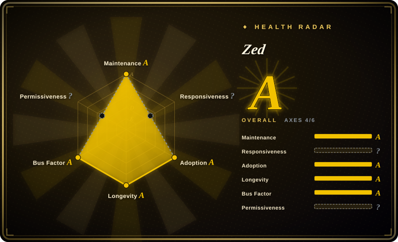

# Zed

A high-performance, multiplayer code editor built in Rust from the creators of Atom and Tree-sitter, offering native speed and real-time collaboration.

## When to use

You're choosing a code editor and raw performance, modern UX, and team collaboration matter. You pick Zed over VS Code because you want a native, GPU-accelerated editor that starts instantly and stays responsive even on large codebases, without Electron's memory bloat. You pick Zed over Neovim because you want a GUI-first experience with real-time collaborative editing — seeing teammates' cursors and edits live — built-in, not bolted on via plugins. You work on macOS, Linux, or Windows and want a consistent native experience with modern language server support and AI assistant integration.

## When NOT to use

- If you need the largest extension marketplace with 50,000+ extensions, use VS Code instead of Zed, because Zed's extension ecosystem is young and far smaller, with many niche language supports and tools missing.
- If you depend on VS Code-specific extensions, settings, or keybindings, use VS Code instead of Zed, because Zed is not a drop-in replacement and your `.vscode/settings.json` and workflows will not transfer.
- If you need a terminal-only editor for remote SSH or minimal environments, use Neovim or Vim instead of Zed, because Zed is a GUI application.
- If you want a fully open-source, unbranded build with a clear standard license, use VS Code — OSS or Neovim instead of Zed, because Zed's GitHub license is marked NOASSERTION despite the README stating GPL-3.0-or-later, and the long-term licensing strategy is not fully clear.
- If you are on an older or low-spec machine with an outdated GPU, use VS Code or Sublime Text instead of Zed, because Zed's GPU-accelerated GPUI framework requires a modern graphics stack and older integrated GPUs may struggle.
- If you need deep IDE features like built-in debugging, profiling, and project management out of the box, use JetBrains IntelliJ IDEA instead of Zed, because Zed is an editor, not a full IDE.

## Comparison

| Alternative | In index | Our verdict | Tradeoff |
| --- | --- | --- | --- |
| VS Code | ✅ | The most popular code editor with the largest extension ecosystem. | VS Code has unmatched extensions and Microsoft backing but is Electron-based and slower; Zed is native and faster but younger with fewer extensions. |
| Sublime Text | 未收录 | Fast, lightweight proprietary editor with a long history. | Sublime is faster and more mature but proprietary and paid; Zed is open-source and free with multiplayer collaboration. |
| Neovim | 未收录 | Modal terminal editor with modern Lua plugin ecosystem. | Neovim is terminal-only and highly customizable; Zed is GUI-first with collaboration built-in. |
| IntelliJ IDEA | 未收录 | Deep language-specific IDE for JVM and Android. | IntelliJ is heavier and language-specific; Zed is lighter and language-agnostic but lacks deep IDE features. |

## Tech stack

- **Rust** — primary language for the editor core and GPUI framework
- **GPUI** — Zed's own GPU-accelerated UI framework (not Electron)
- **Tree-sitter** — incremental parsing for syntax highlighting and code intelligence (Zed's creators also created Tree-sitter)
- **Language Server Protocol (LSP)** — for IDE features across languages

## Dependencies

- A modern desktop OS (macOS, Linux, Windows)
- A GPU and graphics stack that supports GPUI (most modern desktops)
- Sufficient RAM (8GB minimum recommended)

## Ops difficulty

**None for end users**. Zed is a consumer desktop application with automatic updates. For organizations, the main concern is managing team settings, collaboration permissions, and extension governance.

## Health & viability
- **Maintenance**: Grade A — 13/13 active weeks in trailing 13; last commit 0 days ago.
- **Responsiveness**: Cannot be scored — no_traffic.
- **Adoption**: Grade A.
- **Longevity**: Grade A — 2041 days old.
- **Governance**: Grade A — top-3 contributor share 18.9% (307 active maintainers in the trailing 12 months).
- **Risk / License**: `?` (license_unparsed) — GitHub reports `NOASSERTION` and the machine axis cannot classify it; the README states GPL-3.0-or-later for the community edition while the repo also ships branded/proprietary content, so review the license per release rather than treating it as a stable permissive grant.
## Caveats (unverified)

- [未验证] The exact GPU requirements for GPUI on older integrated graphics have not been tested across all platforms.
- [未验证] The multiplayer collaboration feature's network requirements and security model have not been independently audited.
- [推断] Zed Industries may introduce commercial licensing or feature tiers for enterprise collaboration as the product matures.
