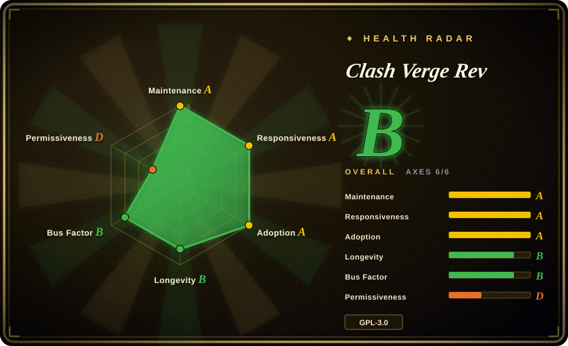

# Clash Verge Rev

A modern cross-platform GUI proxy client based on Tauri, running on Windows, macOS, and Linux with the built-in mihomo (Clash Meta) kernel.

## When to use

You're a developer or power user who needs a flexible, rule-based proxy client on your desktop. You've considered the original Clash for Windows, but that project is archived and no longer maintained. You manage multiple proxy subscriptions and want a clean, modern GUI to switch between them, edit rules, and monitor traffic. You need system-level proxy integration (system proxy and TUN mode) and want to run the mihomo kernel without command-line configuration. You reach for Clash Verge Rev because it is the actively maintained continuation of the Clash Verge project, built with Rust/Tauri for a native-feeling desktop app rather than an Electron-based alternative. Pick Clash Verge Rev over ClashX or ClashX Pro when you need a cross-platform client for Windows, macOS, and Linux rather than a macOS-only solution; pick it over sing-box when you want deeper Clash ecosystem compatibility and familiar rule syntax rather than a next-gen protocol-flexible platform.

## When NOT to use

- **Mobile-only users.** If you need an iOS or Android proxy client, use Shadowrocket or Surge instead of Clash Verge Rev, because this is a desktop-only application.
- **Simple one-proxy setups.** If you only need a single proxy and never switch rules, use the mihomo CLI directly or v2rayN instead of Clash Verge Rev, because the GUI overhead is unnecessary for a static configuration.
- **Enterprise MDM environments.** If you need a proxy client for corporate deployment with a permissive license, use sing-box or v2rayN instead of Clash Verge Rev, because GPL-3.0 copyleft may conflict with corporate software distribution policies. [未验证]
- **Users unfamiliar with proxy concepts.** If you want a beginner-friendly proxy with guided setup, use a commercial client like Surge instead of Clash Verge Rev, because the app assumes knowledge of Clash rules, proxy groups, and subscription URLs.

## Comparison

| Alternative | In index | Our verdict | Tradeoff |
| --- | --- | --- | --- |
| Clash for Windows | 未收录 | The original Windows Clash GUI (archived). | The original Clash for Windows project is archived; Clash Verge Rev is the active continuation with a modern Tauri stack. |
| ClashX / ClashX Pro | 未收录 | macOS-native Clash clients. | ClashX is macOS-specific; Clash Verge Rev is cross-platform and actively maintained. |
| Shadowrocket / Surge | 未收录 | Commercial proxy clients. | Shadowrocket (iOS) and Surge (macOS/iOS) are paid, closed-source apps with broader platform support. |
| sing-box | 未收录 | Next-gen proxy platform with a GUI. | sing-box is more protocol-flexible but Clash Verge Rev has deeper Clash ecosystem compatibility. |
| Proxifier | 未收录 | Commercial per-app proxy routing. | Proxifier is a paid tool for routing specific apps; Clash Verge Rev is a system-level proxy client with rule-based routing. |

## Tech stack

- **TypeScript** — frontend UI logic
- **Rust** — Tauri runtime and system integration
- **Tauri 2** — cross-platform desktop framework
- **mihomo (Clash Meta)** — built-in proxy kernel

## Dependencies

- Windows (x64/x86), Linux (x64/arm64), or macOS 11+ (Intel/Apple Silicon)
- No server infrastructure required; runs entirely on the local machine
- Optional: WebDav for configuration backup and sync

## Ops difficulty

**Low**. It is a desktop application with an installer. The main ongoing tasks are updating the app, updating the built-in kernel, and managing subscription URLs. No server or network infrastructure is required.

## Health & viability
- **Maintenance**: Grade A — 13/13 active weeks in trailing 13; last commit 0 days ago.
- **Responsiveness**: Grade A — median first-response time 0.8 hours across 29 qualifying issues/PRs.
- **Adoption**: Cannot be scored — unknown.
- **Longevity**: Grade B — 955 days old.
- **Governance**: Grade B — top-3 contributor share 86.1% (?).
- **Risk / License**: Grade C — GPL-3.0 license.
## Caveats (unverified)

- [未验证] The original Clash project and its Windows GUI were archived; the long-term stability of this continuation fork depends on ongoing community support.
- [未验证] The regulatory environment around proxy tools in certain jurisdictions may affect project availability and updates.
- [未验证] The GPL-3.0 license terms may conflict with enterprise software distribution policies; verify before corporate deployment.
